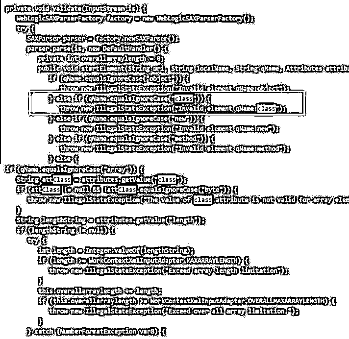
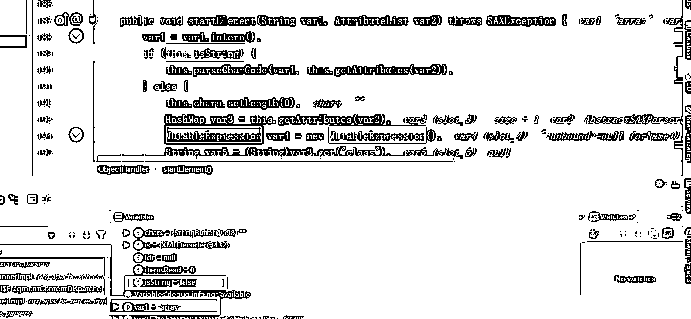
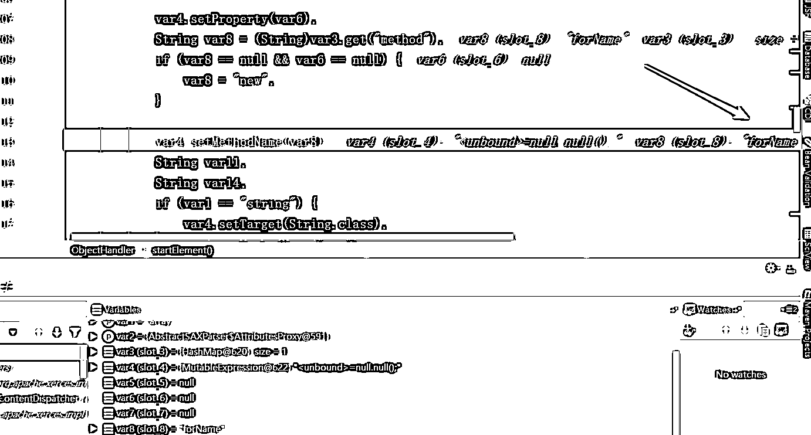
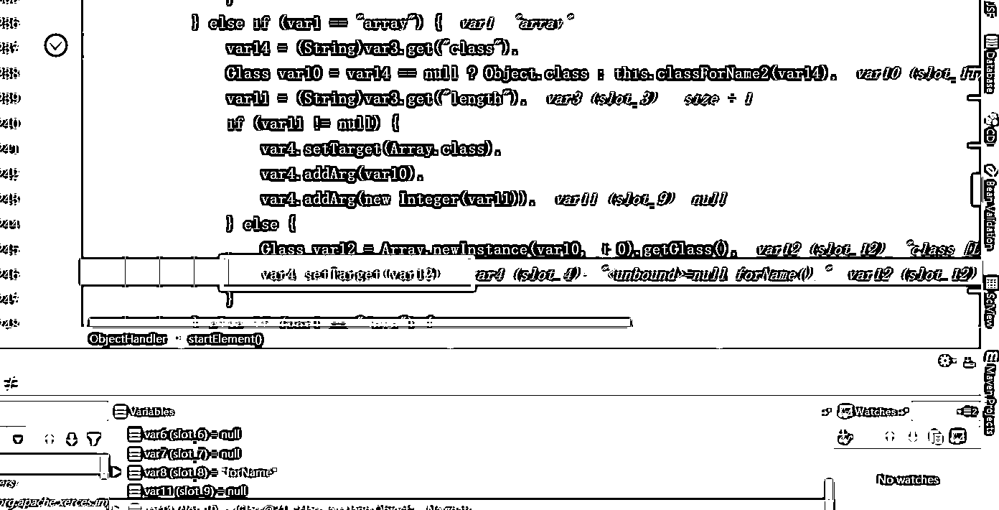
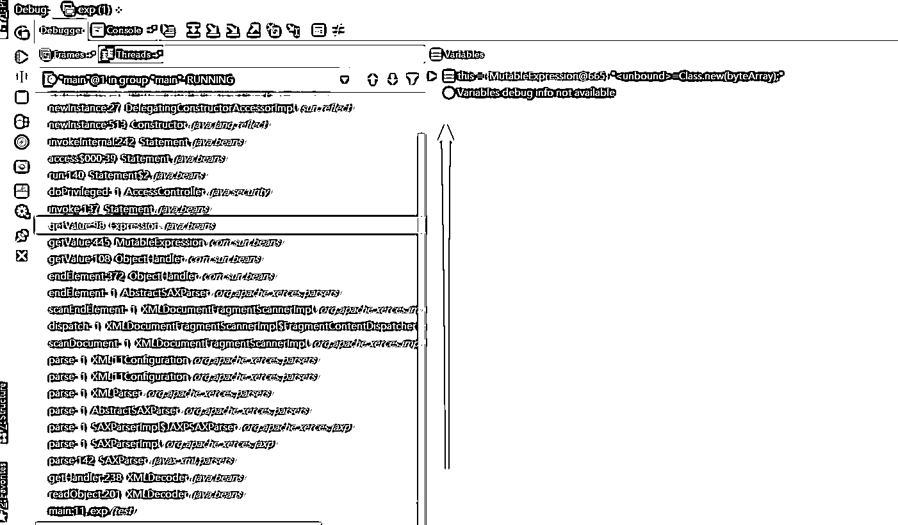
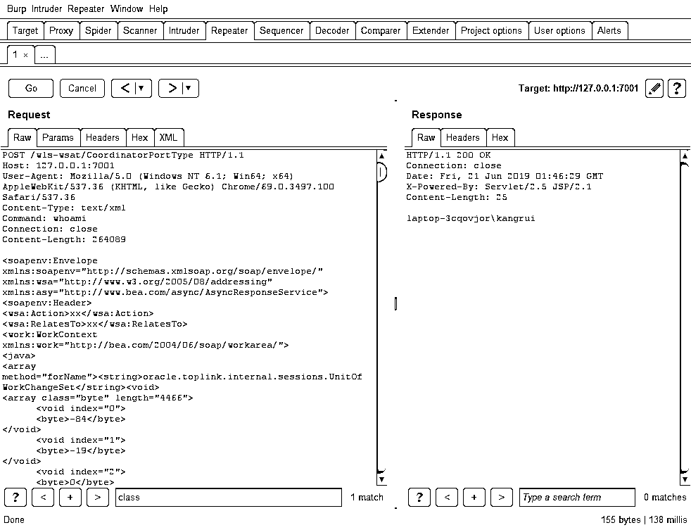
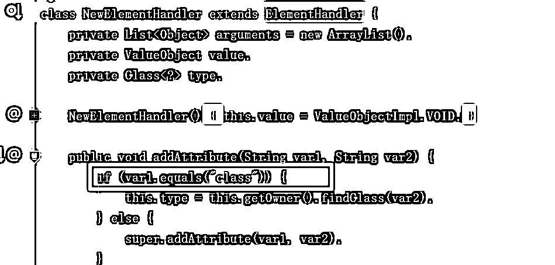
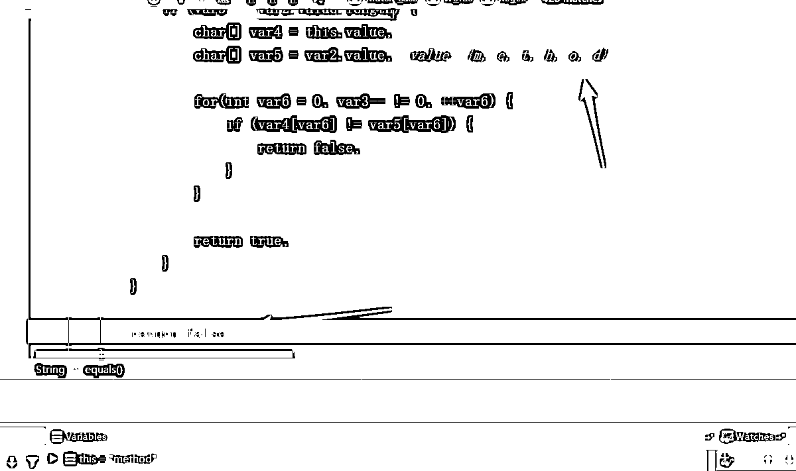

# # CVE-2019-2725 反序列化漏洞补丁绕过分析 - Afant1 - 博客园

> 原文：[`www.cnblogs.com/afanti/p/11079638.html`](https://www.cnblogs.com/afanti/p/11079638.html)

## 一、CVE-2019-2725 几种 poc 构造

CVE-2019-2725 几种 poc 构造看我博客链接，解压密码都是 afanti_
[CVE-2019-2725 二次反序列化 jdk7u21 gadgets](https://www.cnblogs.com/afanti/p/10792982.html)
[CVE-2019-2725 二次反序列化 jndi 注入分析](https://www.cnblogs.com/afanti/p/10802022.html)
[CVE-2019-2725 二次反序列化 FileSystemXmlApplicationContext Gadget POC](https://www.cnblogs.com/afanti/p/10815728.html)
[CVE-2019-2725 二次反序列化 EventData Gadget POC/JdbcRowSetImpl POC 构造](https://www.cnblogs.com/afanti/p/10816028.html)

## 二、补丁信息

看下 CVE-2019-2725 补丁信息，与上次补丁过滤了 class 标签，主要的目标是找个标签代替 class 标签绕过补丁

## 三、复现分析

### 复现环境：jdk1.6.0_31+weblogic 10.3.6

通过`<array method="forName">` ，Class.forName(classname) 反射方法获取类，先把回显的 poc 怼出来，回显参考我写的这篇文章[`www.cnblogs.com/afanti/p/10887381.html`](https://www.cnblogs.com/afanti/p/10887381.html)，使用 jdk7u21 gadgets，具体 poc 直接贴在最下方。
直接定位到处理 xml 标签的类：com.sun.beans.ObjectHandler 类的 startElement 方法：
在处理 array 标签时跟入，this.isString 为 false 来到 else 分支。

194 行会实例化 MutableExpression，看下这个类的方法，

查阅[java 手册](https://docs.oracle.com/javase/7/docs/api/java/beans/Expression.html)
，可以用表达式的形式来调用构造方法、实例化对象、调用方法

这里方法名赋值为 forName

跟到具体处理 array 标签的代码，因为 array 标签没有设置 length 属性，来到 else 分支，Expression 的 Target 设置为一个 Object 对象

最终本函数会将调用 Class.forName 的 Expression 对象压入表达式栈中

再看一下 endElement 实例化恶意类的地方，将 Class.forName 从栈顶弹出，调用 getValue 的方法实例化 UnitOfWorkChangeSet 类

最终来到漏洞触发点，传入 jdk7u21 的 gadgets 触发漏洞。

调用栈信息：

复现情况：

### 复现环境：jdk1.7.0_21+weblogic 10.3.6

当 jdk 版本改为 jdk1.7.0_21 发现之前的 payload 不能用了，下断跟下原因，这里发现 jdk1.7 版本处理 xml 时跟 jdk1.6 不一样，是由一个一个 Handler 来处理。

来到处理 array 的 Handler，这个类的成员变量只有 length 属性，没有 method 属性

看其父类的属性，有 class 属性，在向上找的话也没发现 method 属性，知道报错的原因了，具体跟一下

跟入父类的 addAttribute

这里'method'!=class 返回 false

这里抛出异常

### 复现环境：jdk1.6.0_31+weblogic 12.1.3

在 jdk1.6.0_31 版本 Weblogic 12 服务器都不能启动，查阅资料要求 weblogic 12.1.3 要求 jdk 需要 1.7 以上，所以 weblogic12 不存在绕过。

## 总结

利用环境 jdk1.6 以下，weblogic 版本 10.3.6。
通过`<array method="forName">`绕过。
POC：链接：[`pan.baidu.com/s/1Pa8_Bpl7XpDC6U12r1IWUw`](https://pan.baidu.com/s/1Pa8_Bpl7XpDC6U12r1IWUw)
提取码：rpkb