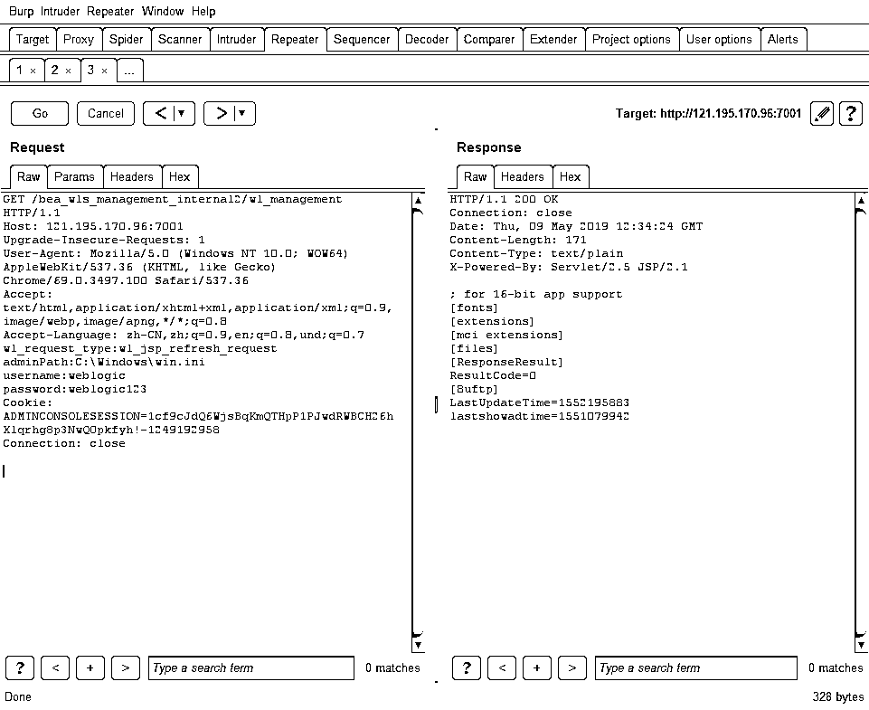
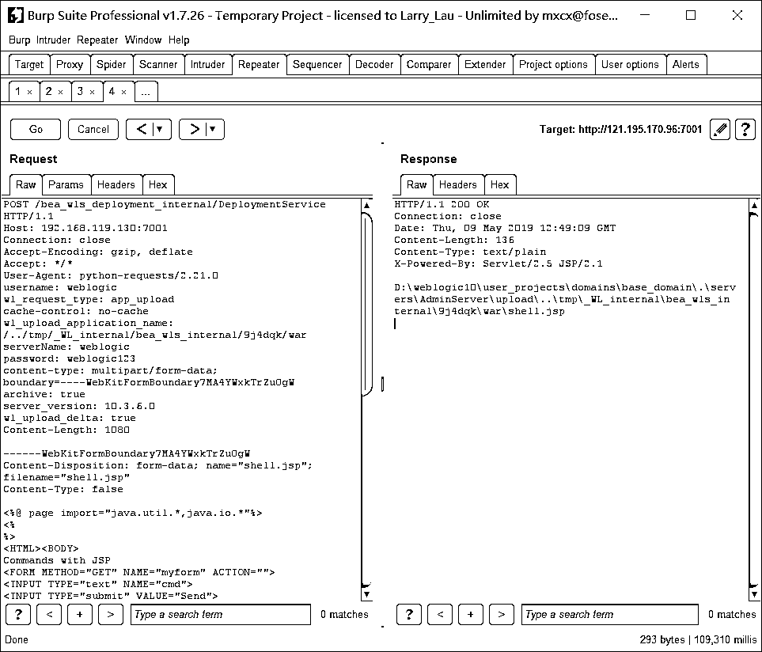
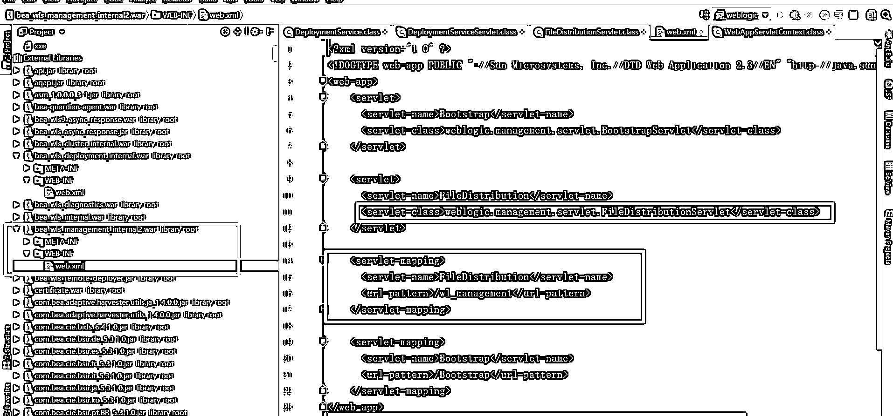

# # weblogic CVE-2019-2615/2618（任意文件读取，任意文件上传） - Afant1 - 博客园

> 原文：[`www.cnblogs.com/afanti/p/10841120.html`](https://www.cnblogs.com/afanti/p/10841120.html)

## 需要用户名密码文件读取。

定位到 FileDistributionServlet 这个 Servlet,路由如下

走到 doGet 方法

来到 doGetJspRefreshRequest 方法，读入传入文件路径，439 输出。

没啥好分析的，直接定位到 DeploymentServiceServlet 这个类的 handlePlanOrApplicationUpload 方法以可就知道了，挺鸡肋的，还需要用户名和密码。

最后看一下路由是怎么形成的，定位到 bea_wls_deployment_internal.war 包 web.xml。这里有路由的指向。

第一个路由构成，bea_wls_management_internal2.war 中的 web.xml-->最后拼成/bea_wls_management_internal2/wl_management

参考链接：
[`xz.aliyun.com/t/5078#toc-3`](https://xz.aliyun.com/t/5078#toc-3)