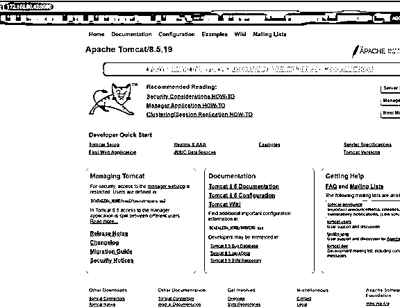
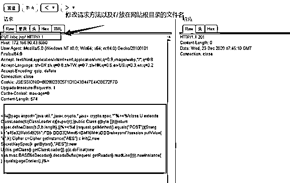
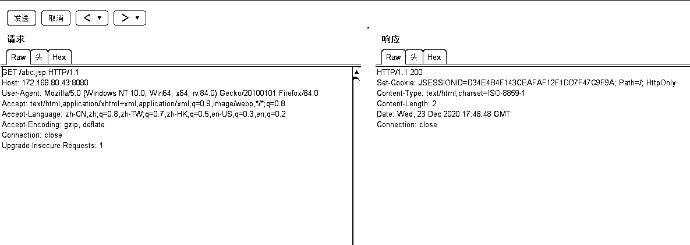

# （CVE-2017-12615）APACHE TOMCAT 远程代码执行漏洞 (带解决方案） - 誉津 - 博客园

> 原文：[`www.cnblogs.com/yujin2020/p/14180022.html`](https://www.cnblogs.com/yujin2020/p/14180022.html)

# （CVE-2017-12615）APACHE TOMCAT 远程代码执行漏洞 

## 一、漏洞简介

当 Tomcat 运行在 Windows 操作系统时，且启用了 HTTP PUT 请求方法（例如，将 readonly 初始化参数由默认值设置为 false），攻击者将有可能可通过精心构造的攻击请求数据包向服务器上传包含任意代码的 JSP 文件，JSP 文件中的恶意代码将能被服务器执行。导致服务器上的数据泄露或获取服务器权限。

## 二、复现过程

中间件版本如下

 

根据漏洞原理修改请求方法为 PUT 并在请求体中写入文件内容

 

文件上传成功

 

## 三、临时防护方案

　　用户可以禁用 PUT 方法来防护此漏洞，操作方式如下：

　　在 Tomcat 的 web.xml 文件中配置 org.apache.catalina.servlets.DefaultServlet 的初始化参数
　　　　<init-param>
　　　　<param-name>readonly</param-name>
　　　　<param-value>true</param-value>
　　　　</init-param>
　　　确保 readonly 参数为 true（默认值），即不允许 DELETE 和 PUT 操作。

**注意：**

　　如果禁用 PUT 方法，对于依赖 PUT 方法的应用，可能导致业务失效。

## 参考链接

　　https://www.cnblogs.com/dgjnszf/p/10793604.html

　　https://xz.aliyun.com/t/7991#toc-1