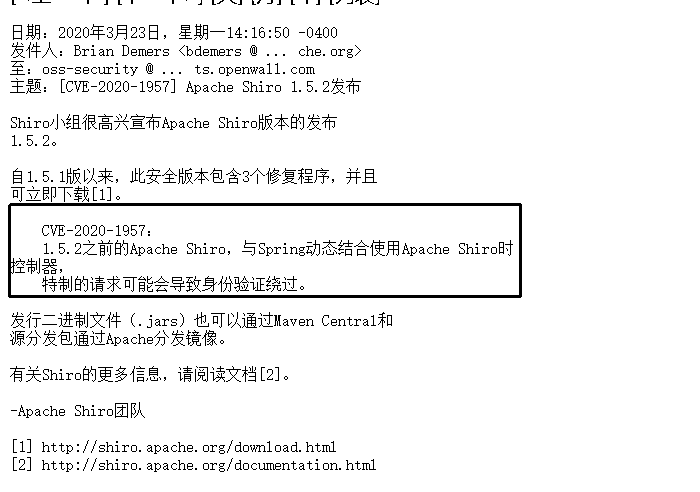
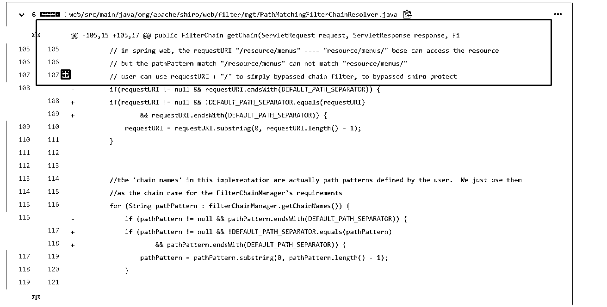
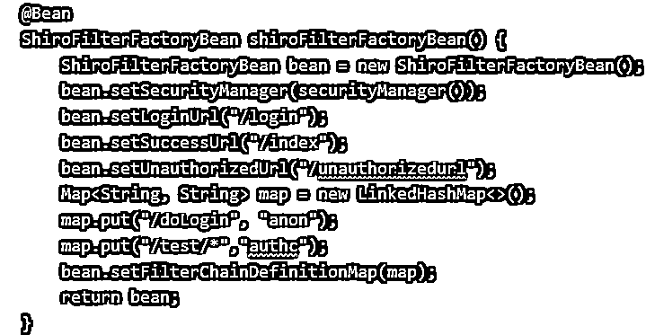
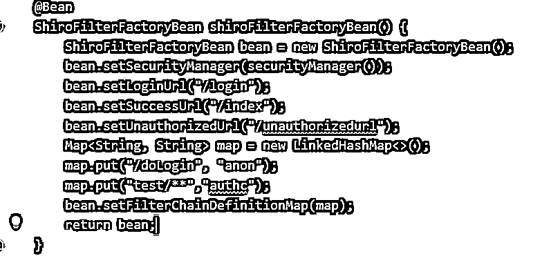
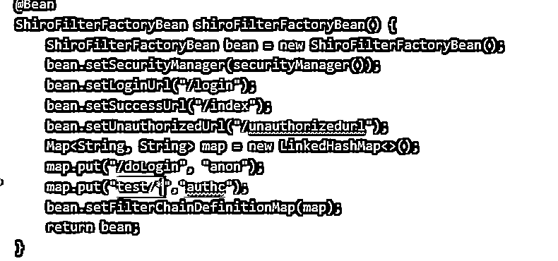
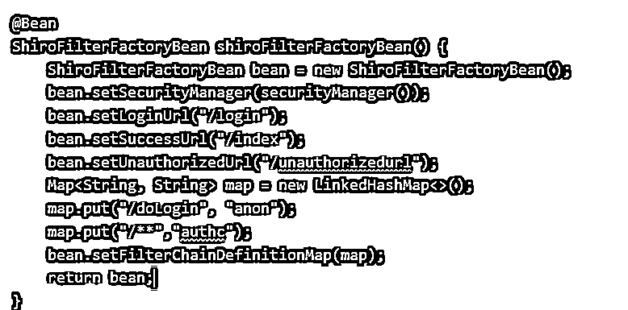

# 【CVE-2020-1957】shiro 搭配 spring 时身份验证绕过漏洞分析 - 水泡泡 - 博客园

> 原文：[`www.cnblogs.com/r00tuser/p/12575934.html`](https://www.cnblogs.com/r00tuser/p/12575934.html)

**0x00 漏洞简介**

**[`www.openwall.com/lists/oss-security/2020/03/23/2`](https://www.openwall.com/lists/oss-security/2020/03/23/2)**

****

****0x01 漏洞分析****

翻查官方 commit，在 commit [`github.com/apache/shiro/commit/9762f97926ba99ac0d958e088cae3be8b657948d`](https://github.com/apache/shiro/commit/9762f97926ba99ac0d958e088cae3be8b657948d) 中找到相关信息

 

 大致理解为 Spring web 在匹配 url 的时候会容错后面多余的/，而 shiro 匹配不上导致绕过，由国人 tomsun28 提交 pull request

**0x02 漏洞环境搭建**

使用 springboot+shiro 搭建一个简单的 demo，代码参考至[`segmentfault.com/a/1190000019440231`](https://segmentfault.com/a/1190000019440231)（使用 java 原生的整合方式）其中 shiro 使用的是 1.4.0 版本在 shiro-config 中配置一个对 url "/test/secret"的过滤，此 url 需要登录才能访问

 同时在 LoginController 中配置以下代码，用于返回一个需要认证的信息

```
1 @GetMapping("/test/secret") 2     public String secret(){ 3         return "secret"; 4     }
```

直接访问/test/secret，跳转到登录页面


 访问/test/secret/，返回了 secret


官方修复也很简单就是把 url 后面的/也考虑进去了再进行匹配顺便一提，使用 maven 拉取包的时候发现 1.5.1 版源码已经修复了，而 1.5.0，1.4.2 的源码却拉取不到**0x03 更新** shiro 的匹配符知识看 freebuf 的分析（[`www.freebuf.com/vuls/231909.html`](https://www.freebuf.com/vuls/231909.html)），才发现自己看漏了。。。后续还有一个绕过，具体 commit 看这里 [`github.com/apache/shiro/commit/3708d7907016bf2fa12691dff6ff0def1249b8ce`](https://github.com/apache/shiro/commit/3708d7907016bf2fa12691dff6ff0def1249b8ce)由于 shiro 先获取的 url，然后会判断分号是否存在，如果存在就会把后面的删除，进入 shiro 匹配，匹配不上默认放行，之后 Spring web 对路径进行规范化从而访问到了相应的控制器比如：

```
/fdsf;/../test/secret

```


**0x04 实际攻击**当 shiroFilter 这么写

 与及这么写



都存在绕过，也就是说当配置在二级目录下面的身份验证都存在被绕过的风险

只有这么写的时候，才不存在问题



 本人技术水平有限，如有不妥之处还望谅解