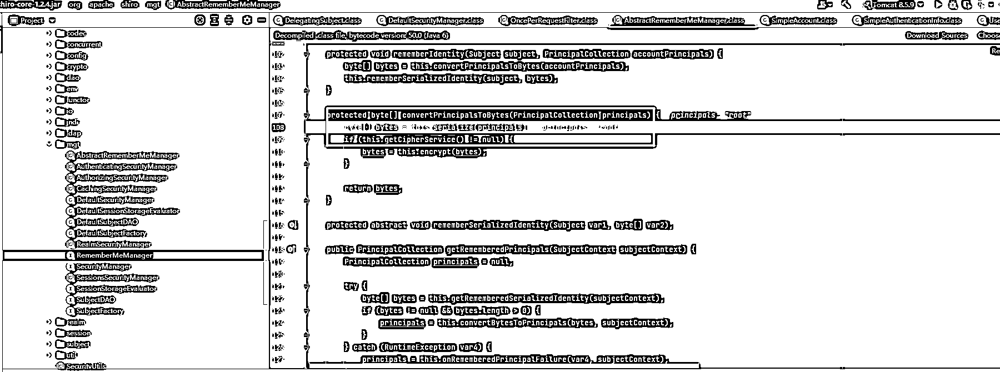
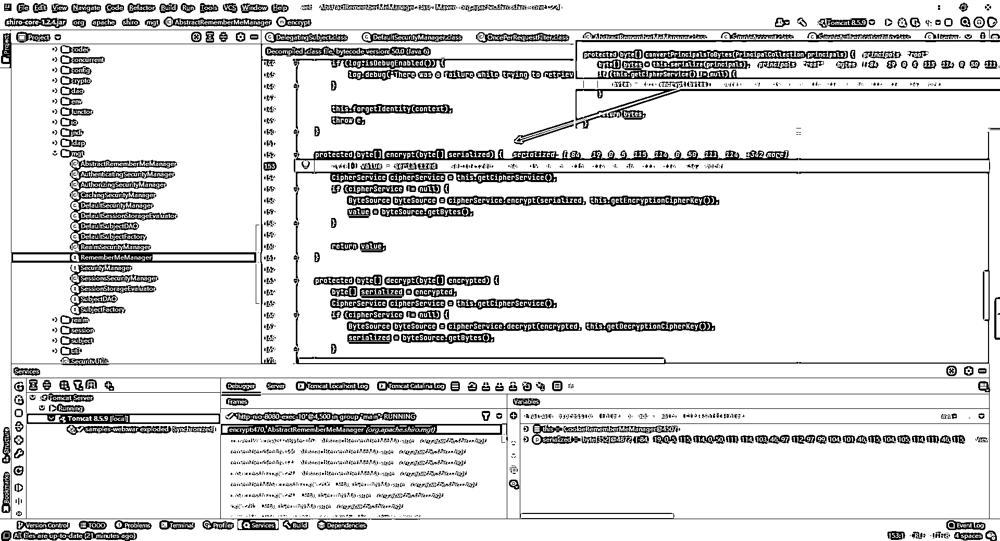
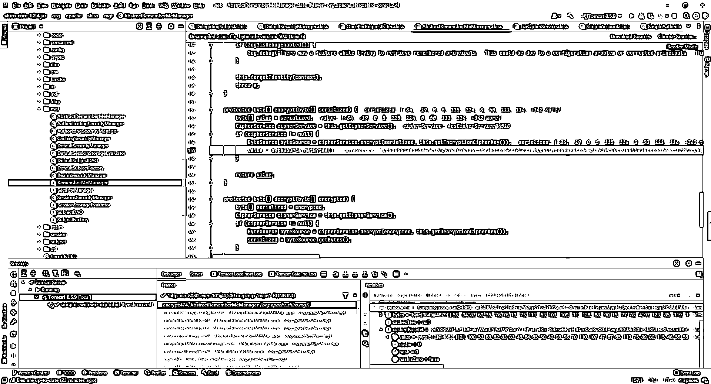
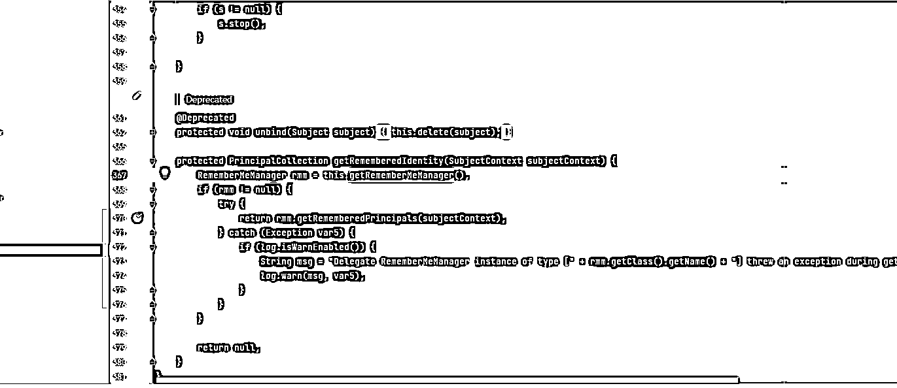

# 【JavaWeb】CVE-2016-4437 Shiro 反序列化漏洞分析及代码审计 - Aur0ra* - 博客园

> 原文：[`www.cnblogs.com/Aurora-M/p/15818775.html`](https://www.cnblogs.com/Aurora-M/p/15818775.html)

# Shiro 反序列化漏洞分析及代码审计

## 漏洞简介

Apache Shiro 是一个强大且易用的 Java 安全框架,执行身份验证、授权、密码和会话管理。
  Apache Shiro 默认使用了 CookieRememberMeManager，用户登录成功后会生成经过加密并编码的 cookie，在服务端对 rememberMe 的 cookie 值，先 base64 解码然后 AES 解密再反序列化，就导致了反序列化 RCE 漏洞。

## 漏洞影响

Apache Shiro < 1.2.4

## 漏洞分析

> 这里是直接从 github 拉下来得，里面有样例，拿样例复现即可

*   先在 RememberMeManager.class 中打下断点，开时调试
    

*   分析登录流程

    *   登录成功后，判定是设置了 rememberMe

    *   开始对验证信息进行梳理

        *   先进行了反序列化
            
        *   然后进行 AES 加密
            
        *   发现密钥是硬编码在代码中的
            
        *   aes 加密后，再进行了一次 b64 编码
            
        *   将上述的 base64 字符串通过响应头设置到本地的 cookie 中
            
        *   添加 set-cookie 字段
            
        *   完成 cookie 设定，达成 rememberMe 功能
            

        > 整个过程
        > 1.序列化用户身份"root"，得到值 A；
        > 2.对 root 的序列化值 A 进行 AES 加密（密钥为硬编码的常量），得到值 B；
        > 3.base64 编码上述计算的结果 B，得到值 C；
        > 4.将值 C 设置到 response 响应包中 cookie 的 rememberme 字段。

    *   继续分析验证功能

        *   在 DefaultSecurityManager.class#getRememberedIdentity 下断
            
        *   分析过后就是上述的逆过程

所以，我们只要知道 aes 密钥就可以伪造 rememberMe 的值，从而达成反序列化。而 Apache Shiro < 1.2.4，aes 密钥是被硬编码的，所以相当于所有的条件都满足了，开始干。

## 漏洞利用

直接用 shiro_exploit2.0 一把梭
[shiro_exploit2.0](https://pan.baidu.com/s/1Hc6iJEo6COuTnJRzc_xP6A?pwd=1234 "shiro_exploit2.0")

## 漏洞修复

1.  升级 shiro 到最新版本,不采用硬编码的方式
2.  如果在配置里配置了密钥，那么请一定不要使用网上的密钥， 一定不要！请自己 base64 一个 AES 的密钥，或者利用官方提供的方法生成密钥：