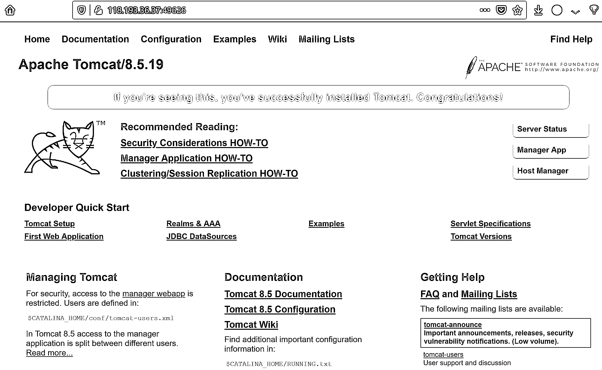
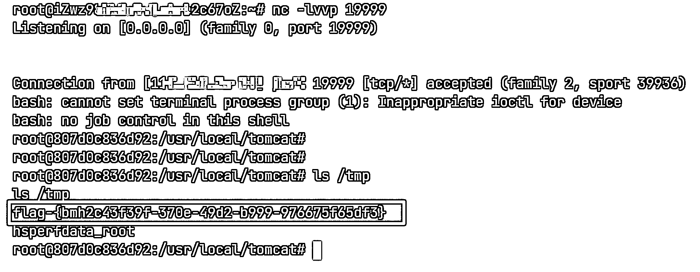

# 【Vulfocus 解题系列】Tomcat 任意写入文件漏洞(CVE-2017-12615) - 4andao - 博客园

> 原文：[`www.cnblogs.com/4andao/p/14220015.html`](https://www.cnblogs.com/4andao/p/14220015.html)

> 2021 年的第一天，决定水一篇文章。。

# 漏洞简介

1.  CVE-2017-12615 漏洞
    这个漏洞被称之为 Tomcat PUT 方法任意写文件漏洞，类似 IIS 的 PUT 上传漏洞。该漏洞可以利用 HTTP 的 PUT 方法直接上传 webshell 到目标服务器，从而获取权限。该漏洞是高危漏洞，在 Tomcat 的 web.xml 默认情况下不存在该漏洞，但是一单开发者或者运维人员手动讲 web.xml 中的 readonly 设置为 false，可以通过 PUT / DELETE 进行文件操控。
2.  漏洞成因
    漏洞的核心错误配置是 web.xml 中的 readonly
    

# 题目环境

在[vulfocus 演示环境](http://vulfocus.fofa.so/)自行搜索。

# 解题思路

打开环境，发现是 Tomcat 8.5.19。

本来想假装不知道是 PUT 漏洞的，先进行一波漏洞搜索的。算了不啰嗦，直接解题。

在上传文件名后缀名的后面加/，即可绕过限制、上传文件。

# 解题过程

根据上述的思路，解题就很简单了：上传一句话 Jsp 马，然后直接执行命令即可。

执行命令反弹 shell 也是可以的：

# Flag

动态 flag。

# 总结

Tomcat 任意写入文件漏洞(CVE-2017-12615)

## 1\. 影响版本：

*   Apache Tomcat 7.0.0 - 7.0.7
*   本次测试的环境是 Tomcat 8.5.19，其他版本未测试。

## 2\. 利用方法：

利用 PUT 方法，上传 Jsp 木马。