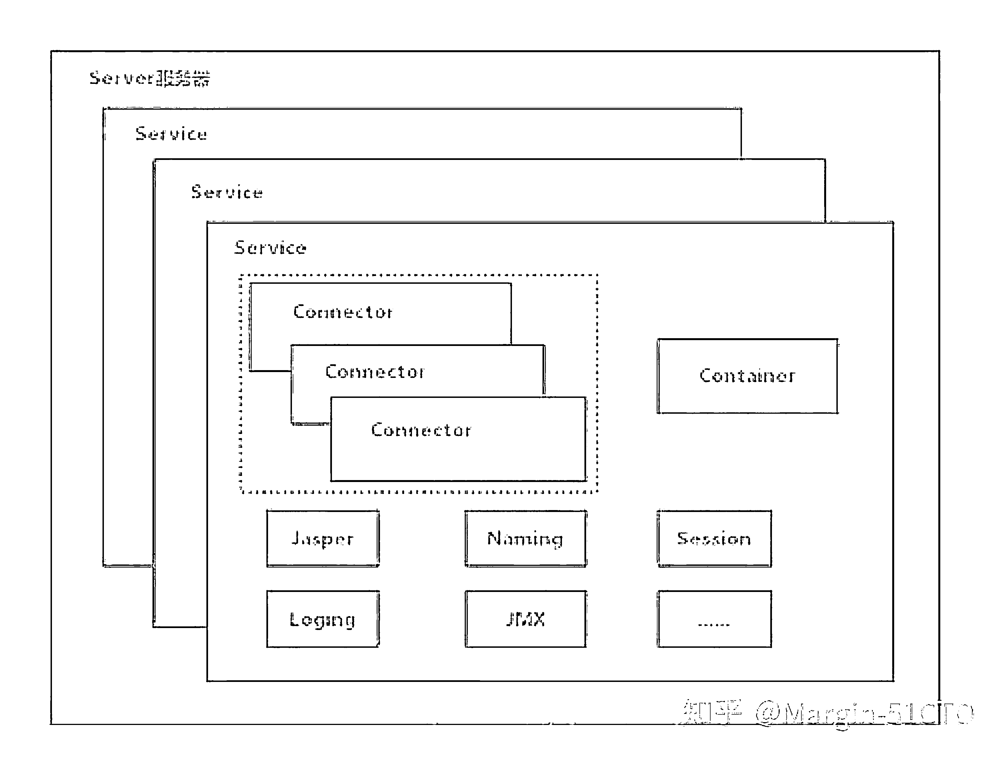

# 【Vulfocus 解题系列】Tomcat 文件包含 & 文件读取漏洞(CVE-2020-1938) - 4andao - 博客园

> 原文：[`www.cnblogs.com/4andao/p/14220016.html`](https://www.cnblogs.com/4andao/p/14220016.html)

> 昨天写了一篇 Tomcat 漏洞 PUT 方法任意写入文件漏洞(CVE-2017-12615) 的复现文章，今天决定近这两天把 Tomcat 常见的漏洞全部再次过一遍，就当复习回顾了。

# 漏洞简介

1.  CVE-2020-1938 漏洞
    国家信息安全漏洞共享平台发布了 Apache Tomcat 上的文件包含漏洞。通知中表示攻击者可利用该漏洞读取或包含 Tomcat 上所有 webapp 目录下的任意文件，如：webapp 配置文件或源代码等。
    影响版本：

*   Apache Tomcat 9.x < 9.0.31

*   Apache Tomcat 8.x < 8.5.51

*   Apache Tomcat 7.x < 7.0.100

*   Apache Tomcat 6.x

    影响说明：读取 webapp 下的所有文件

2.  漏洞原理
    Tomcat 开启了 http 和 AJP 两种协议的处理，由于“javax.servlet.include.request_uri”，“javax.servlet.include.path_info”，“javax.servlet.include.servlet_path” 这三个参数可控，所以导致文件读取以及文件包含漏洞。不过注意，可读取的文件也仅限于 webapps/ROOT 目录。

# 题目环境

在[vulfocus 演示环境](http://vulfocus.fofa.so/)自行搜索。

# 解题过程

利用脚本读取 web.xml 文件

发现可行，然后根据题目给出的提示，要去包含 flag.png 这个文件，于是继续利用脚本包含即可

# Flag

动态 flag。

# 总结与拓展

## 总结

1.漏洞原理
Tomcat 开启了 http 和 AJP 两种协议的处理，由于“javax.servlet.include.request_uri”，“javax.servlet.include.path_info”，“javax.servlet.include.servlet_path” 这三个参数可控，所以导致文件读取以及文件包含漏洞，当然内容也仅限制 webapps/ROOT 目录。
2\. 利用方法：
利用脚本读取/包含文件。

## 拓展知识与一些疑问

1.  Tomcat 的简易架构图
    

从图中可以看出，Tomcat 最顶层的容器是 Server，其中包含至少一个或者多个 Service，一个 Service 有多个 Connector 和一个 Container 组成。这两个组件的作用为：
（1）Connector 用于处理连接相关的事情，并提供 Socket 与 Request 和 Response 相关的转化;
（2）Container 用于封装和管理 Servlet，以及具体处理 Request 请求；
Tomcat 默认的 conf/server.xml 中配置了 2 个 Connector，一个为 8080 的对外提供的 HTTP 协议(1.1 版本)端口，默认监听地址: 0.0.0.0:8080，另外一个就是默认的 8009 AJP 协议(1.3 版本)端口，默认监听地址为:0.0.0.0:8009，两个端口默认均监听在外网 ip。
此次漏洞产生的位置便是 8009 AJP 协议。

2.  为什么是 asdf.jsp
    
    起初对脚本中的 asdf 产生了疑问，最后看了原理之后，才发现，这里的 asdf 可以是任意字母只要 Servlet 中没有就可以，如果没有就会启动 DefaultServlet。
    如果是要进行文件包含的话，那么就要使用 asdf.jsp 这样就会走 jspServlet。