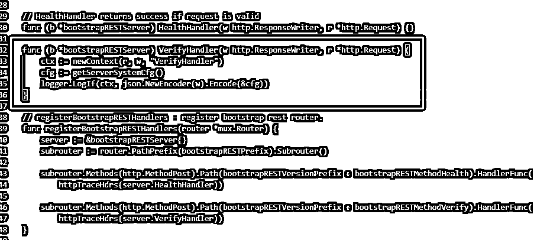
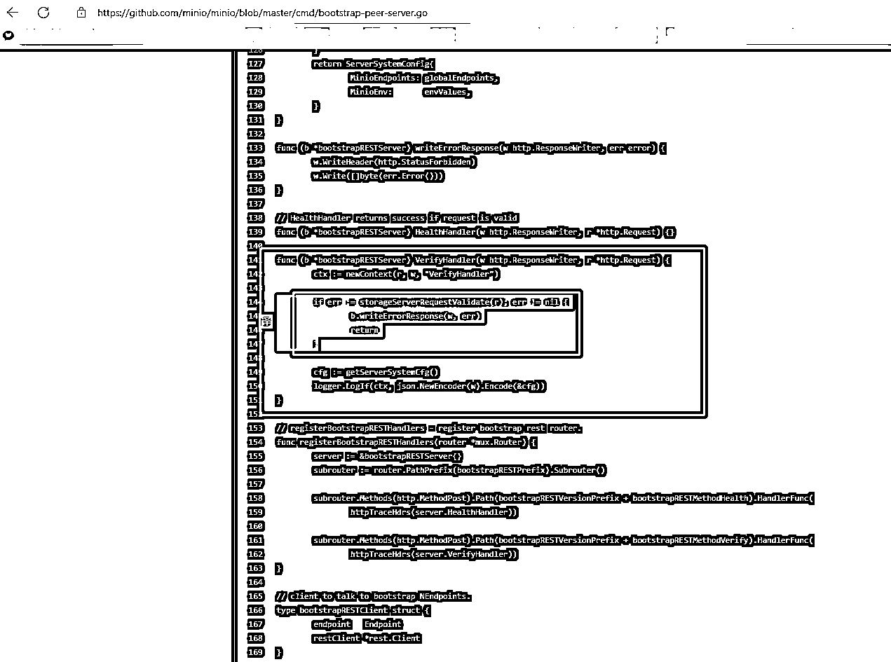

# 【漏洞分析】CVE-2023-28432 Minio 敏感信息泄露登录 - NamikazeQaQ - 博客园

> 原文：[`www.cnblogs.com/namikaze/p/17415145.html`](https://www.cnblogs.com/namikaze/p/17415145.html)

### 漏洞详情

MinIO 是一个高性能的分布式对象存储系统。它是软件定义的，在行业标准硬件上运行，并且 100% 开源，主要许可证是 GNU AGPL v3。MinIO 的不同之处在于它从一开始就被设计为私有/混合云对象存储的标准。因为 MinIO 是专门为对象而构建的，所以单层架构可以毫不妥协地实现所有必要的功能。结果是一个同时具有高性能、可扩展性和轻量级的云原生对象服务器。
近日，MinIO 官方发布了漏洞公告。未经身份验证的攻击者向在集群部署中的 MinIO 发送特殊的 HTTP 请求即可获取到包括 MINIO_SECRET_KEY 以及 MINIO_ROOT_PASSWORD 在内的所有环境变量信息，从而造成信息泄露并且能够以管理员身份登录 MinIO。

| **漏洞名称** | MinIO 信息泄露漏洞 |  |  |
| --- | --- | --- | --- |
| **漏洞公开编号** | CVE-2023-28432 |  |  |
| **漏洞类型** | 信息泄露 | **公开时间** | 2023-03-21 |
| **漏洞等级** | 严重 | **评分** | 暂无 |
| **漏洞所需权限** | 无权限要求 | **漏洞利用难度** | 低 |
| **PoC 状态** | 未知 | **EXP 状态** | 未知 |
| **漏洞细节** | 已公开 | **在野利用** | 未知 |

### 影响版本

MinIO RELEASE.2019-12-17T23-16-33Z <= version < MinIO RELEASE.2023-03-20T20-16-18Z（集群模式）

### 环境搭建

fofa 语句是`app="MINIO-Browser"`，minio 需要是集群模式部署才能触发漏洞，所以 fofa 上的环境可能比较少。手动搭建环境时，可以参考 vulhub。

### 漏洞分析

下载存在漏洞的源码，地址：[`codeload.github.com/minio/minio/zip/refs/tags/RELEASE.2023-03-13T19-46-17Z`](https://codeload.github.com/minio/minio/zip/refs/tags/RELEASE.2023-03-13T19-46-17Z)
漏洞点位于 cmd/bootstrap-peer-server.go 文件的 VerifyHandler()函数中，如下：

请求进来后，没有进行身份认证，直接执行 getServerSystemCfg()函数，获取 env 环境信息。
官方修改后的代码是如下所示：

新增了选中的那段代码，执行了 storageServerRequestValidate(r)函数，进入该函数：

主要是检查 jwt 认证，没有登录就不能访问漏洞所在的接口了。

### 后记

minio 是用 golang 开发的 web 程序，golang 相关的 mvc 框架还没有见过，之后需要熟悉一下。
 