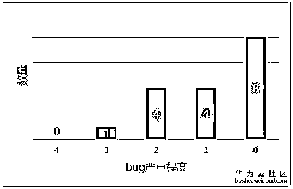
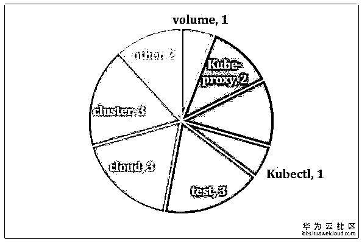

# 【独家】K8S 漏洞报告 | CVE-2019-1002101 解读 - 容器魔方 - 博客园

> 原文：[`www.cnblogs.com/CCE-SWR/p/10724996.html`](https://www.cnblogs.com/CCE-SWR/p/10724996.html)

kubectl cp 漏洞 CVE-2019-1002101 分析

Kube-proxy IPVS 添加 flag ipvs-strict-arp

近期 bug fix 数据分析

——本期更新内容 

kubectl cp 漏洞

近期 kubernetes 的 kubectl cp 命令发现安全问题(CVE-2019-1002101)，该问题严重程度比较高，建议将 kubectl 升级到 Kubernetes 1.11.9,1.12.7,1.13.5 或 1.14.0 版本以解决此问题。

kubectl cp 命令允许用户在容器和主机之间复制文件，其基本原理是：

1.  在源地址将文件打包。

2.  打包输出内容作为 stream 流通过网络传递给目标地址。

3.  传递路径包括：apiserver、kubelet、runtime

4.  stream 流在目的地址作为 tar 的输入，解压。

具体执行过程可以参考 kubernetes/pkg/kubectl/cmd/cp.go 文件中的 copyToPod 和 copyFromPod 两个函数。

在这个过程中，如果容器中的 tar 二进制文件是恶意的，它可以运行任何代码并输出意外的恶意结果。当调用 kubectl cp 时，攻击者可以使用它将文件写入用户计算机上的任何路径，仅受本地用户的系统权限限制。

目前社区在 1.11-1.14 版本均修复了该问题，具体修复方式可参考：

https://github.com/kubernetes/kubernetes/pull/75037

用户可以通过 kubectl version --client 命令查看自己使用的 kubectl 版本，并升级到 1.11.9,1.12.7,1.13.5 或 1.14.0 版本以修复该漏洞。

Kube-proxy IPVS 添加 flag ipvs-strict-arp

首先了解些背景知识。

kube-proxy 的 ipvs 模式会将 clusterIP/externalIP 等绑定到节点上名为 kube-ipvs0 的 dummy 设备，以确保节点上的 ipvs 规则可以对访问这些地址的流量作转发。

在 1.13 版本中，引入一个操作

echo 1 >/proc/sys/net/ipv4/conf/all/arp_ignore

echo 2 > /proc/sys/net/ipv4/conf/all/arp_announce

以禁止 IPVS 模式下对 kube-ipvs0 dummy 设备上绑定的 ip 的 ARP 回复，具体可参考 pr #70530，该改动是为了修复 ipvs 模式下 load banlancer 类型 service 不能正常使用的问题(issue:#59976)。

而本次的 buf fix 则是跟前面的改动有关，因为前面的改动虽然解决了 loadbalancer 的问题，但是又引入了其他问题：有些 CNI 插件在主机和容器间的连接会用到 ARP 协议。因此我们看到有些用户升级到 1.13 后反馈下面的问题：

issue#72779：kube-proxy v1.13.0 and 1.13.1 brokes services with externalIPs

issue#71555：kube-proxy/IPVS: arpignore and arpannounce break some CNI plugins

而本 bug fix 也很简单，就是为 kube-proxy 加了一个启动参数 ipvs-strict-arp，默认为 0，即不改变节点上的 ARP 配置，如果需要改变，则设置该参数值为 1。

不得不说，这只是一个规避方案，无论是否使用该参数，kube-proxy ipvs 模式下总有一部分功能受影响。

但是 IPVS 模式本身就有它独特的优势，是 iptables 所没有的，在这些优势的基础上，一定要 ipvs 实现原来 iptables 实现的所有功能似乎也不太合理。

近期 bug fix 数据分析

近期在我们关注的 1.13 版本(1.13.5 之后)没有比较重要的 bug fix 发布，为数不多的几条也都是集群部署、第三方云提供商、e2e 测试相关，不需要太多关注。

前文提到的 CVE-2019-1002101 漏洞也是在 1.13.5 版本之前已经修复的，上次的 bug fix 已经覆盖到，大家如果有兴趣深入研究的话可以根据本文提供的 pr 链接学习。

最后我们看下具体数据：

如下为所有 bug fix 的汇总信息：

相关服务请访问：https://support.huaweicloud.com/cce/index.html?utm_content=cce_helpcenter_2019