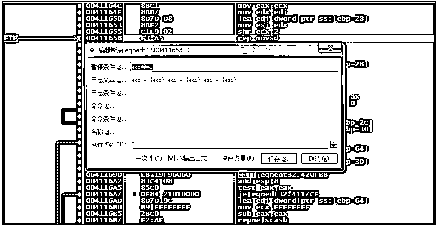

# 【逆向】CVE-2017-11882 漏洞 ShellCode 调试 - SunsetR - 博客园

> 原文：[`www.cnblogs.com/SunsetR/p/13946061.html`](https://www.cnblogs.com/SunsetR/p/13946061.html)

# 前言

CVE-2017-11882 漏洞原理和分析文章网上有很多，就不赘述了，简单总结下 Shellcode 调试方法做个记录。

# 步骤

1、在注册表中添加“EQNEDT32.EXE”镜像劫持。

2、x64 打开“EQNEDT32.EXE”，在 ret 指令（**0x00411874**）下断，一般第二次断下时栈顶 esp 保存的就是 Shellcode 起始地址。也可以在溢出点（**0x00411658**）设置条件断点，假如拷贝的数据超出 36 字节说明存在缓冲区溢出，则函数结尾的 ret 指令执行的既是 Shellcode。

3、完成以上步骤后，打开漏洞文档触发漏洞，调试器会自动附加“EQNEDT32.EXE”，条件断点中断后从函数结尾 ret 指令开始调试即可。

# 总结

一般情况下只要确定存在该漏洞利用，直接火绒剑等动态分析工具看“EQNEDT32.EXE”关键行为即可，如果比较特殊的也可以把 ShellCode 扣出来配合 IDA 和 x64 进行详细分析。