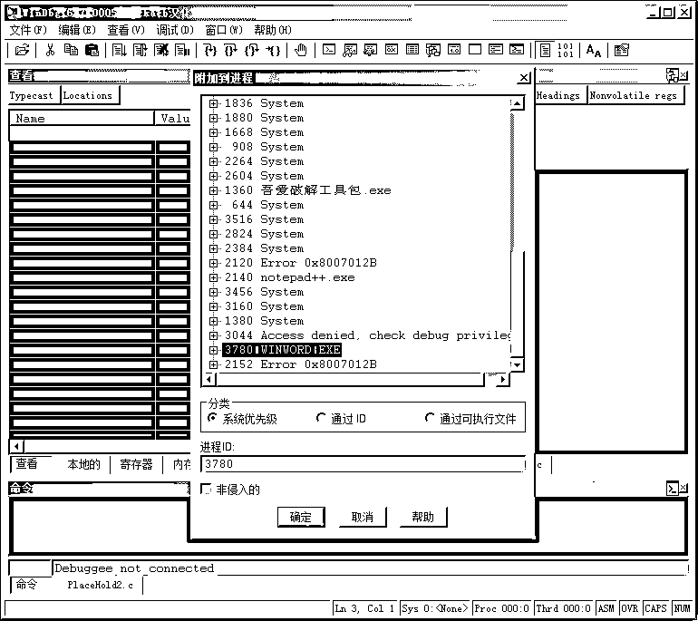
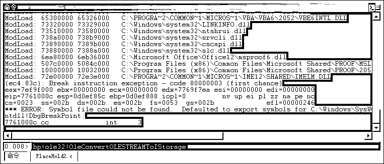
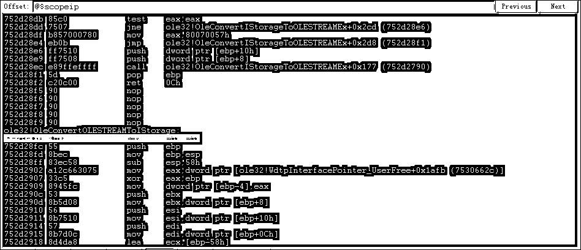
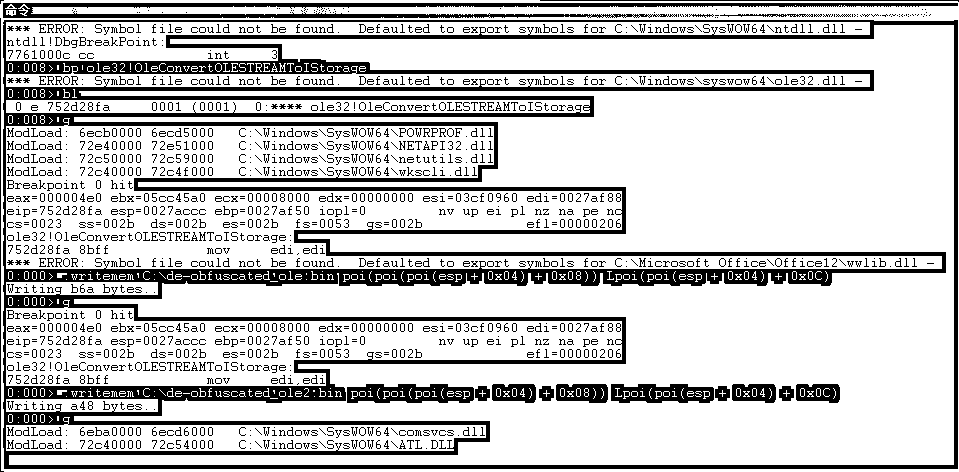
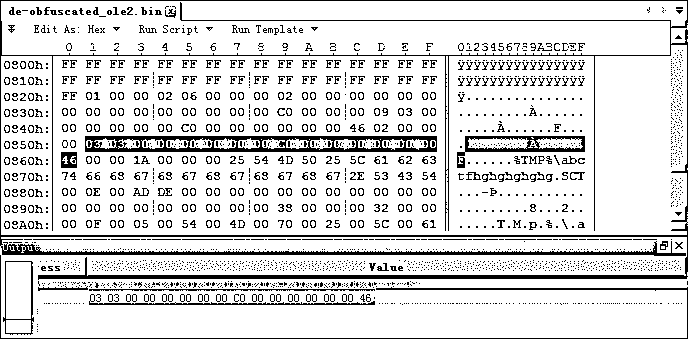
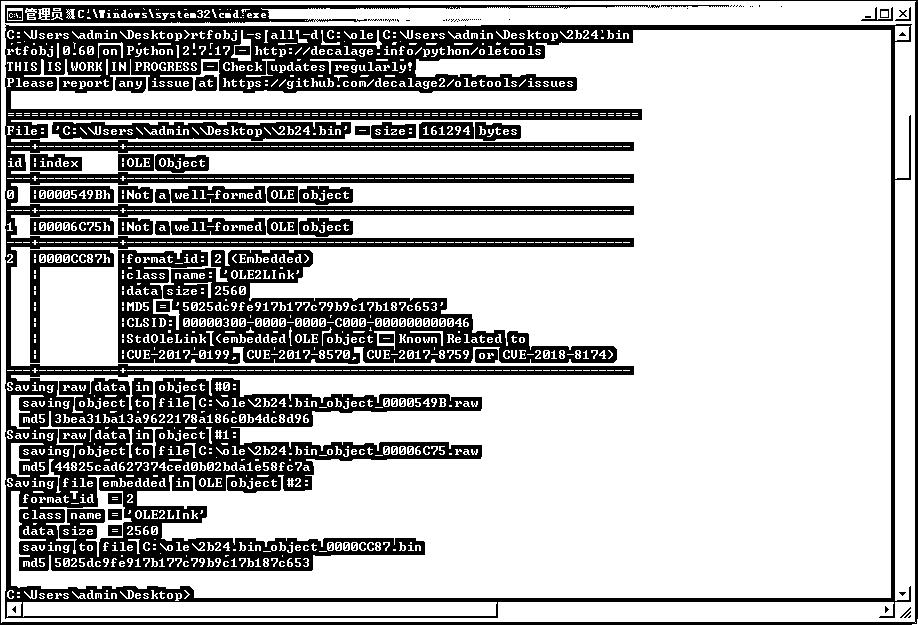

# 【逆向】CVE-2017-8570 漏洞分析调试技巧 - SunsetR - 博客园

> 原文：[`www.cnblogs.com/SunsetR/p/15131953.html`](https://www.cnblogs.com/SunsetR/p/15131953.html)

# 前言

　　CVE-2017-8570 是一个逻辑型漏洞，该漏洞利用复合 Moniker 绕过了 CVE-2017-0199 的更新补丁，可以在 Office 文档中执行任意 SCT（Windows Script Component）脚本代码。

```
//受影响版本：
Microsoft Office 2007 Service Pack 3 Microsoft Office 2010 Service Pack 2 (32-bit editions)
Microsoft Office 2010 Service Pack 2 (64-bit editions)
Microsoft Office 2013 RT Service Pack 1 Microsoft Office 2013 Service Pack 1 (32-bit editions)
Microsoft Office 2013 Service Pack 1 (64-bit editions)
Microsoft Office 2016 (32-bit edition)
Microsoft Office 2016 (64-bit edition)
```

# 分析思路

CVE-2017-8570 最明显的特征是它会借助下面三个 Moniker 去构造逻辑漏洞：

```
//Moniker(GUID 形式)
{00000303-0000-0000-C000-000000000046} -> FileMoniker
{00000309-0000-0000-C000-000000000046} -> CompositeMoniker
{ECABAFC6-7F19-11D2-978E-0000F8757E2A} -> NewMoniker //文件中显示如下：
0303000000000000C000000000000046 -> FileMoniker
0903000000000000C000000000000046 -> CompositeMoniker
C6AFABEC197FD211978E0000F8757E2a -> NewMoniker
```

所以只要在 Rtf 文档或者 Dump 出来的 OLE 文件中同时定位到上述特征，基本可以判定该文档包含了 CVE-2017-8570 漏洞。

# 动态分析

首先打开一个干净的 Word 文档，使用 Windbg 附加 Winword.exe 进程：



然后下断：**bp ole32!OleConvertOLESTREAMToIStorage**



下断后打开要调试的恶意文档触发中断：



然后使用如下命令将内嵌的 ole 数据提取到本地：
**.writemem C:\de-obfuscated_ole.bin poi(poi(poi(esp + 0x04) + 0x08)) Lpoi(poi(esp + 0x04) + 0x0C)**



一共提取了两个 ole 文件：其中在“de-obfuscated_ole.bin”文件中可以发现恶意的 sct 脚本：


在“de-obfuscated_ole2.bin”文件中则可以完全匹配前面提到的三个 Moniker：



可以配合如下 python 脚本进行检测：


```
# coding=utf-8

import os import sys import keyword if 1 >= len(sys.argv): print("Error: 输入参数后重试")
    exit(1)

guid1 = b'\x03\x03\x00\x00\x00\x00\x00\x00\xc0\x00\x00\x00\x00\x00\x00\x46' guid2 = b'\x03\x03\x00\x00\x00\x00\x00\x00\xc0\x00\x00\x00\x00\x00\x00\x46' guid3 = b'\x09\x03\x00\x00\x00\x00\x00\x00\xc0\x00\x00\x00\x00\x00\x00\x46' with open(sys.argv[1], 'rb')as f:
    data = f.read()
    index1 = data.find(guid1)
    index2 = data.find(guid2)
    index3 = data.find(guid3) if index1 != -1 and index2 != -1 and index3 != -1: print("CVE-2017-8570") else: print("not CVE-2017-8570")
```

View Code

# 静态分析

除了使用 Windbg 进行动态分析外，还可以使用 **rtfobj** 脚本从恶意文档中自动提取 ole 文件，实际效果是一样的：



# 参考链接

https://cve.mitre.org/cgi-bin/cvename.cgi?name=CVE-2017-8570
https://msrc.microsoft.com/update-guide/en-US/vulnerability/CVE-2017-8570