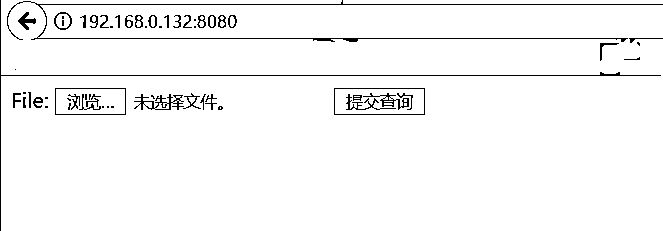
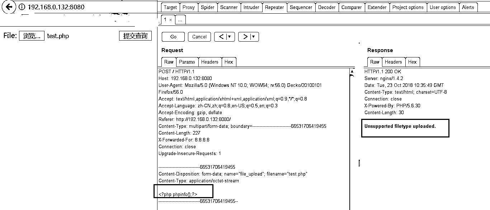
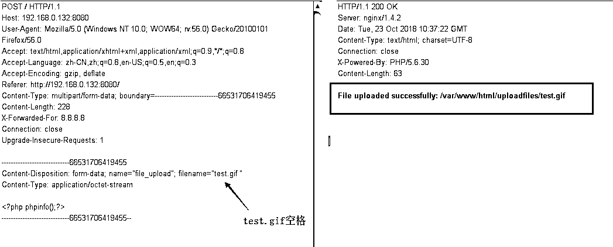

# 14.Nginx 文件名逻辑漏洞（CVE-2013-4547） - bmjoker - 博客园

> 原文：[`www.cnblogs.com/bmjoker/p/9838600.html`](https://www.cnblogs.com/bmjoker/p/9838600.html)

由于博主在渗透网站时发现现在 Nginx 搭建的网站是越来越多

所以对 Nginx 的漏洞来一个全面性的复习，本次从 Nginx 较早的漏洞开始分析。

2013 年底，nginx 再次爆出漏洞（CVE-2013-4547），此漏洞可导致目录跨越及代码执行，

其影响版本为： Nginx 0.8.41 ~ 1.4.3 / 1.5.0 ~ 1.5.7，范围较广。

**漏洞说明**

这个漏洞其实和代码执行没有太大关系，其主要原因是错误地解析了请求的 URI，

错误地获取到用户请求的文件名，导致出现权限绕过、代码执行的连带影响。

举个例子，比如，Nginx 匹配到.php 结尾的请求，就发送给 fastcgi 进行解析，常见的写法如下：

```
location ~ \.php$ {
    include        fastcgi_params;

    fastcgi_pass 127.0.0.1:9000;
    fastcgi_index  index.php;
    fastcgi_param  SCRIPT_FILENAME /var/www/html$fastcgi_script_name;
    fastcgi_param  DOCUMENT_ROOT /var/www/html;
}
```

正常情况下（关闭 pathinfo 的情况下），只有.php 后缀的文件才会被发送给 fastcgi 解析。而存在

CVE-2013-4547 的情况下，我们请求 1.gif[0x20][0x00].php ，这个 URI 可以匹配上正则 \.php$，

可以进入这个 Location 块；但进入后，由于 fastcgi 在查找文件时被\0 截断，Nginx 却错误地认为

请求的文件是 1.gif[0x20]，就设置其为 SCRIPT_FILENAME 的值发送给 fastcgi。

fastcgi 根据 SCRIPT_FILENAME 的值进行解析，最后造成了解析漏洞。

所以，我们只需要上传一个空格结尾的文件，即可使 PHP 解析之。

再举个例子，比如很多网站限制了允许访问后台的 IP：

```
location /admin/ {
    allow 127.0.0.1;
    deny all;
}
```

我们可以请求如下 URI：/test[0x20]/../admin/index.php，这个 URI 不会匹配上 location 后面的/admin/，

也就绕过了其中的 IP 验证；但最后请求的是 /test[0x20]/../admin/index.php 文件，也就是/admin/index.php，

成功访问到后台。（这个前提是需要有一个目录叫 test：这是 Linux 系统的特点，如果有一个不存在的目录，

则即使跳转到上一层，也会爆文件不存在的错误，Windows 下没有这个限制）

简单来说就是我们构造：http://127.0.0.1/test.aaa \0bbb

让 Nginx 认为文件“file.aaa ”的后缀为“.bbb”。

## 漏洞测试

我们在本地搭建一个 nginx 搭建的上传页面： 



这个环境是黑名单验证，我们无法上传 php 后缀的文件：



需要利用 CVE-2013-4547。我们上传一个 test.gif，里面的内容还是<?php phpinfo();?>，注意后面的空格：



发现上传成功，接下来需要构造我们 test.gif[0x20][0x00].php 来造成 Nginx 解析漏洞，使我们的 test.gif 被

解析成 php，访问 http://192.168.0.132:8080/uploadfiles/test.gif  .php，在 burp 抓取的数据包中把 test.gif

后面的两个空格 [0x20][0x20] ---> [0x20][0x00] ，然后 repeater 发包可发现 PHP 已被解析：


 注意，[0x20]是空格，[0x00]是\0，这两个字符都不需要编码。

~~~~~~~~~~~~~~~~~~~~~~~~~~~~~~~~~~~~~~~~~~~~~~~~~~~~~~~~

**CVE-2013-4547**还可以用于绕过访问限制，虽然和文件解析漏洞无关，但也记录在这里。

首先在网站根目录下新建一个目录，命名为 privited，在目录 privated 中新建文件 test.php，内容随意。

然后在 Nginx 的配置文件中写上：

```
  location /privated/ {
    deny all;
  }
```

以禁止该目录的访问。接着在网站根目录下新建一个目录，名为 “bmjoker ”，目录名的最后一个字符是空格，

该目录用于触发漏洞。最后来进行验证，直接访问：

```
  http://127.0.0.1/privated/test.php
```

返回 “403 Forbidden” 。利用漏洞访问：

```
 http://127.0.0.1/bmjoker /../privated/test.php
```

成功访问到文件 test.php 。注意 URL 中的空格，不要将空格编码。

为成功利用漏洞，我们在测试中准备了名字以空格结尾的文件和目录，这是因为在 linux 中，文件名是可以以空格结尾的。若不准备这样的文件，漏洞可以成功触发，但结果却是 404，找不到类似“test.jpg ”这样的文件。而在 Windows 中，文件名不能以空格结尾，所以 Windows 程序遇到文件名“test.jpg ”会自动去掉最后的空格，等同于访问“test.jpg”，基于这样的原因，这一漏洞在 Windows 中会很容易利用。

**结语：**

由此可知，常规利用中如果想触发代码执行，条件为可上传带空格的文件到服务器，

并且服务器存储的时候也需要保留空格，而大多数情况下，web 应用在处理上传文件

时，都会将文件重命名，通过应用自身添加后缀，或者对后缀名去掉特殊字符后，做类型判断。

以上因素都导致此漏洞被认为是鸡肋漏洞，难以利用，而被人们所忽略

参考链接：

[`www.91ri.org/9064.html`](http://www.91ri.org/9064.html)

[`blog.werner.wiki/file-resolution-vulnerability-nginx/`](https://blog.werner.wiki/file-resolution-vulnerability-nginx/)