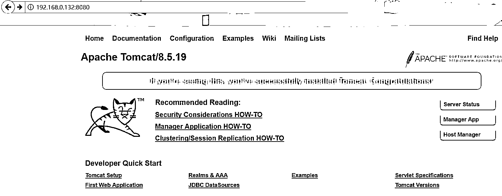
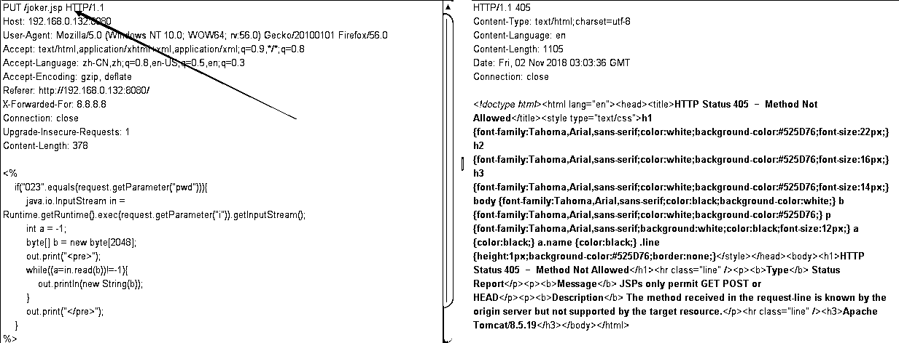
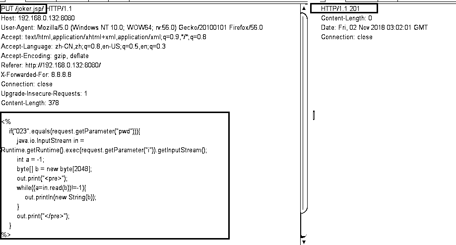
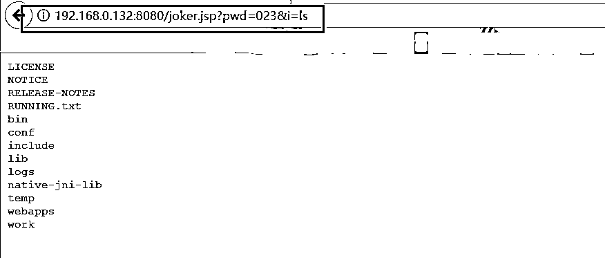

# 17.[CVE-2017-12615]Tomcat 任意文件上传漏洞 - bmjoker - 博客园

> 原文：[`www.cnblogs.com/bmjoker/p/9895178.html`](https://www.cnblogs.com/bmjoker/p/9895178.html)

# 【CVE-2017-12615】 Tomcat 任意文件上传漏洞

首先先贴出 wooyun 上的一个案例：[`wooyun.jozxing.cc/static/bugs/wooyun-2015-0107097.html`](http://wooyun.jozxing.cc/static/bugs/wooyun-2015-0107097.html)

看到这个漏洞让我想到了 IIS6.0 任意文件上传的漏洞，不过现在大多都用工具，比如 IIS put scan...

这里贴出 IIS6.0 任意文件上传案例：[`blog.csdn.net/qq_42357070/article/details/82183988`](https://blog.csdn.net/qq_42357070/article/details/82183988)

能文件上传，大多都是权限过滤不严....

**漏洞分析：**

我们来分析 tomcat 这个漏洞，需要首先允许 tomcat 进行 PUT 操作，问题也就在 /conf/web.xml：

```
<servlet>
    <servlet-name>default</servlet-name>
    <servlet-class>org.apache.catalina.servlets.DefaultServlet</servlet-class>
    <init-param>
        <param-name>debug</param-name>
        <param-value>0</param-value>
    </init-param>
    <init-param>
        <param-name>listings</param-name>
        <param-value>false</param-value>
    </init-param>
    <init-param>
        <param-name>readonly</param-name>
        <param-value>false</param-value>
    </init-param>
    <load-on-startup>1</load-on-startup>
</servlet>
```

重点是 readonly 的那一项，因为其他的都是默认的，只有那个是自己添加的。

我们来看一下 readonly 这个选项是用来做什么的吧：


也是在这个 web.xml 文件中，已经注释的地方说明了默认情况下 readonly 是 true，并且如果

是 true 的话，那么 PUT 和 DELETE 方法是被拒绝的，因此如果手动将 readonly 选项开启为 false，

那么就能够通过 PUT 方法上传文件了。

**漏洞复现：**

我们开启 tomcat 漏洞环境，本次还是使用 docker 来搭建环境，开启环境：



使用 burpsuite 抓包，发送构造的的 webshell：



当我们发送上图构造好的 jsp 马时发现爆出 405 错误，当我们重新构造：



```
PUT /joker.jsp  与  PUT /joker.jsp/ 一个成功一个失败

查阅资料发现，原来 default servlet 只能处理静态文件，而处理 jsp 文件是 jspservlet，但是只有 defaultservlet

有 PUT 上传逻辑，解决的办法是通过构造特殊的后缀名来进行绕过，从而上传 jsp 木马。

经过验证，可以在文件名后面添加斜杠 / 或者 %20 来进行绕过，应为在 windows 下，%20(空格)和 / 都是不合法文件名。都会被去掉
```

我们尝试访问上传上去的 jsp 马：



可以看到木马被正常访问！

为了方便。一般情况下我们直接使用 EXP 快速利用。在这里贴上 Bearcat 师傅的 CVE-2017-12615 的 EXP 下载地址：

[`github.com/iBearcat/CVE-2017-12615`](https://github.com/iBearcat/CVE-2017-12615)

**修复方案：**

1、配置 readonly 和 VirtualDirContext 值为 True 或注释参数，禁止使用 PUT 方法并重启 tomcat

注意：如果禁用 PUT 方法，对于依赖 PUT 方法的应用，可能导致业务失效。 

2、根据官方补丁升级最新版本