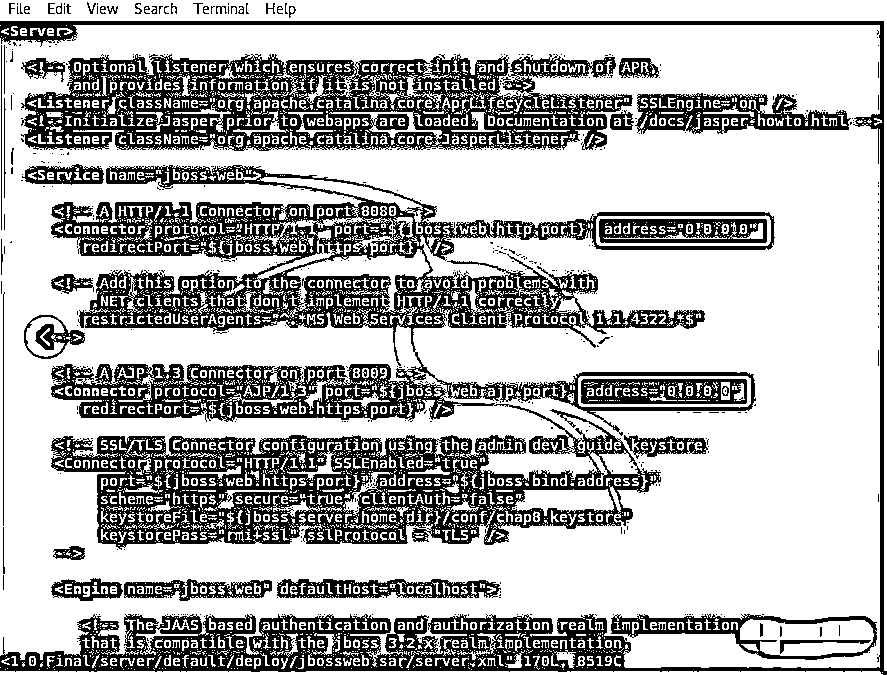
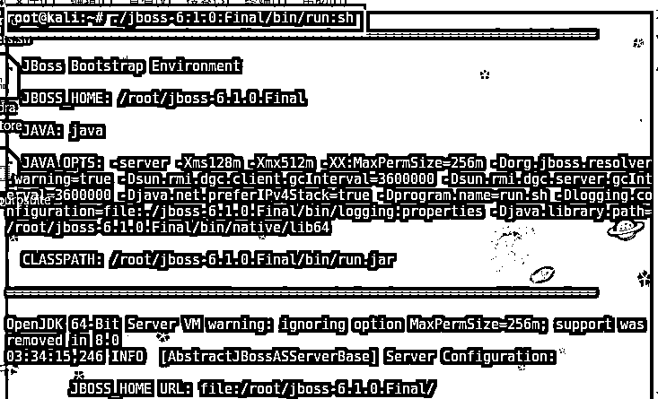
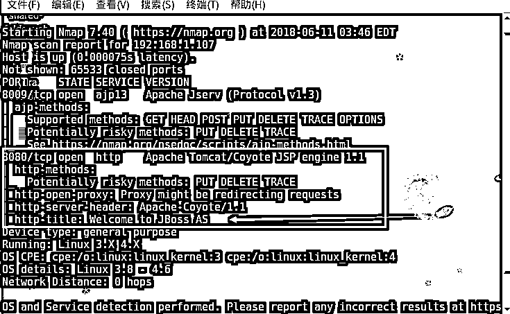
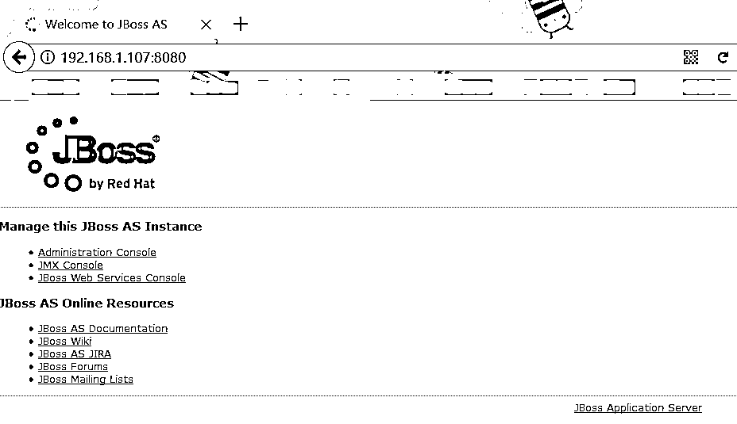
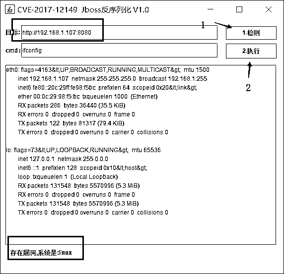
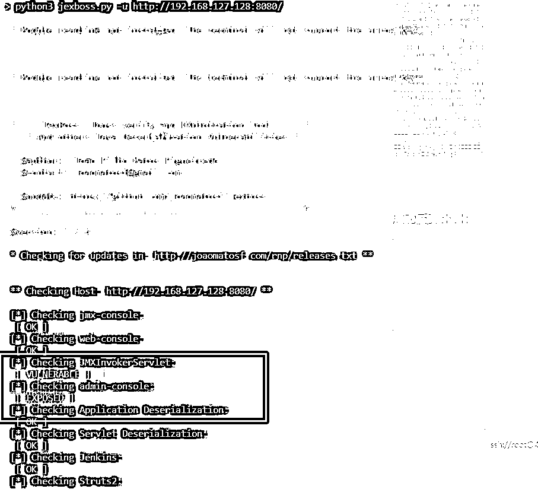

# 6.JBoss5.x6.x 反序列化漏洞（CVE-2017-12149）复现 - bmjoker - 博客园

> 原文：[`www.cnblogs.com/bmjoker/p/9157240.html`](https://www.cnblogs.com/bmjoker/p/9157240.html)

2017 年 9 月 14 日，国家信息安全漏洞共享平台（ CNVD ）收录了 JBOSS Application Server 反序列化命令执行漏洞（ CNVD-2017-33724，对应 CVE-2017-12149 ），远程攻击者利用漏洞可在未经任何身份验证的服务器主机上执行任意代码。

漏洞细节和验证代码已公开，近期被不法分子利用出现大规模攻击尝试的可能性较大。

### 0x01\. 漏洞复现

**1). 环境准备**

```
JBOSS 下载地址：http://download.jboss.org/jbossas/6.1/jboss-as-distribution-6.1.0.Final.zip
 EXP 下载地址：https://github.com/yunxu1/jboss-_CVE-2017-12149
```

**2). 环境搭建**

`第一步：下载 JBOSS 环境，并解压`

```
wget http://download.jboss.org/jbossas/6.1/jboss-as-distribution-6.1.0.Final.zip 
```


第二步：修改配置文件，使网络中的主机都能访问 JBOSS

```
vim ~/jboss-6.1.0.Final/server/default/deploy/jbossweb.sar/server.xml
```



第三步：启动 JBOSS

```
./jboss-6.1.0.Final/bin/run.sh
```



第四步：下载 EXP

```
git clone https://github.com/yunxu1/jboss-_CVE-2017-12149
```


有脚本 EXP 利用方式，同时也有图形化利用方式 


**3). 信息收集**

`第一步：利用 nmap 对目标主机进行常用端口扫描`

```
nmap -p 1-65535 -A 192.168.1.107
```



第二步：访问目标主机的 8080 端口，看看能否正常访问



**4). 漏洞利用**

利用刚才下载好的 EXP 进行漏洞利用，打开图形化工具 `jboss 反序列化 _CVE-2017-12149.jar`

 

-------------------------------

 2019.10.11 日补充

最近 github 出了一个检测 jboss 的项目：[`github.com/joaomatosf/jexboss`](https://github.com/joaomatosf/jexboss)

这里搭建环境验证：

漏洞 ip：192.168.127.128

把项目直接 clone 到本地利用即可



上图标红就说明有问题


可以看到 shell 已经反弹成功。

这个项目还能实现批量扫描，总体很不错！

理解 Java 反序列化漏洞

推荐学习 Paper：Java 反序列化漏洞从入门到深入：https://xz.aliyun.com/t/2041。内容较多，先了解简单 Java 语法结构和面向对象编程基础，再学习序列化、反序列化的基本概念和漏洞成因。

（1）序列化：把 Java 对象转换为字节序列的过程便于保存在内存、文件、数据库中。ObjectOutputStream 类的 writeObject()方法可以实现序列化。

（2）反序列化：把字节序列恢复为 Java 对象的过程。ObjectInputStream 类的 readObject()方法用于反序列化。

（3）漏洞成因：暴露反序列化 API 或传入点 ，用户可以操作传入数据，并且反序列化的 readObject()方法未对用户传入数据进行有效的安全检测，攻击者可以精心构造反序列化对象并执行恶意代码。