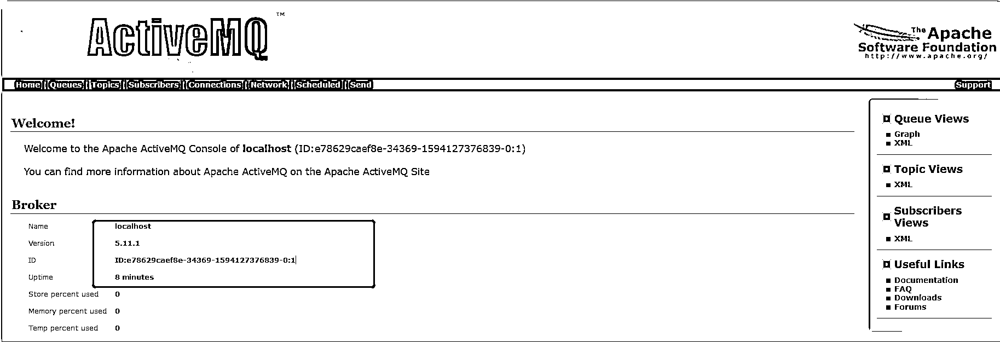
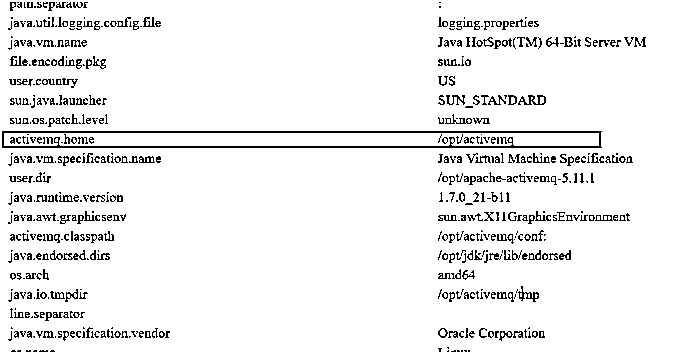
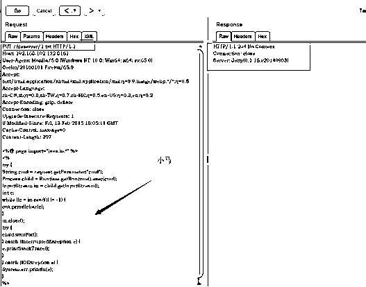
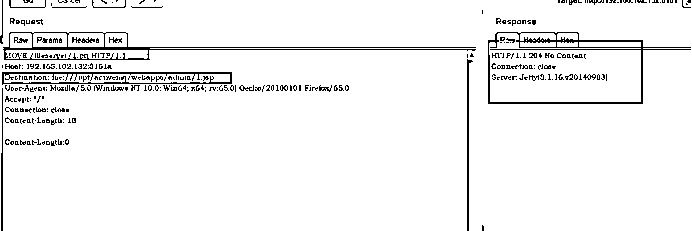
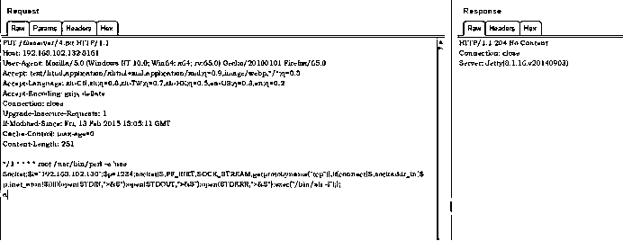
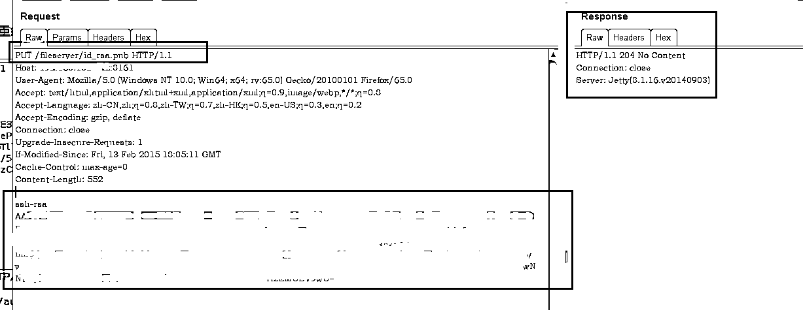
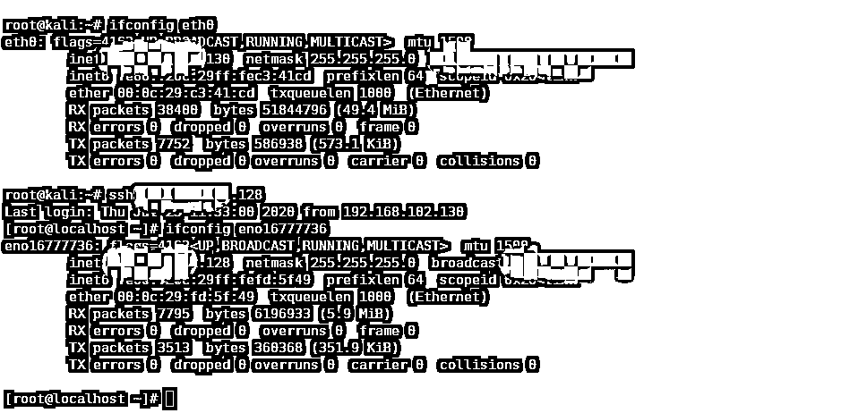

# ActiveMQ【CVE-2016-3088】上传公钥实现 sssh 免密登录 - 007NBqaq - 博客园

> 原文：[`www.cnblogs.com/007NBqaq/p/13322602.html`](https://www.cnblogs.com/007NBqaq/p/13322602.html)

Apache-ActiveMQ 是 apache 旗下的消息中间件，至今为止还是有较多的甲方爸爸们，还在使用该中间件。据了解，Apache-ActiveMQ 中间件有 2 个厉害的 CVE，一个是 CVE-2016-3088,还有一个是 CVE-2015-5254。本次文章内容，主要结合 HW 中遇到的 CVE-2016-3088 漏洞与 ssh 公钥结合，拿下服务器的权限。

# Apache-ActiveMQ 漏洞介绍&环境

## 漏洞介绍

该漏洞为 Apache 消息中间件漏洞，URL 访问地址为：http://x.x.x.x:8161------>默认开启的端口为 8161，当你使用 nmap 进行全端口扫描受害机器时，发现 8161 端口时需要提高警惕性。

默认后台管理控制端，URL 地址 http://x.x.x.x:8161/admin

默认密码：admin/admin

##  

## 漏洞环境

在 centos7.5 上安装 docker 并 pull vulhub 镜像，使用 vulhub 下的 ActiveMQ 环境。

## 漏洞原理

ActiveMQ 的 web 控制台分为三个应用：admin、api 和 fileserver；前两个需要登陆权限；最后一个无需登录权限，及 CVE2016-3008 又称为任意文件写入，可以理解是未授权访问的一种。Fileserver 是一个 api 接口，通过 GET/PUT/DELETE 等 HTTP 的 OPTIONS 方法对文件进行任意读、传、取等操作。

## 影响版本

Apache-ActiveMQ5.0.0-5.13.x;5.14.0 版本后，彻底删除了 fileserver 应用

## 漏洞详情&利用方法

 fileserver 应用中，ActiveMQ 中的 file server 服务允许用户通过 HTTP PUT 方法上传文件到指定目录，fileserver 支持写入文件（但并不提供解析），支持 http 方法中的 move 方法【移动并覆盖】文件，可将 jsp 文件 put 到 filserver 中，在通过 mv 移动到可执行的目录下。

CVE-2016-3088 为任意文件写入：故名思意，即使用 PUT 上传到受害机服务器的目录下，渗透测试的目的是为了获取更高的权限，在这里我们可以利用任意文件写入的这个漏洞，结合 linux 系统本身以及其他可利用的漏洞，打一套组合拳，将该漏洞的危害面积，提升到最大，从而提升攻击者的权限。

写入文件的组合拳【利用方式】，总结有如下三种：

1.写入 webshell------>【该方法简单粗暴，有被管理员发现/被安全设备拦截的危险】

2.写入定时任务 cron/上传攻击者 ssh 公钥【常用手法】等文件------->【该方法最大程度依赖了这个漏洞的 PUT 缺陷，简单并安全的将攻击者权限提升到最大】

3.写入 jar/jetty.xml 等库和配置文件

接下来，文章的复现阶段主要围绕利用方式的前 2 种进行实际操作以及遇到问题的实际解决办法

## 漏洞复现

### 利用方式 1：上传 webshell

　　总体思路：通过 HTTP PUT 方法上传小马.txt 文本------>http 访问 204（成功）------> move 小马.txt 到 api【/admin】/1.jsp 即可访问该小马；具体操作如下

1.使用默认口令登录【admin/admin】，查看 ActiveMQ 的默认路径

　http://x.x.x.x:8161/admin/test/systemProperties.jsp

2.上传小马，以 txt 文本格式上传，然后服务器返回 204，表示上传成功，但该 fileserver 目录下，是没有解析执行的权限。

3.然后将小马 1.txt 移动到 webapps/admin 目录下，成功的话，返回 204 No Content

MOVE /fileserver/1.txt HTTP/1.1 ------>移动 fileserver 目录下的 1.txt 文本

Destination: file:///opt/activemq/webapps/admin/1.jsp --------->移动到目的地址为 file:///路径下的 1.jsp 文件中【即为将 1.txt 内容复制为 1.jsp，并更换后缀名为可被服务器解析的脚本文件】

或者写入到 api/1.jsp 也可【这里可写入的地方较多】

此时，浏览器访问该小马，成功；

### 利用方式 2：定时任务 cron tab，自动化弹 shell

1.上传 cron 配置文件【换行注意使用\n】

    写入 cron 配置文件，地址为攻击机地址，端口随意，只要不占用其他正在使用的端口即可

2.移动到/etc/cron.d/root

 

**注意该方法写定时任务，反弹 shell，ActiveMQ 必须是以 root 方式运行的，不然失效。

### 利用方式 3：上传 SSH 公钥，实现免密登录受害机

SSH 免密登录，在电厂以及实际生产环境下的数据库之间交互数据时，经常使用；SSH 默认也支持公钥免密登录的这种方式。

首先：说明一点不同的系统 ssh 支持的免密登录的参数可能不一致。本次实验分别在 ubuntu16.04、centos7 以及凝思系统上进行实际操作

ssh 免密登录主要涉及到几点内容

ssh-keygen -t rsa ------>用来生成 rsa 的公私钥------>id_rsa.pub

/etc/ssh/sshd_config 或者 /ssh_config

用户目录/.ssh/authorized_keys ----->用来存放攻击者的公钥

1.kali 上 ssh-keygen -t rsa ----->生成 id_rsa.pub

 

2.ssh localhost

在实际模拟环境操作中遇到 ubuntu16.04、centos7 以及凝思系统的当前用户目录下，本地 sshd_conf 文件内容为空或者无 /.ssh/known_hosts 时，可以使用 ssh localhost 这样即可出现文件;

其次，.ssh 目录下还要存在 authorized_keys，这个可以在 move 时创建并存放公钥

3.受害机的 sshd_config 要实现免密登录

RSAAuthentication yes
PubkeyAuthentication yes

StrictModes no ----->这个存在于 centos 的高版本中，默认这个是 yes 即为开启状态；在这种情况下必须关闭该参数

RSA 和 Pubkey 这两个选项，我做了一系列的测试，发现 RSAAuthentication yes/no 都不影响最后的免密登录，只有 PubkeyAuthentication 这个参数必须设置为 YES，不然免密操作会失败

 4.使用 PUT 方法将攻击者的 id_rsa.pub 上传至受害者 fileserver；

 再使用 move 移动到用户名/.ssh/authorized_keys ------>ps：这里主要是因为 docker 下部署的环境容器下，未安装 ssh 服务导致的。

 于是在本地开启 centos7/unbuntu16.04，按照第 2、3 两步进行配置，成功免密登录

## 漏洞修复&加固

1.主要就是升级到 15.x 版本后吧

##  总结：

1.在很多大型甲方公司，经常会使用 SSH 的免密登录，其次 SSH 配置文件中默认也开启了这个方式；这也是 linux 存在的安全风险点

2.渗透技术的难点：在于漏洞与漏洞之间的连环利用；这次利用 PUT 文件上传+MOVE 操作成功 SSH 免密登录。

3.SSH 免密主要核心点就是能上传公钥+PubkeyAuthentication 开启；至于其他博主上说 /.ssh 要 700 /.ssh/authorized_keys 要 600 这个权限说法，个人感觉没啥用，用默认文件/文件夹的权限就可以了吧

 参考文章链接：https://paper.seebug.org/346/