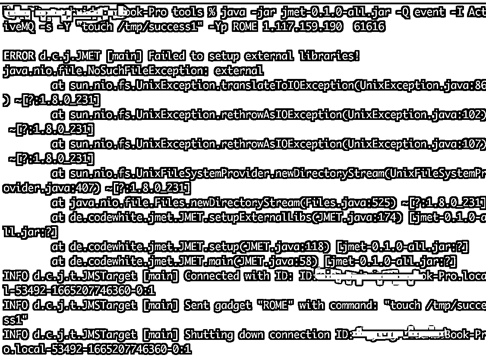
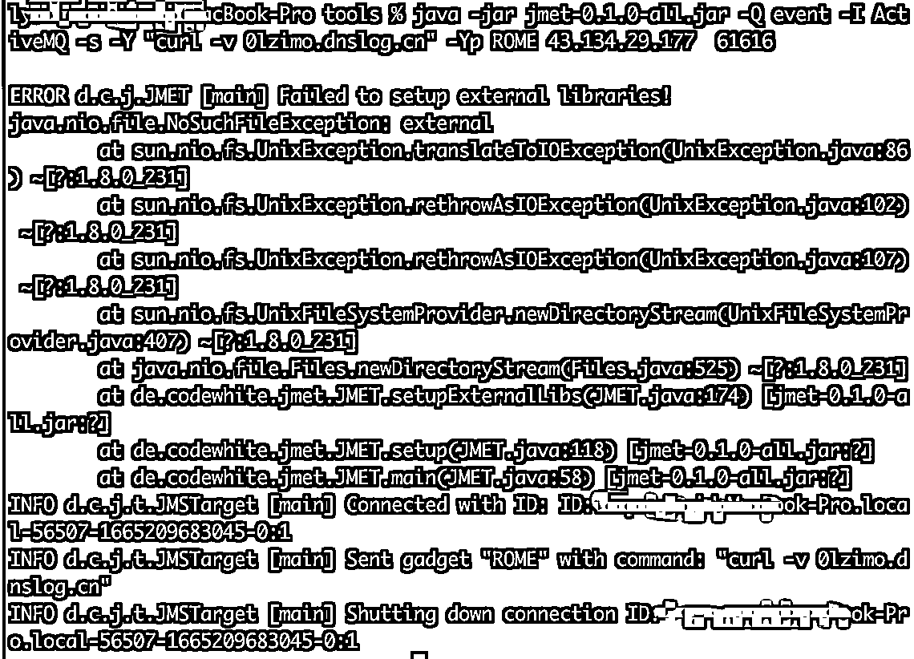
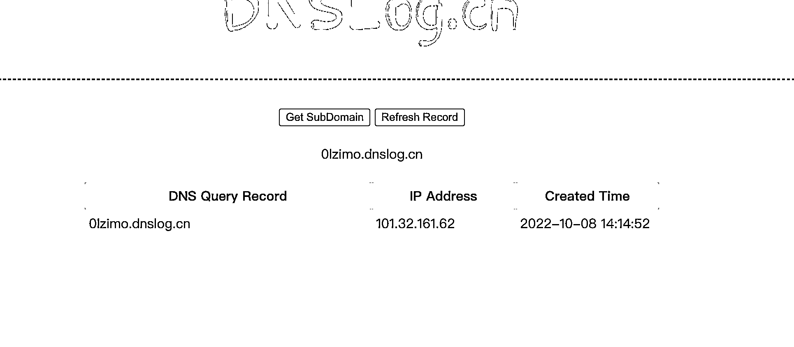

# ActiveMQ Deserialization Vulnerability (CVE-2015-5254) - 任尔东西南北风 - 博客园

> 原文：[`www.cnblogs.com/lyh1/p/16768804.html`](https://www.cnblogs.com/lyh1/p/16768804.html)

环境搭建

环境运行后，将监听 61616 和 8161 两个端口。其中 61616 是工作端口，消息在这个端口进行传递；8161 是 Web 管理页面端口。访问`http://your-ip:8161`即可看到 web 管理页面，不过这个漏洞理论上是不需要 web 的。

## 漏洞复现

漏洞利用过程如下：

1\. 构造（可以使用 ysoserial）可执行命令的序列化对象
2\. 作为一个消息，发送给目标 61616 端口
3\. 访问 web 管理页面，读取消息，触发漏洞

使用[jmet](https://github.com/matthiaskaiser/jmet)进行漏洞利用。首先下载 jmet 的 jar 文件，并在同目录下创建一个 external 文件夹（否则可能会爆文件夹不存在的错误）。

jmet 原理是使用 ysoserial 生成 Payload 并发送（其 jar 内自带 ysoserial，无需再自己下载），所以我们需要在 ysoserial 是 gadget 中选择一个可以使用的，比如 ROME。

执行：

java -jar jmet-0.1.0-all.jar -Q event -I ActiveMQ -s -Y "touch /tmp/success" -Yp ROME your-ip 6161

此时会给目标 ActiveMQ 添加一个名为 event 的队列，我们可以通过`http://your-ip:8161/admin/browse.jsp?JMSDestination=event`看到这个队列中所有消息：

点击查看这条消息即可触发命令执行，此时进入容器`docker-compose exec -it containID /bin/bash`，可见/tmp/success 已成功创建，说明漏洞利用成功：

将命令替换成弹 shell 语句再利用：

值得注意的是，通过 web 管理页面访问消息并触发漏洞这个过程需要管理员权限。在没有密码的情况下，我们可以诱导管理员访问我们的链接以触发，或者伪装成其他合法服务需要的消息，等待客户端访问的时候触发。