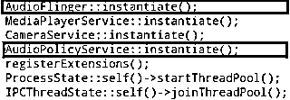
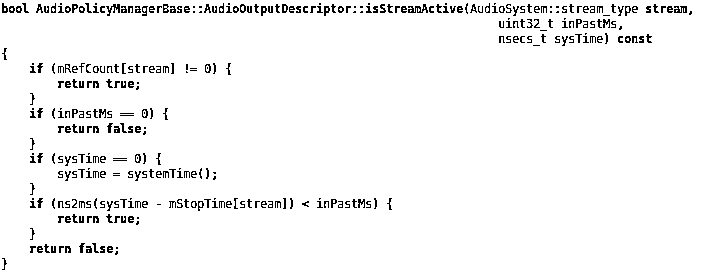
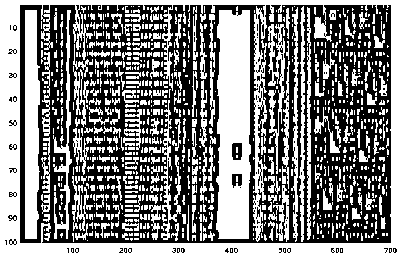
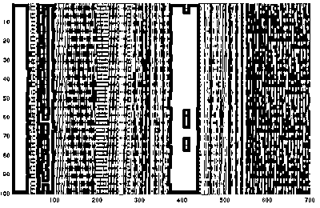
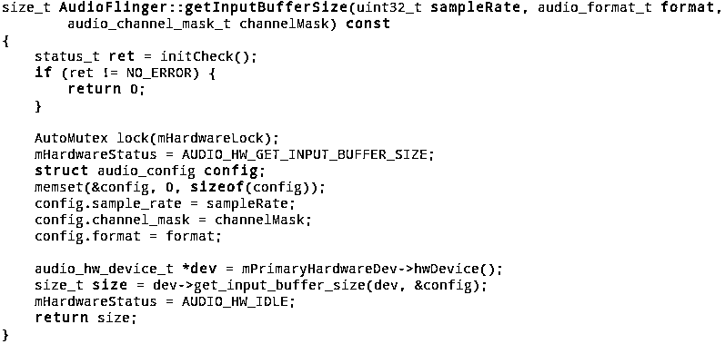
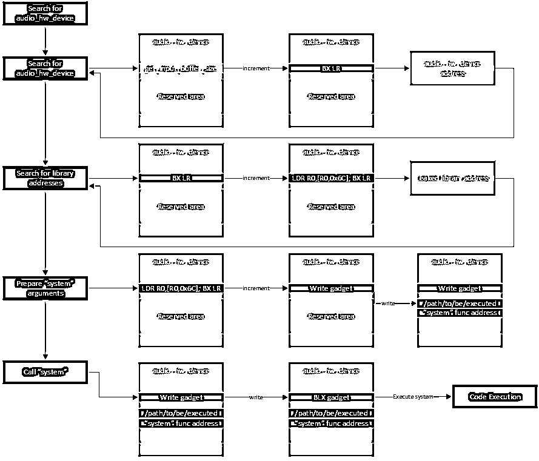

# Android privilege escalation to mediaserver from zero permissions (CVE-2014-7920 + CVE-2014-7921) - _ 懒人 - 博客园

> 原文：[`www.cnblogs.com/lanrenxinxin/p/6217329.html`](https://www.cnblogs.com/lanrenxinxin/p/6217329.html)

墙外通道：[`bits-please.blogspot.com/2016/01/android-privilege-escalation-to.html`](http://bits-please.blogspot.com/2016/01/android-privilege-escalation-to.html)

In this blog post we'll go over two vulnerabilities I discovered which, when combined, enable arbitrary code execution within the "mediaserver" process from any context, requiring no permissions whatsoever.

**HOW BAD IS IT?**

The first vulnerability (CVE-2014-7921) was present in all Android version from 4.0.3 onwards. The second vulnerability (CVE-2014-7920) was present in all Android versions from 2.2 (!). Also, these vulnerabilities are not vendor specific and were present in all Android devices. Since the first vulnerability is only needed to bypass ASLR, and ASLR is only present (in a meaningful form) from Android 4.1 onwards, this means that these vulnerabilities allow code execution within "mediaserver" on any Android device starting from version 2.2.

Although I reported both vulnerabilities in mid October 2014, they were unfortunately only fixed much later (see "Timeline" for full description, below) - in Android version 5.1!  This means that there are many devices out there which are still vulnerable to these issues, so please take care.

You can find the [actual patches here](https://android.googlesource.com/platform/frameworks/av/+/36d1577%5E!/). The patches were pushed to AOSP five months after the vulnerabilities were reported. 

That said, the Android security team was very pleasant to work with, and with other vulnerabilities I reported later on, were much more responsive and managed to solve the issues within a shorter time-frame.

## **WHERE ARE WE AT?**

Continuing our journey of [getting from zero permissions to TrustZone code execution](http://bits-please.blogspot.co.il/2015/03/getting-arbitrary-code-execution-in.html); after recently completing the task of [getting to TrustZone from the Linux kernel](http://bits-please.blogspot.co.il/2015/08/full-trustzone-exploit-for-msm8974.html), and after finding a way to [gain code execution within the Linux kernel](http://bits-please.blogspot.co.il/2015/08/android-linux-kernel-privilege.html), we are left with the final step of gaining the privileges needed in order to execute our kernel exploit.

As mentioned in the [previous blog post in the series](http://bits-please.blogspot.co.il/2015/08/android-linux-kernel-privilege.html), in order to exploit the kernel vulnerability in the "qseecom" driver, an attacker must only satisfy one of the following conditions:

*   Gain execution within one of "mediaserver", "drmserver", "surfaceflinger" or "keystore"
*   Run within a process with the "system", "drm" or "keystore" user-ID
*   Run within a process with the "drmrpc" group-ID

 

In this blog post, we'll gain code execution within the "mediaserver" process, thus completing our journey from zero permissions to TrustZone kernel code execution. 

## DIVING IN

As it's name suggests, the "mediaserver" process is in charge of all media-related tasks. In order to serve different media-related requests, the process exposes a large set of features in the form of four different services:  

*   "media.audio_policy" - Enables manipulation of different audio related policies, such as the volumes of different audio streams
*   "media.audio_flinger" - Main configuration endpoint for media-related tasks, such as recording audio, muting the phone, etc.
*   "media.camera" - Allows interaction with the device's cameras.
*   "media.player" - Allows the playback of many different media formats (for example, by using the "stagefright" library).

            

As you've probably seen, lately there's been a lot of focus on the "media.player" service (ala Stagefright) , especially focusing on different media-parsing libraries which are utilised by it. However, in this post we'll cover two vulnerabilities in a different service - the "media.audio_policy" service.

Usually, when registering an Android service, the actual implementation of the service is provided in the Java programming language. This means that finding memory corruption vulnerabilities is more difficult, since those would only present themselves in unique circumstances (using a native "JNI" call from Java code, delegating a feature to a native library, etc.).

However, in the case of the "mediaserver" process, all of the services housed within the process are implemented in the C++ programming language, making the prospect of finding memory corruptions much more viable.

Actually, implementing a service is quite a hard task to fulfil in a secure manner - recall when we previously discussed kernel vulnerabilities? Well, in order to prevent accidental access to user-provided data, the kernel uses a coding convention in which user-provided pointers are marked as "tainted". However, for interaction between userspace services, there is no such feature. This means that implementers of a service must always pay attention to the origin of the processed data, and can't trust it at all.

## LET'S GET DOWN TO BUSINESS

Here's the game plan - first of all, we'll need to look for a memory corruption vulnerability in the audio policy service. Then, we'll need to find a way to reliably exploit this vulnerability. This is usually made difficult by the presence of ASLR.

For those of you who haven't encountered **ASLR **(**A**ddress **S**pace **L**ayout **R**andomization) yet, you should definitely check [this link](https://www.duosecurity.com/blog/a-look-at-aslr-in-android-ice-cream-sandwich-4-0) for Android-specific information (and [this link](https://copperhead.co/2015/05/11/aslr-android-zygote) to see the problems still present in Android's ASLR implementation).

Now, without any further ado, let's take a look at the functionality exposed by the audio policy service. Unsurprisingly, we'll start at the ["main" function](http://androidxref.com/4.3_r2.1/xref/frameworks/av/services/audioflinger/AudioPolicyService.cpp) of the "mediaserver" process:

Looks straight-forward enough. However, looking deeper reveals that while both "AudioPolicyService" and "AudioFlinger" register themselves as the handlers for commands directed at the "media.audio_policy" and "media.audio_flinger" services respectively, they actually acts as a façades for the real concrete implementation, which is provided after going through several layers of abstraction.

The end result is that the actual implementation for most functionality provided by "AudioPolicyService" and some of the functionality provided by  "AudioFlinger" are in fact handled by a single class - "AudioPolicyManagerBase". As a result, this is the class we're going to be focusing on from now on.

## LIMITED WRITE PRIMITIVE

Whenever a user would like to start an output stream on a particular output device (such as the front or back speakers), he may do so by calling the ["startOutput" function](http://androidxref.com/4.4.4_r1/xref/hardware/libhardware_legacy/audio/AudioPolicyManagerBase.cpp#733), provided by the audio policy service.

 This function receives three arguments: 

*   The output descriptor - this must be a device (such as the front or back speakers).
*   The type of stream for which the output should be opened (should be one of the predefined stream types).
*   The session ID - this should be a number corresponding to a previously opened session.

Initially, the function verifies the "output" parameter by fetching the AudioOutputDescriptor object corresponding to the given output device. This means that this argument must, in fact, be valid.

But what about the other two arguments? Well, peering a little further reveals the following call:

Doesn't seem too shady, but let's just make sure the stream argument is safely handled:

 

Oh.

So - as we can see above, the function uses the "stream" argument as an index into an array (of 32-bit values) within the AudioOutputDescriptor object - and both reads and writes to that address, without ever sanitizing the stream number. We're off to a good start already!

In reality, there are only a [handful of valid stream_type values](http://androidxref.com/4.4.4_r1/xref/hardware/libhardware_legacy/include/hardware_legacy/AudioSystemLegacy.h) (it is in fact an enumerated type), so adding appropriate validation is an easy as checking that the given argument is within the enumerations minimal and maximal values:

 

Regardless - there are still some constraints we need to figure out. First and foremost, in order to avoid unnecessary side-effects, we would like to choose an output descriptor which is not "duplicated" (so as not to execute the first block). Luckily, this is easy - most output descriptors are in fact not duplicated by default. 

Moving on, when would the second block in this function execute? Well, since the "delta" argument is always 1, this means we'll enter the block iff *(int)mRefCount[stream] + 1* is negative. Meaning, if the value pointed to is larger than or equal to 0x7FFFFFFF (since we're dealing with a 32-bit system).

If that were to happen, the actual value would be logged to the system log (an info leak!), and would then be zeroed out before returning from the function. Although this is a nice info-leak, it has two obvious downsides (and another one which I won't cover in this post):

*   Reading the leaked value requires the READ_LOGS permission (and we originally stated we would like to start with zero permissions)
*   The value being read is corrupted - this could be troublesome for quite a few exploitation techniques.

But all is definitely not lost; we can still create a much stronger primitive using this vulnerability. Assuming the second if block is not executed, we arrive at the function's end:

 

So the target value is incremented by one; a limited write primitive. Note that the final log statement is not actually included in a release build (since ALOGV is an empty macro is those builds).

Putting this all together, we get a write primitive allowing us to increment the value at *mRefCount[stream] *by one, so long as it is not larger than or equal to 0x7FFFFFFF.

## I SPY WITH MY LITTLE EYE

Now that we have a write primitive, let's look for a read primitive. Also, since our write primitive is relative to an AudioOutputDescriptor object, which is dynamically allocated (and is therefore located in a rather unpredictable location in the heap), it would be much more convenient if we were able to find such a primitive which is also relative to an AudioOutputDescriptor object.

Pouring over the AudioPolicyManagerBase's methods once more, reveals a very tempting target; the [AudioPolicyManagerBase::isStreamActive](http://androidxref.com/4.4.4_r1/xref/hardware/libhardware_legacy/audio/AudioPolicyManagerBase.cpp#1327) method. This method allows a user to query a given stream in order to check if it was active in any of the output descriptors within the user-supplied time-frame:

 

So once again - this method performs no validation at all on the given "stream" argument. Perhaps the validation is delegated to the internal [AudioOutputDescriptor::isStreamActive](http://androidxref.com/4.4.4_r1/xref/hardware/libhardware_legacy/audio/AudioPolicyManagerBase.cpp#3351) method?

Nope - lucky once again!

So, once more we access the mRefCount member of the AudioOutputDescriptor using the "stream" argument as a index (while performing no validation whatsoever). As we can see, there are two cases in which this function would return true:

*   If *mRefCount[stream] != 0*
*   Otherwise, if the time difference between the current system time and the value of *mStopTime[stream] *is less than the user-supplied argument - *inPastMs*. 

Since we would like to use this vulnerability as an easy read primitive, we would first seek to eliminate side-effects. This is crucial as it would make the actual exploit much easier to build (and much more modular).

However, simply passing in the argument "inPastMs" with the value 0x80000000 (i.e., INT_MIN), would cause the last if statement to always evaluate to false (since there are no integers smaller than INT_MIN).

This leaves us with a simple and "clean" (albeit somewhat weak) read primitive: the function isStreamActive will return true iff the value at *mRefCount[stream]* is not zero. Since the stream argument is fully controlled by us, we can use it to "scan" the memory relative to the AudioOutputDescriptor object, and to gage whether or not it contains a zero DWORD.

## THERMAL VISION

At this point you might be wondering - how can you even call this a read-primitive? After all, the only possible information we can learn using this vulnerability is whether or not the value at a given address is zero. Glad you (kind-of) asked!

In fact, this is more than enough for us to find our way around the heap. Instead of thinking in terms of "heap" and "memory", let's use our imagination.

You're a secret agent out on a mission. You're standing behind a closed door, leading to the room you need to enter. So what do you naturally do? Turn on your thermal vision goggles, of course. The goggles present you with the following image:

 

So it's safe - we can see it's only a dog.

Let's look at the image again - did we really need all the heat information? For example, what if we only had information if a given pixel is "hot" or not?

Still definitely recognizable.

This is because the outline of the dog allowed us to create a "heat signature", which we could then use to identify dogs using our thermal goggles.

So what about heaps and memory? Let's say that when a value in memory is non-zero, it is "hot", and otherwise, that memory location is "cold". Now - using our read-primitive, we can create a form of thermal vision goggles, just like the pair we imagined a minute ago.

All that remains to be seen is whether or not we can create good "heat signatures" for objects we are interested in.

First, looking at a histogram of a full memory dump of the heap in the mediaserver process, reveals that the value zero is by far the most common:

 

Moreover, typical heap objects appear to have many zeros within them, leading to some interesting repeatable patterns. Here is a heat-map generated from the aforementioned heap dump:

 

Now - looking at the binary heat-map we can see there are still many interesting patterns we can use to try and "understand" which objects we are observing:

 

So now that you're (hopefully) convinced, we can move on to building an actual exploit!

## BUILDING AN EXPLOIT

As we've established above, we now have two tools in our belt:

*   We can increment any value, so long as it's lower than 0x7FFFFFFF 
*   We can inspect a memory location in order to check if it contains the value zero or not

In order to take this one step further, it would be nice if we were able to find an object that has a very "distinct" heat-signature, and which also contains pointers to functions which we can call (using regular API calls), and to which we can pass controllable arguments.

Searching around for a bit, reveals a prime candidate for exploitation - [audio_hw_device](http://androidxref.com/4.4.4_r1/xref/hardware/libhardware/include/hardware/audio.h#438). This is a structure holding many function pointers for the implementations of each of the functions provided by an actual audio hardware device (it is part of the audio hardware abstraction layer). Moreover, these function pointers can also be triggered at ease simply by calling different parts of the audio policy service and audio flinger APIs.

 

However, what makes this object especially interesting is its structure - it begins with a header with a fixed length initialized with non-zero values. Then, it contains a large block of "reserved" values, which are initialized to zero, followed by a large block of function pointers, of whom only the second one is initialized to zero.

 This means *audio_hw_device* objects have quite a unique heat signature:

 

So we can easily find these objects, great! Now what?

Let's sketch a game-plan:

*   Search for a *audio_hw_device* using its heat signature
*   Create a "stronger" read primitive (using the existing primitives)
*   Create a "stronger" write primitive (again, using the existing primitives)
*   Using the new primitives, hijack a function to execute arbitrary code

We've already seen how we can search for a *audio_hw_device* by using the heat signature mentioned above, but what about creating new primitives?

## HARDER BETTER FASTER STRONGER (PRIMITIVES)

In order to do so, we would like to hijack a function within the *audio_hw_device* structure with the following properties:

*   We can easily trigger a call to this function by invoking external API calls
*   The function's return value is returned to the user
*   The arguments to this function are completely user-controlled

Reading through the different API calls once more, we arrive at the perfect candidate; [AudioFlinger::getInputBufferSize](http://androidxref.com/4.4.4_r1/xref/frameworks/av/services/audioflinger/AudioFlinger.cpp#993):

 

As you can see, an *audio_config* structure is populated using the user-provided values, and is then passed on to the audio hardware device's implementation - *get_input_buffer_size*.

This means that if we find our *audio_hw_device*, we can modify the *get_input_buffer_size* function pointer to point to any gadget we would like to execute - and whichever value we return from that gadget, will be simply returned to the user.

## CREATING THE PRIMITIVES

First of all, we would like to find out the real memory address of the *audio_hw_device* structure. This is useful in case we would like to pass a pointer to a location within this object at a later stage of the exploit.

This is quite easily accomplished by using our weak write primitive in order to increment the value of the *get_input_buffer_size* function pointer so that it will point to a "BX LR" gadget - i.e., instead of performing any operation, the function will simply return.

Since the first argument provided to the function is a pointer the *audio_hw_device* structure itself, this means it will be stored in register R0 (according to the ARM calling convention), so upon executing our crafted return statement, the value returned will be the value of R0, namely, the pointer to the *audio_hw_device*.

 

Now that we have the address of the *audio_hw_device*, we would like to also read an address within one of the loaded libraries. This is necessary so that we'll be able to calculate the absolute location of other loaded libraries and gadgets within them.

However, as we've seen before, the *audio_hw_device* structure contains many function pointers - all of whom point to the text segment of one of the loaded libraries. This means that reading any of these function pointers is sufficient for us to learn the location of the loaded libraries.

Moreover, since the *get_input_buffer_size* function receives the *audio_hw_device* as its first argument, we can search for any gadget which reads into R0 a value from R0 at an offset which falls within the function pointer block range, and returns. There are many such gadgets, so we can simply chose one:

 

At this point, we know the location of the *audio_hw_device* and of the loaded libraries. All that's left is to create an arbitrary write primitive.

As we've since before, three user-controlled values are inserted into a structure and passed as the second argument (R1) to *get_input_buffer_size*. We can now use this to our advantage; we'll pass in values corresponding to our wanted write address and value as the first two arguments to the function. These will get packed into the first two values in the *audio_config* structure.

Now, we'll search for a unique gadget which unpacks these two values from R1,  writes our crafted value into the wanted location and returns.

While this seems like a lot to ask for, after searching through a multitude of gadgets, there appears to be a gadget (in *libcamera_client.so*) which does just this:

 

This means we can now increment the *get_input_buffer_size* function pointer to point to this gadget, and by passing the wanted values to the AudioFlinger::getInputBufferSize function, we can now write any 32-bit value to any absolute address within the mediaplayer process's virtual address space.

## WE HAVE LIFT-OFF

Now that we have all the primitives we need, we just need to put the pieces together. We'll create an exploit which calls the "system" function within the "mediaserver" process.

Once we have the addresses of the *audio_hw_device* and the library addresses, along with an arbitrary write primitive, we can prepare the arguments to our "system" function call anywhere within mediaserver's virtual address space.

A good scratch pad candidate would be the "reserved" block within the *audio_hw_device*, since we already know its absolute memory location (because we leaked the address of the *audio_hw_device*), and we also know that overwriting that area won't have any negative side-effects. Using our write primitive, we can now write the path we would like to call "system" on to the "reserved" block, along with the address of the "system" function itself (which we can calculate since we leaked the library load address).

Now, we can use our write primitive to change the *get_input_buffer_size* function pointer one final time - this time we would like to point it at a gadget which would unpack the function address and argument we have written into the reserved block, and would execute the function using this argument. This gadget was found in *libstagefright.so*:

 

So... This is it; we now have code execution within the "mediaserver" process. Here's a small diagram recapping our total exploit flow:

 

## FULL EXPLOIT CODE

As always; I'd like to provide the full exploit code we have covered in this blog post. You can get it here:

[`github.com/laginimaineb/cve-2014-7920-7921`](https://github.com/laginimaineb/cve-2014-7920-7921)

The gadgets were collected for Android version 4.3, but can obviously be adjusted to whichever Android version you would like to run the exploit against (up to Android 5.1).

I highly recommend that you download and look at the exploit's source code - there are many nuances I did not cover in the blog post (for brevity's sake) and the each stage of the exploit is heavily documented.  

Have fun!

## TIMELINE

*   14.10.14 - Vulnerabilities disclosed to Google
*   21.10.14 - Notified the Android security team that I've written a full exploit
*   13.12.14 - Sent query to Google regarding the current fix status
*   03.01.15 - Got response stating that the patches will be rolled out in the upcoming version
*   03.02.15 - Sent another query to Google
*   18.02.15 - Got response stating the fix status has not changed
*   08.03.15 - Sent third query to Google
*   19.03.15 - Got response saying patches have been pushed into Android 5.1